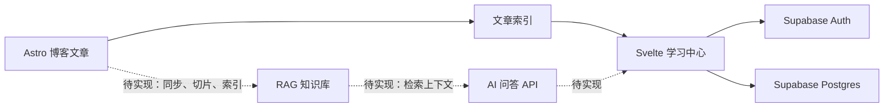

# 博客知识库与学习系统

## 项目定位

这个项目不只是“知识库”，更准确地说是：

> 个人学习管理系统 + 博客内容索引 + 未来的 RAG 知识问答。

它分为三个相互独立但可以协作的部分：

1. **内容层**：Astro 博客中的 Markdown/HTML 文章。
2. **学习层**：阅读进度、学习事件、目标和未来的复习计划。
3. **问答层**：文章切片、检索、引用和 AI 回答。

学习进度不能代替知识问答；文章读到 `100%` 也不等于已经掌握。

## 当前状态

### 已完成

- [x] `/studyProgress/` 私人学习中心。
- [x] Supabase Auth 密码登录和 RLS 数据隔离。
- [x] 从博客内容生成文章索引。
- [x] 文章分类筛选、分页和状态统计。
- [x] 手动记录 `0/25/50/75/100%` 阅读进度。
- [x] 阅读事件日志和多端同步。
- [x] 创建、删除学习目标，并为目标关联多篇文章。
- [x] 根据关联文章进度计算目标完成率。
- [x] 文章详情页根据滚动位置计算进度，并通过悬浮按钮保存。
- [x] 私密文章网页锁罩（仅防普通网页访问，不属于真正加密）。

### 尚未完成

- [ ] 艾宾浩斯复习计划、复习记录和到期提醒。
- [ ] 每日学习复盘。
- [ ] 目标编辑、文章移除和排序。
- [ ] 博客文章自动同步到问答知识库。
- [ ] RAG 检索、带来源引用的 AI 问答。
- [ ] 问答记录和效果评估。

## 当前架构

### 技术栈

- Astro 5 + Svelte 5
- GitHub Pages 静态部署
- Supabase Auth + Postgres + RLS
- pnpm

页面只显示密码输入框，内部使用固定 owner email 和用户输入的密码登录。密码、Service Role Key、模型 API Key 都不能写进前端或公开仓库。

## 核心文件

### 学习中心

- `src/pages/studyProgress.astro`
- `src/components/studyProgress/`
- `src/lib/studyProgress/`

### 文章阅读进度

- `src/components/ArticleProgressSaver.svelte`
- `src/pages/posts/[...slug].astro`

### 私密文章锁罩

- `src/components/PrivatePostGate.svelte`
- `src/content/config.ts`

### 数据库文档

- `docs/studyProgress/schema.prisma`：数据库结构的唯一主要说明。
- `docs/studyProgress/supabase-schema.sql`：Supabase 建表脚本。
- `docs/studyProgress/setup.md`：配置说明。

本文件不再重复列出每个数据库字段。表结构或字段含义变化时，应优先更新 `schema.prisma`。

## 数据模型概览

| 表 | 用途 | 状态 |
|---|---|---|
| `study_progress` | 每篇文章的当前阅读进度 | 已使用 |
| `study_events` | 进度变化日志 | 已使用 |
| `study_goals` | 学习目标 | 已使用 |
| `study_goal_items` | 目标关联文章 | 已使用 |
| `article_chunks` | 文章切片 | 预留，结构需要在 RAG 落地前调整 |

重要边界：

- 当前状态看 `study_progress`，历史变化看 `study_events`。
- 删除目标不会删除文章或文章进度。
- 复习状态不能通过清空 `progress_percent` 实现，应新增独立的复习计划和复习记录。

## 安全边界

- Supabase Publishable Key 可以出现在浏览器，但必须配合 RLS。
- Service Role Key、Dify API Key、模型 API Key 只能放在服务端。
- GitHub Pages 不能安全保存秘密，因此不能直接调用需要私密 Key 的 AI 或 Dify API。
- 当前私密文章仍存在于公开源码和静态产物中，网页锁罩不等于真正保密。
- 真正私密的文章必须移出公开构建，由 NAS、Edge Function 或受保护存储在验证后返回。

## 知识问答方案

### 推荐：先用 Dify 验证，再决定是否自研

第一版推荐把 Dify 当作**问答和 RAG 实验平台**，但不让它接管整个博客系统：

- Astro 继续负责文章展示。
- Supabase 继续负责登录、学习进度和目标。
- Dify 负责第一版文档切片、向量化、检索和回答。
- NAS API 或 Supabase Edge Function 负责保存 Dify Key、同步文章和转发问答请求。

这样可以先验证三个关键问题：

1. 你会不会经常使用博客问答？
2. 默认切片和检索效果是否足够？
3. 你真正需要的是“问文章内容”，还是“结合学习进度帮你规划”？

### 为什么不建议现在直接自研完整 RAG

自研至少需要维护：

- Markdown 清洗和按标题切片。
- embedding 生成与更新。
- pgvector 索引和相似度查询。
- 关键词 + 向量混合检索。
- rerank、Top K 和阈值调试。
- 模型调用、流式回答、引用和错误重试。
- 文档变更后的增量同步。
- 密钥、鉴权、限流和费用控制。

这些工作能提供更强控制力，但现在会明显放大项目复杂度。

### 什么时候迁回 Supabase pgvector

出现以下情况时，再考虑自己维护 `article_chunks + embedding`：

- Dify 的切片不适合博客标题层级。
- 需要按分类、标签、私密状态或用户权限精确过滤。
- 需要把学习进度、复习到期和问答检索深度结合。
- 希望数据完全由自己的 NAS/Supabase 管理。
- 希望减少对第三方平台的依赖。

Supabase 官方支持 pgvector、语义检索、Edge Functions 和基于 RLS 的 RAG 权限控制，因此现有技术路线并没有堵死自研空间。

## 第一版问答闭环

建议先只做 5 至 10 篇公开文章：

1. 创建 Dify 知识库和 Chatflow。
2. 手动上传少量 Markdown，验证切片和引用效果。
3. 在 NAS 或 Supabase Edge Function 建立 `/knowledge/chat` 服务端接口。
4. 博客新增一个需要登录的问答页面。
5. 前端把问题发给服务端，由服务端调用 Dify。
6. 回答必须显示文章标题、链接和引用片段。
7. 收集答非所问、无结果和引用错误的案例。

这一阶段暂时不要：

- 自动同步全部文章。
- 新建复杂的向量数据库表。
- 做 Agent、多模型路由或长期记忆。
- 把学习规划和文章问答混成一个提示词。

## 后续路线

### 阶段 A：问答验证

- 少量公开文章接入 Dify。
- 完成登录、提问、流式回答和来源引用。
- 验证中国大陆和手机网络访问情况。

### 阶段 B：内容同步

- 为文章生成稳定的内容哈希。
- 支持新增、更新、删除文章的增量同步。
- 元数据至少包含 `article_id`、标题、URL、分类、标签和更新时间。

### 阶段 C：学习规划

- 新增复习计划和复习记录表。
- AI 只读取结构化学习数据并给出建议，不直接修改进度或目标。
- 所有 AI 建议由用户确认后再写入数据库。

### 阶段 D：评估是否自研 RAG

- 如果 Dify 足够好，继续使用。
- 如果检索或权限无法满足要求，再迁移到 Supabase pgvector。
- Dify 也支持连接外部知识库，因此可以保留它的 Chatflow，只替换底层检索服务。

## 关键提交

- `a9c8bd4`：学习进度中心第一版。
- `75c080c`：文章阅读进度悬浮保存。
- `bd10c87`：记录文章阅读进度功能。

完整提交说明见 `commit-history.md`，避免继续在本文件重复提交明细。
