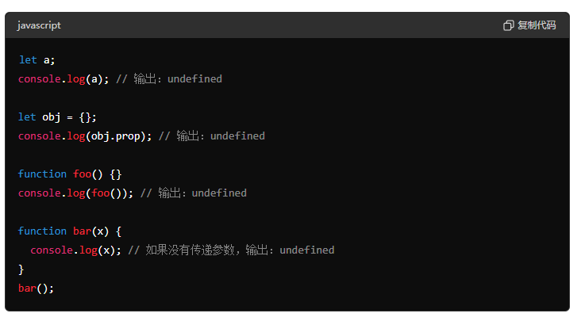
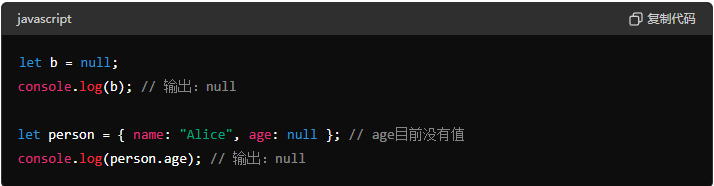
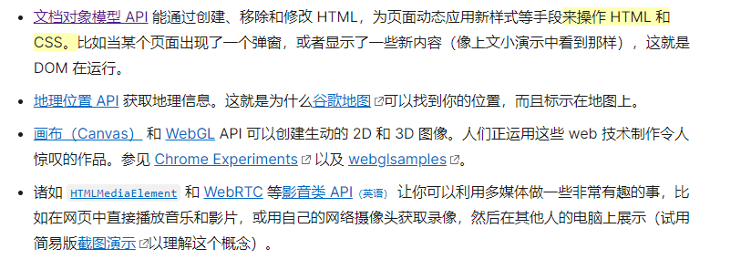
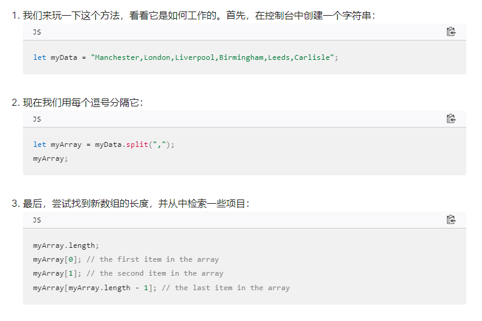
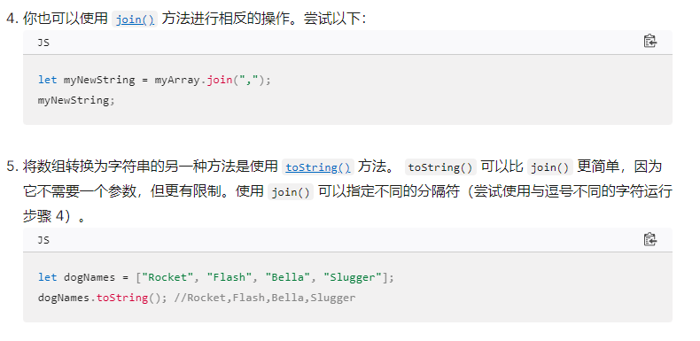
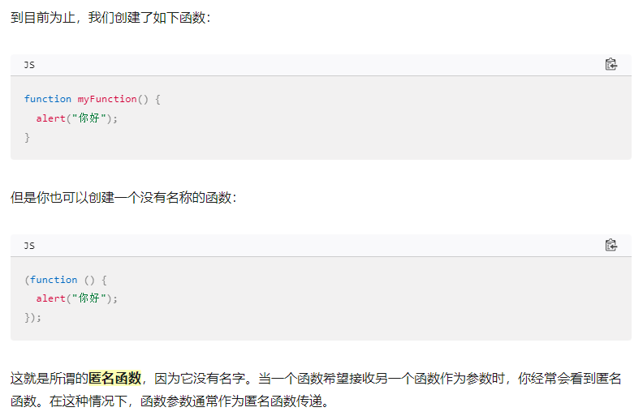
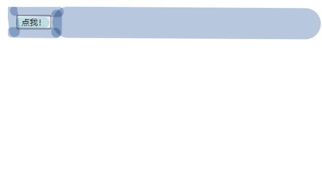
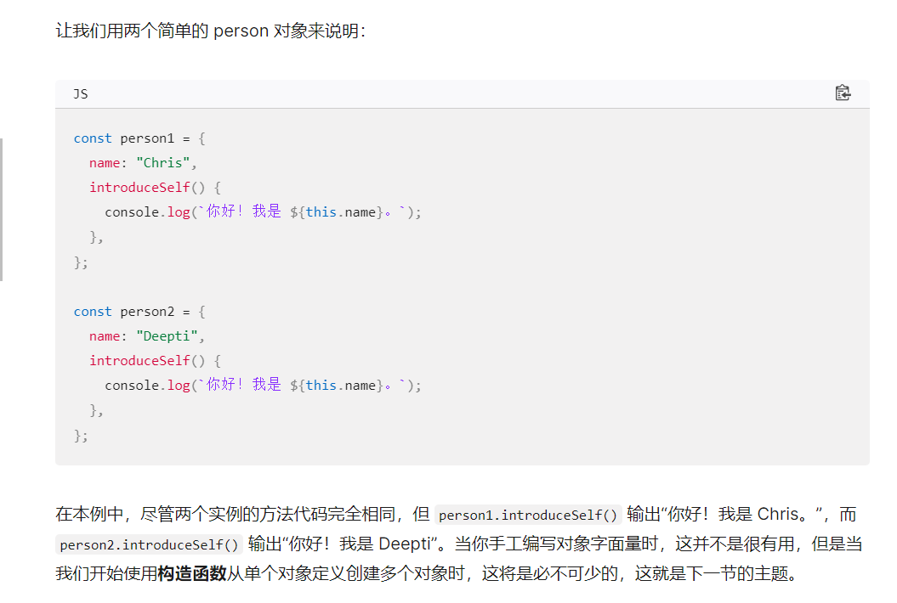

## 数据类型

### 概述

* 原始类型（primitive type）
  * 数值（number）：整数和小数
  * 字符串（string）
  * 布尔值
* 合成类型（complex type）
  * 对象（object）：分为狭义对象（object）、数组（array）、函数（function）
* 特殊值
  * undefined：未定义
  * null：空值

undefined是本来该有值的地方你没设值，是一种异常情况，所以它返回数值时是NAN.

null表示一个变量明确的被赋值成空值，所以返回0.





1.类型

- `typeof undefined`返回`"undefined"`。
- `typeof null`返回`"object"`（这是一个历史遗留问题，实际上`null`并不是一个对象）。

```
javascript复制代码console.log(typeof undefined); // 输出："undefined"
console.log(typeof null); // 输出："object"
```

> 因为一开始公司设置的数据类型只有对象、整数、浮点数、字符串和布尔值。只把null当做特殊对象，所以typeof null返回object。null,后来`null`独立出来，作为一种单独的数据类型，为了兼容以前的代码，`typeof null`返回`object`就没法改变了。

2.相等性

- `undefined == null`返回`true`，因为它们都被认为是空值。
- `undefined === null`返回`false`，因为它们类型不同。

```
javascript复制代码console.log(undefined == null); // 输出：true
console.log(undefined === null); // 输出：false
```

总结：undefined表示变量未赋值或未定义

null表示变量明确被赋值为空。

----

## MDN

### 杂】

<h3>箭头函数</h3>

在 JavaScript 中，`() => {}` 是箭头函数（arrow function）语法的一部分。箭头函数是 ES6（ECMAScript 2015）引入的一种新的函数定义方式，提供了一种更简洁的函数表达法，特别是对于简短的函数。

具体来说，`() => {}` 的含义如下：

1. **`()`**: 参数列表，表示函数的参数。如果函数没有参数，可以写成空的圆括号。如果有一个参数，可以省略圆括号。例如，`x => x * x` 是一个接受一个参数 `x` 的箭头函数。如果有多个参数，参数需要用圆括号包起来，如 `(a, b) => a + b`。

2. **`=>`**: 箭头符号，表示这是一个箭头函数。

3. **`{}`**: 函数体，包含需要执行的代码。如果函数体只有一个表达式，并且这个表达式会作为返回值返回，则可以省略大括号和 `return` 关键字。例如，`x => x * x` 是一个返回 `x` 的平方的箭头函数。

箭头函数与传统函数（使用 `function` 关键字定义的函数）有一些重要的区别：

1. **语法简洁**: 箭头函数写起来通常比传统函数更简洁。
   
2. **词法上的 `this` 绑定**: 箭头函数没有自己的 `this` 值，它会捕获上下文中 `this` 的值。这意味着箭头函数中的 `this` 会和箭头函数定义时的上下文的 `this` 保持一致。这对于在回调函数中使用 `this` 特别有用。

例子：

传统函数：
```javascript
function sum(a, b) {
    return a + b;
}
```

箭头函数：
```javascript
const sum = (a, b) => {
    return a + b;
};

// 进一步简化
const sum = (a, b) => a + b;
```

箭头函数在回调中的使用：
```javascript
const numbers = [1, 2, 3, 4, 5];

// 使用传统函数
const doubled1 = numbers.map(function(number) {
    return number * 2;
});

// 使用箭头函数
const doubled2 = numbers.map(number => number * 2);
```

总之，箭头函数为编写更简洁、更直观的代码提供了便利，尤其在处理回调函数或嵌套函数时非常有用。

## ------------------------

## JS第一步🦘

<h3>什么是JS</h3>

JS是一种脚本编程语言，可以让网页提供实时内容更新。

**API分类**

全称是Application Programming Interface.应用程序接口

分为3rd party APIs,Browser APIs


有以下几种常用API




**JS用途**

常见用途是按照文档对象模型API动态修改HTML，CSS


**内部JS**

就是在html文件中添加< script>blablablabla< /script>。 bla就是js语言

**外部JS**

在html文件中引用外部文件。< script src="script.js" defer>< /script>

**内联JS**

直接在html的标签中添加事件处理。

---

**常见定义解释**

* 解释&编译：分别是interpret,compile.先解释编译，编译型语言是说代码要转化成另一种形式才能运行。比如C和C++先要编译成机器码，然后才能由计算机运行。解释型语言是说，代码自上而下运行，且**实时返回运行结果**。
* `监听控件.addEventListener("监听事件"，“处理器”)  `：监听控件发生的事件并分配处理器


**脚本阻塞**

由于HTML是自上而下运行，所以有时候遇见js了就不往下运行了，这时候常用defer，不过是外部js的时候。

*  `DOMContentLoaded` 事件，表示HTML 文档体完全加载和解析。（一般用在html加载完毕再运行js的时候）
* `defer`：（仅对外部脚本有效，而且通常是放到< head>标签中）常见于< script src="script.js" defer>< /script>。defer告知浏览器在遇到 `<script>` 元素时先把HTML 内容解析完以后再执行js脚本，而不是遇见脚本就立即执行。（适用于脚本中有很多DOM的情况）有助于减缓阻塞。（defer的翻译是推迟，延缓）
* `async`：脚本下载完就立即执行。也就是可能会边解析HTML文档边解析脚本。
* 如果你直接把js脚本文件放在HTML代码底端，那上面的都是浮云，完全不需要使用了，因为计算机直接运行完上面的再运行js。


## 循环&条件语句

`for...of` 循环为你提供了一种获取数组中的每一个元素的方法

例子

```
const fruits = ["apples", "bananas", "cherries"];
for (const fruit of fruits) {
  console.log(fruit);
}
```

`for (const fruit of fruits)` 这一行的意思是：

1. 把 `fruits` 中的第一个元素设置成`fruit`。
2. 运行`{}` 。
3. 获取 `fruits`中的下一个元素，重复步骤 2，直至到达 `fruits` 的末尾。

---

**循环**

循环并不难，但是在一些算法题目中容易绕进去，希望你冷静思考，不要妄自菲薄，熟练度上来以后会好很多。

while(	){	}

do{	}while(	)

-- 

break 跳出循环（只跳出最近的一层循环）

continue 跳出迭代 （跳出最近一层）


**条件**

if(	)else{	}

if(	){	}else if(	){	}else{	}


## 变量

变量可以存储任何东西，比如变量可以存储数值。但是变量不是数值本身，变量只是装数值的容器。

声明一个变量的语法是在 `var` 或 `let` 关键字之后加上这个变量的名字、


<h5>变量提升</h5>

指的是你可以先用这个变量，在后面再声明它。

name="chris";  var name;


不过这样写是错误的，var myName = "Chris"; var myName = "Bob";


<h5>变量命名规则</h5>

你应当坚持使用拉丁字符 (0-9,a-z,A-Z) 和下划线字符。

- 变量名不要以下划线开头——以下划线开头的被某些 JavaScript 设计为特殊的含义，因此可能让人迷惑。
- 变量名不要以数字开头。这种行为是不被允许的，并且将引发一个错误。
- 一个可靠的命名约定叫做 ["小写驼峰命名法"](https://en.wikipedia.org/wiki/CamelCase#Variations_and_synonyms)，用来将多个单词组在一起，小写整个命名的第一个字母然后大写剩下单词的首字符。我们已经在文章中使用了这种命名方法。
- 让变量名直观，它们描述了所包含的数据。不要只使用单一的字母/数字，或者长句。
- 变量名大小写敏感——因此`myage`与`myAge`是 2 个不同的变量。
- 最后也是最重要的一点——你应当避免使用 JavaScript 的保留字给变量命名。保留字，即是组成 JavaScript 的实际语法的单词！因此诸如 `var`、`function`、`let` 和 `for` 等，都不能被作为变量名使用。浏览器将把它们识别为不同的代码项，因此你将得到错误。


<h5>动态类型</h5>

JavaScript 是一种“动态类型语言”，这意味着不同于其他一些语言 (译者注：如 C、JAVA)，你不需要指定变量将包含什么数据类型（例如 number 或 string）。

let myString = "Hello";

## 文本处理 字符串

在 JavaScript 中，你可以选择单引号（`'`）、双引号（`"`）或反引号（```）来包裹字符串。

字符串的开头和结尾必须使用相同的字符，否则会出现错误。

<h5>模板字面量</h5>

使用反引号声明的字符串是一种特殊字符串，被称为[*模板字面量*](https://developer.mozilla.org/zh-CN/docs/Web/JavaScript/Reference/Template_literals)。在大多数情况下，模板字面量与普通字符串类似，但它具有一些特殊的属性。


在模板字面量中，你可以在 `${ }` 中包装 JavaScript 变量或表达式，其结果将被包含在字符串中：

```
const name = "克里斯";
const greeting = `你好，${name}`;
console.log(greeting); // "你好，克里斯"
```

你可以使用相同的技术来连接两个变量：

```
const one = "你好，";
const two = "请问最近如何？";
const joined = `${one}${two}`;
console.log(joined); // "你好，请问最近如何？"
```

像这样连接字符串被称为*串联*（concatenation）。


如果你不想使用模板字面量，只想使用普通字符串，

可以写

```
const greeting = "你好";
const name = "克里斯";
console.log(greeting + "，" + name); // "你好，克里斯"
```

> 用加号"+"尽情的连接吧！

但是，模板字面量通常更具可读性：

```
const greeting = "你好";
const name = "克里斯";
console.log(`${greeting}，${name}`); // "你好，克里斯"
```


更复杂一点的模板字面量中可以包含js表达式：

```
const song = "青花瓷";
const score = 9;
const highestScore = 10;
const output = `我喜欢歌曲《${song}》。我给它打了 ${
  (score / highestScore) * 100
} 分。`;
console.log(output); // "我喜欢歌曲《青花瓷》。我给它打了 90 分。"
```


:christmas_tree:当你想在字符串中输入双引号或者单引号的时候该怎么做呢？

输入双引号：

> 一种是换其他字符来声明字符串，之前说过字符串还可以用单引号和反引号声明
>
> ```
> const goodQuotes1 = 'She said "I think so!"';
> const goodQuotes2 = `She said "I'm not going in there!"`;
> ```

输入单引号' ：

> 可以用转义字符，单引号'的转义字符是\'
>
> ```
> const bigmouth = 'I\'ve got no right to take my place…';
> console.log(bigmouth);
> //I've got no right to take my place…
> ```

## 数组

<h4>数组的定义和简单使用</h4>

数组是包含了多个值的对象。

数组也是个对象，与其他对象的区别是我们可以单独访问列表中的每个值。

**创建数组：**

```
let shopping = ["bread", "milk", "cheese", "hummus", "noodles"];
let random = ["tree", 795, [0, 1, 2]];	//混合项目
```

**访问和修改数组元素：**

用方括号访问：

shopping[0];

数组中包含数组的话称之为多维数组。你可以通过将两组方括号链接在一起来访问数组内的另一个数组:

random[2] [2];

**获取数组长度：**

```
sequence.length;
```


<h4>有趣的方法</h4>

**spilt方法：用于分割字符串去存进数组中**



**join方法与方法：把数组每个项组合起来存进字符串**




<h4>添加和删除数组项</h4>

添加一个或多个要添加到数组末尾的元素`push()`

```
myArray.push("Cardiff");
myArray;
myArray.push("Bradford", "Brighton");
myArray;
```

从数组中删除最后一个元素的话直接使用 `pop()`

```
myArray.pop();
```


`unshift()` 和 `shift()` 从功能上与`push()` 和 `pop()`完全相同，只是它们分别作用于数组的开始，而不是结尾。

```
myArray.unshift("Edinburgh");	//unshift意思是平移
myArray;
```


```
let removedItem = myArray.shift();
myArray;
removedItem;
```


## 函数

函数是可复用的代码块，要使用这个代码块呢，只需要一个简短的命令来调用。

<h4>浏览器内置函数</h4>

太多咯，比如replace、join...

<h4>自定义函数</h4>

function name(){

​	//开始定义

}

name();	//开始使用


<h4>函数与方法</h4>

对象的成员的函数被称为**方法**。

很多时候内置代码是同属于函数和方法的。比如string a.replace();

此时这个replace就是属于a对象的方法，但它也是内置函数哦、


<h4>参数</h4>

常见一点的知识就不写了。

参数(parameter)我们也可以叫做属性(property)、argument、特性(attribute)。

有时候也可以设置默认参数

function hello（name）{		};	//指的是name是默认属性

function hello（name="克里斯"）{		}；	//指的是name是默认属性，克里斯是默认值


<h4>匿名函数和默认值</h4>



### 箭头函数

==(参数)=>{执行的内容}==

举例：

```
textBox.addEventListener("keydown", (event) => {
  console.log(`You pressed "${event.key}".`);
});
```

如果函数只接受一个参数，可以省略参数周围的括号：

```
textBox.addEventListener("keydown", event => {
  console.log(`You pressed "${event.key}".`);
});
```

最后，如果函数只包含一行 `return` 语句，也可以省略圆括号和 `return` 关键字，隐式地返回表达式。在下面的示例中，我们使用 `Array` 的 [`map()`](https://developer.mozilla.org/zh-CN/docs/Web/JavaScript/Reference/Global_Objects/Array/map) 方法将原始数组中的每个值加倍：

```
const doubled = originals.map(item => item * 2);
```


### 注意(声明

在JavaScript中，函数的定义和声明有时候可以混淆，但它们实际上指的是同一件事情，只是表达方式有所不同。以下是它们的区别和使用场景：

1. **函数声明 (Function Declaration)**:
   - 使用 `function` 关键字来定义函数。
   - ==函数声明会被提升（hoisted）==，这意味着在执行代码之前就可以访问函数。
   - 示例：
     ```javascript
     function add(a, b) {
         return a + b;
     }
     ```

2. **函数表达式 (Function Expression)**:
   - 将函数赋值给变量，或者将函数作为匿名函数直接使用。
   - 函数表达式不会被提升（==匿名函数也不会被提升==，匿名函数也可以当做函数表达式），只有在执行到达它们定义的位置时，才能访问到这些函数。
   - 示例：
     ```javascript
     var add = function(a, b) {
         return a + b;
     };
     ```
   - 或者使用匿名函数：
     ```javascript
     var add = function(a, b) {
         return a + b;
     };
     add(4,7);
     ```
   
3. **箭头函数 (Arrow Function)**:
   - ES6引入的新特性，提供了一种更简洁的函数定义方式。
   - 箭头函数有更短的语法，并且词法上绑定 `this`。
   - 示例：
     ```javascript
     var add = (a, b) => a + b;
     ```

**总结**：
- 如果你希望函数在代码中任何地方都可以被调用（因为函数声明会被提升），可以使用函数声明。
- 如果你希望在一个表达式中定义函数（比如将函数赋值给变量），或者希望定义匿名函数，可以使用函数表达式。
- 如果你希望使用更现代的语法，尤其是在处理简单函数时，可以考虑使用箭头函数。

在实际应用中，通常会根据具体的需求和代码风格来选择适合的方式来定义函数。

### 注意(传参简化

```
function logKey(event) {
  console.log(`You pressed "${event.key}".`);
}

textBox.addEventListener("keydown", logKey);
```

上面所有代码简化成以下，用匿名函数

```
textBox.addEventListener("keydown", function (event) {
  console.log(`You pressed "${event.key}".`);
} );

```

还可以进一步简化，用箭头函数

```
textBox.addEventListener("keydown", (event) => {
  console.log(`You pressed "${event.key}".`);
});
```


### 调用知识

```
btn.onclick = displayMessage;
```

btn绑定的是button，当button被点击的时候，函数就会被调用。

不过那可能会想为什么右边的函数没有加括号呢？这是因为一旦加上括号，就会立即被调用，管你此时有没有被点击呢

比如btn.onclick=displayMessage();	

不过可以写**匿名函数**。因为匿名函数并不会直接执行，前提是代码要在函数作用域内。

btn.onclick=function(){  }


## 事件

事件是你正在编程的系统中发生的事情。（事件是在浏览器窗口内触发的）

事件产生，系统触发某种信号，并且触发一些可自选机制。
//这里列举常见的事件 中文+英文

> 事件举例：
>
> 用户按下某个按键 keydown
>
> 用户悬停光标 mouseover
>
> 网页结束加载 load
>
> 表单提交 submit
>
> 视频的播放、暂停或结束 play/pause/ended
>
> 发生错误 error
> 
> 表单控件（下拉、复选框、文本框）失焦或值变化 change
> 
> 元素获得或失去焦点 focus/blur
> 
> 窗口尺寸变化时触发 resize


### 事件处理器

<h4>事件处理器（event handler）是指事件触发时真正执行的那段逻辑。</h4>

> 像我之前对事件处理器的理解是这样的：`事件处理器(“事件”，“调用函数”)`
> 实际上这是完全错误的！！
> 我上面这段里的“事件处理器”实际上只是浏览器DOM提供的API方法，用来把`事件`和`调用函数`绑定起来，比如下面的addEventListener就是API方法，并不是事件处理器本身。
> 所以事件处理器指的是上面的`调用函数`。

```
// 比如这里给按钮绑定 点击事件 和 事件处理器，handleSave是事件处理器，addEventListener负责注册或者添加监听器
// addEventListener内部的事件和事件处理器加起来，它们三个加起来才是监听器
const btn = document.querySelector('#save');
btn.addEventListener('click',handleSave)
```
<h5>监听器</h5>
监听器（事件监听器）就是把“浏览器的监听 API + 某个事件的触发 + 事件处理函数”组合在一起使用的一套机制。
具体做法是，通过浏览器提供的addEventListener这类API，把某个事件和事件处理函数（也叫事件处理器）绑定，事件触发时，浏览器会自动调用事件处理函数。

<h5>移除监听器</h5>

监听器的定义可以看上面的代码框里的注释

方法一：使用`removeEventListener()`方法，负责删除事件处理器。内部两个参数，一个事件名，一个函数。

方法二：通过信号法删除。

大体是说先创建一个控制器。

然后在addEventListener内部，添加一个参数，叫选项对象，负责向该处理器传递信号。

然后在监听器外，调用处理器的中止功能。（abort是中止的意思）

```
const controller = new AbortController();	//创建对象，controller叫做控制器
// 这里有三个参数，第一个是事件，第二个是回调函数，第三个是选项对象
btn.addEventListener("click",
  () => {
    const rndCol = `rgb(${random(255)}, ${random(255)}, ${random(255)})`;
    document.body.style.backgroundColor = rndCol;
  },
{signal: controller.signal })  //在addEventListener方法内部传递 Signal;


controller.abort();// 移除所有与该控制器相关的事件处理器

```
AbortController 适合一次性移除多个监听器或在组件销毁时统一清理，对比 removeEventListener 逐个解绑更省事。
> 先 const controller = new AbortController()，然后在所有需要统一管理的监听器里都把 { signal: controller.signal } 作为第三个参数传进去；当你执行 controller.abort() 时，所有挂在该 signal 上的监听器都会立即解除。这样在页面切换、组件卸载或需要批量禁用交互时，只需中止一次，避免逐个 removeEventListener。


<h5>在单个事件上添加多个监听器</h5>

你可以为一个事件设置多个处理器

myElement.addEventListener("click",functionA);

myElement.addEventListener("click",functionB);

当点击按钮，这两个处理器函数都会运行


<h5>其他事件监听器机制</h5>


除了 `addEventListener()`，浏览器还提供事件属性和内联事件处理器两种写法，但它们都不如 `addEventListener()` 灵活。`addEventListener()` 能为同一个事件绑定多个处理函数，并且脚本与结构分离，后期维护更轻松。

事件属性处理器：常见于 `button.onclick = () => {}` 这种写法，也可以先在别处定义函数 `function change() { ... }`，再用 `button.onclick = change` 引用它。需要注意的是，属性只能保存最后一次赋值，比如先写 `element.onclick = fn1;` 再写 `element.onclick = fn2;`，最终只会执行 `fn2`，不像 `addEventListener()` 那样能并存多个处理函数。

内联事件处理器：如 `<button onclick="change()">Click me!</button>`。这种方式会把 HTML 和 JS 混在一起，把代码写在HTML里，将UI和逻辑交织混合，一旦需要调整触发逻辑就得逐个控件修改，因此不推荐使用。


### 事件对象

放在事件处理函数的**参数**当中

```
btn.addEventListener("click", bgChange);	//btn绑定的是button

function bgChange(e) {
  const rndCol = `rgb(${random(255)}, ${random(255)}, ${random(255)})`;
  e.target.style.backgroundColor = rndCol;
  console.log(e);
}
```

在上面的代码中，可以看到触发的函数传入的参数是e,其实这里传入`event`,`evt`,`e`都可以

> 以往我们常常会给bgChange传入函数运转需要的参数或者不提供，这里我们传入e。这里的e指的就是触发的

这个东西叫**事件对象**，它会自动传递给事件处理函数。

> 回到代码，e.target指的是控件本身（这里代码没有展示完毕，我们绑定的是button）
>
> target是e的属性，负责对元素进行引用。所以这里改变颜色改变的是button的颜色，而不是html背景颜色。


针对不同的事件，事件对象有时候有一些额外的属性。在上个代码中，事件对象具有target属性，这个是通用的。不过针对keydown事件，事件对象额外的属性就是key，告诉你哪个键被按下。


### 阻止默认行为

有时你希望事件结束后不要立即执行默认行为。

比如用户提交表单，有时表单自己有一些简单的验证，但由于过于简单，很多信息筛错筛不出来，所以需要开发者自己写验证信息。

不过这不重要，重要的是用户有时会提交错误的信息，还按下了提交按钮，这时怎么阻止呢？

```
//以下是一个简单的例子

form.addEventListener("submit", (e) => {
  if (fname.value === "" || lastname.value === "") {
    e.preventDefault();
    para.textContent = "You need to fill in both names!";
  }
});
指的是在form当中的提交触发时，如果当中的input有任一是空的，就触发以下事件。并且触发完毕我们还会告诉用户应该修改哪里。
```


## 事件嵌套传递

### 事件冒泡

事件冒泡描述了浏览器如何针对嵌套元素的事件。

事件原理：当一个元素嵌套在父元素里，当你点击这个元素，同时也隐含的点击了它的父元素。（好比一个盒子里有巧克力，当你取巧克力，你不可避免的就碰到盒子）

<h5>冒泡实例</h5>

```
<body>
  <div id="container">
    <button>点我！</button>
  </div>
</body>
```

当你给div、button、body都绑上监听器，再来个处理函数

```
function handleClick(e) {
  output.textContent += `你在 ${e.currentTarget.tagName} 元素上进行了点击\n`;
}
```

会出现如下结果：



这上面其实插入了一张空白图片，当你点击浅蓝色区域，会出现`你在 BUTTON 元素上进行了点击
你在 DIV 元素上进行了点击
你在 BODY 元素上进行了点击`

当你点击深蓝色区域，会出现`你在 DIV 元素上进行了点击
你在 BODY 元素上进行了点击`

当你点击白色区域，会出现`你在 BODY 元素上进行了点击`


在这种情况下：

- 最先触发按钮上的单击事件
- 然后是按钮的父元素（`<div>` 元素）
- 然后是 `<div>` 的父元素（`<body>` 元素）

==我们可以这样描述：事件从被点击的最里面的元素**冒泡**而出。==


### 阻止传递

(指的是阻止事件冒泡传递)

<h5>使用 stopPropagation() 修复问题</h5>

但不是所有时候我们点击元素都希望触发它的父元素的，有一个方法可以防止这些问题。[`Event`](https://developer.mozilla.org/zh-CN/docs/Web/API/Event) 对象有一个可用的函数，叫做 [`stopPropagation()`](https://developer.mozilla.org/zh-CN/docs/Web/API/Event/stopPropagation)，当在一个事件处理器中调用时，可以防止事件向任何其他元素传递。

>  首先要找出你想要阻止什么事件，然后在事件内部施加语句

例如，

```
video.addEventListener("click", (event) => {
  event.stopPropagation();	//
  video.play();
});
```


### 事件冒泡应用

事件冒泡可以实现**事件委托**。

通俗来讲，一个父元素往往包含很多子元素，有时候监听器相同时，你不需要在每个子元素上安置监听器，只需要在父元素上安一个即可。因为子元素上的改变会传导到父元素上。


## event.target

我们使用 `event.target`来获取事件的目标元素（也就是最里面的元素）。

如果我们想访问处理这个事件的元素（在这个例子中是容器），我们可以使用`event.currentTarget`。

(不懂的结合MDN当前页面例子就懂了，这里只是mark一下)


## 事件捕获

它也是事件传递，但顺序与事件冒泡 相反。

> 事件冒泡是先在最内层的目标元素上发生，然后在逐层往父元素发生。
>
> 事件捕获在先在最外层父元素发生，再往内发生。
>
> //
>
> 专业术语：
>
> 事件冒泡：先在最内层的目标元素上发生，然后在连续较少的嵌套元素上发生。
>
> 事件捕获：事件先在*最小嵌套*元素上发生，然后在连续更多的嵌套元素上发生，直到达到目标。


**事件捕获默认是禁用的，你需要在 `addEventListener()` 的 `capture` 选项中启用它。**

> ```
> container.addEventListener("click", handleClick, { capture: true });
> ```


## 对象🦘

```
const objectName = {
  member1Name: member1Value,
  member2Name: member2Value,
  member3Name: member3Value,
};
```

一个对象由许多的成员组成，每个成员都拥有一个名字和一个值。**每一组名字/值必须由逗号分隔，并且名字和值要用冒号分隔。**

> 对象成员的值是任意的，比如可以是数字，数组也可以是函数。
>
> 对象成员值是数字、数组的时候我们叫做对象的**属性**，也叫**数据项**。
>
> 对象成员值是函数的时候，即对象对数据可以进行某些操作时，我们称为**方法**。
>
> ```
> const person = {
>   name: ["Bob", "Smith"],	//数据项
>   age: 32,					//数据项
>   bio: function () {		//方法
>     console.log(`${this.name[0]} ${this.name[1]} 现在 ${this.age} 岁了。`);
>   },
> };
> ```
>
> 这里的函数写法可能看起来有点奇怪，这的确不是我们最简单的写法。
>
> ```
> bio(){
> 	console.log(...);
> }
> ```
>
> ==上面的被称为**对象字面量**，手动的写出对象的内容来创建对象。==是我们自己手写创建的对象，而不是直接用模板生成的

### 点表示法

点表示法可以访问对象的属性和方法，对象的名字表现为一个**命名空间**。

当你想要访问对象内部的属性和方法时，命名空间必须写在第一位。然后输入一个点，紧接着是你想要访问的目标。

> 这个目标可以是简单属性的名字，或者是数组属性的子元素

person.age;

person.bio();

person.name[0];

<h5>子命名空间</h5>

从

```
const person = {
  name: ["Bob", "Smith"],
};
```

改成

```
const person = {
  name: {
    first: "Bob",
    last: "Smith",
  },
};
```

需要访问这些属性，只需要再一次用链式的点表示法。

person.name.first;

### 括号表示法

person.age变成 person.["age"];

person.name.first变成 person["name"] ["first"]

>  之前我们访问name里的元素用的是person.name[0]，这看起来很像是在访问数组，我们这里也用到了方括号，看起来也像是数组。
>
> 区别在于，它是使用关联值的名称来访问，而不是使用索引。
>
> 这里我们称之为**关联数组**，对象将字符串映射到值，而数组将数字映射到值。

点表示法通常优于括号表示法，因为它更易读。但是当出现对象的属性名称是***变量***时，必须使用括号表示法。

```
const person = {
  name: ["Bob", "Smith"],
  age: 32,
};

function logProperty(propertyName) {
  console.log(person[propertyName]);	////括号表示法
}

logProperty("name");	
// ["Bob", "Smith"]
logProperty("age");
// 32
```

==在JavaScript中，使用括号表示法访问对象属性时，必须将属性名作为字符串传递，因此需要使用引号（单引号 `'` 或双引号 `"`）来包围属性名。否则，JavaScript会将其解释为变量名，而不是属性名的字符串==

==但是如果是变量，用括号表示法访问时可以不加字符串，但是得保证变量内存储的值必须是字符串==


### 设置对象成员

<h4>修改对象成员的值</h4>

person.age=45;

person["name"] ["last"]="CratChit";

<h4>创建新的成员</h4>

person["eyes"]="hazel";

//创建新的函数

person.farewell=function(){console.log("再见");}

<h4>设置对象成员</h4>

```
const myDataName = nameInput.value;
const myDataValue = nameValue.value;
person[myDataName] = myDataValue;
////应用
const myDataName = "height";
const myDataValue = "1.75m";
person[myDataName] = myDataValue;
```


### “this”的含义

之前我们用到过this

```
const person={
	name:"Chris",
	introduceSelf() {
  		console.log(`你好！我是 ${this.name[0]}。`);
  	}
}
```

关键字 `this` 指向了当前代码运行时的对象——这里指 `person` 对象

> 为什么不直接写person呢？
>
> 假如说我们这里只有一个对象，那你写写person无碍，但是当你要创建多个对象时，那肯定不能把person写进函数里了，因为我们每个对象都想用你这个函数。
>
> 所以这就体现了this的作用，它可以让你对每一个创建的对象都采取相同的方法定义。



### 构造函数

==只用==对象字面量在创建多个对象时是不够用的。

我们希望有这样一种方法，可以创建任意多个对象，只需要更新不同属性的值。

> 注：以下不是构造函数

```
function createPerson(name) {
  const obj = {};
  obj.name = name;
  obj.introduceSelf = function () {
    console.log(`你好！我是 ${this.name}。`);
  };
  return obj;
}
```

每次调用 `createPerson()` 函数时，它都会创建并返回一个新对象。该对象将具有两个成员：

- 一个 `name` 属性
- 一个 `introduceSelf()` 方法。


现在我们可以创建任意多个对象，重用该定义：

```
const salva = createPerson("Salva");	//==createPerson会返回一个obj，此时你把obj传给salva，即该==
salva.name;
salva.introduceSelf();
// "你好！我是 Salva。"

const frankie = createPerson("Frankie");
frankie.name;
frankie.introduceSelf();
// "你好！我是 Frankie。"
```


> 可以看到上面的salva和frankie的创建有点冗长了，我们需要新创建一个空对象，然后初始化它、返回它。
>
> 接下来我们使用构造函数。

**构造函数是使用new关键字调用的函数**

当你调用构造函数时，它将：

- 创建一个新对象
- 将 `this` 绑定到新对象，以便你可以在构造函数代码中引用 `this`
- 运行构造函数中的代码
- 返回新对象

让我们应用一下，首先重写示例。

function Person(name) {
  this.name = name;
  this.introduceSelf = function () {
    console.log(`你好！我是 ${this.name}。`);
  };
}

然后开始应用：

const salva = new Person("Salva");
salva.name;
salva.introduceSelf();
// "你好！我是 Salva。"

const frankie = new Person("Frankie");
frankie.name;
frankie.introduceSelf();
// "你好！我是 Frankie。"


## 对象原型


### 原型链

js中所有对象都有一个内置属性，叫做**prototype(原型)**。

原型本身也是一个对象，所以这个对象也有自己的内置属性，故原型也会有自己的原型。这就构成了**原型链**。

原型链止于 null作为其原型的对象。


<h4>访问原型</h4>

访问对象原型的标准方法是Object.getPrototypeof( )；

当你试图访问一个对象的属性时，如果在对象本身找不到该属性，就会在原型链中搜索该属性，如果仍然找不到该属性，就会搜索原型的原型，以此类推，直到找到属性或者到达链的末端(返回undefined)。

所以，在调用 `myObject.toString()` 时，浏览器做了这些事情：

- 在 `myObject` 中寻找 `toString` 属性
- `myObject` 中找不到 `toString` 属性，故在 `myObject` 的原型对象中寻找 `toString`
- 其原型对象拥有这个属性，然后调用它。

<h4>原型是什么</h4>

有个对象叫Object.prototype，它是最基础的原型（因为它指向null），所有对象都默认拥有它。

> Object.prototype自身没有原型，它是原型链的终点。


但是一个对象的原型并不一定总是Object.prototype，

```
const myDate = new Date();
let object = myDate;

do {
  object = Object.getPrototypeOf(object);
  console.log(object);
} while (object);

// Date.prototype
// Object { }
// null
```

所以myDate的原型是Date.prototype对象，Date.prototype的原型是Object.prototype，Object.prototype的原型是null

### 属性遮蔽

指的是在对象中定义了一个属性，但是在对象的原型中定义了一个同名的属性。

可以看到在下面的第二句就有gapyear，可以知道gapyear是Date中的函数

但是在第三行我们在myDate中又定义了一个gapyear函数，此时你再调用gapyear调用的是myDate中的函数。

```
const myDate = new Date(1995, 11, 17);

console.log(myDate.getYear()); // 95

myDate.getYear = function () {
  console.log("别的东西！");
};

myDate.getYear(); // '别的东西！'
```

鉴于对原型链的描述，这应该是可以预测的。当我们调用 `getYear()` 时，浏览器首先在 `myDate` 中寻找具有该名称的属性，如果 `myDate` 没有定义该属性，才检查原型。因此，当我们给 `myDate` 添加 `getYear()` 时，就会调用 `myDate` 中的版本。

这叫做属性的“遮蔽”。


### js中的类

#### 类和构造函数

在 JavaScript 中，可以通过两种主要方式声明构造函数：一种是使用传统的函数声明，另一种是使用 ES6 引入的类语法。

<h3> 使用函数声明</h3>

传统上，JavaScript 使用函数声明来定义构造函数。构造函数名通常以大写字母开头，表示它是一个构造函数，需要使用 `new` 关键字来实例化对象。


<h3>使用 ES6 类语法</h3>

在 ES6 中，引入了 `class` 关键字，使得定义类和构造函数更加简洁和直观。


## JSON

json是一种标准格式，用的是js语法，但是和js没有关系。

json里面就是由一堆数组、对象这样的东西构成。

* JSON 是一种纯数据格式，它只包含属性，没有方法。
* **JSON 要求在字符串和属性名称周围使用双引号。单引号无效。**
* JSON 实际上可以是任何可以有效包含在 JSON 中的数据类型的形式。比如，单个字符串或者数字就是有效的 JSON 对象。

```
const person = {
  name: "John",
  age: 30,
  isStudent: false,
  address: {
    street: "123 Main St",
    city: "New York",
    zipcode: "10001"
  },
  phoneNumbers: ["123-456-7890", "987-654-3210"]
};
```

一个是JSON格式的字符串

const jsonString = '{"name": "Alice", "age": 25}';

一个是JS风格的字符串

const jsonObject = {name: "Alice", age: 25};

> JSON 格式中的 `{}` 是对象结构，
>
> 但 JSON本质上是一个纯字符串， 所以整个内容必须以字符串的形式表示，因此需要用引号包裹。

<h4>两个常用函数</h4>

**JSON.parse()：将JSON字符串解析为JS对象**

const jsonString = '{"name": "Alice", "age": 25}';
const jsonObject = JSON.parse(jsonString);
console.log(jsonObject);  // 输出: {name: "Alice", age: 25}

**JSON.stringify()：将JS对象序列化为JSON字符串**

const jsonObject = {name: "Alice", age: 25};
const jsonString = JSON.stringify(jsonObject);
console.log(jsonString);  // 输出: '{"name": "Alice", "age": 25}'


## 异步

异步指的是让你的程序在执行一个耗时操作的同时可以去处理其他的事情，而不是在那里一味地等待程序的运行。（当这个耗时操作完成后，再通过某种方式，如回调，promise来通知你并处理结果）


> 可能发生异步的情况
>
> 以下是一些可能会长时间运行的函数：
>
> - 使用 `fetch()`发起 HTTP 请求
> - 使用 `getUserMedia()` 访问用户的摄像头和麦克风
> - 使用 `showOpenFilePicker()`请求用户选择文件以供访问
>
> 
>
> 与之相对的，来看看什么是同步函数
>
> const name = "Miriam";
> const greeting = Hello, my name is ${name}!;
> console.log(greeting);
> // "Hello, my name is Miriam!"
>
> 这样一行完了再下一行执行的（无需等待）就叫做**同步程序**。


## 事件处理程序

**事件处理程序是异步编程的一种具体实现和表现形式。**

之前我们学过事件处理程序，意思就是事件发生后的一些处理程序。（它没有立即执行，只是被预约）

比如addEventListener不是事件处理程序，它有两个参数，第二个才是事件处理程序，addEventListener只是负责给事件添加事件处理程序的

> container.addEventListener("click", handleClick, { capture: true });

而时间处理程序在事件发生后才调用，而不是事件发生的同时被调用的

事件处理程序放在那里但是不会立即执行，不会阻塞js其余的执行，而是在遇到特定事件才触发，触发完后返回结果。

事件处理程序在事件发生时被放入事件队列（event queue），等待事件循环处理。当主线程空闲时，事件循环会从事件队列中取出事件处理程序并执行它们。

> 事件处理程序遵循“发布-订阅”模式，
>
> 订阅（subscribe)：设定好事件处理程序`button.addEventListener('click', myFunction)`
>
> 注册（register）：代码解析到事件处理器，会在后台将事件处理器和事件绑定在一起。
>
> 发布（publish）:当事件被触发，事件处理程序被放进消息队列
>
> 执行：js的事件循环（Event loop）机制会持续检查调用栈是否为空，为空的话，会从消息队列中取出来一个待处理的事件，并进行处理。


## 回调

事件处理程序是一种特殊的回调函数。

回调函数就是说，把A函数传进B函数，并在适当的时候调用A函数。(A:callback)

B执行的时候可能会立即调用A函数，也可能会等一会执行。

尽管回调函数通常是通过将一个函数作为参数传递给另一个函数来实现，但只要遵循将操作的控制权交给另一个函数这一核心概念，就可以有多种实现方式。

> 回调函数遵从先传进去一个函数，并在合适的时候再调用这个函数。

**回调与异步的关系：**回调是我们传进去一个函数，这个函数不需要立即执行。而你的事件处理程序也不需要立即执行，只是等事件发生了再执行事件处理程序，执行完毕我们会返回执行的结果

同步回调是在主函数执行过程中立即调用的回调函数。

```
function greet(name, callback) {
    console.log('Hello ' + name);
    callback();
}

function sayGoodbye() {
    console.log('Goodbye!');
}

greet('Alice', sayGoodbye);
```

最后一行调用greet，传入name和函数，由于consolelog忽略不计，基本可以当saygoodbye一传进去就执行了，所以是同步回调


**异步回调**

```
function fetchData(callback) {
    setTimeout(function() {
        console.log('Data fetched');
        callback('Data');
    }, 2000);
}

function processData(data) {
    console.log('Processing: ' + data);
}

fetchData(processData);
```

这里的processData等了一会儿才执行的


**回调例子**

```
document.getElementById('myButton').addEventListener('click', function() {
    console.log('Button clicked!');
});
```

这里的function() {console.log('Button clicked!');}就是回调函数。当按钮被点击，回调函数被调用


**回调地狱**

拿上面举例，指的是function() {}里面还调用了其他函数，这个其他函数里还调用函数。这就是回调地狱。我们利用promises解决。

**待扩充**


## js中异步相关机制讲解

### 单线程模型

JS上只有一个线程，一个线程只能运行一个脚本（运行的这个叫主线程）（其他线程搁后台待着吧

JS设计之初就只想要有一个线程，因为多线程还涉及线程之间的交互设置，所以JS压根就没想让你多线程。但是有时候会有一个很漫长的函数，总不能卡在那里等着吧（这叫假死）

所以设计了这样一种模式，把这种任务先挂起来不管，先继续执行后面的代码，等挂着的任务返回一个结果（不是执行完毕的结果，而是IO结果，请求结果）再把这个挂着的任务放到主线程继续执行。


### 同步、异步任务

同步任务是说没有被引擎挂起，放在主线程中排队执行的任务。只有前一个任务完成，才能执行后一个任务。

异步任务是说被引擎挂在一边，不进入主线程、而进入任务队列的任务。只有主线程的执行栈空了，才会利用回调函数把任务队列中的异步任务放到主线程执行。

**异步**：异步任务不进入主线程、而进入**"任务队列"**（task queue）的任务，只有"任务队列"通知主线程，某个异步任务可以执行了，该任务才会进入主线程执行。

使用异步的场景：

（1）定时任务，setTimeout，setInterval

（2）网络请求： ajax请求，动态加载

（3）事件绑定，点击等交互事件

<h4>简陋的机制描述</h4>

执行栈（调用栈）		Event queue

> 左边是位于主线程的执行栈，右边是一个事件队列。
>
> 执行栈空的时候，会从事件队列中取东西出来执行。


### 任务队列

我们知道我们会有一个正在运行的主线程，引擎还提供一个任务队列，放置的是需要程序处理的各种异步任务。

（根据异步任务的类型，实际上存在多个任务队列，但是一般为了方便理解，我们假设只有一个任务队列）

我们的主线程会去一直执行同步任务，一旦同步任务执行完，就去看看任务队列里的异步任务，如果满足条件，异步任务就进入主线程开始执行，这时“异步任务”就变成同步任务了。执行完，再去任务列表找下一个异步任务。一旦任务队列清空，程序就结束执行。

> 我们的异步任务在准备进入主线程的时候，需要用到回调函数。为什么？你想想回调函数里面是什么？它毕竟也是个函数，函数里面就是方法，所以函数里面写的就是你该干什么，拿addeventlistener举例，这里的回调函数就是说在发生某个事件后我要执行什么。这个要执行什么就是调回主线程的关键，因为如果你没有要继续执行的东西，把你调到主线程有什么用呢？又不知道要干什么。所以**一个异步任务没有回调函数，就不会进入任务队列**

```
console.log('Start');

setTimeout(() => {
    console.log('Timeout callback');
}, 1);

console.log('End');

```

浏览器先来执行console.log('Start')

然后遇见定时器，发送到（浏览器）Web API，

继续执行console.log('End')，

Web API反馈回来（1s到期了），把settimeout的回调函数<u>放到任务队列</u>，

事件循环检查执行栈空了，从任务队列中取出settimeout的回调函数并执行console.log('Timeout callback')


### 定时器

原理：`setTimeout`和`setInterval`的运行意思大概是，等待一段时间后再执行这个函数，区别是是否重复执行。但是这些由于本身就是回调函数，本身就待在任务队列中，所以不能够保证时间到了，事件循环也能立即把他们从任务队列拉出来执行，只能说等待同步任务执行结束。

**`setTimeout`和`setInterval`的运行机制，是将指定的代码移出本轮事件循环，等到下一轮事件循环，再检查是否到了指定时间。如果到了，就执行对应的代码；如果不到，就继续等待。**

#### setTimeout()

```
var timerId = setTimeout(func|code, delay);
```

setTimeout函数用来指定一段代码在多少毫秒之后执行，它返回一个整数，表示定时器的编号（这个定时器可以根据编号取消，取消的意思就是不等了，直接执行）

上面代码中，`setTimeout`函数接受两个参数，第一个参数`func|code`是将要推迟执行的函数名或者一段代码，第二个参数`delay`是推迟执行的毫秒数。

```
举例一
setTimeout('console.log(2)',1000);
举例二
setTimeout(f,1000);	//这个f指的是函数名，函数在某个地方定义过
举例三
setTimeout(f);	//第二个参数如果不写，就默认为0
举例四
setTimeout(function (a,b) {
  console.log(a + b);
}, 1000, 1, 1);	//上面代码中，一共有四个参数，第一个参数是推迟执行的函数，第二个是定时器，第三个和第四个是1000ms后，推迟执行的函数（回调函数）的参数）

```

//特殊情况

```
var x = 1;

var obj = {
  x: 2,
  y: function () {
    console.log(this.x);
  }
};

setTimeout(obj.y, 1000)
// 1
```

先看最后一行，我们传入了对象obj的方法，也就是obj内部的函数，但是这时obj.y内部的this已经不指向obj了，已经指向全局了

具体来说，当你把对象的方法作为参数传递时，这个方法会丧失其原始对象的上下文绑定，**变成**一个**独立的函数**。此时，函数的 `this` 关键字不会再指向原始对象，而是默认指向全局对象（在浏览器中是 `window`）或 `undefined`（严格模式下）。


#### setInterval()

`setInterval`函数的用法与`setTimeout`完全一致，区别仅仅在于`setInterval`指定某个任务每隔一段时间就执行一次，也就是无限次的定时执行。

```
var i = 1
var timer = setInterval(function() {
  console.log(2);
}, 1000)
```

上面代码中，每隔1000毫秒就输出一个2，会无限运行下去，直到关闭当前窗口。

```
var div = document.getElementById('someDiv');
var opacity = 1;
var fader = setInterval(function() {
  opacity -= 0.1;
  if (opacity >= 0) {
    div.style.opacity = opacity;
  } else {
    clearInterval(fader);
  }
}, 100);
```

上面代码每隔100毫秒，设置一次`div`元素的透明度，直至其完全透明为止。

> 不过这个函数有个细节，就是假设你现在设置每隔1000ms执行，但是任务需要执行100ms，根据函数的设计，实际上过去900ms就开始执行任务了。因为这个1000ms是包含中间空余的时间和执行任务的时间。
>
> 如果你想修订这个设计，可以这么写
>
> ```
> var i = 1;
> var timer = setTimeout(function f() {
>   timer = setTimeout(f, 2000);
>   timer = setTimeout(f, 2000);
>   timer = setTimeout(f, 2000);
>   // ...
> }, 2000);
> ```
>
> 跟着我的思路~首先我们是等待2000ms后开始执行function f(){}，先执行第一句，等待2000ms执行f，再等待2000ms执行f...
>
> 这样写的好处就是确保下一次执行总是在本次执行结束的2000ms开始。


## promise

**Promise** 是现代 JavaScript 中异步编程的基础。它是一个由异步函数返回的对象，可以指示操作当前所处的状态。在 Promise 返回给调用者的时候，操作往往还没有完成，但 Promise 对象提供了方法来处理操作最终的成功或失败。

> 现在你的主线程正在运行，now~遇见一个异步函数，我们让异步函数先去运行着，这个异步函数会先返回一个值，这个值叫做promise（promise是个对象），这个值它并不代表最终的结果，不过它的意思叫“承诺”，它会告诉代码，你需要我做的事情等异步函数结束我就会执行的！


你需要知道，**所有的异步任务都返回一个Promise实例**

Promise既是一个对象，也是一个构造函数。

对象是指promise拥有自己的属性、方法。

构造函数是指对象可以用Promise new指令创建出来 var p1=new Promise(f1);	//f1是异步函数

### Promise对象状态

Promise 对象通过自身的状态，来控制异步操作。Promise 实例具有三种状态。

- 异步操作未完成（pending）
- 异步操作成功/完成（fulfilled）
- 异步操作失败（rejected）

> 有时我们用**已敲定**（settled）这个词来同时表示fulfille和rejected两种情况。

如果一个 Promise 已敲定，或者如果它被“锁定”以跟随另一个 Promise 的状态，那么它就是**已解决**（**resolved**）的。

resolved 是指 Promise 已经有了最终的状态（要么是 fulfilled 要么是 rejected），但这只是描述性的术语，而不是规范中的状态码。


### Promise 状态转换

> 注意，这里的“成功”或“失败”的含义取决于所使用的 API：例如，`fetch()` 认为服务器返回一个错误（如 [404 Not Found](https://developer.mozilla.org/zh-CN/docs/Web/HTTP/Status/404)）时请求成功，但如果网络错误阻止请求被发送，则认为请求失败。

> 这三种的状态的变化途径只有两种。
>
> - 从“未完成”到“成功”
> - 从“未完成”到“失败”
>
> 一旦状态发生变化，就凝固了，不会再有新的状态变化。这也是 Promise 这个名字的由来，它的英语意思是“承诺”，一旦承诺成效，就不得再改变了。这也意味着，Promise 实例的状态变化只可能发生一次。
>
> 因此，Promise 的最终结果只有两种。
>
> - 异步操作成功，Promise 实例传回一个值（value），状态变为`fulfilled`。
> - 异步操作失败，Promise 实例抛出一个错误（error），状态变为`rejected`。

```js
let promise = new Promise(function(resolve, reject) {
    try {
        let result = someOperation(); // 假设这是一个可能抛出错误的操作
        resolve(result);
    } catch (error) {
        reject(error);
    }
});

promise.then(function(value) {
    console.log(value);
}).catch(function(error) {
    console.error("操作失败:", error);
});
```

上面是一个Promise构造函数，构造函数的创建实例的时候就能立刻执行。此时这个构造函数的参数是一个函数，这个执行函数接受两个参数，

**resolve**: 用于将 Promise 从“待定”（pending）状态变为“已完成”（fulfilled）状态，并传递一个值(data)作为成功的结果。

**reject**: 用于将 Promise 从“待定”（pending）状态变为“已拒绝”（rejected）状态，并传递一个原因(error)（通常是错误对象）作为失败的原因。

> 下面是应用，第一个函数用于改变实例的状态，第二个函数用于接收状态做出决定（then负责接收fulfilled状态，catch负责接收）

```js
let promise = new Promise(function(resolve, reject) {
    let success = true;
    if (success) {
        resolve("操作成功");	//resolve接收一个data数据，用于传递给以后要处理data的函数
    } else {
        reject("操作失败");		//reject接受一个error数据，也可以叫reson数据，就是失败原因，以后也会传递给要处理error的函数
    }
});

promise.then(function(value) {
    console.log(value); // 输出 "操作成功"
}).catch(function(error) {
    console.log(error);
});
```

#### 这里有promise的知识

> 这里会补充一些promise的知识
>
> promise用于处理异步操作（指需要等待一段时间才能完成的操作）。它表示一个异步操作的完成状态。
>
> 1. pending（等待中）：初始状态，既不是成功，也不是失败。
> 2. fulfilled（已成功）：表示操作成功完成。
> 3. rejected（已失败）：表示操作失败。
>
> 可以通过new Promise()来创建promise对象。它接受一个函数作为参数，而这个函数又有两个参数，resolve和reject参数分别用于把promise状态设置为fulfilled或rejected。
>
> > ```
> > const myPromise = new Promise((resolve, reject) => {
> > // 异步操作
> > setTimeout(() => {
> >  const success = true; // 假设操作成功
> >  if (success) {
> >    resolve('操作成功！');
> >  } else {
> >    reject('操作失败！');
> >  }
> > }, 1000);
> > });
> > ```
>
> 然后可以用.then()和.catch()来处理promise的结果
>
> > ```
> > myPromise
> > .then((result) => {
> >  console.log(result); // 输出：操作成功！
> > })
> > .catch((error) => {
> >  console.error(error); // 输出：操作失败！
> > });
> > ```
>
> > 上文提到的resolve是有很多意思的，上文的resolve是有作用的参数，也可以是函数，因为它会改变promise的状态，从pending到fulfilled。没错，resolve是promise的内部方法。
> >
> > 但是resolve作为promise的方法，还可以用于传递结果值。（promise.resolve是promise的静态方法，快速创建一个已经fulfilled的promise）
> >
> > ```
> > const resolvedPromise = Promise.resolve('操作成功！'); 
> > ```
> >
> > 在这个例子中，Promise.resolve 返回一个已经 resolve 的 Promise，其结果为 '操作成功！'。
> >
> > **resolve 的本质**
> >
> > resolve 的本质是一个 函数，用于控制 Promise 的状态。它的具体角色取决于上下文：
> >
> > - resolve 作为参数：在 Promise 的 executor 函数中，resolve 是一个函数参数，用于将 Promise 状态设置为 Fulfilled。
> > - resolve 作为方法：在 Promise 的实现中，resolve 是一个内部方法，用于控制 Promise 的状态。
> > - resolve 作为结果值：Promise.resolve 是 Promise 的静态方法，用于快速创建一个已经 Fulfilled 的 Promise。
>
> async/await是promise的语法糖，它可以使异步代码看起来更像同步代码。async用于声明一个异步函数，await用于等待promise的结果。
>
> promise.all是一个用于处理多个promise的方法。它接受一个promise数组，并返回一个新的promise。这个新的promise在输入的所有promise都成功时才会resolve，并且resolve的结果是数组，包含所有promise的结果。如果任何一个promise失败，promise.all会立即reject，并返回一个失败的原因。
>
> ```
> const promise1 = Promise.resolve('结果1');
> const promise2 = Promise.resolve('结果2');
> const promise3 = Promise.resolve('结果3');
> 
> Promise.all([promise1, promise2, promise3])
>   .then((results) => {
>     console.log(results); // 输出：['结果1', '结果2', '结果3']
>   })
>   .catch((error) => {
>     console.error(error); // 如果有任何一个 Promise 失败，这里会捕获错误
>   });
> ```

