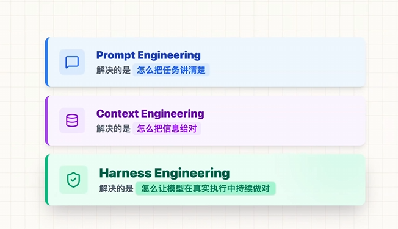
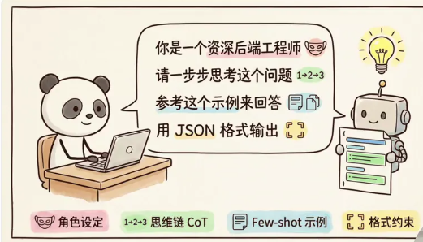
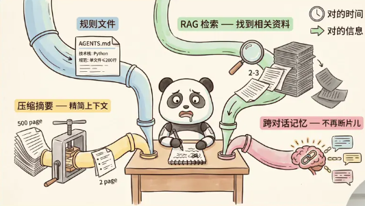
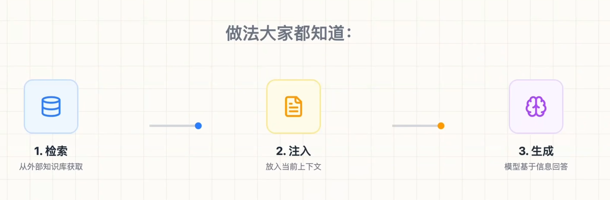
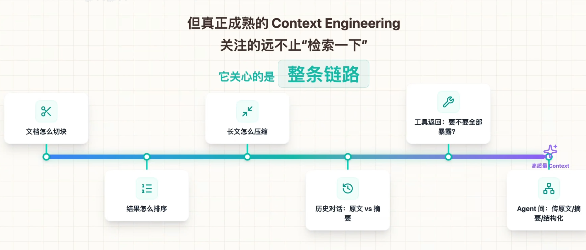
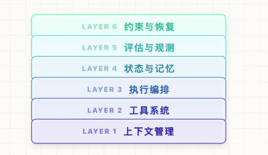
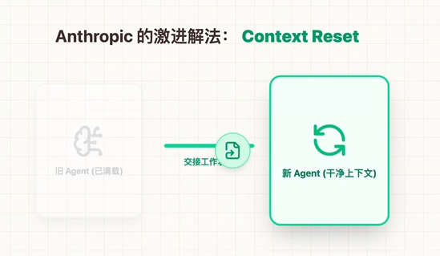
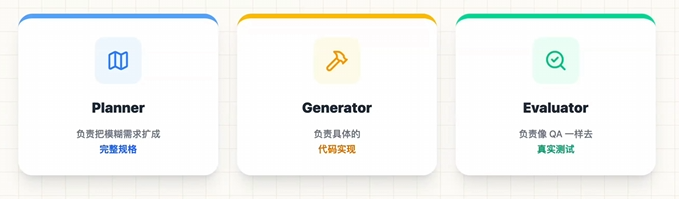
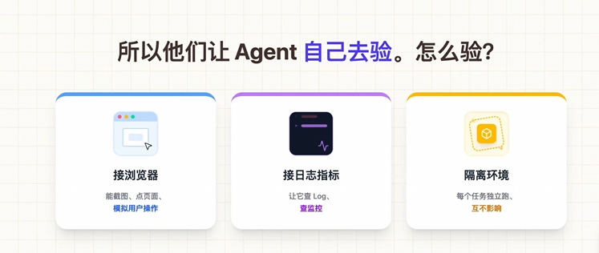

> [底子来源是鱼皮的视频，做了精简](https://www.bilibili.com/video/BV1cW9xB3Ec1/?spm_id_from=333.1245.0.0)
>
> [还有花园的视频](https://www.bilibili.com/video/BV1Zk9FBwELs?vd_source=5437c606fea007bf0f9d56d7836dd0ea)

## Harness概念
> harness直译是马具，引申意思是：把某个东西“套起来、控制起来、接起来，让它能被安全、稳定地使用”。

如果把 **AI 模型**比作一匹马，那**Harness** 就是你驾驭这匹马所需要的一切，比如缰绳、路线规划、围栏等等。

**Harness**就是围绕**AI 模型** 搭建的一整套工作环境和工作流程。

真正决定我们的系统能不能稳定地跑起来，往往不是模型本身，而是模型外面那套运行系统。(harness)

一个 AI 编程助手：

```
Agent = 大模型 + Harness
```

其中大模型负责“思考和生成”，harness 负责让它真的能干活，除了模型本身以外，几乎所有能决定它能不能稳定交付的东西都可以算进**Harness**。比如：

```
模型：GPT / Claude / Qwen
Harness：
- 读取项目文件
- 搜索代码
- 执行命令
- 调用 Git
- 运行测试
- 管理上下文
- 限制权限
- 和 IDE / 终端交互
```

## AI工程发展回顾与Harness定位




**Prompt**是对指令的工程化，

**Context**是对输入环境的工程化，

**Harness**就是对整个运行系统的工程化。它们的边界是一层比一层大的。


### 第一阶段：提示词工程

**Prompt Engineering**

核心：让AI听懂需求
技巧：角色设定、格式约束、思维链、示例



#### 大模型的本质

把 ChatGPT/Claude 的外壳剥开，里面的大模型（LLM）本质就是一个磁盘上的超大参数文件。

将其加载到显卡内存里，配上 HTTP 接口就成了大模型 API 服务；

给它加个聊天界面就变成了聊天 AI，加个代码编辑器就成了 AI IDE。

大模型做的事情很简单，就是**基于当前输入的内容，预测下一个字词大概率会是什么**。它本质上只是在猜你想要什么。

如果给它的指令太宽泛，那它预测的答案就会非常发散。

能加的内容有很多，比如：
- **角色设定**：告诉它应该扮演什么角色
- **背景信息**：提供任务的相关背景
- **历史对话**：让模型了解之前的交互
- **参考文档**：提供相关的资料
- **限制输出格式**：明确输出的结构要求

这些约束构成了所谓的**提示词**。

> 所以 **Prompt Engineering** 的本质，不是命令模型，而是塑造一个局部的概率空间。那这个阶段最重要的能力不是系统的设计，而是语言的设计。

### 第二阶段：上下文工程

**Context Engineering**

> 模型不只是要回答问题，而是要进到真实的环境里面做事情。
>
> 系统面对的已经不是一次回答对不对，而是整条链路的任务能不能跑通。
>
> 比如，如果你不是简单地问一句“帮我总结一下这篇文章”，
>
> 而是让他做一个更真实的任务：帮我分析这份需求文档，找出潜在风险，结合历史的评审意见给出改善建议，再生成一版发给产品经理的反馈稿。

**Context Engineering** 的核心就变成一句话：模型未必知道，系统必须在合适的时机，把正确的信息送进去。

> 这里的 Context 代表了所有影响模型当前决策信息的总和。
>
> 包括用户的输入、历史对话、检索结果、工具返回、当前任务的状态、中间产物、系统规则、安全约束或者其他 Agent 传过来的结构化结果。

#### 上下文腐化问题

大模型的上下文窗口是有最大限制的，这个限制叫**上下文窗口**。在 AI 大模型应用里多对话几轮，就很容易将上下文窗口打满。

于是就需要通过一些策略去压缩或丢弃部分信息，在这个过程中，不可避免会丢失关键信息，从而破坏上下文的完整性和准确性。这类问题被统称为**上下文腐化**（Context Corruption），效果上就是模型开始记不住、回答前后不一致。

上下文窗口就这么大，于是问题就变成了：**怎么才能在合适的时候，将合适的内容塞入到有限的上下文中？**

#### 上下文工程的三步骤

上下文工程一般通过外部程序来实现，比如 Cursor、Claude Code、Tree 等 coding agent。但总的来说可以总结为三个步骤：**召回 → 压缩 → 组装**。

**1. 召回（Retrieval）**

召回说白了就是找什么信息。这些信息可以来自：
- 外部新闻
- 过去聊天记录
- 当前代码环境
- 程序运行报错等

总之就是从中找出最相关的内容。这里面涉及到 RAG、Memory 等技术。

**2. 压缩（Compression）**

因为上下文窗口有限，需要将信息变小。比如将信息分批发给大模型做总结之后，再进行组装。

**3. 组装（Assembly）**

因为信息放置的位置和顺序会直接影响模型的理解和输出。比如越靠后的内容越容易被模型关注，所以需要通过一定的结构重新组装内容。

这样进入模型的上下文更精简、更相关，输出也会更稳定、更准确。

> 不同 AI 工具的上下文工程策略不同，所以你会发现就算用的是同一个模型，不同 AI 工具的执行效果也会有差异。

Prompt其实只是Context的一部分，也正因如此，配套上下文的供给机制是非常重要的。

方法：规则文件、RAG检索、压缩摘要、跨对话记忆



> 写 **Agent**的**MD 规则文件**，让 AI 了解项目背景；
>
> 用 **RAG检索** 让 AI 能检索到相关资料；
>
> 对过长的上下文做 **压缩摘要**；
>
> 甚至给 AI 建立 **跨对话记忆** 机制，让它不会聊着聊着就断片。

**RAG**





> 真正成熟的 **Context Engineering** 呢，关注的肯定不只是检索啊，它关注的是整条完整的链路。比如：
>
> - 文档怎么切块；
> - 结果怎么排序；
> - 长文怎么压缩；
> - 历史对话什么时候要保留，什么时候要摘要；
> - 工具返回要不要全部暴露给模型；
> - 多个 **Agent** 之间到底传原文、摘要还是结构化的字段呢？

如果把所有工具、说明、参数全部一上来塞给模型，信息一多，容易注意力涣散。

所以使用skills，核心思路是**渐进式披露**。

> 上下文的优化不仅是给的更多，而是按需给，在正确的时机给。

#### Agent 与 ReAct 模式

模型是更聪明了，但它只能聊天，没法帮我们干活。

于是我们可以给大模型加入 **Bash、沙盒文件系统、MCP** 等能力，让它能像人一样操作外部工具：读写代码文件、执行命令、做测试。它们共同构成了**执行层**。

将它们串成一个流程，在外部套一层循环：
1. 通过提示词工程和上下文工程组装上下文发给大模型
2. 大模型负责**思考**
3. 外部程序负责**执行**
4. 执行过程中得到的报错等信息再加到上下文里
5. 继续推理和执行

这套一边思考一边行动的循环，就是所谓的 **ReAct**（Reasoning + Acting）。

而这个能通过聊天帮你执行任务的程序，就是所谓的 **AI Agent**。

> Agent 的本质就是一个 for 循环。只要这个循环一长，上下文就一定会膨胀，上下文工程做再好也可能会腐化。

随着它看过的文件越来越多，拿到的信息越来越杂，前面定好的目标和约束后面可能慢慢就被冲淡了，理解也会越来越偏。

#### 规则文件与记忆层

怎么办呢？只要我们可以保证每次给大模型的上下文中都包含一些可复用的核心信息，比如：
- 项目目标
- 技术栈、需求背景
- 代码风格
- 禁止事项等

只要保证这部分一直在那，大模型就能在大框架约束下减少理解偏移。

这些核心信息可以单独写成文件，固定在代码仓库里。比如：
- **Cloud Code** 用 `cloud.md`
- **Cursor** 用 `.cursorrules`
- **Cline** 用 `rules.md`

它们暂时没有统一的名字，可以暂且称为**规则文件**（Rule Files）。

规则文件会在调用大模型的时候作为系统提示词自动注入上下文。

规则文件写多了也会变长，那就拆——把它拆成几份更短的文件，再加一个简单的路由。比如：
- 背景就读 `BG.md`
- 技术栈就看 `STACK.md`

一般情况下只需要加载文件地址路径，真正需要的时候再加载文件的全部内容。将它们跟提示词工程和上下文工程配合在一起，形成**记忆层**。

有了记忆层和执行层的配合，Agent 就能不停写代码。跑 Linter 和单元测试过程中发现执行有问题，还可以将测试输出和报错加入到上下文里，这样就可以驱动 Agent 在下一轮循环中自动做修复。

这套通过校验结果回算错误来实现自动修复问题的能力，形成了**反馈层**。

#### 编排层

但 Agent 的循环如果缺乏全局规划和清晰的结束目标，依然很容易跑偏，甚至陷入无效死循环。

所以我们还可以将大任务拆解为有明确执行标准的多个子任务，按规划驱动 Agent 分步执行。

这种以全局规划为核心、对任务做拆解与全流程管控的能力，形成了**编排层**。

#### Harness Engineering 的定义

总结一下：
- **记忆层**：记忆层
- **执行层**：执行层
- **反馈层**：反馈层
- **编排层**：编排层

这些能力共同组成了一套包裹着大模型的工程外壳，它就是 **Harness Engineering**（驾驭工程）。

大模型越强，外壳就可以做得越薄，但无论怎么样，这层外壳都得有。

**核心公式**：

```
Agent = 大模型 + Harness
```

只要不是大模型的那部分，那都属于 Harness Engineering 的范畴。

### Harness Engineering 怎么落地

#### Cloud Code 的实践

以 Cloud Code 为例，Cloud Code 软件本身已经原生支持 Harness 的四层能力，所以最清爽的做法就是在 `cloud.md` 文件里：
- 写清楚项目背景是什么
- 明确你希望大模型做什么、不做什么
- 写清楚做完之后要跑哪些 Linter
- 单测和 CI 执行哪些检查

#### SpecKid 与 SDD 开发模式

如果不想自己写这么累，可以引入一些插件，比如 **SpecKid** 这类扩展。它会根据项目将需求拆成多个阶段，做的事情很简单：
1. 先生成对应的约束文件，明确需求
2. 再制定具体开发计划
3. 拆解任务
4. 最后才是实际修改加测试

每个阶段都可能会更新一次 `SPEC.md`，这样每一阶段注入上下文的尽可能都是核心信息。

这套开发方式也叫 **Spec-Driven Development**（规范驱动开发），简称 **SDD**。本质上做的事情就是 Harness Engineering 的落地。

> 但 SpecKid 整体还是不够强，我相信很快会有更加全面的替代方案出现。


---

### 第三阶段：Harness Engineering



#### 1.上下文管理

让模型站在正确信息边界内思考。

1. **角色的目标和定义**：模型要知道自己是谁，任务是什么，成功的标准是什么。
2. **信息的裁剪和选择**：上下文不是越多越好，而是越相关越好。
3. **结构化的组织**：固定的规则放在哪儿，当前的任务放在哪儿，任务运行的状态放在哪儿，外部的证据又放在哪儿，最好分层清楚。因为信息一旦乱掉，模型就很容易漏重点、忘约束，甚至自我污染。

#### 2.工具系统

没有工具，大模型本质上是文本预测器。只有连上工具，才能做事情，比如读外部的东西、写入。

解决三个问题：

1.给他什么工具？工具太少，能力不够；工具太多，模型又会乱用。

2.什么时候该调用工具？本来不需要查的时候别乱查，该查证的时候也别硬答。

3.结果怎么重新喂回？搜索回来的几十条结果不应该原封不动地塞回去，而是要提炼筛选，保持和任务的相关性。

#### 3.执行编排

解决的核心问题是：模型下一步该做什么？要把所有的步骤串起来，防止整个过程想到哪做到哪，最后交付出来一堆半成品。

```
所以一个完整的任务通常需要有这样的轨道：

1. 理解目标；
2. 判断信息够不够，不够就继续获取；
3. 基于结果继续分析；
4. 生成输出；
5. 检查输出，不满足要求就重新修正或者重试。
```

#### 4.状态与记忆

我们要至少让他分清三类东西：

1. 当起任务的状态
2. 中间结果
3. 长期的记忆和用户偏好

#### 5.评估与观测

很多系统其实不是生成不出来，而是生成完了之后，根本不知道自己做得好不好。如果没有独立的评估和观测能力，**Agent** 就会长期停留在自我感觉良好的状态。

这一层包括：

1.输入验收

2.环境验证

3.自动测试

4.日志和指标

5.错误归因

#### 6.约束、校验失败和恢复

真正决定系统能不能上线的关键。

一个成熟的Harness 一定要包括三件事情：

1. **约束**：哪些能做，哪些不能做；
2. **校验**：输出之前、输出之后要怎么检查；
3. **恢复**：失败之后，怎么重试、切路径、回滚到稳定的状态

### 长程自主时ai出现的问题

#### 上下文焦虑

时间一长，模型开始丢细节，着急收尾。

通常解决是压缩上下文，但是压缩只是变短了不代表负担真的消失了 。

Authropic做了“Context Reset”，



> 像工程里面遇到内存泄露——不是继续清缓存，而是直接重启整个进程再恢复状态（Reset）。

#### 自评失真

模型自己打分偏乐观，尤其是没有标准答案的地方。

所以要**生产和验收必须分离**。



Evaluator不只是看代码，而是真实的操作页面，看具体的交互。




**OpenAI**他们重新定义了工程师在**Agent** 时代的工作。他们做了一个非常有意思的思路：人类在这个环境里面不需要写一行代码，人类只需要去负责设计环境。

具体来说，工程师的工作变成了三件事情：

1. 把产品目标拆解成 **Agent** 能理解的小任务；
2. 当 **Agent** 失败的时候，不是让它更努力一点，而是问环境里面缺了什么能力；
3. 建立反馈的链路，让 **Agent** 真正能够看到自己的工作结果。

## Harness解决的核心问题与方法
- 上下文架构：让AI了解项目
  - 方法：编写规则文件(如`agents.md`)
  - 关键：按需加载
    - 方案：规则文件作为目录，索引详细文档
- 执行能力：给AI装上工具
  - 工具类型
    - 基础操作：终端、文件系统、浏览器
    - 扩展能力：MCP(数据库、联网搜索)
    - 专业技能：AI Skills(生成PPT、处理Excel)
- 任务编排：给AI安排工作计划
  - 问题：大任务一把梭导致上下文溢出与代码混乱
  - 解决方案
    - 任务拆分：大任务拆小，每次做一个功能
    - 先计划再执行：使用PlanMode，人工确认方案
    - 沉淀文档：记录实现、方案、待办事项
    - 并行执行：多个Agent处理独立任务
- 反馈机制：让AI自查工作
  - 检查方法
    - 代码检查：运行Linter
    - 功能验证：运行自动化测试
    - 实际操作：打开浏览器测试
  - 修复与审查
    - 自动修复：读取报错信息并尝试修复
    - 人工介入：提供问题与截图
    - 多Agent互审：代码审查机制
- 架构护栏：防止代码腐化
  - 问题：AI模仿烂代码，导致技术债累积
  - 解决方案
    - 专用Linter：强制执行架构约束
      - 与反馈机制Linter的区别
      - 规则示例：UI层不直接调用数据库、单向依赖
    - 提交拦截：Pre-commit Hooks
    - 定期清理：垃圾回收机制，自动修复偏离
    - 版本控制：每完成功能用Git提交，创建存档点

### 使用现成工具
- 规范驱动开发工具：如 SpecKid
- 内置工作流框架：如 Superpowers（强制 TDD、代码审查）
- 原则：理解思路比掌握工具更重要

### 核心观点与呼吁
- 工程师角色的转变
  - 从写代码转向需求分析、设计、拆解、把关
  - 工程能力是驾驭AI的关键
  
- 建议：多做完整项目，积累工程经验

有了 Harness Engineering 之后，程序员的工作内容就从写代码，慢慢改为写规则和 Skill。

> 有句话是这么说的：你那些拿了 N+1 的同事其实从未离开你，他只是变成了 Skill，默默陪伴你，你就说暖不暖心吧。

## 总结

| 工程类型 | 解决的问题 |
|---------|---------|
| **Prompt Engineering** | 让大模型明白你的具体需求和输出标准 |
| **Context Engineering** | 给大模型注入精准有效的上下文 |
| **Harness Engineering** | 让大模型持续按规范执行任务，并最终交付 |

现在大家通了吗？

  
