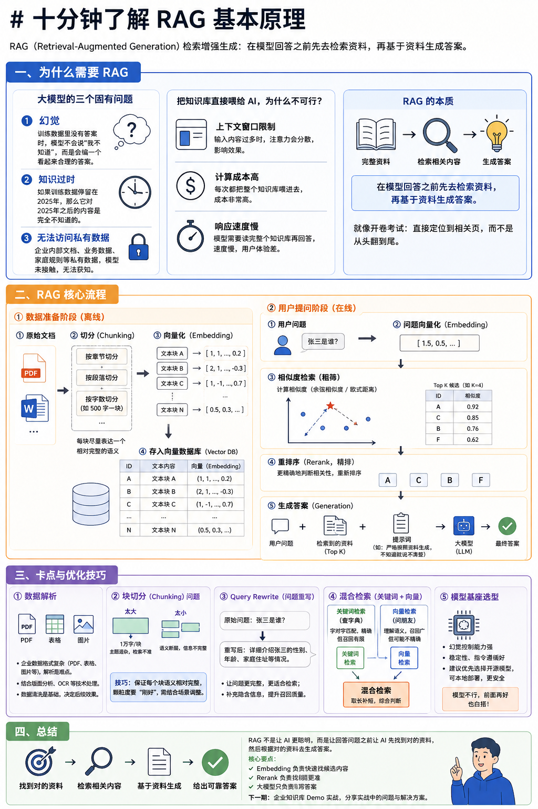
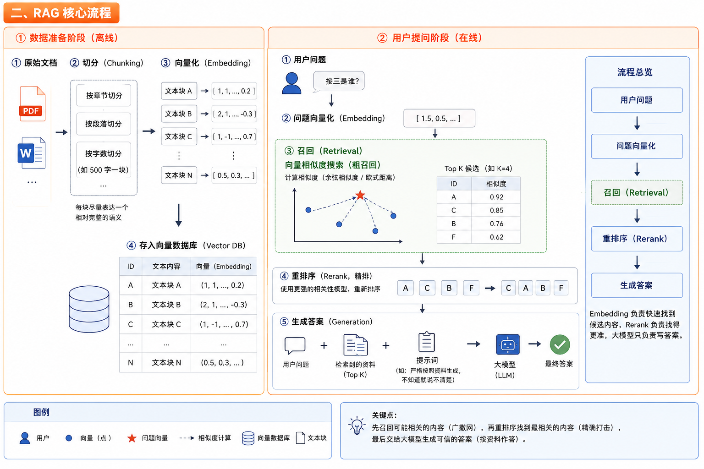
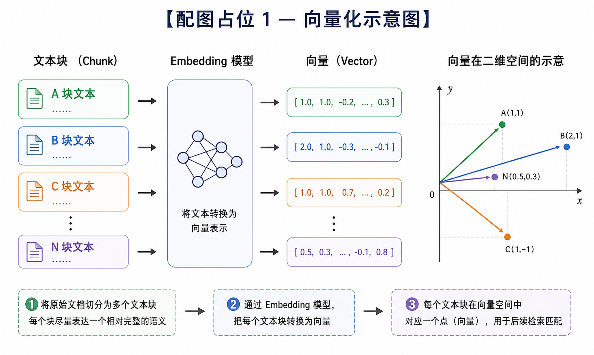
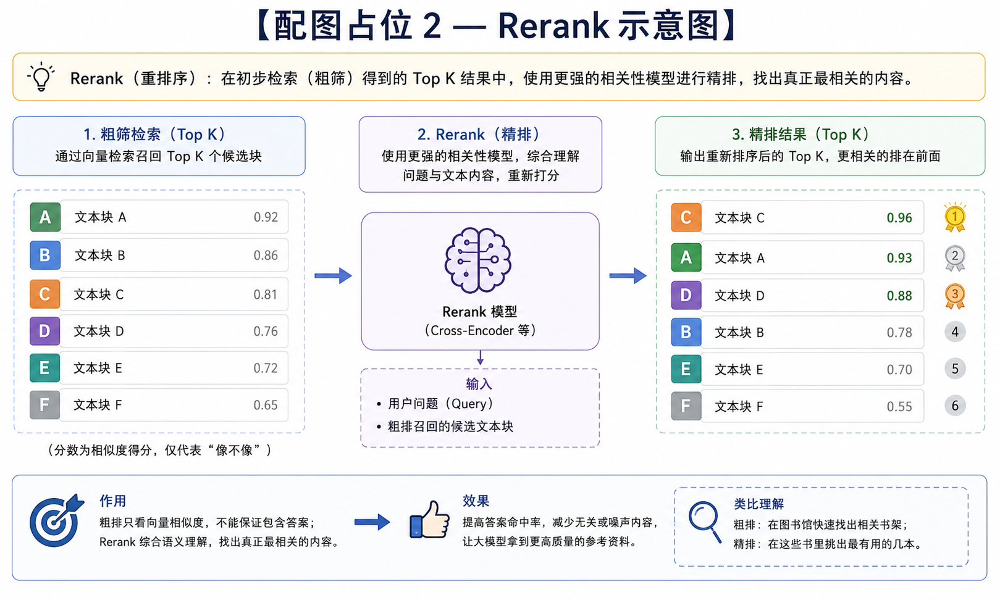
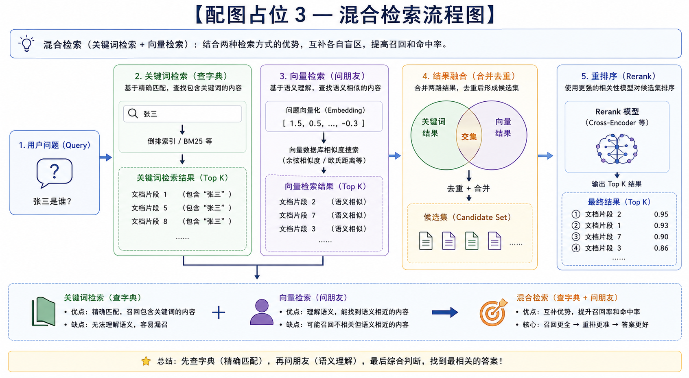

# 十分钟了解 RAG 基本原理

## 一、为什么需要 RAG

我们今天要搞懂在大模型应用里非常核心的技术 RAG 的基本原理。它的全称是 Retrieval Augmented Generation，中文叫做检索增强生成。现在我们看到的很多大模型应用，比如企业知识库、客服机器人、文档助手，背后基本都会用到 RAG。

我们今天分为三个模块：**为什么需要 RAG**、**RAG 核心流程**，以及**卡点及优化技巧**。

### 大模型的三个固有问题

大模型已经非常强了，为什么还需要 RAG？原因很简单——大模型的本质是在预测下一个 token，这就会带来三个问题：

**第一个，幻觉。** 当大模型的训练数据里没有答案的时候，它不会说"我不知道"，而是会继续往后预测下一个词，会编一个看起来合理的答案。

**第二个，知识过时。** 如果模型训练数据停留在比如 2025 年，那么它对 2025 年之后的内容是完全不知道的。

**第三个，无法访问私有数据。** 比如说企业的内部文档、业务数据，小到每个家庭里面的规则，这些它都接触不到。因为它没在你们公司上过班，没有在你们家生活过，所以不知道这些私有的数据。

### 把知识库直接喂给 AI，为什么不可行？

你可能会想到一个办法：把企业的整个知识库直接在输入框中丢给 AI，然后让它回答。这个听起来很合理，但实际上不可行，原因有三个：

**第一，上下文窗口的限制。** 虽然现在模型已经非常强，可以处理很长的输入，但是内容太多的时候会出现注意力分散的问题。

**第二，计算成本高。** 每次把整个知识库喂进去，成本会非常高。

**第三，响应速度慢。** 如果每次给输入框丢一个问题，模型都要读完整个知识库再回答，速度会非常慢。用户也不会在那等 12 分钟等你生成一个答案。

### RAG 的本质

所以更合理的方式是：在回答之前，先找到最相关的那几页或那几段内容，然后再交给大语言模型。

从这个例子我们就可以看到，RAG 的本质就是：**在模型回答之前先去检索资料，再基于资料生成答案**，而不是每次都需要从头把这本厚厚的文档从头翻到尾。

如果你是在描述工作流里的那个步骤，用 **Retrieval**；如果你是在讨论搜得全不全，用 **Recall**。

---

## 二、RAG 核心流程

RAG 可以分成两个阶段：**数据准备阶段** 和**用户提问阶段**。

### 数据准备阶段

假设场景：给企业做知识库问答系统

首先是要处理企业的原始文档。原始文档通常很长、信息混杂，

所以第一步是**切分（chunking）**，把文档拆成很多小块，每一块尽量表达一个相对完整的语义。

切分方式可以按章节、按段落、按字数（比如 500 字切一块），具体方式需要看实际文档情况来决定。为什么一定要切分？因为整篇文档去做处理会导致语义混乱，检索时不准确。

切分完成之后，因为计算机不理解文字，只理解数字，所以需要把每个文本块转成向量，也就是 **embedding 向量化**。

我们把文本内容和它对应的向量一起存入向量数据库。这个数据库最起码有两个表头：一个是文本内容，一个是对应向量。比如 A 块对应 (1,1)，B 块对应 (2,1)，C 块对应 (1,-1)，还有很多其他块。到这里，数据就准备完成了。

### 用户提问阶段

当用户输入一个问题，比如"张三是谁"，同样这个问题也需要转成向量。它经过 embedding 模型转化后得到一个坐标 (1.5, 0.5)。用这个向量分别和数据库中的每一个向量去计算相似度，来找到和问题最相关的内容。

计算相似度的方法常见的有两种：**余弦相似度**（计算夹角的 cos 值）和**欧式距离**（计算点之间的直线距离）。

然后返回其中最相关的 Top K 个块。比如 Top K=4，就是召回了四个片段。

但这里有一个关键点：这一步只是**粗筛**。它只能判断这几个片段和问题"像不像"，但不能保证这四个片段到底有没有回答这个问题。所以我们会再加一层 **Rerank（重排序）**。

最后，我们将用户问题、检索到的参考资料和提示词（比如说"严格按照资料进行生成，不知道就说不清楚，不要胡乱回答"）一起组成 Prompt，交给大模型生成答案。

整个 RAG 链路中，Embedding 负责快速找到候选内容，Rerank 负责找得更准，大模型只负责写答案。系统分工非常明确，用户感知到的只有最终那一层——当用户问了"张三是谁"之后，大模型就直接给出了答案，张三是谁谁谁。

---

## 三、卡点与优化技巧

虽然流程看起来简单，但真正做起来会有很多坑。

### 数据解析

企业的数据一般不会是干净的文本，可能有 PDF、有表格、有图片。特别是 PDF 解析起来非常复杂。实际在做商业落地项目时，这一步的**数据清洗非常关键**。这一步还会结合版面模型和 OCR 识别技术来处理各种不同格式的文档。

### 块切分问题

这是 RAG 效果最关键的点之一。如果块切得太大，比如 1 万字一个块，一个块里面包含的主题非常多，检索就不准确——比如我想搜索关于 A 的内容，但检索出来的块里包含了 ABCDEFG，内容不精确。

如果块切得太小，又会造成**语义断裂**。比如"张三是一个好人"，把"张三"切成一个块，把"是一个好人"切成另一个块，被拆开后模型就不知道"谁"是一个好人了，因为块和块之间是分开的。

所以怎么分块是一个技巧，我们需要保证每个块的语义都是相对完整的。本质就是信息的颗粒度要刚好，这需要在具体场景中具体分析。

### Query Rewrite（问题重写）

我们平时聊天都比较口语化，跟大模型聊天时也会比较口语化。有时候原始问题太短、太模糊或者碎片化，需要经过 **Query Rewrite** 进行问题重写。核心目的是让优化后的问题更适合后面的向量检索，更能贴合知识库。

比如把"张三是谁"重写成"详细介绍张三的性别、年龄、家庭住址等等的情况"。有时候这一步也是为了补充一些隐含信息——一些用户没有说出口的需求，需要自动补上。

### 混合检索

实际中常用的方法是 **混合检索**，把关键词检索和向量相似度检索一起进行。

**关键词检索**就好比查字典，必须字对字、丁是丁卯是卯——拿着"张三"就去知识库里找"张三"这个字相关的内容。

**向量检索**就好比问朋友，朋友懂你的意思，但可能会有出入。

混合检索就是在查询一个问题时，先查字典，再问朋友，然后综合判断。两种检索方式各有各的盲区，但它们的盲区刚好可以互补。

### 模型基座选型

最后才是模型基座的选型。首先模型需要满足基本的不能出现幻觉、稳定性、遵循指令等基本要求。另外最好它是开源的模型，因为开源模型可以部署到本地，更安全。

如果模型本身不行，前面做得再好也没有用。即便这里找到的答案是正确的，模型给你回答错了，也是不行的。

## 四、dify

Dify 由 LangGenius（北京长月科技有限公司）研发。Dify 是一个典型的**开源项目**（在 GitHub 上极度活跃，拥有数万 Star），提供云端版本（Dify.ai）和私有化部署版本。

工作范围：

- 可视化工作流 (Workflow)： 像 n8n 或 Coze 一样，通过拖拽节点来设计 AI 的逻辑（判断、循环、API 调用）。
- RAG (知识库检索)： 这是 Dify 的杀手锏。它内置了非常专业的文档处理流程（清洗、分段、向量化、检索），你只需要上传几十个 PDF 或网页链接，它就能让 AI 基于这些文档回答问题，效果比 Coze 更专业、更可控。
- 模型管理： 你可以在 Dify 里统一接入 OpenAI、Claude、混合使用各种国产模型（豆包、通义千问等），甚至是本地部署的 Llama 3。
- 后端即服务 (Backend as a Service)： 只要你在 Dify 里做好了工作流，它会自动为你生成 API 接口。你的前端程序直接调用这个接口，就能使用 AI 功能，不需要自己写繁琐的后端代码。

不过在工作流方面，目前不如codex，所以主要讨论rag。

#### rag

这是 Dify 最核心的资产。

你丢给它一万本 PDF，它会自动完成：**提取文本 -> 自动分段（Chunking）-> 清洗乱码 -> 向量化（Embedding）-> 存储到向量数据库**。

当你问问题时，它负责**高精度检索**。这一套流程如果你在 n8n 里做，需要接 5-6 个外部 API，而在 Dify 里是内置的一键式功能。

Dify 在 RAG 领域做了深度的工程调优，其召回（Retrieval）能力远超简单的向量搜索：

- **ETL 数据清洗：** 自动去除文档中的乱码、页眉页脚，支持复杂的 Markdown 转换。
- **Hybrid Retrieval（混合召回）：** 同时启用传统关键词检索（Recall）与语义向量检索，确保在搜术语、搜细节时比纯向量检索更准。
- **Reranking（重排序）：** 先粗筛出一批资料，再用精细模型进行二次排序，极大提升了 AI 回答的上下文相关性。

#### 为什么有了dify还要自研

虽然 Dify 很强，但在以下三个极端场景下，大公司依然会选择“自主研发”：

A. 极其复杂的文档结构

- Dify 的局限： 虽然它支持 PDF、Markdown，但如果你的文档里有复杂的跨页表格、流程图、CAD 图纸，或者需要特定的排版逻辑，Dify 的默认分段可能就会切碎语义。
- 企业做法： 专门写一个 Python 解析器（比如用 LayoutAnalysis 模型），先把图片和表格转成 AI 能懂的特定格式，再喂给知识库。

B. 数据隐私与极高安全性

- Dify 的局限： 如果使用 Dify 云版本，数据会经过它们的服务器。
- 企业做法： 银行或政务系统会选择私有化部署 Dify。即在自己的内网服务器上装一套 Dify，这样既享受了它的便利，又保证了数据不出内网。

C. 超大规模数据与高并发

- Dify 的局限： 当你有千万级别的文档量，或者每秒钟有几万人在查询时，Dify 底层的 PostgreSQL/Vector 数据库可能需要深度的架构优化。
- 企业做法： 使用专业的向量数据库集群（如 Milvus、Zilliz、Pinecone）配合自研的微服务架构。

