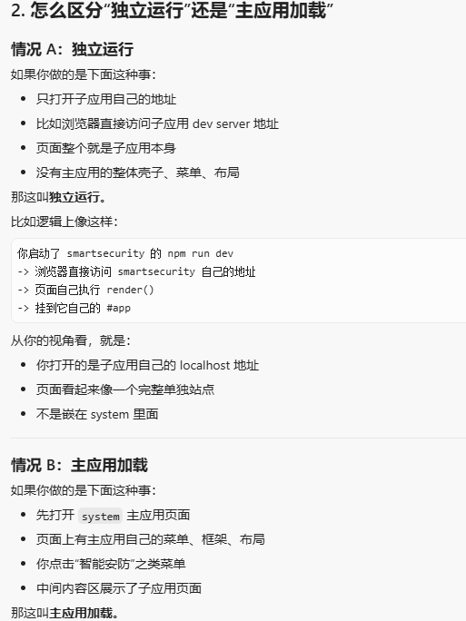
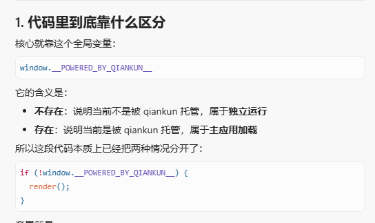
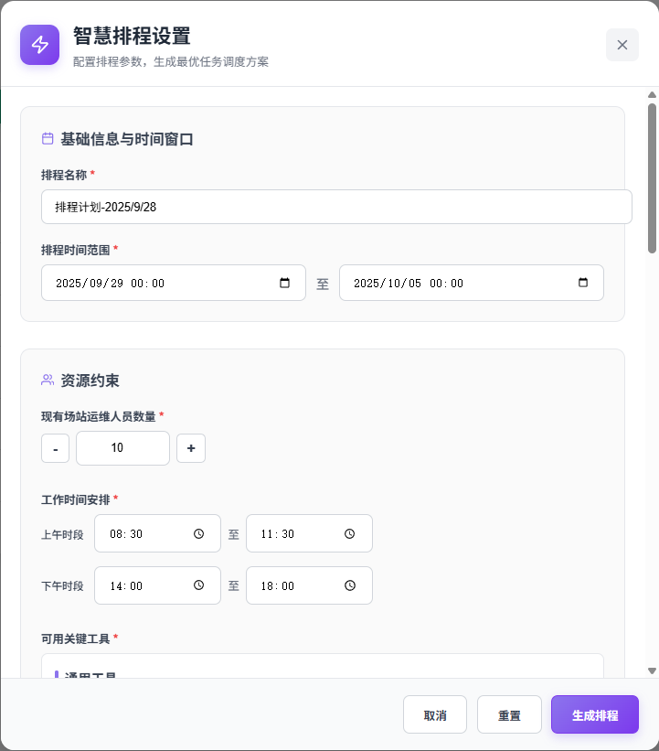
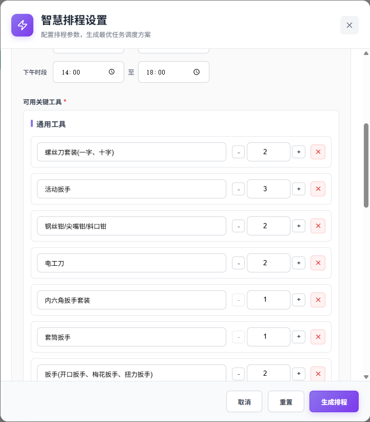
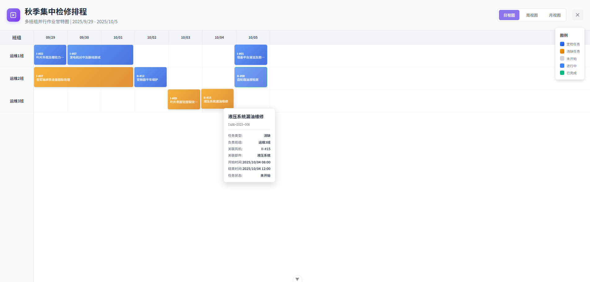
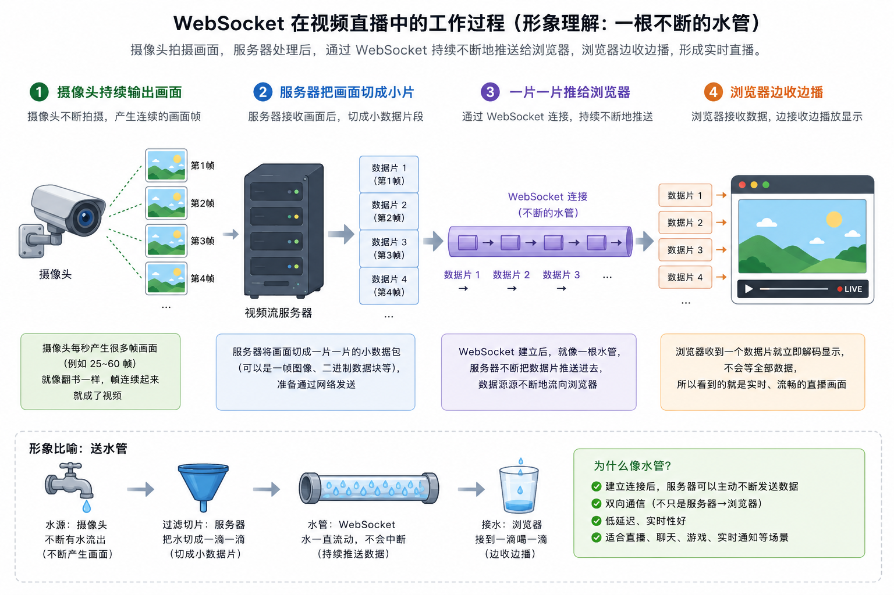

# 热工院新能源智慧化生产平台前端面试讲解稿

> **热工院新能源智慧化生产平台｜前端开发**
>
> **技术栈**：Vue2 / Element UI / Vuex / Vue Router / ECharts / Axios /qiankun 微前端 
>
> **项目简介**：基于微前端架构的新能源生产管理平台，覆盖智能排程、巡检大屏、实时视频、安防监控等模块，服务 3 个新能源场站，提升设备检修效率 30%。

## 1. 项目怎么开口讲

这个项目是一个面向新能源场站的智慧化生产管理平台，主要服务风电、光伏等新能源场站的生产运行场景。平台里有智能排程、巡检大屏、实时视频、安防监控等模块，前端采用 Vue2 + Element UI 技术栈，并用 qiankun 做微前端拆分。

我在项目里主要负责前端业务模块开发，包括三个方向：

1. 子应用的 qiankun 微前端接入。
2. 智能排程结果的可视化展示。
3. 视频流播放组件的封装和页面联动。

面试时可以这样讲：

> 这个项目不是一个单纯的后台管理系统，它更偏生产现场业务。用户是场站的调度、检修、巡检和值班人员，所以前端页面要解决的是“让现场状态看得清、业务与现实情况快速联动起来”。

## 2. 项目整体前端结构

一个大平台下面有多个前端项目文件夹。每个业务子应用都是一个完整的 Vue 项目，有自己的 `package.json`、`src`、`router`、`main.js`、`vue.config.js`、`.env`，可以自己启动、自己开发、自己打包。最后由主应用 `system` 统一加载这些子应用。

```text
TpriNe-pc/
  system/          主应用/基座：菜单、登录、权限、加载子应用
  smartsecurity/   智能安防子应用：消防、周界、门禁、违章、巡检等
  plan/            智能巡检/计划子应用：点位、计划、任务、云台、识别等
```

每个子应用文件夹里面大致长这样：

```text
smartsecurity/
  package.json        启动、打包、依赖配置
  vue.config.js       devServer、代理、publicPath、qiankun UMD 打包配置
  .env.development    开发环境变量
  .env.production     生产环境变量
  public/             静态资源，比如播放器库、index.html
  src/
    main.js           子应用入口，qiankun 生命周期也在这里
    App.vue           子应用根组件
    router/index.js   子应用自己的路由 base 和路由表
    permission.js     路由权限/导航守卫
    store/            子应用自己的 Vuex
    api/              子应用自己的业务接口
    views/            子应用自己的业务页面
    components/       子应用自己的局部组件
```

## 3. 微前端定义

> qiankun 的作用是让主应用根据路由去加载某个子应用。主应用加载子应用的 JS/CSS 后，会调用子应用暴露出来的生命周期函数，比如 `bootstrap`、`mount`、`unmount`。子应用在 `mount` 里把自己的 Vue 实例挂载到主应用给的容器里。

```text
开发时：先启动 system 主应用（比如 npm run start-all）
  -> 再启动当前子应用（比如 smartsecurity 里 npm run dev）
  -> 主应用里点击“智能安防”菜单
  -> qiankun 发现这个路径匹配 smartsecurity 子应用
  -> 主应用加载 smartsecurity 的资源
  -> 调用 smartsecurity 暴露的 mount 方法
  -> smartsecurity 把自己的 Vue 页面挂到主应用容器里
```


## 4. 核心工作一：qiankun 子应用接入

> 我负责过平台里多个业务子应用的 qiankun 接入。落到代码上，就是把每个业务模块整理成一个完整 Vue 子应用文件夹，然后处理启动方式、入口生命周期、路由 base、资源路径、打包格式、主子应用通信和公共能力复用。

### 4.1 一个子应用要关注哪些文件

以 `smartsecurity` 为例，接入 qiankun 时最重要的是这几个文件：

```text
smartsecurity/
  package.json
  vue.config.js
  src/main.js
  src/router/index.js
```

逐个讲：

1. `vue.config.js`  

   这里配置端口、代理、publicPath、webpack alias、UMD 打包格式。qiankun 接入里很重要的 `libraryTarget: 'umd'` 就在这里。

```js
output: {
  library: 'smartsecurity',
  libraryTarget: 'umd'
}
```

   这几行的意义就是：把子应用打成主应用能加载的模块格式，不然 qiankun 拿不到子应用导出的生命周期。

---

2. `src/main.js`  

   这是子应用入口。普通 Vue 项目里它只负责创建 Vue 实例；
   
   微前端项目里，它还要导出 `bootstrap`、`mount`、`unmount`，让主应用能加载和卸载它。

```js
export async function bootstrap() {}
export async function mount(props) {
  render(props);
}
export async function unmount() {}
```

   面试时可以直接说：普通 Vue 项目没有这套生命周期，但 qiankun 子应用必须把它暴露出来。

---

3. `src/router/index.js`  
   这里配置子应用自己的路由。微前端里最关键的是 `base`，因为子应用独立运行和被主应用加载时，路径前缀是不一样的。：

```js
base: window.__POWERED_BY_QIANKUN__
  ? '/smartsecurity'
  : '/web-smartsecurity/'
```


### 4.2 子应用入口 `main.js` 到底在干什么

普通 Vue2 项目的 `main.js` 一般就是：

```js
new Vue({
  router,
  store,
  render: h => h(App)
}).$mount('#app');
```

但 qiankun 子应用不能只这样写，因为它要同时支持两条完全不同的启动链路：

1. **独立运行链路**：开发时直接访问子应用自己的地址，它要像普通 Vue 项目一样自己启动。
2. **主应用加载链路**：从 `system` 菜单进入时，它不能自己抢先启动，而是要等 qiankun 调用生命周期后再挂载。






```js
const render = (props = {}) => {
  const { container } = props;

  // 两种运行方式最后都会走到这里，
  // 区别只是：是谁调用 render，以及挂载到哪里。
  initRouter(props, router);

  instance = new Vue({
    router,
    store,
    render: h => h(App)
  }).$mount(
    // 主应用加载：挂到主应用容器
    // 独立运行：挂到子应用自己的页面
    container ? container.querySelector('#app') : '#app'
  );
};

// 独立运行链路：入口文件执行后，子应用自己启动自己
if (!window.__POWERED_BY_QIANKUN__) {
  render();
}

export async function bootstrap() {}

// 主应用加载链路：qiankun 调用 mount，子应用才真正启动
export async function mount(props) {
  store.commit('SET_TOKEN', props.store.token);
  actions.setActions(props);
  render(props);
}

// 主应用切走该子应用时，执行卸载
export async function unmount() {
  instance.$destroy();
  instance.$el.innerHTML = '';
  instance = null;
}
```

下面不要混着看，分成两条执行过程就清楚了。

#### 情况一：子应用独立运行时，页面是怎么跑起来的

这个场景通常发生在本地开发调试，比如你直接在 `smartsecurity` 项目里执行 `npm run dev`，浏览器访问的是子应用自己的地址。

执行顺序可以理解成：

```text
浏览器打开子应用地址
-> 加载 smartsecurity 自己的 index.html 和 main.js
-> 发现 window.__POWERED_BY_QIANKUN__ 不存在
-> 进入 if (!window.__POWERED_BY_QIANKUN__)
-> 直接执行 render()
-> render() 内部初始化路由
-> new Vue(...) 创建实例
-> 挂载到当前页面自己的 #app
-> 子应用页面独立显示出来
```

这条链路有两个特点：

1. **启动者是子应用自己**：不是主应用通知它启动，而是它加载完入口文件后自己就执行了 `render()`。
2. **挂载点是当前页面自己的 `#app`**：也就是 `.$mount('#app')`，和普通 Vue 项目本质上是一样的。

所以独立运行时，你可以把它理解成一个“正常 Vue 项目 + 额外兼容了 qiankun 能力”的状态。页面真正跑起来的关键，是这句：

```js
if (!window.__POWERED_BY_QIANKUN__) {
  render();
}
```

也就是说，**没有 qiankun 宿主时，子应用自己负责把页面启动起来。**

#### 情况二：被主应用加载时，页面是怎么跑起来的

这个场景是用户先进入 `system` 主应用，再点击“智能安防”之类的菜单。此时浏览器当前其实先打开的是主应用页面，不是子应用独立页面。

执行顺序是另一条链路：

```text
浏览器先打开 system 主应用
-> 用户点击某个菜单，路由命中 smartsecurity 的 activeRule
-> qiankun 开始加载 smartsecurity 的 js/css 资源
-> 执行子应用 main.js
-> 此时 window.__POWERED_BY_QIANKUN__ 存在
-> 不会进入 if (!window.__POWERED_BY_QIANKUN__)
-> 子应用此刻不会自己 render
-> qiankun 接着调用 bootstrap()
-> 再调用 mount(props)
-> mount(props) 里先接收主应用传来的 token / 通信能力
-> 然后执行 render(props)
-> render(props) 把 Vue 实例挂到主应用容器里的 #app
-> 子应用页面显示在主应用内容区域中
```

这条链路要重点看出三个区别：

1. **启动者变成了主应用 + qiankun**：子应用虽然也执行了 `main.js`，但它不会在文件加载后立刻自启动，而是等待 `mount(props)`。
2. **挂载点变成主应用传入的容器**：也就是 `container.querySelector('#app')`，页面不是占满整个独立站点，而是嵌在主应用内容区。
3. **启动前要先接主应用上下文**：比如 `token`、全局状态通信方法，这些只有在 `mount(props)` 阶段才能拿到。

所以被主应用加载时，页面真正跑起来的关键，不是 `if` 里的自启动，而是这句：

```js
export async function mount(props) {
  store.commit('SET_TOKEN', props.store.token);
  actions.setActions(props);
  render(props);
}
```

也就是说，**有 qiankun 宿主时，子应用不自己启动，而是等主应用调用 `mount` 后再启动。**

#### 这两种情况的本质差别

如果面试官追问“你们到底怎么兼容这两种运行模式”，可以直接总结成一句话：

> 本质上是把 `new Vue().$mount(...)` 这一步抽成了 `render`。独立运行时由子应用自己调用 `render()`；接入主应用时由 qiankun 在 `mount(props)` 里调用 `render(props)`。两边创建的是同一个 Vue 应用，但启动时机、挂载位置、拿到的上下文都不一样。

你也可以再补一个对照表述：

- **独立运行**：入口文件加载完就自己启动，挂自己的 `#app`。
- **主应用加载**：入口文件先注册生命周期，等 qiankun 调 `mount` 后再启动，挂主应用容器。
- **卸载阶段**：只有微前端场景会频繁发生模块切换，所以 `unmount()` 要把实例销毁干净。

这样讲，面试官通常就能感觉到你不是只记住了 `bootstrap / mount / unmount` 这几个名词，而是真的理解了页面在两种场景下分别是怎么跑起来的。

### 4.3 子应用怎么知道自己是不是被 qiankun 加载

这一节如果只讲“有个全局变量可以判断”，其实还是有点悬空。更容易讲清楚的方式，是继续顺着上面那两条运行链路看。

项目里判断的方法一般是：

```js
if (window.__POWERED_BY_QIANKUN__) {
  __webpack_public_path__ = window.__INJECTED_PUBLIC_PATH_BY_QIANKUN__;
}
```

这里先记一句最核心的话：

> `window.__POWERED_BY_QIANKUN__` 不是我们自己定义的，而是 qiankun 在加载子应用时注入的运行环境标记。有没有这个变量，本质上就是在判断：当前页面是子应用自己跑起来的，还是被主应用托管起来的。

#### 情况一：独立运行时，这个变量是什么状态

独立运行时，浏览器访问的是子应用自己的开发地址或部署地址。整个页面就是子应用自己提供的，不经过 qiankun。

所以这时执行顺序可以理解成：

```text
浏览器直接访问子应用地址
-> 子应用自己的 html / js 开始加载
-> 因为没有经过 qiankun 托管
-> window.__POWERED_BY_QIANKUN__ 不存在
-> if (window.__POWERED_BY_QIANKUN__) 不成立
-> 不会改写 __webpack_public_path__
-> 静态资源继续按子应用自己原本的 publicPath 去加载
```

这很正常，因为独立运行时，图片、异步 chunk、播放器脚本这些资源，本来就应该从子应用自己的服务地址去拿。

你可以把它理解成：

- 页面是子应用自己的
- 资源地址也是子应用自己的
- 所以不需要 qiankun 帮它改资源前缀

#### 情况二：被主应用加载时，这个变量是什么状态

被主应用加载时，情况就不一样了。此时用户打开的首先是主应用页面，子应用资源是被 qiankun 动态拉进来的。

执行顺序可以理解成：

```text
浏览器先打开 system 主应用
-> qiankun 根据路由去加载子应用资源
-> 在执行子应用代码前，注入微前端运行环境变量
-> 子应用 main.js 开始执行
-> 发现 window.__POWERED_BY_QIANKUN__ 存在
-> 进入 if (window.__POWERED_BY_QIANKUN__)
-> 把 __webpack_public_path__ 改成 qiankun 注入的资源前缀
-> 后续图片、异步 chunk、播放器资源都从正确的子应用资源地址加载
```

这里真正要解决的问题是：**子应用虽然嵌在主应用页面里运行，但它的静态资源不能错去主应用域名或错误路径下找。**

比如不处理的话，常见问题就是：

- 页面主体能出来，但图片 404
- 首屏正常，点到某个懒加载页面 chunk 404
- 播放器相关静态库找不到

所以这个判断不只是“用来识别环境”，它还有一个很实际的作用：**决定要不要把资源加载路径切到 qiankun 注入的地址上。**

#### 这一节面试时可以怎么总结

你可以直接这样讲：

> 我们用 `window.__POWERED_BY_QIANKUN__` 判断当前是不是被主应用托管。如果是独立运行，就按子应用自己的资源路径加载；如果是被 qiankun 加载，就把 `__webpack_public_path__` 改成 qiankun 注入的路径，避免图片、异步 chunk、播放器这类静态资源 404。

这句话比单纯说“有个全局变量”更像你真的踩过坑。

### 4.4 路由在哪里调整

路由调整在子应用自己的 `src/router/index.js` 里，但这一节也不能只停留在“改个 base”。真正要讲清楚的是：**为什么同一套路由，在两种运行方式下必须配两个不同的前缀。**

子应用路由里通常会写成这样：

```js
export default new Router({
  base: window.__POWERED_BY_QIANKUN__ ? '/smartsecurity' : '/web-smartsecurity/',
  mode: 'history',
  routes: constantRoutes
});
```

#### 情况一：独立运行时，为什么要用自己的 base

独立运行时，浏览器访问的是子应用自己的站点。比如它可能部署在：

```text
http://xxx/web-smartsecurity/
```

那这时候子应用内部的路由就必须基于它自己的部署前缀来解析，所以用的是：

```js
base: '/web-smartsecurity/'
```

执行效果可以理解成：

```text
浏览器访问 /web-smartsecurity/task/list
-> Vue Router 以 /web-smartsecurity/ 作为路由基座
-> 匹配到子应用内部的 task/list 页面
-> 页面正常显示
```

如果独立运行时你错误地写成 `/smartsecurity`，那路由解析和刷新地址都可能不对，因为这个前缀本来是主应用分配给它的，不是它自己独立部署时的真实入口。

#### 情况二：被主应用加载时，为什么要切到主应用分配的 base

被主应用加载时，浏览器地址栏已经属于主应用整体路由了。主应用通常会约定：

```text
/smartsecurity
```

这个前缀一旦命中，就表示“当前应该激活智能安防子应用”。所以子应用自己的路由 base 也必须跟着切到：

```js
base: '/smartsecurity'
```

执行效果可以理解成：

```text
浏览器当前地址是 /smartsecurity/task/list
-> qiankun 根据 /smartsecurity 激活 smartsecurity 子应用
-> 子应用自己的 Vue Router 也以 /smartsecurity 作为基座
-> 内部路由继续匹配 /task/list
-> 页面在主应用内容区正确显示
```

如果这里不切换，会出现一个非常典型的问题：

- 主应用已经把子应用挂起来了
- 但子应用内部路由识别不到当前 URL
- 结果就是页面空白、刷新 404、菜单高亮错乱，或者子页面跳转路径不对

#### 所以 4.3 和 4.4 其实是一前一后配合的

这里你可以顺手把逻辑串起来讲：

1. 先通过 `window.__POWERED_BY_QIANKUN__` 判断自己现在是哪种运行环境。
2. 如果是微前端环境，就先把静态资源加载路径切对。
3. 同时把路由 `base` 切到主应用分配的前缀。
4. 这样子应用的“资源地址”和“页面路由”都会对齐到主应用体系里。

#### 这一节面试时可以怎么总结

可以直接说：

> 路由 `base` 是微前端接入里特别容易出问题的地方。因为子应用独立运行时，它有自己的部署前缀；但挂到主应用里时，它又必须和主应用注册的 `activeRule` 保持一致。我们就是通过运行环境判断，动态切换 `base`，保证独立访问、主应用挂载、页面刷新和内部跳转都正常。

### 4.5 打包配置在哪里调整

子应用的 `vue.config.js` 里有：

```js
configureWebpack: {
  output: {
    // 子应用暴露给 qiankun 的全局模块名。
    library: 'smartsecurity',

    // 打成 UMD 格式，主应用才能以模块方式加载子应用导出的生命周期。
    libraryTarget: 'umd',

    // 避免多个 webpack 应用的 JSONP chunk 名称冲突。
    jsonpFunction: 'webpackJsonp_smartsecurity'
  }
}
```

面试官如果问“为什么要 UMD”，可以答：

> qiankun 加载子应用后，需要拿到子应用暴露出来的生命周期函数，比如 `mount`、`unmount`。UMD 是一种兼容性比较好的模块格式，可以让主应用拿到这些导出内容。

### 4.6 主应用怎么注册子应用

主应用在 `system/src/micro/index.js` 里注册子应用：

```js
// registerMicroApps 告诉 qiankun：
// 有哪些子应用、入口地址是什么、什么路由下激活。
registerMicroApps(filterMicroApps(), microAppHooks);

// start 才是真正启动 qiankun。
// prefetch: 'all' 表示空闲时预加载子应用资源，提高后续打开速度。
start({
  prefetch: 'all'
});
```

这里的逻辑可以这样讲：

> 主应用会维护一份子应用配置，包括子应用名称、入口地址、激活规则和挂载容器。当用户访问某个路径时，qiankun 根据激活规则判断该加载哪个子应用。

### 4.7 主子应用通信

主应用用 qiankun 的 `initGlobalState` 初始化全局状态：

```js
// 主应用维护一份全局状态。
// token 用来同步登录态，$route 用来接收子应用当前路由，
// sidebarOpened 用来同步侧边栏状态。
export const initialState = Vue.observable({
  sidebarOpened: false,
  token: getToken(),
  $route: null,
  sonRouter: null
});

// qiankun 提供 initGlobalState，用来建立主子应用之间的状态通信。
const actions = initGlobalState(initialState);
```

子应用里通过 `actions.setGlobalState` 把当前路由同步给主应用：

```js
router.beforeEach((to, from, next) => {
  actions.setGlobalState({
    $route: {
      fullPath: to.fullPath,
      path: to.path,
      query: to.query,
      meta: to.meta
    }
  });
  next();
});
```

面试可以这样说：

> 主应用和子应用不是直接互相 import，而是通过 qiankun 的全局状态通信。比如主应用把 token、侧边栏状态传给子应用；子应用把当前路由同步给主应用，用于标签页、面包屑或导航状态维护。


## 6. 核心工作二：智能排程可视化

> 整个过程做的重点，不是单纯把算法接口接入页面，而是把调度业务中的关键判断步骤前置到交互链路里。

**任务筛选**：这一步完成的是排程范围确认。用户先按场站、设备、处理窗口等维度选择本轮要进入排程的任务，先完成本轮任务筛选。

**前置信息选择**：任务进入排程前，先在列表中为每个已选任务选择设备类型和影响类型。这两个字段是触发后续计算的前置条件。

**优先级判定**：页面顶部提供“优先级判定”按钮，点击后前端会把当前选中的任务整理成请求数据，调用后端接口自动生成处理时长、人员数量、优先级等结果，并回填到表格。

---

点击**排程管理：**

**人工排序确认**：在自动排程之前，保留人工排序步骤，允许结合现场经验手动调整先后顺序。

这一步完成的是人工经验纳入。系统没有把排程完全做成黑盒自动计算，而是在算法之前保留人工干预入口，让排程结果更贴近现场执行逻辑。

点击**智慧排程**：

**资源约束配置**：排程前单独配置时间范围、可用人数、作业时段、关键工具数量等资源条件，而不是把这些参数默认写死在后台。

这一步完成的是约束显式化。用户可以明确知道当前结果是在什么条件下生成的；如果结果不理想，也可以回到这一层重新调整资源条件后再次排程。

**结果校验**：算法返回结果后，页面通过结果列表和甘特图展示任务安排、时间分布和资源占用情况，方便继续核对是否存在时间冲突、人员超限、任务分布不合理等问题。





## 7. 核心工作三：视频流能力封装

### 7.1 先解释 WebSocket

普通 HTTP 是“一次请求，一次响应”。比如页面请求列表接口，后端返回 JSON，这次请求就结束了。

WebSocket 不一样，它是浏览器和服务端之间建立一条持续连接。连接建立后，服务端可以不断往前端推数据，前端也可以随时发消息给服务端。

> 它适合实时性比较强的场景，比如消息通知、设备状态、实时视频流。它不像 HTTP 那样每次都要重新建立请求，而是建立一条长连接，后续数据都在这条连接里传输。

**注：WebSocket不生产内容，只负责搬运。**

### 7.2 WebSocket在视频流中的作用

摄像头常见的视频协议是 RTSP，但浏览器原生不能直接播放 RTSP。实际项目里通常会有一个流媒体服务做中转

```
摄像头 ──RTSP──> 翻译机 ──WebSocket推MP4小片──> 浏览器
```



> websocket只是传话筒，把翻译好的切片递给浏览器。
>
> 流媒体服务才是翻译官，把摄像头的RTSP翻译成浏览器能消化的MP4分片。

> RTSP（Real Time Streaming Protocol）是安防和硬件摄像头领域的“老大哥”。市面上你能买到的海康威视、大华等绝大多数网络摄像头，默认都使用这个协议来传输视频流。
>
> **优点**：实时性好、延迟低，专门为控制流媒体设计的（比如控制播放、暂停、录制）。
>
> 早年的浏览器可以通过安装第三方插件强行播放RTSP视频，但现代浏览器出于安全考虑，封杀第三方插件，现代浏览器只认属于web标准的协议，比如 HTTP、HTTPS，以及 HTML5 原生支持的视频格式（MP4、WebRTC、HLS 等）。
>
> 所以为了播放RTSP，需要在服务器部署**流媒体服务软件**，
>
> - 它会连接摄像头的RTSP地址，把原始的视频流拉取到服务器。
> - 服务器内部对RTSP进行拆解和重打包，转换成浏览器能看懂的格式，比如WebRTC(毫秒级延迟)、HLS（兼容性好，但有延迟）
> - 把翻译好的web视频流通过HTTP或webSocket发送给浏览器。
>
> 总结：因为硬件设备（摄像头）和软件终端（浏览器）说着不同的网络语言，所以必须在架构中间加一层服务器作为“桥梁”来转换格式，这就是“流媒体中转”的本质。

### 7.3 WebSocket 视频流的播放地址

结合前面的内容，聊到我们前端，所以前端真正拿到的，就是个 ws 地址 + 一个播放器库。

```
摄像头 ──RTSP──> 翻译机 ──WebSocket──> 浏览器
                              ↑
                              │
                        这个地址是这段的水龙头名字
```

两端的角色：

- 前端（浏览器这边的 EasyPlayer Pro）：水龙头用户——访问这个地址去"开水龙头取水"。
- 翻译机（流媒体服务，比如 EasyNVR / ZLMediaKit）：水龙头的主人——监听这个地址，一有人访问就打开对应摄像头的流，开始往这边推分片。

在这个项目里，前端拿到设备或摄像头的 `stream id` 后，拼成播放地址：

```js
ws://${window.location.hostname}/stream_proxy/camera/${s}.live.mp4
│   │                            │              │      │
│   │                            │              │      └─ 文件后缀：.mp4
│   │                            │              └─ 流标识 / 摄像头 ID
│   │                            └─ 流媒体服务的中转路径
│   └─ 主机名（跟着当前页面走）
└─ WebSocket 协议（不是 http）
```

> - `ws://`：用 WebSocket 协议传输，不是 HTTP。
> - `window.location.hostname`：直接拿当前页面所在的主机名，部署到哪就跟到哪，避免硬编码 IP。
> - `/stream_proxy/camera/${s}.live.mp4`：告诉流媒体服务"我要订阅摄像头 ID = `${s}` 的这一路流"。
> - `.live.mp4`：后缀骗人。后端实际上没有一个 `.mp4` 文件在等你下载，`.mp4` 只是流媒体服务约定的"路径名后缀"，表示"这里是一路实时 MP4 流"。

这说明前端不是直接连摄像头，而是连一个流媒体代理服务。

### 7.4 EasyPlayerPro是怎么播放画面的

注：下面是组件内部实现的，咱其实不用干这些，咱要干的看7.5

浏览器不会自己把 MP4 分片拼成画面（`<video>` 标签也不行，因为它要的是完整文件）。EasyPlayer Pro 干的是这件事：

```
浏览器主线程
  └─ new window.EasyPlayerPro(el, config)         ← 创建播放器
       │
       └─ 内部起一个 Web Worker（独立线程，专门解码）
            │
            ├─ fetch("EasyPlayer-lib.js")         ← 加载解码库
            ├─ fetch("EasyPlayer-decode.js")
            ├─ fetch("EasyPlayer-pro.wasm")       ← 加载 H.264 解码 wasm
            └─ fetch("EasyPlayer-snap.wasm")
                 │
                 └─ 收到 WebSocket 推过来的 MP4 chunk
                      → 用 .wasm 软解 H.264/H.265
                      → 把每帧画到 <canvas> 上
                      → 主线程刷新就出画面
```

> webworker是独立线程，不会影响主线程，
>
> 解码后画面铺到`<canvas>`上。

### 7.5 EasyPlayerPro 组件封装

组件大致职责：

1. 接收外部传入的 `stream`。
2. 根据 `stream` 生成 WebSocket 播放地址。
3. 初始化 `window.EasyPlayerPro` 播放器。
4. 自动播放。
5. 监听 `stream` 变化，切换摄像头时重新播放。
6. 组件销毁时释放播放器实例。

代码示例：

```js
props: {
  // app 表示业务类型，比如 camera。
  // 在当前代码里它更多是作为语义字段存在。
  app: {
    type: String,
    required: true,
    default: ''
  },

  // stream 是摄像头或视频流标识。
  // 页面只需要传这个 id，组件内部负责拼播放地址。
  stream: {
    type: [String, Number],
    default: ''
  }
}
```

> prop决定播什么


**父组件在使用easyPlayerPro时**怎么用，

> ```
><EasyPlayerPro app="camera" :stream="deviceId" />
> ```
> 
> stream代表某个摄像头ID、某个流ID..


**生成播放地址：**

```js
getPlayUrl() {
  const s = String(this.stream != null ? this.stream : '');

  // 没有流 id，就不播放。
  if (!s) return '';

  // 如果后端直接给了完整 http 地址，就直接使用。
  if (s.startsWith('http')) {
    return s;
  }

  // 否则根据当前域名和 stream id 拼接 WebSocket 播放地址。
  // 这样部署环境变化时，不需要把 IP 写死在组件里。
  return `ws://${window.location.hostname}/stream_proxy/camera/${s}.live.mp4`;
}
```

> - 如果传进来的 `stream` 本身就是 `http...` 开头的完整地址，就直接拿来播。
> - 如果不是地址，那它会把 `stream` 当成一个 ID，拼成播放地址： `ws://当前域名/stream_proxy/camera/{stream}.live.mp4`


**初始化播放器：**

```js
async initPlayer() {
  const el = this.$refs.playerRef;
  if (!el) return;

  // 防止重复初始化播放器。
  	// 如果已经存在实例，先销毁再创建。
  if (this.playerInstance) {
    this.playerInstance.destroy();
    this.playerInstance = null;
  }


  // muted: true 是为了兼容浏览器自动播放策略。
  // 很多浏览器不允许有声音的视频自动播放。
  const playerConfig = {
    stretch: true,
    hasAudio: true,
    autoplay: true,
    controls: false,
    muted: true,
    loop: false,
    decoderPath
  };

  // EasyPlayerPro 是通过静态资源引入到 window 上的播放器构造函数。
  this.playerInstance = new window.EasyPlayerPro(el, playerConfig);

  // 初始化后自动播放当前 stream。
  await this.autoPlay();
}
```

> window.EasyPlayerPro是全局变量，源于 public/index.html 引入的 `EasyPlayer-pro.js`（带 wasm 解码器）

**真正"播起来"的动作：`autoPlay`**

> **问题 1：浏览器自动播放策略（Autoplay Policy）**
>
> 现代浏览器（Chrome/Safari/Firefox）的策略是：
>
> - 没有用户手势时，页面不能"有声音地"自动播放
> - 但**静音（muted）**的视频是允许自动播放的
> - 任何未经过用户手势触发的 `play()`，如果没静音，可能直接被拒，或者 promise reject
>
> 所以代码的策略是：先静音开播，等用户点了页面再开声。
>
> **问题 2：EasyPlayerPro 的 play() 是异步且可能失败**
>
> `playerInstance.play(url)` 返回的是 Promise：
>
> - 成功 → 视频开始渲染
> - 失败（被浏览器策略拦、ws 没连上、媒体格式不支持等）→ 进入 catch
>
> 所以 `autoPlay` 用 `try / catch` 写了两条路径

```js
async autoPlay() {
      if (!this.playerInstance || !this.getPlayUrl()) return

      try {
        // 尝试直接自动播放（此时是静音的，浏览器策略不会拦）
        await this.playerInstance.play(this.getPlayUrl())
        console.log('视频自动播放成功')
        // 视频已经在播了，只是没声音。
        // 监听整个 document 的第一次点击，用户手势触发后再解除静音
        // （浏览器只允许在用户手势上下文内把声音打开）
        const handleClick = () => {
          if (this.playerInstance) this.playerInstance.setMute(false)
          document.removeEventListener('click', handleClick)
        }
        document.addEventListener('click', handleClick, { once: true })	//先监听再解除，比较安全
      } 
    
    catch (error) {
        console.warn('直接自动播放失败，等待用户交互触发：', error)
        // 挂一个用户手势兜底：等用户点/摸一下屏幕时再重试播放
        // 注意：手机端没有 click 事件，必须同时监听 touchstart
        const handleUserInteraction = async() => {
          if (this.playerInstance && this.getPlayUrl()) {
       // 从用户手势里发起的 play() 可以带声音，所以这里直接解除静音
            await this.playerInstance.play(this.getPlayUrl())
            this.playerInstance.setMute(false)
          }
          document.removeEventListener('click', handleUserInteraction)
          document.removeEventListener('touchstart', handleUserInteraction)
        }	//结束函数
        document.addEventListener('click', handleUserInteraction, { once: true })
        document.addEventListener('touchstart', handleUserInteraction, { once: true })
      }
    },
```


**监听流切换**：

```js
watch: {
  // app 或 stream 变化时，说明用户可能切换了视频源。
  // 不重新创建整个组件，而是调用播放器的 play 方法切流。
  stream: {
    handler() {
      this.replayIfReady();
    }
  }
}
```

```
async replayIfReady() {
   if (this.playerInstance && this.getPlayUrl()) {
     await this.playerInstance.play(this.getPlayUrl())
   }
 },
```


**销毁播放器**：

```js
// Vue2 组件销毁前调用。
// 如果不销毁播放器实例，WebSocket 连接、定时器、事件监听可能还留着。
beforeDestroy() {
  this.destroyPlayer();
}
```

```js
destroyPlayer() {
  if (this.playerInstance) {
    this.playerInstance.destroy();
    this.playerInstance = null;
  }
}
```


### 7.6 面试时怎么讲这块成果

可以这样说：

> 我把视频播放逻辑封装成一个通用组件，页面只需要传摄像头或设备的 stream id。组件内部负责生成播放地址、初始化播放器、处理自动播放、切换视频源和销毁实例。这样巡检大屏、分区监控、云台控制等页面都可以复用同一套播放逻辑。


## 8. 安防监控模块怎么讲

智能安防模块包含消防、周界、门禁、违章、巡检等页面。可以按“地图/状态/列表/详情/处置”这条线来讲：

> 安防模块主要解决的是场站安全状态可视化。页面上会展示设备分布、在线状态、告警数量、告警列表和详情弹窗。比如消防页面会展示消防设备状态、当前告警、今日告警和设备分区；周界页面会展示围栏或入侵事件；门禁页面会展示出入记录和人员信息。

这部分不用讲太多原理，重点讲你在页面层做了什么：

1. 接口数据接入。
2. 状态字段格式化。
3. 告警列表和详情弹窗。
4. 地图点位/设备卡片展示。
5. 视频预览联动。

## 9. 简历原句优化

你原来的简历内容已经不错，但可以稍微让表达更“工程化”。

### 原版

> 主导平台 3 个子应用的 qiankun 微前端接入，处理路由基座、公共能力复用问题。

### 优化版

> 负责平台多个业务子应用的 qiankun 接入，完成子应用生命周期改造、路由 base 适配、UMD 打包配置及主子应用状态同步；并在接入过程中梳理 `common` 公共代码的引用方式，减少子应用重复开发。

### 原版

> 基于排程算法数据设计甘特图等可视化方案，展示检修任务时间 / 资源安排，人员调度效率提升 40%。

### 优化版

> 基于排程算法输出设计任务甘特图和任务列表，将检修任务的开始/结束时间、执行班组、设备对象、优先级等字段可视化展示，辅助调度人员快速识别资源占用和任务冲突。

### 原版

> 基于 WebSocket 封装视频播放组件，视频预览加载速度提升 70%，巡检点位联动准确率 100%。

### 优化版

> 封装基于 WebSocket 流地址的 `EasyPlayerPro` 视频播放组件，统一处理播放地址生成、播放器初始化、自动播放、视频源切换和实例销毁，支撑巡检大屏、分区监控、云台控制等场景复用。

如果一定要保留数字，可以写：

> 结合流媒体代理服务和播放器组件复用，优化视频预览链路，视频打开体验较改造前明显提升。

面试里数字可以说，但简历上数字越具体，越要准备来源。

## 10. 高频面试追问

### 10.1 什么是微前端？

答：

> 微前端就是把一个大型前端应用拆成多个可以独立开发、独立构建、独立部署的小应用，再由一个主应用统一加载。它解决的是大型前端项目模块耦合、构建慢、多人协作困难的问题。

### 10.2 qiankun 子应用接入要做哪些事？

答：

> 主要包括：导出生命周期函数，配置 UMD 打包，处理 public path，配置路由 base，主应用注册子应用，处理主子应用状态通信，以及注意样式和资源隔离问题。

### 10.3 主应用和子应用怎么通信？

答：

> qiankun 提供 `initGlobalState`。主应用初始化全局状态，子应用在 `mount(props)` 里拿到通信方法。主应用可以把 token、侧边栏状态传给子应用，子应用也可以把当前路由等信息同步回主应用。

### 10.4 WebSocket 和 HTTP 有什么区别？

答：

> HTTP 更像一次性请求，前端请求一次，后端返回一次。WebSocket 是长连接，连接建立后双方可以持续通信。实时视频、消息通知、设备状态这类场景更适合 WebSocket。

### 10.5 为什么浏览器不能直接播放 RTSP？

答：

> RTSP 是很多摄像头常用的流媒体协议，但浏览器原生 video 标签不支持直接播放 RTSP。所以通常需要流媒体服务把 RTSP 转成 WebSocket、WebRTC、HLS 或 FLV 这类浏览器可以消费的格式。

### 10.6 为什么播放器组件销毁时要 destroy？

答：

> 因为播放器内部可能持有 WebSocket 连接、解码器、定时器、事件监听和 DOM 引用。如果组件销毁时不释放，切换页面后可能出现连接残留、内存泄漏或者重复播放的问题。

### 10.7 自动播放为什么要 muted？

答：

> 现代浏览器通常禁止有声音的视频自动播放。设置 `muted: true` 可以提高自动播放成功率，等用户点击页面后再取消静音。


## 11. 一分钟项目介绍

可以背这个版本：

> 我做过一个热工院新能源智慧化生产平台，主要面向新能源场站的生产运行管理，包含智能排程、巡检大屏、实时视频和安防监控等模块。前端技术栈是 Vue2、Element UI、Vuex、Vue Router、Axios、ECharts，并用 qiankun 做微前端架构。
>
> 我主要负责三个方面。第一是多个业务子应用的 qiankun 接入，包括子应用生命周期、路由 base、资源路径、UMD 打包和主子应用状态通信。第二是智能排程可视化，把排程算法返回的任务时间、班组、设备和优先级等数据展示成甘特图和任务列表，方便调度人员看资源占用和任务冲突。第三是视频流组件封装，基于 WebSocket 流地址和 EasyPlayerPro 封装通用播放器组件，统一处理播放地址、初始化、自动播放、切流和销毁，在巡检大屏、分区监控和云台控制页面复用。

## 12. 三分钟项目介绍

可以背这个版本：

> 这个项目是热工院新能源智慧化生产平台，服务新能源场站的生产运行场景。它不是普通的后台 CRUD 系统，而是把检修排程、巡检任务、实时视频、安防告警这些能力整合到一个平台里。用户主要是调度、检修、巡检和值班人员，所以前端要解决的问题是状态展示清楚、任务安排直观、视频联动及时。
>
> 技术架构上，项目采用 Vue2 + Element UI，并通过 qiankun 做微前端拆分。主应用负责登录、菜单、权限、公共布局和子应用加载，业务模块拆成独立子应用，比如智能安防和计划巡检。这样每个模块可以独立开发和构建，同时公共请求、权限指令、基础组件、布局和工具函数沉淀在 `common` 包里复用。
>
> 我在微前端接入里主要做了子应用生命周期改造。子应用既能独立运行，也能被主应用加载。独立运行时自己挂载 Vue 实例；在 qiankun 环境下，主应用会调用子应用导出的 `mount` 方法，并把 token、路由信息和全局状态传进来。子应用还需要处理 public path 和路由 base，否则会出现资源加载路径错误或者路由跳转异常。
>
> 在智能排程模块，我主要负责排程结果的可视化表达。算法会输出任务、时间、班组、设备、优先级等字段，我把这些字段整理成甘特图和任务列表，让调度人员可以直观看到每个任务的开始结束时间、资源占用和是否存在冲突。
>
> 在视频流这块，我封装了 `EasyPlayerPro` 播放组件。页面只需要传摄像头或设备的 stream id，组件内部会拼接 WebSocket 播放地址，初始化播放器，处理自动播放、静音策略、切换视频源和销毁实例。这个组件被巡检大屏、分区监控、云台控制等页面复用，减少了页面层重复处理视频播放逻辑。

## 13. 你要记住的几个关键词

面试前重点记这些词：

- qiankun 生命周期：`bootstrap`、`mount`、`unmount`。
- 子应用独立运行和主应用加载的差异。
- `__POWERED_BY_QIANKUN__` 判断运行环境。
- `__webpack_public_path__` 处理资源路径。
- `libraryTarget: 'umd'` 暴露子应用生命周期。
- `initGlobalState` 做主子应用通信。
- `common` 公共包复用请求、布局、组件和工具函数。
- WebSocket 是长连接，适合实时视频/消息。
- 浏览器不能直接播放 RTSP，需要流媒体服务中转。
- 播放器组件要处理播放地址、初始化、切流、销毁。

## 14. 最后怎么收尾

如果面试官让你总结这个项目，可以这样说：

> 这个项目对我来说最大的收获是，我不只是写单个页面，而是接触到了一个中大型前端系统的模块拆分和工程接入。微前端让我理解了主应用和子应用的边界，公共包让我理解了复用和一致性，视频流组件让我接触了实时视频在浏览器里的播放链路。虽然有些底层能力比如流媒体服务和排程算法不是我负责的，但我能把它们的结果稳定地接到前端页面里，并做成业务人员可以使用的功能。
