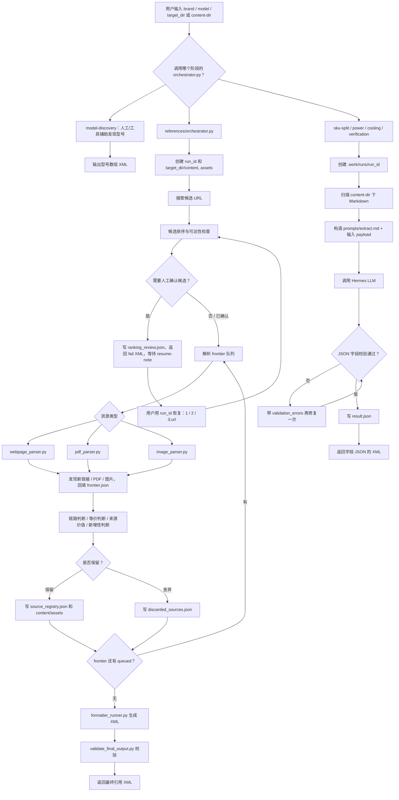

# 仓库目录讲解

## 总览

这个仓库用于支撑“雷电拓展坞信息研究与结构化录入前处理”。它不是一个单一脚本项目，而是一组面向不同阶段的 skill 与工具集合。

从现在的结构看，主线可以理解成：

```text
品牌
  -> model-discovery：找出该品牌下的准确雷电拓展坞型号
  -> references：围绕某个型号收集资料，并固化为 Markdown + assets + 引用 XML
  -> sku-split：判断这个型号是否需要拆分成多个 SKU / 子型号
  -> power：从已收集资料中整理供电字段
  -> cooling：从已收集资料中整理散热字段
  -> verification：确认 Intel Thunderbolt 认证字段
  -> references/data-model.md：这些结果最终要贴近产品数据模型
```

目录大致分三层：

- `references/`：全局标准文档，定义数据模型、枚举值和后台只读 API 约束。
- `scripts/`：仓库根目录下的通用底层 CLI，例如搜索、抓网页、抽 PDF、查后台 API。
- `sub-skill/`：真正的业务流程目录。每个子目录都是一个独立阶段，有自己的 `SKILL.md`，多数还带自己的 `tools/orchestrator.py`。

当前主要结构如下：

```text
dock-info-research-standardize-input-skill/
├── readme.md
├── 科普.md
├── references/
│   ├── api-reference.md
│   ├── data-model.md
│   └── dict-values.md
├── scripts/
│   ├── auth.example.json
│   ├── dock-api.js
│   ├── extract-pdf.js
│   ├── fetch-page.js
│   └── web-search.js
└── sub-skill/
    ├── model-discovery/
    │   ├── SKILL.md
    │   ├── checklist.md
    │   ├── pitfalls.md
    │   └── tools/
    │       ├── web_search.py
    │       ├── fetch_page.py
    │       ├── extract_pdf.py
    │       └── image_info.py
    ├── references/
    │   ├── SKILL.md
    │   ├── prompts/
    │   ├── tools/
    │   └── validators/
    ├── sku-split/
    │   ├── SKILL.md
    │   ├── prompts/
    │   └── tools/
    ├── power/
    │   ├── SKILL.md
    │   ├── prompts/
    │   └── tools/
    ├── cooling/
    │   ├── SKILL.md
    │   ├── prompts/
    │   └── tools/
    └── verification/
        ├── SKILL.md
        ├── prompts/
        └── tools/
```

---

## 🥑`references/`

### 总体说明

`references/` 不负责执行任务，它定义的是“结果应该怎么标准化”。凡是涉及品牌、字段、枚举、接口边界和最终产品结构的地方，都应该回到这里确认。

### `references/dict-values.md`

记录系统使用的字典枚举值。

### `references/data-model.md`

这个文件定义扩展坞产品在系统中的结构化数据模型。它说明最终产品数据应该包含哪些字段，例如：

- 产品主表 `Product`
- 接口对象 `Port`
- 视频输出能力 `VideoCapability` / `VideoOutput`
- 系统支持 `OsSupport`
- 资料引用 `MaterialRef`
- 价格信息 `Price`

- ...

### `references/api-reference.md`

后台只读 API 的说明，服务于查询已有数据，而不是维护数据。

包含：

- Base URL 形态
- 鉴权方式
- `scripts/auth.json` 的凭据位置
- `list`、`get`、`refresh-token` 等命令
- 只允许读，不允许新增、更新、删除

它是仓库和后台系统之间的安全边界。

---

## 🥑`scripts/`

### 总体说明

`scripts/` 放的是仓库根目录的通用命令行工具。关注单一能力，不承载完整业务流程。

不过要注意：新版 `model-discovery` 已经有自己的 Python 工具放在 `sub-skill/model-discovery/tools/` 下，所以型号发现阶段优先使用子技能自己的工具，而不是根目录的 JS 脚本。

### `scripts/web-search.js`

网页搜索 CLI。它通过 SearXNG 做主搜索，并在需要时回退到 DuckDuckGo Lite。

输出结果包含：

- `title`
- `url`
- `snippet`
- `thumbnail`
- `engine`
- `published`

它只负责“发现候选链接”，不负责判定资料是否可靠。

### `scripts/fetch-page.js`

网页抓取 CLI。它不是简单的 `curl`，而是支持多种读取策略：

- 静态 HTML 抓取
- `__NEXT_DATA__` / JSON-LD 等结构化数据提取
- Playwright 动态页面抓取
- `--interact` 交互式展开 Tab、Accordion、详情面板等内容

它的价值在于把一个 URL 变成可阅读的页面文本或结构化片段。

### `scripts/extract-pdf.js`

PDF 文本层提取工具。它读取本地 PDF，逐页提取文本，并在文本太少时用退出码提示可能需要视觉解析。

它适合做 PDF 解析前的快速判断，但不是完整的 PDF 视觉解析框架。

### `scripts/dock-api.js`

后台只读 API 的 CLI 封装，支持：

- `list`
- `get`
- `refresh-token`

它依赖 `scripts/auth.json`，并通过 `Authorization: Bearer ...` 访问后台。它不包含写入、删除或维护状态变更能力。

### `scripts/auth.example.json`

认证配置模板。真实 token 应放在未提交的 `scripts/auth.json` 中。

---

## 🥑`sub-skill/`

### 总体说明

`sub-skill/` 是这个仓库的核心业务区。每个子目录对应一个相对独立的阶段：

- `model-discovery/`：找型号。
- `references/`：找资料、解析资料、输出引用。
- `sku-split/`：判断型号是否需要拆 SKU / 子型号。
- `power/`：整理供电字段。
- `cooling/`：整理散热字段。
- `verification/`：整理 Intel 雷电认证字段。

可以把 `model-discovery` 和 `references` 看成“资料准备阶段”，把 `sku-split`、`power`、`cooling`、`verification` 看成“基于资料的字段抽取阶段”。

---

## 🥑`sub-skill/model-discovery/`

### 总体说明

`model-discovery/` 的任务边界是：输入品牌名，找出该品牌下所有准确的雷电拓展坞型号。

它只负责型号发现，不负责给某个型号收集完整资料，也不负责输出产品字段。

### `sub-skill/model-discovery/SKILL.md`

这个文件定义型号发现流程的工作协议。

核心要求包括：

- 输入是品牌名。
- 先查 `references/dict-values.md` 中的 `dock_brand`，尽量校准品牌。
- 搜索官网、支持站、下载页、手册、PDF、评测、社区、零售商、Intel Thunderbolt 数据库等来源。
- 搜索摘要只能用于发现链接，不能直接作为型号结论。
- 对官网和支持中心要尽量遍历产品索引、分类页、旧款页、下载页、地区站点。
- 发现 `Plus`、`Pro`、`Gen`、数字代际、年份款、货号前缀等命名规律时，要主动补查基础款、前代和相邻款。
- 只输出确认属于雷电 / USB4 相关多口扩展坞的型号。

输出是 XML，`data` 中是 JSON 数组字符串。

### `sub-skill/model-discovery/checklist.md` 和 `pitfalls.md`

`checklist.md` 是验收清单，用于检查输出格式、品牌标准化、搜索覆盖、官网支持站遍历、PDF/图片证据确认、命名补洞、外部交叉验证等内容。

`pitfalls.md` 记录旧错误和反例，用于避免重复犯错。

`SKILL.md` 要求关键动作写入 `.work/logs.md`，并且结果要连续两轮独立检查通过后才算成功。

### `sub-skill/model-discovery/tools/`

这是新版型号发现专用工具目录。它把原来依赖根目录脚本的动作收进了子技能内部：

- `web_search.py`：执行搜索，默认使用本地 SearXNG，可输出 JSON。
- `fetch_page.py`：读取页面，支持普通抓取和交互抓取。
- `extract_pdf.py`：下载或读取 PDF 并提取文本。
- `image_info.py`：下载或读取图片，记录图片元信息，辅助后续视觉确认。

因此，阅读 `model-discovery` 时，应优先看这些 Python 工具，而不是只看根目录 `scripts/`。

---

## 🥑`sub-skill/references/`

### 总体说明

`references/` 用于处理“单个品牌 + 单个型号”的资料研究任务。

它的输入是已经确定的品牌和型号；输出包括两部分：

- 本地交付物：`target_dir/content/` 下的 Markdown，以及 `target_dir/assets/` 下的图片、PDF、截图、原始文件等。
- 消息返回：最终 XML，里面是可作为产品资料引用的 `<ref>` 列表。

它不做购买推荐、价格追踪、产品排行或横向对比。

### `sub-skill/references/SKILL.md`

这个文件定义资料调研子技能的总协议。

首次调用必须提供：

- `brand`
- `model`
- `target_dir`

恢复调用使用：

- `run_id`
- `resume_note`

这个子技能的唯一执行入口是：

```bash
python3 tools/orchestrator.py --brand "CalDigit" --model "TS4" --target-dir "./out"
```

恢复时：

```bash
python3 tools/orchestrator.py --run-id "已有 run_id" --resume-note "1"
```

### 交付目录与内部状态

`target_dir` 只放最终交付内容：

```text
target_dir/
├── content/
│   └── {source_id}.md
└── assets/
    └── {source_id}/
```

过程状态不写入 `target_dir`，而是写入内部运行目录：

```text
runs/
└── {run_id}/
    └── state/
        ├── source_registry.json
        ├── fact_ledger.json
        ├── conflicts.json
        ├── discarded_sources.json
        ├── frontier.json
        └── run_state.json
```

这个分离很重要：`target_dir` 面向最终交付，`runs/{run_id}/state/` 面向恢复、排队、调试和流程控制。

### `sub-skill/references/prompts/`

这个目录保存资料调研中的判断和解析提示词，例如：

- `candidate_judge.md`：判断候选来源是否值得进入解析。
- `article_candidate_curator.md`：对文章 / 评测型候选进行精选。
- `webpage_parser.md` / `webpage_deep_parser.md`：网页解析规则。
- `pdf_text_batch_parser.md` / `pdf_vision_page_parser.md`：PDF 文本页和视觉页解析规则。
- `image_parser.md`：图片资料解析规则。
- `chain_link_judge.md`：资料链路关系判断。
- `material_equivalence_judge.md`：资料等价 / 重复判断。
- `source_value_judge.md`：来源价值判断。
- `novelty_finder.md` / `novelty_verifier.md`：新增事实判断与复核。
- `ref_desc_formatter.md`：最终引用 `desc` 生成规则。
- `output_formatter.md`：最终 XML 输出规则。

### `sub-skill/references/tools/`

这是资料调研流程的主要实现代码。

重点文件：

- `orchestrator.py`：总调度器，串起搜索、排序、人工确认、解析、去重、输出。
- `searxng_search.py`：搜索模块，负责搜索计划、健康检查和搜索结果归一化。
- `candidate_ranker.py`：候选排序和可达性检查。
- `resource_router.py`：根据资源类型把 URL / 文件分发给网页、PDF、图片解析器。
- `webpage_parser.py`：网页深度解析，并发现页面中的二级 PDF / 图片 / 链接资源。
- `pdf_parser.py`：PDF 页面解析，区分文本页和视觉页。
- `image_parser.py`：图片资料解析。
- `chain_link_judge.py`：判断来源链、引用链、派生关系。
- `material_equivalence_judge.py`：判断重复、镜像、转载或同文档不同入口。
- `source_value_judge.py`：判断来源价值。
- `novelty_judge.py`：判断是否提供新增事实。
- `persist_state.py`：运行状态读写。
- `formatter_runner.py`：把内部 payload 转成最终 XML。
- `parser_common.py`：公共工具函数、进度输出、source_id、超时常量等。

### `sub-skill/references/validators/validate_final_output.py`

最终 XML 校验器。它检查：

- 根节点必须是 `<res>`。
- `<status>` 只能是 `succ` 或 `fail`。
- `succ` 时必须有 `<data>`，且至少有一个 `<ref>`。
- `<ref><type>` 只能是 `url`、`file`、`image`。
- 每个 `<ref>` 必须有非空 `url` 和 `desc`。
- `fail` 时不能有 `<data>`，且必须有非空 `<extras>`。

它只校验，不修复。

---

## `sub-skill/sku-split/`

### 总体说明

`sku-split/` 用于判断当前输入型号是否已经是不可再拆的准确型号，还是应该作为组合型号，或者拆分成多个 model。

它依赖 `references/` 阶段已经收集好的资料目录，也就是 `content-dir`。

### 输入与调用

首次调用：

```bash
python3 tools/orchestrator.py \
  --brand "CalDigit" \
  --model "Thunderbolt 3 Mini Dock" \
  --content-dir "/path/to/content-dir"
```

恢复调用：

```bash
python3 tools/orchestrator.py --run-id "<run_id>" --resume-note "补充说明"
```

### 输出字段

成功时 XML 的 `<data>` 里是 JSON，只允许包含：

- `skuSplitDecision`：`single` / `grouped` / `split`
- `models`
- `skuSplitDetail`
- `notes`
- `materialRefs`
- `hasUncertainInfo`

三种判断含义：

- `single`：输入型号就是一个准确型号，不需要拆。
- `grouped`：有多个兄弟 SKU 或衍生型号，但本质能力差异不大，适合作为组合型号管理。
- `split`：存在显著能力差异，应拆成多个 model 分别录入。

---

## `sub-skill/power/`

### 总体说明

`power/` 用于从已收集资料中整理供电相关字段。

它不负责找资料，而是读取 `content-dir` 下的 Markdown 资料，并调用 `prompts/extract.md` 让 LLM 抽取供电结论。

### 输出字段

成功时 XML 的 `<data>` 里是 JSON，只允许包含：

- `powerInputDetail`
- `powerOutputMax`
- `powerOutputTypical`
- `powerOutputDetail`
- `notes`
- `materialRefs`
- `hasUncertainInfo`

其中 `materialRefs.url` 是相对 `content-dir` 的 Markdown 路径，用于说明推断、冲突或特殊采信依据。

---

## `sub-skill/cooling/`

### 总体说明

`cooling/` 用于从已收集资料中整理散热信息。

它关注产品是否主动散热、散热方式描述、是否存在不确定结论等。

### 输出字段

成功时 XML 的 `<data>` 里是 JSON，只允许包含：

- `activeCooling`
- `coolingDetail`
- `notes`
- `materialRefs`
- `hasUncertainInfo`

---

## `sub-skill/verification/`

### 总体说明

`verification/` 用于确定指定型号是否通过 Intel Thunderbolt 认证。

它会要求 LLM 优先查询 Intel 官方认证产品数据库，同时结合 `content-dir` 中已有资料判断。Intel 认证页本身不进入 `materialRefs`；如果 Intel 未列出但官方资料宣称认证，需要在相关 `materialRefs[].desc` 中说明。

### 输出字段

成功时 XML 的 `<data>` 里是 JSON，只允许包含：

- `tbIntelCertified`
- `notes`
- `materialRefs`
- `hasUncertainInfo`

---

## 🍩阶段型子技能的共同模式

`sku-split`、`power`、`cooling`、`verification` 这四个目录的实现方式很像：

- 都有 `SKILL.md` 说明输入、调用方式和输出字段。
- 都有 `prompts/extract.md` 约束 LLM 怎么抽字段。
- 都有 `tools/orchestrator.py` 作为唯一执行入口。
- 首次运行需要 `--brand`、`--model`、`--content-dir`。
- 恢复运行使用 `--run-id` 和 `--resume-note`。
- 内部状态写在各自目录下的 `.work/runs/`。
- 调度器会收集 `content-dir` 下的 Markdown，构造 prompt，调用 `hermes --toolsets browser,terminal,file --oneshot`。
- LLM 必须返回 JSON object。
- 调度器会校验 JSON 字段，只允许输出 `PHASE_CONFIG["allowed_data_keys"]` 中列出的字段。
- 校验失败时会用同一份输出和错误信息再给 LLM 一次修正机会。
- 成功后把结果写入 `.work/runs/{run_id}/result.json`，并向 stdout 返回 XML。

这四个阶段不是资料采集器，而是“字段抽取器”。它们默认相信 `content-dir` 里已经有足够资料；如果资料不够，应通过输出中的 `hasUncertainInfo`、`notes`、`materialRefs` 暴露不确定性。

---

## 🍩一个完整流程中会发生什么

下面按真实使用顺序串起来看。

### 1. 发现品牌下有哪些型号

先调用 `sub-skill/model-discovery/`。

这个阶段只输入品牌。它会搜索官网、支持站、PDF、评测、零售、社区和 Intel 数据库等来源，最终返回该品牌下确认属于目标范围的雷电拓展坞**型号数组**。

如果结果缺少证据，或者 PDF / 图片无法确认，流程应该按 HiL 方式中断，而不是猜测。

### 2. 给某个型号收集资料

拿到型号后，对每个具体型号调用 `sub-skill/references/tools/orchestrator.py`。

这个阶段会：

1. 创建 `run_id`。
2. 准备 `target_dir/content/` 和 `target_dir/assets/`。
3. 搜索候选 URL。
4. 调用 `candidate_ranker.py` 排序和初筛。
5. 在 `ranking_review.json` 处暂停，让用户确认候选列表。
6. 用户用 `resume-note` 确认、重搜或补充 URL。
7. 正式解析网页、PDF、图片。
8. 从已解析资料中发现新资源，继续加入 `frontier.json`。
9. 做链路判断、等价判断、来源价值判断、新增性判断。
10. 保留有价值资料，舍弃重复或低价值资料。
11. 写出 Markdown 和 assets。
12. 生成并校验最终引用 XML。

这一阶段结束后，最重要的产物不是 XML 本身，而是 `target_dir/content/` 下的一批 Markdown。后面的字段抽取阶段都会读这些 Markdown。

### 3. 判断型号是否需要拆 SKU

有了 `content-dir` 之后，先跑 `sku-split/` 比较合理。

原因是：如果当前型号其实包含多个能力差异明显的子型号，那么后续的供电、散热、认证字段可能不能混在一起抽。先拆 SKU，可以避免把多个产品的数据混成一个产品。

输出可能是：

- `single`：继续按当前型号处理。
- `grouped`：作为组合型号管理。
- `split`：拆成多个 model 后分别继续处理。

### 4. 抽供电字段

调用 `power/`，读取同一个 `content-dir`。

这个阶段输出供电输入、最大主机供电、典型供电、供电补充说明，以及必要的资料引用。

### 5. 抽散热字段

调用 `cooling/`。

它会判断主动散热 / 被动散热，并整理散热详情。如果资料没有明确说明，也应该体现不确定性。

### 6. 确认 Intel 雷电认证

调用 `verification/`。

它会优先查 Intel 官方认证数据库，再结合已有资料判断 `tbIntelCertified`。如果 Intel 数据库和官方宣传资料之间存在差异，要在输出中说明。

### 7. 对齐最终产品模型

最后，把这些阶段的输出对齐到 `references/data-model.md` 中的 `Product` 字段。

此时可以把仓库里的关键文件理解为：

- `model-discovery/SKILL.md`：决定有哪些型号值得做。
- `references/tools/orchestrator.py`：把某个型号的证据资料收集齐。
- `sku-split/tools/orchestrator.py`：决定这个型号粒度是否正确。
- `power/tools/orchestrator.py`：抽供电字段。
- `cooling/tools/orchestrator.py`：抽散热字段。
- `verification/tools/orchestrator.py`：抽认证字段。
- `references/data-model.md`：告诉你这些字段最终落到哪里。

### 简短记忆版

```text
model-discovery = 找型号
references      = 找资料并生成 content-dir
sku-split       = 判断型号粒度
power           = 抽供电
cooling         = 抽散热
verification    = 抽 Intel 认证
data-model      = 最终产品数据形状
```

---

## 🍩调度器是什么，怎么看调度情况

### 调度器是什么

这里说的“调度器”，不是后台常驻服务，也不是系统级任务队列。它就是每个阶段里的 `tools/orchestrator.py`。

它的作用是把一堆分散动作串成一个可恢复、可校验的流程。例如 `references/tools/orchestrator.py` 会负责：

- 初始化 run，生成 `run_id`。
- 创建或检查输出目录。
- 调用搜索工具。
- 调用候选排序工具。
- 在需要人工确认时暂停。
- 按资源类型调用网页 / PDF / 图片解析器。
- 把新发现的链接继续塞回队列。
- 判断资料是否重复、是否有新增价值。
- 写状态文件。
- 最后生成 XML 并校验。

所以它更像一个“流程控制器”：它自己不一定做所有具体工作，但它决定什么时候调用谁、结果写到哪里、失败后怎么恢复。

### 要一直挂着吗

一般不需要把它当服务一直挂着。

它的运行方式是“一次命令跑一个阶段”：

```bash
python3 tools/orchestrator.py --brand "CalDigit" --model "TS4" --target-dir "./out"
```

命令运行期间，调度器进程需要存在，因为它正在搜索、排序、解析、判断或格式化。运行结束后，它会向 stdout 返回 XML，然后进程退出。

有两种特殊情况：

1. `references` 资料调研可能很慢，尤其是 PDF、网页深度解析、LLM 判断阶段。这个时候不是常驻服务，而是“这个命令还没跑完”，需要等它自然结束。
2. 遇到候选 URL 初筛确认点时，调度器会故意返回 `fail` XML 并退出。这不是流程失败，而是在等用户用同一个 `run_id` 恢复。

恢复时不是让旧进程继续挂着，而是重新启动一次命令，让它读取旧 `run_id` 的状态：

```bash
python3 tools/orchestrator.py --run-id "已有 run_id" --resume-note "1"
```

因此可以这样记：

```text
正在执行时：进程需要活着
等待人工确认时：进程通常已经退出，状态保存在文件里
恢复执行时：用 run_id 重新启动调度器
最终完成后：进程退出，结果写在 XML / result.json / content-dir 中
```

### 怎么检测 `references` 大调度器的情况

`references` 是最复杂的调度器，状态主要看这个目录：

```text
sub-skill/references/runs/{run_id}/state/
```

最重要的文件：

- `run_state.json`：当前 run 的总状态。重点看 `status`、`phase`、`updated_at`、`orchestrator_pid`。
- `frontier.json`：候选资料队列。重点看每个资源的 `status`，例如 `queued`、`parsing`、`parsed`、`discarded`、`failed`。
- `parser_status.json`：解析阶段的摘要。重点看 `parsed_count`、`pending_count`、`failed_count`、`frontier_count`。
- `ranking_review.json`：候选初筛后的人工确认清单。如果流程停在这里，需要用户选择继续、重搜或补 URL。
- `source_registry.json`：最终保留下来的资料来源。
- `discarded_sources.json`：被舍弃或判定冗余的资料来源。

可以用命令快速查看：

```powershell
Get-Content -Encoding utf8 sub-skill\references\runs\<run_id>\state\run_state.json
Get-Content -Encoding utf8 sub-skill\references\runs\<run_id>\state\parser_status.json
Get-Content -Encoding utf8 sub-skill\references\runs\<run_id>\state\ranking_review.json
```

如果想看调度器进程是否还活着，先从 `run_state.json` 找到 `orchestrator_pid`，再查进程：

```powershell
Get-Process -Id <orchestrator_pid>
```

如果进程不存在，但 `run_state.json` 里还显示 `status=running`，通常表示上一次执行被外部中断了。此时不要直接新建任务，应优先用 `run_id` 恢复。

### 怎么检测字段抽取调度器的情况

`sku-split`、`power`、`cooling`、`verification` 是轻量调度器。它们的状态目录在各自子技能下面：

```text
sub-skill/{phase}/.work/runs/{run_id}/
```

常见文件：

- `state.json`：阶段状态，包含 `run_id`、`phase`、`brand`、`model`、`content_dir`、`status`。
- `sources.json`：本次从 `content-dir` 收集到的 Markdown 来源列表。
- `result.json`：最终解析并校验通过的 JSON 结果。
- `initial_prompt.md` / `initial_stdout.txt` / `initial_stderr.txt`：第一次 LLM 调用的 prompt 和输出。
- `repair_prompt.md` / `repair_stdout.txt` / `repair_stderr.txt`：如果第一次 JSON 校验失败，修复轮的 prompt 和输出。

查看方式类似：

```powershell
Get-Content -Encoding utf8 sub-skill\power\.work\runs\<run_id>\state.json
Get-Content -Encoding utf8 sub-skill\power\.work\runs\<run_id>\result.json
```

轻量调度器的 `state.json` 中 `status=finished`，并且存在 `result.json`，通常就表示该阶段已经跑完。

### 调度器流程图


