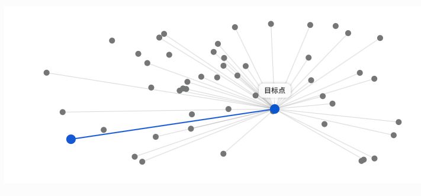
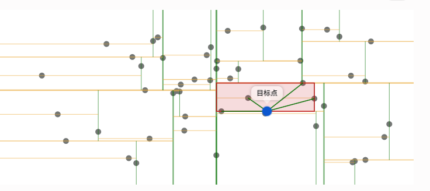
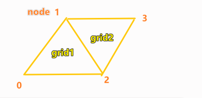

# WCH1D 大文件与性能优化复盘

**大文件性能优化：针对 2GB + 地形 / 结果文件处理卡顿问题，落地分块上传、多线程计算方案，文件处理耗时从 30 分钟缩短至 5 分钟。**

---

## 链路一：2D 计算结果文件（NC）处理

第一条链路讲的是二维计算结果从"引擎输出的大型 NC 文件"变成"前端可以播放的积水/洪水演进动画"的过程。


NC 是记录某个时刻下某个网格当时的水深，是“时间步 × 网格” 组织的结果矩阵，适合模型计算和批量存储，但不适合前端直接渲染播放。

二维模型算完以后，把nc结果切成渲染帧传输给前端，作为用户，是看能不能顺畅地在地图上拖动时间轴，也就是拖动帧，从而看到不同时刻的积水范围、积水深度和洪水扩散过程。


所以技术上的难点是：引擎输出的nc文件不是前端能直接播放的数据，它不仅很大，有2GB，而且数据还要做转换，会遇到内存、耗时和 UI 卡顿问题。

```text
2d_model.nc
  -> format_result/        先把 NC 拆成按时间步组织的中间文件
  -> client_result/        再把中间文件转成前端可直接渲染的帧
  -> result.zip            打包成可下载、可复用的结果包
  -> 前端本地解压播放      用缓存、Worker、空间索引减少卡顿
```


```text
阶段一：NC -> format_result
  输入：2GB+ 的 2d_model.nc
  核心动作：按“时间步 × 网格”拆出 h0.json、h1.json、h2.json...
  技术价值：把一个超大矩阵，拆成前端和后端都更容易按帧读取的小文件

阶段二：format_result -> client_result
  输入：网格中心坐标 CX/CY + 每个时间步的水深 h{t}.json + 前端节点 node.json
  核心动作：用 KDTree 找“每个网格中心最近的 3/4 个节点”，再用 NumPy 把网格水深聚合成节点颜色值
  技术价值：把“模型计算数据”变成“Cesium 可渲染帧”

阶段三：client_result -> result.zip -> 客户端 result.zip
  输入：服务器上的 client_result/ 目录
  核心动作：Python zipfile 归档，Node.js ReadStream 按块发送，Electron 按块写入磁盘
  技术价值：大结果包不进入完整 Buffer，内存压力由 chunk 大小决定，而不是由 ZIP 总大小决定

阶段四：客户端解压播放
  输入：本地 result.zip / result/ 目录
  核心动作：按需读取帧、Worker 解析、缓存最近帧、空间索引加速交互
  技术价值：把播放压力从主线程拆出去，减少拖动时间轴和空间查询时的卡顿
```

### 1.1 阶段一：NC -> format_result，把超大矩阵拆成按时间步组织的中间文件

对于NC大文件的处理，首先是看它本身的数据结构有没有优化的空间，我识别它的数据结构：时间步 × 网格。

所以把处理粒度从"整个文件"降到"时间步批次"，按照时间步进行分割出许多文件。

这样就从"加载全量、按行索引"变成"按文件名直读"。

> 引擎计算结束后，二维结果以 `nc` 的形式落在服务器的硬盘上，数据库只做指针读取——后续所有读取、拆解、打包都是按路径去访问。

拆分前：1 个 NC 文件，H 是 3×6 的矩阵

```
── H[time_steps=3, n_cells=6]		//6个网格，3个时间步
    ├── 时间步 0: [0.10, 0.12, 0.08, 0.09, 0.11, 0.10]   ← 0 秒那一帧
    ├── 时间步 1: [0.20, 0.25, 0.18, 0.22, 0.30, 0.28]   ← 60 秒那一帧
    └── 时间步 2: [0.35, 0.40, 0.33, 0.45, 0.55, 0.50]   ← 120 秒那一帧
```

每一行就是一张"所有网格的水深快照"。每走一个时间步，引擎会根据当前水位、流速、边界条件 更新并落盘一次所有网格的水深。


按时间步拆完之后，目录长这样：

```text
format_result/
├── CXData.json   [x0, x1, x2, x3, x4, x5]                ← 6 个网格的 X 坐标
├── CYData.json   [y0, y1, y2, y3, y4, y5]                ← 6 个网格的 Y 坐标
├── h0.json       [0.10, 0.12, 0.08, 0.09, 0.11, 0.10]    ← 0 秒那帧的水深
├── h1.json       [0.20, 0.25, 0.18, 0.22, 0.30, 0.28]    ← 60 秒那帧的水深
├── h2.json       [0.35, 0.40, 0.33, 0.45, 0.55, 0.50]    ← 120 秒那帧的水深
└── overview.json { timeSeq, max, min, hSize=3, ... }
```

前端不用再带着 NC 解析器全量加载，按帧加载、按帧渲染、按帧释放。

---

### 1.2 阶段二：format_result -> client_result，用 KDTree 生成可渲染帧

`format_result` 只是中间数据，还不是前端最终播放的数据。所以要转化为前端Cesium渲染需要的格式，即渲染帧，​渲染帧是“某一个时间步下，前端每个节点应该显示什么颜色/水深值”的数组。

这个阶段的数据变化是：

```text
format_result/
  CXData.json / CYData.json / h0.json / h1.json / ...

经过空间映射和颜色结果计算：

client_result/
  R0.json
  R1.json
  R2.json
  ...
  CXData.json / CYData.json
  overview.json
  node.json
```

> 在讲代码之前，先把这两个角色对齐，避免后面读混：
>
> - **网格中心点（grid point）**：NC 里每个网格中心对应一个 `cx, cy` 坐标，这些点是计算的产物，不会去渲染。而`H` 是按网格中心存的水深。
> - **节点（node）**：前端用 Cesium 渲染时是把地图拆成很多**三角面**或**四角面**，每个面有 3 个或 4 个角点。这些角点就叫做节点。
>
> ```
> 网格中心点 grid:
>   grid0 = { x: 100, y: 200, h: 10 }   // 模型说：这块地砖中心水深 10
>   grid1 = { x: 130, y: 200, h: 20 }   // 模型说：另一块地砖中心水深 20
> 
> 前端节点 node:
>   node0 = { coord: [90, 190] }        // 前端三角面的一个角
>   node1 = { coord: [110, 190] }       // 前端三角面的一个角
>   node2 = { coord: [100, 215] }       // 前端三角面的一个角
> ```
>
> 
>
> **网格中心是科学计算的产物，节点是渲染的舞台。两者坐标体系相近，但点的数量、用途都不同。** 所以我们要用一个py脚本在两者之间搭一座桥——把"网格水深"按空间邻接关系，搬到"节点的颜色"上。
>
> 这里的“空间邻接关系”不是业务上的上下游关系，而是几何距离关系：**某个网格中心离哪 3 个或 4 个节点最近，就认为这个网格中心的水深应该影响这些节点。**
>
> “节点的颜色”也不是另一套新概念。前端最终要画的是三角面/四角面，而 Cesium 更擅长接收顶点上的属性值：每个节点拿到一个水深值后，前端再把水深映射成颜色，例如浅水是浅蓝、深水是深蓝。也就是说：
>
> ```
> 网格水深值
>   -> 分摊到附近节点
>   -> 节点得到水深值
>   -> 前端按水深值换算颜色
>   -> Cesium 在三角面内部做颜色插值
> ```

`process_result.py` 的核心优化思路是：

- 把节点坐标转成 `numpy` 数组。（:fish:原本是什么样子，转化后又是什么样子​）

- 用 `KDTree` 一次性查询每个网格点附近最近的 3 或 4 个节点（`k = shape_type`，三角面取 3、四角面取 4）。

- 对每个时间步，用 `np.repeat` 和 `np.bincount` 把网格水深聚合到节点，然后前端按水深值换算颜色，Cesium 在三角面内部做颜色插值。

  


#### KDTree 怎么在代码里落地

理解 KDTree 的概念之后，真正写代码时不是自己手写一棵树，而是把数据整理成库能接受的数组，然后调用库提供的建树和查询 API。

> 这里使用KDTree用到了python的sKDTree库

在这段代码里，落地步骤是：

```text
1. 准备被查询的数据：所有前端节点坐标
   nodes
     -> node_coords_raw
     -> node_coords: numpy.ndarray, shape = (n_nodes, 2)

2. 用节点坐标建树
   tree = cKDTree(node_coords)

3. 准备查询点：所有网格中心坐标
   CXData + CYData
     -> grid_coords: numpy.ndarray, shape = (n_grid, 2)

4. 一次性查询每个网格中心最近的 k 个节点
   distances, indices = tree.query(grid_coords, k=shape_type)

5. 后续用 indices 建立“网格中心 -> 节点”的映射关系
```

对应到代码就是：

```python
node_coords_raw = [node['coord'] for node in nodes]

if len(node_coords_raw[0]) > 2:
    node_coords = np.array([[c[0], c[1]] for c in node_coords_raw])
else:
    node_coords = np.array(node_coords_raw)

tree = cKDTree(node_coords)

grid_coords = np.column_stack([cx_data, cy_data])
k = shape_type
distances, indices = tree.query(grid_coords, k=k)
```

这段代码里有三个关键对象：

```text
node_coords
  -> 被查找的点集合
  -> 前端节点/角点
  -> KDTree 建在它上面

grid_coords
  -> 发起查询的点集合
  -> NC 网格中心点
  -> 每个网格中心都要找附近节点

indices
  -> 查询结果
  -> indices[i] 表示第 i 个网格中心最近的 k 个节点编号
```

举个最小例子：

```text
node_coords = [
  [90, 190],   // node0
  [110, 190],  // node1
  [100, 215],  // node2
  [130, 210],  // node3
]

grid_coords = [
  [100, 200],  // grid0
  [125, 205],  // grid1
]

indices = tree.query(grid_coords, k=3)[1]
```

可能得到：

```text
indices = [
  [0, 1, 2],  // grid0 最近的是 node0、node1、node2
  [1, 2, 3],  // grid1 最近的是 node1、node2、node3
]
```

所以 KDTree 在代码里的价值不是“直接生成颜色”，而是先生成一张关系表：

```text
每个网格中心
  -> 最近的 3/4 个节点编号
```

后面的 `np.repeat + np.bincount` 才是拿着这张关系表，把网格中心水深批量分摊到节点上。

#### KDTree 是什么——为什么这里要用它

KDTree（K-Dimensional Tree，K 维二叉树）是一种**空间索引**。它是用来解决“谁离当前点最近”的问题。

> k是数据的维度，如果数据只有经纬度 (X, Y)，那就是 2 维，这是一个 2D-Tree。
>
> 如果数据还有海拔高度 (X, Y, Z)，那就是 3 维，这是一个 3D-Tree。
>
> 不管是几维，它每次切分时，**永远只是一刀切成两半**（一分为二，这就是二叉）。

```text
笨办法：
假设有五万个网格和五万个节点，目前要找离某个网格最近的三四个点，那五万个节点要分别去计算离网格最近的距离，一个网格是五万次，五万个网格就是五万*五万（25亿次）
n_grid × n_nodes 次距离计算

聪明办法：
KDTree：先把所有节点按 (x, y) 建一棵二叉树，
        再让每个网格走树查找最近邻，平均 O(log n)
        一次 KDTree.query() 一次性查完所有网格
        大约 5 万 × log(5万) ≈ 5 万 × 16 次比较
```





> 这里详细的描述一下，(2,3),(5,4),(9,6),(4,7),(8,1),(7,2)，假设有这些点，先按x从小到大进行排序，(2,3),(4,7),(5,4),(7,2),(8,1),(9,6)，然后取(7,2) 中间节点作为根节点，
>
> ```
>               x = 7
>                 │
> 左边区域          │        右边区域
> x < 7           │        x > 7
>                 │
> (2,3)           │        (8,1)
> (4,7)           │        (9,6)
> (5,4)           │
> ```
>
> 按y切，先看左边区域
>
> 按y从小到大排序，`(2,3), (5,4), (4,7)`，中间点是（5，4），
>
> ```
>               (7,2) | x
>              /          \
>        (5,4) | y       x > 7 的点
>        /        \
>  (2,3) | x   (4,7) | x
> ```
>
> 再看右边区域，选择（9，6）作为中间点
>
> ```
>               (7,2) | x
>              /          \
>        (5,4) | y       (9,6) | y
>        /        \        /
>  (2,3) | x   (4,7) | x  (8,1) | x
> ```
>
>  **这里我们只切了两刀，就切完了，这是因为只有6个点，如果有几万个点，你切两刀肯定切不完，比如地图上有50000个点，第一刀左右各自25000，再切每个格子12500，直到16刀（2^16 = 65536），每个格子剩下1-2个点才可以**
>
> ```
> y
> ↑
> 8 |   (4,7)        │
> 7 |                │           (9,6)
> 6 |                │----------------  y=6，只切右边区域
> 5 |       (5,4)    │
> 4 |----------------│                 y=4，只切左边区域
> 3 | (2,3)          │
> 2 |                │ (7,2)
> 1 |                │      (8,1)
> 0 +----------------│----------------→ x
>                   x=7
> ```


##### 时间复杂度

**平均情况（最常见）：O(log n)**

但是建树是有成本的，是O(nlogn)

前面提到我们需要切o(logn)刀，也就是二叉树有logn层，但是每一层是要排序的，花费o(n)，所以建树要o(nlogn)。

> 这里之所以每一层是n，用到了快速选择，比如同一层有十个人，你从中随便挑一个人，说 比他矮的站左边，比他高的站右边，所以会有（n-1）个人和他比较，可以当做复杂度是o(n)


#### 怎么把网格水深聚合到节点——`np.repeat + np.bincount`

先把工具名说清楚：`NumPy` 是 Python 的第三方数值计算库，通常写成：

```python
import numpy as np
```

所以这里的 `np.repeat` 和 `np.bincount` 不是算法名字，也不是库名字，而是 **NumPy 库里的两个数组处理函数**：

```text
np.repeat
  -> 完整名字是 numpy.repeat
  -> 作用：把数组里的元素按次数重复

np.bincount
  -> 完整名字是 numpy.bincount
  -> 作用：按编号统计次数，或者按编号累加权重
```

为什么这里要用 NumPy？因为二维结果本质上是大量数字数组：节点坐标数组、网格中心坐标数组、每一帧水深数组、节点颜色数组。用普通 Python 或 JavaScript 手写循环也能做，但会变成大量解释器层面的逐项处理；NumPy 更适合把这些数字批量放进数组，再用底层向量化函数一次性处理。

可以先用两个小例子理解这两个函数：

```python
np.repeat([10, 20], 3)
# [10, 10, 10, 20, 20, 20]
```

意思是：把 10 重复 3 次，把 20 重复 3 次。

```python
indices = [0, 1, 2, 1, 2, 3]
values  = [10,10,10,20,20,20]

np.bincount(indices, weights=values)
# [10, 30, 30, 20]
```

意思是：按编号把值累加起来。

```text
0 号节点收到 10
1 号节点收到 10 + 20
2 号节点收到 10 + 20
3 号节点收到 20
```

> 前面我们讲了对某个网格的中心点，如何找离它最近的三四个节点，
>
> 网格就像是地砖，有三角形，有四边形，我们还知道地砖的中心点的水深，
>
> 但是前端需要把网格的角去描绘出来，那么假如网格是三角形，离网格中心点最近的三个点就可以当做它的角点，这也是kdtree帮助我们做到的。
>
> 即把中心点转化成一个完整的图形，知道这个图形的角点是谁。

接下来要做的事情是：**把网格中心的水深值，转换成节点上的水深值**。
也就是把网格中心的水深值 赋给它的3个角，np.repeat + np.bincount就是做这个的。

```
要做一次转换：
网格中心值 -> 分摊到附近节点 -> 每个节点得到一个最终颜色值
```

比如现在要两个网格中心，grid1，grid2，水深分别是10，20

有四个节点 node0，node1，node2，node3

**在经过kdtree后，**

```
indices = [
  [0, 1, 2],  # grid0 最近的 3 个点
  [1, 2, 3],  # grid1 最近的 3 个点
]
```



**h_repeated**

原本水深值是10，20，现在检测到有六个点（尽管两个的重叠的）

它会把10复制三份，20复制三份，

分别交给对应的节点

```
flat_indices = [0, 1, 2, 1, 2, 3]
h_repeated   = [10,10,10,20,20,20]
```

**np.bincount**

这里不是简单“剔除重复点”，而是按节点编号把同一个节点收到的多个水深值先累加起来。

```
node_sums = [10, 30, 30, 20]
```

然后统计重复点被叠加了几次，比如这里的30叠加了两次，所以除以2

变成

```
node0 = 10
node1 = 15
node2 = 15
node3 = 20
```

上面得到了4个节点值，里面是水深值，那么假设现在就只有这四个节点，
我们把它存入h0.json，这代表第0个时间步下，每个网格的水深。


```text
format_result/h0.json
  -> 存的是第 0 个时间步下，每个网格中心的水深

经过 KDTree + np.repeat + np.bincount
  -> 转成第 0 个时间步下，每个节点的水深

client_result/R0.json
  -> 前端读取后，按节点顺序把水深映射成颜色
  -> Cesium 再在三角面/四角面内部做颜色过渡
```

每个时间步都重复同样的转换，所以会得到：

```text
h0.json -> R0.json
h1.json -> R1.json
h2.json -> R2.json
```

最终 `client_result/` 不是原始计算结果，而是已经为前端播放准备好的“逐时间步节点渲染数据”。


### 1.3 阶段三：服务器 client_result -> result.zip -> 客户端 result.zip，打包并流式交付

阶段三完成两件连续的事情：

1. **打包**：在服务器上把 `client_result` 目录压缩成 `result.zip`。
2. **交付**：把服务器上已经存在的 `result.zip` 流式传输并写入客户端磁盘。

先看这一阶段的完整数据流，后面的 `fs`、`Stream`、`pipe` 都是在解释这张图里的细节：

```text
服务器磁盘：
client_result/
  -> Python zipfile 逐个文件写入 ZIP 容器
  -> format_result/result.zip

后端交付：
format_result/result.zip
  -> fs.createReadStream 创建磁盘可读流
  -> readableStream.pipe(res)
  -> HTTP 响应按 chunk 发送

Electron 客户端接收：
HTTP 响应体
  -> Axios 在主进程中得到 response.data 可读流
  -> response.data.pipe(fs.createWriteStream(...))
  -> 客户端本地 result.zip
```

这里要特别区分两件事：**打包发生在下载之前，流式发生在下载过程中。** `fs.createReadStream` 负责把已经存在的 `result.zip` 按块读出来。

#### 第一步：服务器把 `client_result` 归档成 `result.zip`

> ```
> 工具：Python 标准库 zipfile
> 模式：ZIP_STORED，只归档，不执行 DEFLATE 压缩
> ```

服务器磁盘上目前 `client_result` 文件：

```text
client_result/
  -> R0.json、R1.json...       渲染帧
  -> overview.json             结果摘要
  -> CXData.json、CYData.json  网格中心坐标
  -> node.json                 节点信息
```

后端启动本机 Python脚本，使用 Python 标准库 **`zipfile`** 生成 `result.zip`：

```text
Node.js 启动 Python 子进程
  -> os.walk 遍历 client_result
  -> zipfile.write 逐个写入文件
  -> 使用相对路径保存 ZIP 条目
  -> 关闭 ZIP
  -> 生成 format_result/result.zip
```

代码使用 `zipfile.ZIP_STORED`。它只把多个文件归档进 ZIP 容器，**不执行 DEFLATE 压缩**，因此 ZIP 体积接近原文件总量。选择它是用更大的下载体积换取更少的 CPU 计算和更短的打包等待时间；如果目标是减小网络流量，则应改用 `ZIP_DEFLATED`，但打包耗时会增加。

改成 Python 子进程进行压缩后，Node.js 只负责调度，文件遍历和归档由短生命周期进程完成。这样可以避免在 Node.js 堆中组装大型 ZIP，并在子进程退出时集中释放相关资源。

到这里，服务器已经生成了磁盘文件 `format_result/result.zip`，打包动作结束。下面的 `fs.readFile`、`fs.createReadStream` 和 HTTP 响应都只负责**交付这个已经打包好的 ZIP**。

#### 第二步：服务器读取 `result.zip` 并通过 HTTP 交付

##### 前置知识：三个 Node.js 核心概念

**1. Buffer **

Buffer 是一块专门用来存储二进制数据的内存区域。

**大小固定：** Buffer 一旦被创建（比如你申请了 10 个字节的大小），它的长度就**永远不能改变**了。它不能像数组那样 `push` 一个新东西进去自动变长。

**内存独立：** Buffer 占用的内存空间**不是**由 V8 引擎（执行 JavaScript 的核心）分配的，**而是**由底层的 **C++** 直接分配。这使得它在处理大型文件时性能非常高。

> ```
> // 场景 1：找底层的 C++ 要 10 个字节的空白储物柜，默认全部填 0
> const buf1 = Buffer.alloc(10); 
> console.log(buf1); 
> // 打印结果: <Buffer 00 00 00 00 00 00 00 00 00 00>
> 
> 
> // 场景 2：直接把一段字符串转换成 Buffer
> const buf2 = Buffer.from('hello');
> console.log(buf2); 
> // 打印结果: <Buffer 68 65 6c 6c 6f>  (这里的 68 就是字母 h 的十六进制 ASCII 码)
> ```


举例：一个 4 字节的 Buffer 可以装下 `[0x48, 0x65, 0x6c, 0x6c]`，对应 ASCII 字符串 "Hell"（一个字节是8比特）。`fs.readFile` 读取文件后返回的正是这个 Buffer——文件有多大，Buffer 就有多大。

**⭐**：`fs.readFileSync` / `fs.readFile` 读取的是**磁盘文件的原始字节**，返回值默认就是 `Buffer`。这不是“先把 JS 转成二进制”，而是：任何文件落到磁盘上，本质上都已经是字节。

`fs.readFileSync('result.zip')` 做的事很朴素：把 `result.zip` 的所有字节一次性搬进内存，形成一个完整 Buffer。

```js
// 读取整个文件到内存（1GB 文件 => 1GB Buffer）
const buffer = fs.readFileSync('result.zip')
// 此时整个文件躺在 Node.js 进程的堆内存里
```

> :fire:我认为针对二三点，你的科普应该达到去介绍node的这个模块，比如fs模块的readfile和readfilesync，或者createreadstream，以及​stream模块，pipe是什么，你应该介绍知识本身，不需要你在这里举出我项目的代码，不需要，请你重写2，3

**2. Stream && fs **

Node.js 里处理文件常用 `fs` 模块。它有两类典型读法：

```text
fs.readFile / fs.readFileSync
  -> 一次性读取完整文件
  -> 返回完整 Buffer
  -> 文件越大，瞬时内存越大

fs.createReadStream
  -> 不一次性读取完整文件
  -> 返回 Readable Stream（可读流）
  -> 后续按 chunk 一块一块吐出 Buffer
```

Stream（流）是一种“数据不必一次性到齐，可以分块到达”的抽象。`fs.createReadStream('result.zip')` 做的不是读取完整 ZIP，而是创建一个**可读流对象**：这个对象知道从哪个文件读、每次读多少、读完怎么结束。

```js
// 创建一个“从磁盘文件读数据”的可读流
const stream = fs.createReadStream('result.zip')

// 每当读到一块数据，就触发 data 事件
stream.on('data', (chunk) => {
  console.log(chunk.length) // chunk 是一小段 Buffer
})
```

> `fs.createReadStream` / `fs.createWriteStream` 返回的对象本身就是 `stream` 模块里 `Readable` / `Writable` 的实例，所以只要用了这两个方法，就算用到了 stream 模块。


所以，`Buffer` 和 `Stream` 不是对立关系：

```text
Buffer：
  一块已经在内存里的字节

Stream：
  一条持续吐出/接收字节块的通道

Readable Stream：
  能吐出数据的流，例如 fs.createReadStream('result.zip')

Writable Stream：
  能接收数据的流，例如 HTTP 响应 res、fs.createWriteStream('result.zip')
```

**3. pipe —— 把两个流对接起来，数据自动从一端流向另一端**

`pipe` 是 Stream 的粘合剂，它是一个**连接动作**——它把一个可读流和一个可写流连起来，读到的块自动写进去，程序员不需要自己写循环和缓冲区管理代码：

```js
// 把文件流直接对接到 HTTP 响应，写入网络
fs.createReadStream('result.zip').pipe(res)
```

```text
fs.createReadStream('result.zip')
  -> 返回可读流 Readable Stream
  -> 负责从磁盘吐出 chunk

res
  -> HTTP 响应对象
  -> 在 Node.js 里可以当作 Writable Stream
  -> 负责把 chunk 写到网络响应里

readable.pipe(res)
  -> 把“能吐数据的一端”接到“能收数据的一端”
```


效果等同于程序员手写：

```js
readable.on('data', (chunk) => {
  res.write(chunk)
})

readable.on('end', () => {
  res.end()
})
```

但 `pipe` 会替你处理更多细节，比如背压（写入端来不及接收时，读取端会适当放慢），所以它比手写循环更稳定。

##### **和SSE的区别**

前面提到的是http流式响应，不等同于SSE，

核心区别是：连接生命周期和数据驱动方式完全不同。


你上一轮看到的 `fs.createReadStream(outputZip).pipe(res)` 本质是：

- 一个请求 → 打开一个流 → 把整个文件 chunks 发完 → 连接结束
- 服务端不会主动“再发新消息”；它只是把磁盘文件切成块，顺着 HTTP 响应管道吐给客户端
- 属于 Response Streaming / 下载流


SSE（Server-Sent Events） 是基于 HTTP 长连接的服务端主动持续推送机制。服务端可以在连接建立后，不定时、多次向客户端发送事件，客户端用 `EventSource` 持续接收。

它不是为了“下载一个大文件”设计的，而是为了实时通知、日志滚动、状态更新。

注意点：

- 在启动的时候`  res.setHeader('Content-Type', 'text/event-stream')`就可以，

- 每一条数据格式必须是 `data: <内容>\n\n`
- 连接保持打开，直到客户端关闭或服务端调用 `res.end()`

---

##### 流式交付 vs 非流式交付

理解了上面三个概念，就明白两种交付方式的本质区别：

```text
非流式（fs.readFile）：
磁盘 result.zip
  -> fs.readFile 一次性把全部字节读入内存（1GB Buffer）
  -> res.send(buffer)
  -> 整个 ZIP 必须完整躺在内存里才能开始发
  -> 网络

流式（fs.createReadStream）：
磁盘 result.zip
  -> fs.createReadStream 每批吐出 64KB 的 chunk
  -> readableStream.pipe(res)
  -> 每块数据直接从磁盘流向网络，中间不囤积
  -> 网络
```

非流式的致命问题是：**1GB 的 ZIP 需要接近 1GB 的 Buffer 来承载它**。并发下载时，每个请求都可能各自持有一份大 Buffer，内存压力会按请求数叠加；同时，大对象分配和垃圾回收也会让 Node.js 服务更容易抖动。

流式的优势：**内存占用与文件大小无关，只与单次 chunk 大小（64KB）成正比**。读一块、发一块、删一块，永远只有几个 chunk 在内存里打转。


##### 后端：分两步走——业务层开流，路由层把流接到响应上

理解这段代码的关键，是**区分两个文件的角色**。它们不是并列关系，而是**先后调用**：


**第一步：业务层（two_dimensional.js）在请求处理过程中建流**

路由层收到请求，调用了这个文件里的某个业务函数

业务层只负责"我要传哪个文件"——把磁盘上这个文件变成一个 Readable Stream（可读流），然后把这个流**作为结果的一部分**返回：

变成可读流是调用 `fs.createReadStream(outputZip)` 创建一个**读取句柄/读取通道**。

```js
// two_dimensional.js，第 135-147 行
const fileStat = fs.statSync(outputZip);
const readableStream = fs.createReadStream(outputZip);   // ① 创建可读流（开"水龙头"）

resolve({
    apiType: 'FILE_STREAM_DOWNLOAD',                     //    告诉路由层："这是流式下载"
    filename: '2d_Result.zip',
    mimeType: 'application/zip',
    contentLength: fileStat.size,                        //    告诉前端总大小，用于进度计算
    fileStream: readableStream                           // ② 把流交给路由层处理
});
```


```text
普通文件路径：
  outputZip = "D:/.../format_result/result.zip"
  -> 只是一个字符串，表示文件在哪里

可读流：
  fs.createReadStream(outputZip)
  -> 一个 Readable Stream 对象
  -> 里面保存了文件路径、读取位置、缓冲区大小等状态
  -> 后续有人消费它时，它会从磁盘持续读出 chunk
```

所以业务层这一步做的是：

```text
磁盘路径 result.zip
  -> fs.createReadStream
  -> Readable Stream 对象
  -> 放进 result.fileStream 返回给路由层
```

这里还没有把 ZIP 全部读进内存，也还没有发给前端。业务层只是把“我要下载的文件”从一个路径，包装成了一个可以被 HTTP 响应消费的可读流。


**第二步：路由层（custumrouter.js）拿到业务层返回的 result，做最后一步 pipe**

路由层调用完业务层，业务层会有返回，所以此时又到了路由层。把业务层给的可读流 `pipe` 到 HTTP 响应上：

```js
// custumrouter.js，第 18-22 行
else if (result != null && result.apiType === "FILE_STREAM_DOWNLOAD") {
    res.attachment(result.filename);                      // 设置下载文件名
    res.setHeader("Content-Type", result.mimeType);       // application/zip
    res.setHeader("Content-Length", result.contentLength); // 文件总大小
    result.fileStream.pipe(res);                          // ★ 关键：把磁盘流对接到 HTTP 响应
}
```

注意最后一行是 `readableStream.pipe(res)`，**数据从 readableStream 流向 res**——可读流 → 可写流，方向不能反。

这里 `fs.createReadStream(outputZip)` 返回一个 Node.js `Readable Stream`，**它开了一个"水龙头"**，本身并不读文件，真正读取发生在 `pipe(res)` 时——HTTP 响应对象（`res`）本身实现了 Writable Stream 接口，pipe 把两个流接起来，数据从磁盘自动流向网络，不需要手动写循环。

```text
业务层：
  创建 readableStream
  把它放到 result.fileStream 里返回

路由层：
  取出 result.fileStream
  调用 result.fileStream.pipe(res)
```

`pipe` 的意思是“开始消费这个可读流，并把读出来的每个 chunk 写入 HTTP 响应”。也就是：

```text
result.fileStream              res
磁盘 ZIP 可读流       pipe     HTTP 响应可写流
      ───────────────────────>
      chunk1, chunk2, chunk3...
```

路由层的价值不是再做数据转换，而是把业务层准备好的下载流真正接到网络响应上。没有 `pipe(res)`，可读流只是一个“可以读”的对象；执行 `pipe(res)` 后，数据才开始从磁盘进入 HTTP 响应。

---

##### 前端：把网络流直接 pipe 到磁盘

这里说“前端”容易误会，因为这个项目是 Electron，不是纯浏览器前端。Electron 里至少有两层：

```text
渲染进程：
  负责 Vue 页面、按钮、进度条、Cesium 画面
  更像普通浏览器页面

主进程：
  运行在 Node.js 环境
  可以使用 fs、path、createWriteStream 等本地文件能力
  负责把下载流写到用户本地磁盘
```

所以这一步的真实链路是：

```text
Vue 页面点击下载
  -> 通过 window.electronAPI.writeFileStream 通知主进程
  -> 主进程用 axios 发请求，并设置 responseType: 'stream'
  -> axios 返回的 response.data 是网络可读流
  -> 主进程创建 fs.createWriteStream(filePath)
  -> response.data.pipe(writer)
  -> result.zip 落到本地磁盘
```

关键点：浏览器页面本身不能随便用 `fs` 写本地文件，但 Electron 主进程可以。因此我们把“大文件流式写盘”放在主进程做，而不是放在 Vue 渲染进程里做。

>面试表达：
>
>这里不是“普通浏览器前端也能用 Node.js”，而是 **Electron 应用同时有浏览器能力和 Node.js 能力**。Vue 页面属于渲染进程，负责发起下载动作；真正下载并写文件的是 Electron 主进程，因为主进程运行在 Node.js 环境里。
>
>并且这里确实需要请求配置里的 `responseType: 'stream'`。它告诉 Axios：不要把响应体拼成完整字符串、JSON、Blob 或 ArrayBuffer，而是把 HTTP 响应体作为 Node.js `Readable Stream` 返回。


```js
// Electron 主进程 utils.js，第 307-329 行
const response = await axios(args.streamRequest);         // 发请求
const writer = fs.createWriteStream(filePath);            // ① 建磁盘写流

// ② 拿 Content-Length 算进度
const totalLength = parseInt(response.headers['content-length'], 10);
let downloadedLength = 0;
response.data.on('data', (chunk) => {                    // ③ 监听每块到达
    downloadedLength += chunk.length;
    const progress = Math.round((downloadedLength / totalLength) * 100);
    event.sender.send('download-progress', { progress });// 通知渲染进程
});

response.data.pipe(writer);                              // ④ 网络流 pipe 到磁盘流

// 等待整文件写完才 resolve
return new Promise((resolve, reject) => {
    writer.on('finish', () => resolve(filePath));
    writer.on('error', reject);
});
```

**全程没有完整 Buffer**：数据从网络流来，直接 pipe 进写流，中途不囤积。

```js
const response = await axios(args.streamRequest)	//发请求
const writer = fs.createWriteStream(filePath)	//建立可写流
response.data.pipe(writer)
```

三行分别对应：

```text
response.data
  -> 网络可读流
  -> 数据来源是后端 HTTP 响应

writer
  -> 磁盘可写流
  -> 数据目的地是客户端本地 result.zip

response.data.pipe(writer)
  -> 把“网络来的 chunk”直接写到“本地文件”
```

它和后端 `pipe` 的机制一样，都是“可读流 -> 可写流”，只是两端换了：

```text
后端 pipe：
  磁盘 ZIP 可读流
    -> HTTP 响应可写流
  目标：把服务器磁盘文件发到网络

前端 / Electron pipe：
  HTTP 响应可读流
    -> 本地磁盘可写流
  目标：把网络收到的数据写成本地文件
```

##### pipe

这里讲讲pipe

你可以看下面代码作为参考，我这里不展示。

`pipe()` 是 Node.js 里 **Readable Stream 可读流对象上的方法**。

pipe 把一个可读流接到一个可写流上，让左边吐出来的数据自动写进右边。

使用pipe的条件：

1. 你手里要有一个Readable Stream
2. 你要把它接到一个 Writable Stream

> ```
> 后端：
> 服务器磁盘 ZIP  ->  HTTP 响应/网络
> 
> 前端 Electron：
> HTTP 响应/网络  ->  客户端本地 ZIP
> ```

```
readable.pipe(writable)
```

```
readable 负责产出 chunk
  -> pipe 负责转交
  -> writable 负责接收 chunk
```

`pipe` 本身不是流，也不会把流的类型变掉。它只是连接动作。

> 下面说说后端和前端pipe的区别

**后端**

```
result.fileStream.pipe(res)
```

> 服务器磁盘 result.zip
>   -> fs.createReadStream 产生可读流 result.fileStream
>   -> pipe
>   -> HTTP 响应 res
>   -> 发到网络
>
> ```
> 磁盘文件可读流.pipe(HTTP 响应可写流)
> ```

**前端**

```
response.data.pipe(writer)
```

> 后端 HTTP 响应
>   -> axios 得到网络可读流 response.data
>   -> pipe
>   -> fs.createWriteStream 产生磁盘可写流 writer
>   -> 写成本地 result.zip
>
> ```
> 网络响应可读流.pipe(本地文件可写流)
> ```
>
> 

##### 全链路一览

```text
① fs.createReadStream('result.zip')    // 后端：开磁盘可读流
        ↓
② readableStream.pipe(res)              // 后端：接到 HTTP 响应（可写流）
        ↓
③ 网络按块传输                          // 每块约 64KB
        ↓
④ axios response.data                   // Electron 主进程：HTTP 响应可读流
        ↓
⑤ response.data.pipe(writer)            // Electron：接到磁盘写流
        ↓
⑥ 磁盘 result.zip                       // 每块直接落盘，不经过内存拼接
```

这条链路上，唯一可能短暂持有数据的地方是流内部的缓冲区（约几十 KB 级别），**内存峰值与文件总大小完全无关**，这正是流式传输能支撑 1GB+ 大文件和并发请求的根本原因。


---

阶段三完整过程：

```text
服务器 client_result
  -> 补齐坐标和节点文件
  -> Python os.walk 逐文件遍历
  -> ZIP_STORED 归档为服务器 result.zip
  -> ReadStream 按块读取服务器 ZIP
  -> HTTP 按块发送
  -> Axios Stream 按块接收
  -> WriteStream 写入客户端 result.zip
  -> 下载完成后交给阶段四解压和播放
```

可提炼为三个可迁移的优化原则：

1. **打包策略要匹配瓶颈**：这里使用 `ZIP_STORED`，用更少的压缩计算换取更快的结果包生成。
2. **大文件传输要端到端流式化**：只优化服务端读取还不够，客户端接收也必须直接流向磁盘。
3. **内存规模应由缓冲窗口决定，而不是由文件总大小决定**：这也是流式方案能支撑大文件和并发请求的根本原因。

---

### 1.4 阶段四：result.zip -> 前端播放，重点是 Worker 与空间索引

阶段四不再处理 NC，也不再做后端映射。它面对的是阶段三下载到本地的 `result.zip`，解压后里面已经有前端可播放的数据：

```text
客户端本地 result.zip
  -> 解压成 result/
  -> 读取 overview.json，知道一共有多少帧、最大/最小水深是多少
  -> 用户拖动时间轴时，按需读取 R0.json、R1.json、R2.json...
  -> Worker 把帧 JSON 转成颜色数组
  -> 主线程只拿最终颜色数组更新画面
```

用简单的话说，前端这里分成两段：**先解压，后播放**。

```text
第一段：下载完成后解压
  Vue 页面拿到本地 result.zip 路径
  -> 调用 window.electronAPI.unzipFile
  -> Electron 主进程用 AdmZip 打开 result.zip
  -> extractAllTo(...) 解压到本地 result/ 目录
  -> 前端拿到 result/ 目录路径

第二段：用户播放或拖动时间轴
  前端先读 overview.json，知道有多少帧、颜色范围是多少
  -> 用户拖到第 t 帧
  -> 前端读取 result/R{t}.json
  -> 把这一帧文本交给 Worker 解析
  -> Worker 返回颜色数组
  -> 主线程拿颜色数组更新画面
  -> 同时 prefetch(t+1)，提前读取下一帧 result/R{t+1}.json
  -> 下一次播放到 t+1 时，优先从缓存里拿，减少等待
```

所以 Worker **不是解压时生效**，而是播放时生效。解压只是把 `result.zip` 还原成 `overview.json、R0.json、R1.json...` 这些本地文件；Worker 负责的是用户播放时，把某一帧 `R{t}.json` 从“水深数字数组”转换成“可渲染的颜色数组”。

这里还要区分两个词：代码里真正做的是 **预读**，不是完整预渲染。`prefetch(t+1)` 会提前把下一帧文件读进 `frameCache`；等用户真的播放到下一帧时，再通过 `getColors(t+1)` 命中缓存或交给 Worker 转成颜色数组。这样连续播放时不会每一帧都临时从磁盘开始读。


用大白话说，阶段四做的不是“重新计算洪水”，而是“播放已经算好的帧”：

```text
Worker
  -> 在后台线程把水深数组转成 RGBA 颜色数组

主线程
  -> 只负责把颜色数组交给渲染层更新显示
```


```text
Worker：
  把 JSON.parse + 颜色数组生成从主线程移到后台线程
  性能模型从“播放时阻塞 UI”变成“后台解析，主线程只提交结果”

R-Tree 空间索引：
  把空间交互从“遍历所有边/网格”变成“先查候选集，再做精确判断”
  性能模型从“全量扫描”变成“索引粗筛 + 几何精判”
```

#### Worker，把帧解析从主线程拆出去

Worker 对应的代码是 `frameParserWorker.ts` 。它解决的不是下载问题，而是**播放时的主线程卡顿问题**。

如果不用 Worker，用户每拖动一次时间轴，主线程就要同步完成“读帧文本、遍历节点、计算颜色、更新画面”这一整串重活，帧越大越容易卡。

```text
主线程：
  负责用户交互、读取当前帧文件、发任务给 Worker、接收颜色数组、提交渲染

Worker：
  负责生成颜色数组
```

**第一步：创建 Worker**

主线程创建一个独立的 Worker：

```ts
this.worker = new Worker(
  new URL('../workers/frameParserWorker.ts', import.meta.url),
  { type: 'module' } as any
)
```

这一步的含义是：浏览器/Electron 渲染环境里额外开一个后台线程，专门跑 `frameParserWorker.ts`。之后主线程不直接解析颜色，而是把当前帧内容发给这个 Worker。

**第二步：主线程把当前帧发给 Worker**

用户拖动时间轴或自动播放到某一帧时，主线程会进入 `getColors(num)`：

```text
getColors(num)
  -> 读取 R{num}.json 文本
  -> 生成一个 workerSeq id
  -> workerWaits.set(id, resolve)
  -> worker.postMessage({ id, content, min, max })
```

这里的 `id` 很重要。因为 Worker 是异步返回的，主线程需要用 `id` 知道“这次返回的结果，对应的是哪一次请求”。

对应代码逻辑可以概括成：

```ts
const id = ++this.workerSeq
const promise = new Promise<Uint8Array>((resolve) => {
  this.workerWaits.set(id, resolve)
})

this.worker.postMessage({ id, content, min, max })
const colors = await promise
```

**第三步：Worker 解析并返回颜色数组**

Worker 收到消息后，做三件事：

```text
JSON.parse(content)
  -> 按 min/max 把水深归一化并映射成 RGBA
  -> 生成 Uint8Array(arr.length * 4)
  -> postMessage({ ok: true, id, colors }, [colors.buffer])
```

这里最值得讲的是最后的 `[colors.buffer]`。它表示把 `Uint8Array` 背后的二进制 buffer **转移**给主线程，而不是再复制一份。对大帧数据来说，这比普通对象数组来回拷贝更适合。

**第四步：主线程接收 Worker 成果**

主线程在创建 Worker 时就注册了 `onmessage`：

```text
worker.onmessage
  -> 拿到 { ok, id, colors }
  -> 用 id 找到 workerWaits 里对应的 resolver
  -> resolver(colors)
  -> getColors(num) 里的 await promise 结束
```

这就是“接收 Worker 工作成果”的关键：主线程不是盲等一个全局结果，而是用 `id -> resolver` 这张表把每次请求和每次返回配对。

#### 播放时的优化：渲染、预读、移除旧帧、丢弃过期结果

用户播放或拖动时间轴时，不是“每次都从零开始同步解析并渲染”。前端做了一个小型的播放调度。这里用户说的“预渲染”，在当前代码里更准确地说是**预读下一帧**：先把下一帧文件读进缓存，真正的颜色转换仍然在需要显示时通过 Worker 完成。

```text
用户切到第 num 帧
  -> specificRendered(num)
  -> renderSeq + 1，记录这是最新一次渲染请求
  -> getColors(num) 获取颜色数组
       -> 命中 colorCache：直接返回
       -> 没命中：readFrame(num)，再交给 Worker 解析
  -> Worker 返回 colors
  -> 如果 seq 已过期，丢弃这次结果
  -> 如果 seq 仍是最新，把 colors 提交给渲染层
```

这里有四个播放侧优化点：

```text
1. 预读：
   播放到当前帧后，代码会调用 prefetch(i) 提前读取下一帧。
   这样用户连续播放时，下一帧可能已经在读取中或已经进入缓存。

2. 缓存：
   frameCache 保存最近读取的 R{t}.json 文本。
   colorCache 保存 Worker 已经算好的 Uint8Array 颜色数组。
   再次播放附近帧时，不必重复读文件和重复解析。

3. 删除旧数据：
   maxCacheSize = 8。
   当 frameCache 或 colorCache 超过上限时，删除最早进入缓存的帧。
   这样缓存不会随着用户长时间播放无限增长。

4. 移除旧渲染：
   单帧渲染模式下，如果已有 overallPrim，会先从 scene.primitives 里 remove 掉。
   然后再用当前帧 colors 创建新的 primitive。
   这样画面上不会堆叠一堆历史帧。
```

`renderSeq` 解决的是另一个播放问题：**异步返回顺序可能和用户操作顺序不一致**。

```text
用户快速拖动：R10 -> R30 -> R60
Worker 返回顺序可能是：R10 -> R60 -> R30

如果不判断：
  R30 最后返回，可能把画面错误覆盖回旧帧。

使用 renderSeq：
  每次渲染请求都生成一个递增序号。
  Worker 返回后先比较 seq 是否仍然等于最新 renderSeq。
  不是最新，就直接丢弃。
```

所以 Worker 只是第一层优化：它把重活移出主线程。播放调度才是完整链路：**预读减少等待，缓存减少重复计算，缓存淘汰控制内存，旧 primitive 移除避免画面堆叠，renderSeq 防止旧异步结果覆盖新画面。**

#### 亮点二：R-Tree 空间索引，把空间交互从全量扫描改成候选集查询

空间索引属于这条链路的**前端播放与交互阶段**。前面几步解决的是“结果能不能下载、能不能播放”；这里解决的是结果显示之后，用户框选一个区域、点击一条边或选择某个网格时，系统如何快速判断哪些地形边界或网格对象被选中。如果每次都遍历全部边界，再逐个做几何相交判断，数据量一大就会卡。

这里用到了 **R-Tree 空间索引**，具体实现库是 `rbush`。

这一步的核心是两阶段查询：

```text
阶段一：R-Tree 粗筛
  输入：用户框选区域的 bbox
  动作：edgeTree.search(selectionBbox)
  输出：bbox 可能相交的少量候选边

阶段二：几何精判
  输入：候选边
  动作：booleanIntersects(edgeLine, selectionPolygon)
  输出：真正与用户选择区域相交的边
```

为什么要分两阶段？因为 bbox 判断便宜，精确几何相交判断贵。

```text
优化前：
用户框选一次
  -> 遍历所有边
  -> 每条边都做 booleanIntersects
  -> 数据越多越卡

优化后：
用户框选一次
  -> R-Tree 先按 bbox 找候选边
  -> 只对候选边做 booleanIntersects
  -> 大量无关对象在粗筛阶段被排除
```

代码证据：

- `edgeTree = new rbush()`：创建 R-Tree 索引对象。
- `edgeTree.load(edgesToInsert)`：初始化时批量把边界 bbox 加入索引。
- `edgeTree.search({ minX, minY, maxX, maxY })`：用户选择时先查候选边。
- `booleanIntersects(edgeLine, selectionPolygon)`：只对候选边做精确相交判断。

这个亮点可以和阶段二的 KDTree 放在一起讲：二者都属于空间索引，但解决的问题不同。

```text
阶段二 KDTree：
  解决“网格中心最近的节点是谁”
  用于结果数据从网格中心映射到前端节点

阶段四 R-Tree：
  解决“用户选择区域附近有哪些空间对象”
  用于前端播放后的空间交互加速
```

所以阶段四的技术主线可以这样收束：

> 后端已经把大 NC 结果变成逐帧数据，前端就不能再把播放和交互压回主线程。播放侧用 Worker 承担 JSON 解析和颜色数组生成，交互侧用 R-Tree 先缩小候选集再做几何精判。一个解决“帧解析不卡 UI”，一个解决“空间查询不全量扫”。

---

### 1.7 这一链路真正体现的优化能力

链路一可以总结成四个层次：

```text
业务目标：
让用户看二维积水/洪水随时间演进

数据问题：
原始结果是 2GB+ NC，大矩阵不能直接给前端播放

后端优化：
NC 分批拆解 -> KDTree/cKDTree 空间映射 -> numpy 聚合 -> result.zip 复用和流式下载

前端优化：
本地解压 -> 按帧读取 -> Worker 解析 -> 缓存播放 -> 空间索引辅助交互
```

如果要把它讲成技术价值，可以这样说：

> 我处理的是二维水动力结果的大文件链路。原始 NC 文件体量大、结构复杂，不能直接交给前端。我的思路是先把 NC 按时间步拆成中间文件，再用 KDTree 空间索引和 `numpy` 向量化计算，把网格水深映射成前端可直接播放的结果帧，最后打成可复用的 `result.zip` 通过文件流交付。前端本地解压后，用 Worker、帧缓存和空间索引降低播放和交互卡顿。这个优化的核心不是简单换语言，而是把大文件处理拆成可控的数据层级，让每一层只做它最适合的事情。

---

## 链路补充：一维结果保存阶段的 Node.js 内存优化思路

你给的 `nodejs性能.txt` 和上面的二维第 ① 步不是同一个代码点。它主要对应的是 **一维/PHM 计算结束后的结果保存阶段**：引擎已经执行成功，Node 进入 `================结果保存================` 之后，开始读取 `input.nc` 或 `1d_model.nc`，把一维结果转成断面点结果并写入数据库。

这个阶段的关键链路在 `engine_phm.js`：

```text
calculateAsync
  -> getCalculateResult(projectId, context, resultFilePath, points)
  -> 分批构造结果并写入 point_result
  -> saveResult 收尾更新工程计算状态/热启动文件
```

优化前，`getCalculateResult` 在非 CPU 路径下会先整文件读取 NC：

```js
const fileData = fileUtils.readContentBufferSync(resultFilePath)
reader = new NetCDFReader(fileData)
```

然后一次性取出 `ETA`、`SQ`、`SA`、`SU`、`Time` 和水质变量，再调用 `convertNCVariable` 做全量转置，最后对每个断面点执行 `join(',')`，生成 `times`、`level`、`flow`、`area`、`velocity`、`waterQualityVariableData` 等字段。旧的 `saveResult` 虽然按 1000 条做 `batchSave`，但那是在 `getCalculateResult` 返回完整 `resultPoints` 之后才发生的，所以它只能降低入库压力，不能解决前面"全量读、全量转置、全量拼字符串"带来的峰值内存。

`nodejs性能.txt` 里记录的就是这一步的核心优化：在 NetCDF 库暂时无法真正流式读取的前提下，把 **转置、字符串拼接、结果对象构造、落库** 改成按时间窗口分批处理。

可以这样理解：

```text
优化前：
整份 NC 进内存
  -> 所有变量全量转置
  -> 所有点全量 join 成大字符串
  -> 返回完整 resultPoints
  -> saveResult 再按 1000 条入库

优化后：
整份 NC 进内存（当前库限制，暂时保留）
  -> 每次 slice 一段时间步，例如 500 个 time step
  -> 只转置当前时间窗口
  -> 只拼当前窗口内每个断面点的字符串
  -> 当前批次立即 batchSave
  -> 清空本批临时数组，进入下一批
```

这不是严格意义上的"流式读取 NC"，因为 `NetCDFReader` 这条路径仍然需要先把文件读成 Buffer；它更准确地说是 **全量读取后的分批转换与分批落库**。它的收益是避免原始数组、全量转置数组、全量结果字符串、完整 `resultPoints` 同时堆在 Node 堆里，从而降低 `Reached heap limit` 这类 OOM 风险。

具体来说，这个优化把内存峰值最高的部分从"全量时间步一起转置和拼接"改成了"按时间窗口循环处理"：

1. 仍然先读取一维结果 NC，拿到 `ETA`、`SQ`、`SA`、`SU`、`Time` 和水质变量这些原始数组。
2. 设定一个时间窗口大小，例如 `BATCH_SIZE = 500`。
3. 每轮用 `batchStart/batchEnd` 从各变量数组里切出当前 500 个时间步。
4. 只对当前批次做 `convertNCVariable`，把扁平数组转成当前窗口内的"断面点 × 时间步"结构。
5. 只为当前窗口拼接 `times`、`level`、`flow`、`area`、`velocity` 和 `waterQualityVariableData` 字符串。
6. 当前窗口构造出的 `batchResults` 立即调用 `pointResultRepository.batchSave` 入库。
7. 入库完成后清空当前批次的 slice、转置数组和结果对象，再进入下一批。

这样，结果保存阶段的入库顺序也发生了变化：不再是"所有时间步都拼完后，每个断面点一条完整超长记录"，而是按时间窗口推进。例如 200 个断面点、50000 个时间步、每批 500 个时间步时，系统会处理 100 轮；每一轮为 200 个断面点生成当前 500 个时间步的数据并立即入库。也就是说，库里的结果从"一个断面点对应全时段大字符串"转为"一个断面点在一个时间窗口内对应一条结果记录"。

这个改动的重点不是减少 NC 原始数组本身，而是减少后续处理中间态的叠加。优化前，内存里会同时存在全量原始数据、全量转置数组、全量字符串结果和完整 `resultPoints`；优化后，除原始数据外，转置数组、字符串结果和待入库对象都只保留当前批次，用完即释放。

## 链路二：工程包导入与导出

这条链路解决的是工程迁移问题：用户把一个工程导出成 `.prj` 工程包，再在另一套环境中导入，恢复一维、水文、二维模型及其附件和时序配置。

业务上，它看起来只是"导出一个文件，再上传一个文件"；技术上，这个文件不是普通附件，而是一个包含大量结构化数据和嵌入文件内容的工程快照。

```text
数据库中的工程数据
  -> 导出服务组装完整工程对象
  -> JSON 序列化为 .prj
  -> 客户端选择工程包
  -> 大文件按块提交
  -> 服务端合并并 JSON.parse
  -> 按业务模块写回数据库
```


### 2.1 阶段一：本地 `.prj` -> 多个上传请求，拆掉单请求体积瓶颈

优化前，小文件和大文件走同一条路径：

```text
客户端完整读取工程包
  -> 转成一份完整 base64
  -> 放进单个 JSON 请求体
  -> /importProject
  -> 服务端一次性解码和解析
```

文件变大后，问题首先出现在 HTTP 边界：

- base64 本身会让二进制体积增加约三分之一。
- 完整 base64 再嵌入 JSON，会形成一个很大的单次请求体。
- 请求可能受到客户端、代理、Express body 限制或超时限制。
- 用户只能等待最终成功或失败，不知道卡在上传还是解析。

Git 提交 `1c5f0ad5` 将大文件路径改为分块方案：文件大于 50MB 时，Electron 主进程按 1MB 读取并编码为多个 base64 分片；渲染进程不再把全部内容放进一次请求，而是顺序调用分片接口。

```text
优化前：
完整文件 -> 完整 base64 -> 一个超大 HTTP 请求

优化后：
完整文件
  -> 1MB 数据块
  -> base64 分片
  -> 请求 1 成功
  -> 请求 2 成功
  -> ...
  -> 请求 N 成功
```

这里优化的是**单次请求的峰值大小和网络可控性**。每一块上传成功后才继续下一块，因此某一请求只承担一个分片，而不再承担整个工程包。

它不是并行上传：前端循环中对每次 `importProAppend` 都执行了 `await`，实际是顺序发送。顺序策略吞吐量未必最高，但状态简单，不会产生大量并发请求同时占用网络和服务端资源。

### 2.2 阶段二：初始化 -> 逐块追加，用 `uploadId` 把多个请求关联成一次导入

文件拆成多个请求后，服务端必须知道"这些块属于同一个工程包"。为此，提交 `b4104e1` 增加了一个轻量的上传会话协议：

```text
importProject-init
  -> 创建 uploadId
  -> chunkUploadSessions[uploadId]

importProject-append(uploadId, index, chunk)
  -> base64 解码成 Buffer
  -> 追加到该会话的 buffers
  -> 返回当前分片 index

importProject-finalize(uploadId)
  -> 取出这个会话的全部 Buffer
  -> 开始合并、解析和持久化
```

这三个接口不是三种优化，而是**同一次大文件导入的三个连续阶段**：

1. `initChunkedImport` 建立会话并返回 `uploadId`。
2. `appendChunk` 将每个分片归入对应会话。
3. `finalizeChunkedImport` 确认上传结束并消费会话数据。

会话状态存放在 Node.js 进程内的 `chunkUploadSessions: Map` 中，不在数据库，也没有写入服务器临时文件。每个会话记录：

```text
uploadId
  -> buffers[]    已接收的分片 Buffer
  -> size         已接收的总字节数
  -> updatedAt    最后更新时间
```

服务端在累计体积超过 2GB 时删除会话并拒绝继续接收；定时任务每 5 分钟扫描一次，清理 30 分钟未更新的会话。它们属于资源保护，避免异常中断的上传永久占用进程内存。

### 2.3 阶段三：分片 Buffer -> 工程对象，集中合并和解析

当最后一个分片上传完成，前端调用 `importProFinalize`。后端此时执行：

```text
sess.buffers
  -> Buffer.concat
  -> completeBuffer
  -> toString('utf8')
  -> content
  -> JSON.parse
  -> data
```

这里必须准确理解内存模型：**分块上传没有让服务端实现低内存流式解析。**

分片在上传期间一直保存在 `buffers[]` 中；`Buffer.concat` 又生成完整 `completeBuffer`；转成 UTF-8 后还会产生完整字符串；`JSON.parse` 最后生成完整对象树。在合并和解析附近，多个大型中间态可能短时间同时存在。

所以这套方案做到的是：

```text
已经解决：
一个超大请求 -> 多个可控小请求

尚未解决：
服务端全量缓存 -> 全量合并 -> 全量字符串 -> 全量对象
```

这也是"分块上传"和"端到端流式处理"的根本区别。前者改变网络请求粒度；后者还要求分片直接落盘，并用流式解析器或可增量消费的文件格式处理，避免在服务端重新拼回完整内存对象。

### 2.4 阶段四：工程对象 -> 各业务表，按模块恢复工程

`JSON.parse` 得到完整工程对象后，后端不是把 JSON 原样存成一条记录，而是按业务依赖顺序恢复：

```text
data.projectInfo
  -> 创建新 projectId，写入工程基本信息

data.oneDInfo
  -> putAllInfo，恢复一维模型

data.hydrologicInfo
  -> hydrologicService.saveProject，恢复水文模型

data.twoDInfo
  -> twoDimensionalService.save，恢复二维模型

data.files
  -> fileContentRepository.save，恢复附件

data.timeseriesSourceConfigs
  -> timeseriesSourceConfigRepository.upsert，恢复时序引用
```

业务层面，这是把"一个工程包"重新变回可编辑、可计算的工程。

技术层面，这是一次**反序列化后的领域拆分**：工程包是传输格式，数据库中的一维、水文、二维和附件表才是运行时数据模型。导入不能停留在文件上传成功，还必须完成跨模块持久化。

### 2.5 阶段五：上传进度 + 服务端阶段进度，让长任务可观察

大文件导入包含两类不同进度：

```text
网络上传进度：
已成功提交分片数 / 总分片数
  -> 已上传 MB / 总 MB

服务端处理进度：
90%  合并分片
92%  解析文件
94%  写入工程信息
96%  保存一维数据
97%  保存水文数据
98%  保存二维数据
99%  保存附件
100% 完成
```

前端上传每个分片后直接更新体积进度；进入 finalize 阶段后，每 600ms 调用 `importProject-progress` 查询 `chunkImportProgress`。因此用户看到的不再是一个长时间没有反馈的遮罩，而是"数据传到哪里、服务端处理到哪一步"。

进度轮询本身不会减少 CPU 或内存，但它把长任务从黑盒变成状态机，带来三项工程价值：

- 用户能够判断系统仍在工作，而不是已经卡死。
- 出错时可以定位在上传、合并、解析还是某类模型保存。
- 后续如果增加重试、取消或断点续传，已有 `uploadId + 阶段状态` 可以作为协议基础。

### 2.6 这条链路真正体现的优化能力

链路二最准确的技术总结是：

```text
业务问题：
完整工程快照过大，单请求导入容易超限且过程不可见

协议改造：
初始化会话 -> 顺序上传分片 -> finalize 触发合并解析

体验改造：
上传体积进度 -> 服务端阶段进度

已获得的收益：
降低单次 HTTP payload，明确长任务阶段，增加会话上限和超时清理

仍存在的边界：
前后端都会持有全部分片，服务端仍需 Buffer.concat + JSON.parse
```

这条链路可以提炼为三个可迁移原则：

1. **先判断瓶颈发生在哪一层**：分块上传解决请求体限制，不等于解决服务端峰值内存。
2. **多个请求需要显式会话协议**：用 `uploadId` 关联分片、状态和最终处理，而不是让接口彼此无关。
3. **长任务不仅要能完成，还要可观察**：把上传、合并、解析、持久化暴露成可识别阶段。

#### 当前代码一致性需要注意

Git 提交 `1c5f0ad5` 中的 `handleLargeFileOpen` 会按 1MB 生成 `chunks`，与三段式接口完整衔接。但当前工作树中的该函数后来为了修复"分块分别 base64 后再拼接导致文件内容失真"的问题，已经改成整文件 `readFileSync -> base64`，返回值不再包含 `chunks/totalChunks`；导入界面的大文件分支仍在读取这两个字段。

因此，**三段式分片协议和后端实现有明确代码证据，但当前前端入口存在版本衔接不一致**。复盘可以把它作为已经实施过的优化设计来讲，但如果评价当前版本是否可运行，必须先修复这一入口，不能直接声称现状已经完整闭环。

### 2.7 当前代码一致性问题——大文件导入前端入口存在版本断层

这一段不是技术方案的描述，而是**现状中存在的 bug**，放在这里提醒读者不要直接拿这段链路当"完整可用"的前提。

#### 问题现象

`1c5f0ad5` 提交中的 `handleLargeFileOpen` 函数按 1MB 分块生成 `chunks[]` 和 `totalChunks`，与后端 init/append/finalize 三段式接口完整衔接——前端发 `chunks[0]`、`chunks[1]` ... `chunks[N-1]`，后端按 `uploadId` + `index` 归位。

但当前工作树的 `handleLargeFileOpen` 后来改成了：

```js
// 修复"分块分别 base64 后再拼接导致文件内容失真"
const buffer = fs.readFileSync(filePath)
const base64 = buffer.toString('base64')
return { base64 }  // 不再有 chunks / totalChunks
```

导入界面的 `importProAppend` 大文件分支目前仍在读 `chunks` 和 `totalChunks`：

```js
const chunks = fileData.chunks
const totalChunks = fileData.totalChunks
for (let i = 0; i < totalChunks; i++) {
  await importProAppend(..., chunks[i], ...)
}
```

因此，**当前工作树里后端三段式协议是完整的，但前端入口已退化为"返回整文件 base64、不再有分块"**——大文件导入实际会走回"一个 base64 塞进一次请求"的老路径，`init/append/finalize` 分片协议的前端调用链实际上没有被触发。

#### 当前 workaround

如果需要验证分片链路是否真的工作，必须先修复 `handleLargeFileOpen` 的返回值，让它重新返回 `{ chunks, totalChunks }`；或者让大文件分支直接走新增的 base64 编码后的 `appendChunk` 路径（但目前导入界面没有这个分支）。

#### 建议修复方向

从"分块拼接导致内容失真"这个问题来看，`handleLargeFileOpen` 改成整文件 base64 的原因应该是"分块 base64 各自独立、拼接后解码出错"。正确的修复方向是：**分块读、分块 base64，但在上传请求里带每个分片的起止字节偏移量**，让后端在 finalize 时按偏移量合并（而不是按分片顺序简单拼接），这样既保留分块上传的能力，又解决拼接失真问题。或者更直接：把大文件上传改回整文件 base64，同时把后端 `Buffer.concat` 阶段改成流式写入磁盘，分片协议本身暂时保留接口但前端暂时不触发。

#### 对复盘的影响

这段链路作为"已设计的优化方案"和"已实施的协议"是成立的，但**当前工作树的前端入口处于损坏状态**。

如果这段要写进面试表达，可以这样处理：

- 可以说："我参与了工程包大文件分块上传的方案设计，拆出了 init/append/finalize 三段式协议，理解了用 uploadId 关联分片状态、会话超时清理的机制。"
- 不要说："导入全程走分片协议、大文件上传没问题"——因为当前前端 `handleLargeFileOpen` 已回退，导入大文件仍会走"整文件 base64 + 一次请求"的老路，uploadId 分片链路未被触发。
- 如果面试官追问现状，直接说："入口后来因为分块 base64 拼接导致内容失真临时回退了，正确的修复方向是带偏移量的分块上传，正在排期修复。"——这个回答体现了你既知道设计意图，也知道当前卡点，比装作一切正常要安全得多。

---

## 3. 这条优化链路背后的方法论

### 3.1 不要一次性全量读

工程导入拆分成分块上传；NC 读取拆成按变量、按时间步、按批次生成文件；单网格查询只读取指定网格列。大文件优化首先就是降低单次内存峰值和单次请求压力。

### 3.2 长任务要变成可观察步骤

工程导入有上传进度和服务端解析进度；二维结果下载有下载 MB 和解压阶段；结果生成会更新计算进度。长任务不可怕，完全无反馈才可怕。

### 3.3 用适合的运行时处理适合的问题

Node.js 负责接口、工程数据保存、流程编排和文件流返回。Python 负责 NC、numpy、KDTree、批量 JSON/ZIP 这类数值和文件密集型任务。前端 worker 负责把 JSON parse 和颜色映射从 UI 线程挪走。

### 3.4 先缩小候选集，再精确计算

后端 `result_utils.js` 用空间网格和 bbox 找候选节点；前端地形边界用 R-Tree 和 bbox 找候选边；worker 里先边界框排除，再中心点/顶点判断。空间数据优化的共同逻辑是先用便宜判断排除绝大多数对象。

### 3.5 能复用就复用

`result.zip` 已存在且比 NC 新，就不重复生成。前端帧数据和颜色数组也做缓存。重复生成和重复解析都是大文件场景下最容易浪费时间的地方。

### 3.6 优化不是无限承诺

当前代码仍有边界：

- 工程分块上传最终仍在后端内存里合并，不是完全落盘流式合并。
- 部分统计导出脚本会把变量读入内存，用内存换速度。
- Python 依赖 `netCDF4`、`numpy`、`scipy`、`orjson/ujson`，运行环境缺失时会回退或失败。
- 前端 worker 和缓存能降低卡顿，但如果帧数和网格数极端大，仍要依赖计算前风险预警控制规模。

把边界讲清楚，反而更像真实工程复盘。

---

## 4. 面试中可以怎么讲

### 4.1 一句话版本

我参与和理解过 WCH1D 里大文件与二维结果性能优化链路，核心是把工程导入、NC 解析、结果包生成、文件流下载和前端结果渲染拆成可观察、可复用、可分批处理的流程，减少单次请求压力、内存峰值和 UI 卡顿。

### 4.2 项目经历版本

在 WCH1D 桌面端建模软件中，二维地形、工程包和计算结果文件体量较大，普通上传、解析和渲染方式容易出现请求超限、2GB NC 读取失败、`result.zip` 生成耗时长、结果播放卡顿等问题。团队针对这类场景做了系统性优化：工程导入改成初始化、分片追加、合并解析、进度轮询的三段式流程；二维 NC 结果优先由 Python `netCDF4`/`numpy` 拆分为按时刻组织的中间文件，再通过 KDTree 和批量写入生成前端可播放的 `client_result`；下载阶段使用文件流和进度提示；前端渲染通过 R-Tree/bbox 空间索引、worker 解析帧数据、缓存和过期渲染丢弃降低交互卡顿。

### 4.3 如果面试官追问"你具体学到了什么"

可以这样答：

我学到的是，大文件优化不能只盯着某一个函数耗时，而要看数据在系统里的完整生命周期。比如工程导入，前端分片只是第一步，后端还要能合并、解析、保存一维/水文/二维/附件和时序配置，并把进度反馈给用户。再比如二维结果，NC 文件不是直接给前端播放，而是先转成 `format_result`，再转成 `client_result`，最后打成 `result.zip`；中间每一步都要考虑内存、序列化、重复生成和下载体验。

### 4.4 如果面试官追问"为什么不用纯 Node.js"

可以这样答：

Node.js 更适合做接口编排、业务保存和文件流转，但二维 NC 结果是典型数值数组处理，涉及大矩阵读取、最近邻查询、批量 JSON 写入。Python 的 `netCDF4`、`numpy`、`scipy.spatial.cKDTree` 更适合这类工作。因此系统采用 Node.js 编排流程、Python 处理数值密集任务、前端 worker 处理 UI 线程上的解析和颜色映射，这样每一层都做自己更擅长的事情。

### 4.5 如果要写进简历

谨慎版：

> 参与 WCH1D 大文件与二维结果性能优化链路梳理，理解工程分块导入、2GB 级 NC 结果解析、`result.zip` 复用/生成、文件流下载、前端二维结果渲染缓存与 worker 化处理等方案，并在一维/二维边界、GIS 结果展示和导入导出场景中配合优化用户体验。

更偏技术版：

> 围绕 WCH1D 二维结果与工程大文件场景，参与分析导入、解析、生成、下载、渲染全链路性能问题；系统采用分块上传、Python `netCDF4`/`numpy` 解析 NC、KDTree 结果映射、`result.zip` 文件流下载、R-Tree/bbox 空间索引和前端 worker 帧解析等方式，降低大体量数据处理时的内存峰值和 UI 卡顿风险。

如果需要强调协作：

> 在团队已有大文件优化工作的基础上，结合自己负责的一维/二维边界、GIS 联动和结果展示模块，梳理大文件导入、时序引用、二维结果包生成与前端渲染的交接关系，能够定位大文件问题发生在上传、解析、结果生成、下载还是渲染阶段。

---

## 5. 最后怎么理解这件事

这条大文件优化线真正体现的是"复杂建模软件的工程化能力"。它不是一个孤立性能点，而是把用户真实工程数据从导入、保存、计算、生成、下载、展示到风险预警全部串起来。

如果只讲"用了 Python 处理 2GB 文件"，会显得很窄；如果讲成"我们把大文件处理拆成分块上传、批量解析、中间结果、结果包复用、文件流下载、前端 worker 渲染和计算前规模预警"，就能体现你理解的是完整系统。

这也是这份文档重写后最应该保留的主线：大文件优化不是一个按钮，也不是一个脚本，而是一整条数据生命周期的拆解和重组。
