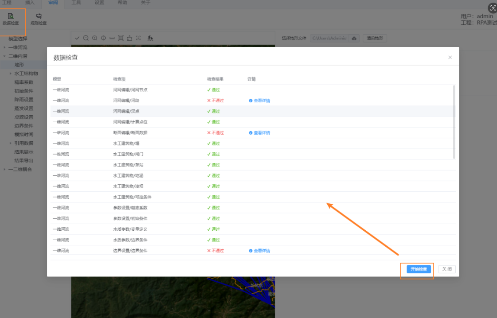
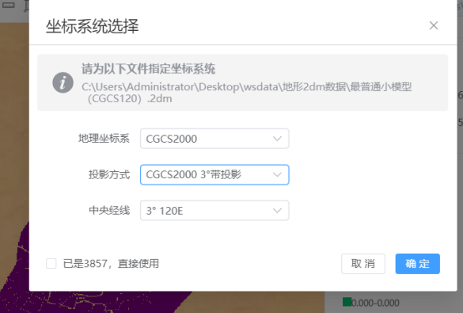

#  GIS 体系搭建：学习版讲解、需求演进与代码阅读路线

这份文档覆盖原来的“面试讲解”文档，但定位改成学习文档。也就是说，它不是让你背一段漂亮话，而是帮你把“GIS 体系搭建”这条简历背后的代码、需求、演进顺序和实现思路重新学明白。

本次分析遵循一个原则：以你的简历需求为主线，以 Git 提交和需求复盘为证据。Git 提交只能告诉我们“当时改了哪些点”，但真正要理解的是更大的能力目标：为什么要搭 GIS 体系，体系分了哪些层，每层解决什么问题，后续 GIS 互动、图层体系、数据检查、坐标转换是怎样一层一层长出来的。

你的简历原句是：

> GIS 体系搭建：主导 GIS 地图模块代码体系建设，封装地图初始化、图层联动等核心逻辑，支持 5+ 坐标系转换，支撑 10+ 水利建模项目。

我建议你后面可以把“数据检查”也放进去，因为它不是孤立功能，而是 GIS 和建模数据进入系统前的质量保障：

> GIS 体系搭建：主导桌面端 GIS 地图模块体系建设，封装地图初始化、图层渲染、表格-地图双向联动、坐标转换与数据检查等核心能力，支持 5+ 坐标系转换，支撑水文、一维、二维、供水、水资源等 10+ 建模业务场景。

## 1. 先建立总图：GIS 体系到底解决什么问题

这个项目不是普通管理后台，而是水利建模桌面端。用户面对的不是一张表，而是一套工程数据：

- 河网、断面、河段、计算点。
- 二维地形、网格、边界、点源、站点、桥墩、闸门。
- 水文分区、水文站点、径流边界、降雨蒸发。
- 供水管网、节点、管道、水泵、阀门、水池、水库。
- 水资源水源、用水、水库、发电站、供需关系。

这些数据都有一个共同特点：它们不是纯业务字段，而是带空间位置的模型对象。所以 GIS 在这个项目里不是“地图组件”，而是业务基础设施。它至少要解决五类问题：

1. 地图如何初始化，谁负责持有 Cesium 实例。
2. 业务页面如何调用地图能力，而不是每个页面都直接写 Cesium。
3. 表格数据和地图实体如何互相定位、互相高亮。
4. 多模型、多图层、多对象如何统一显示、隐藏、清除。
5. 外部数据导入时，坐标系和数据质量如何保证。

可以把整个体系理解成五层：

```text
业务页面层
  水文、一维、二维、供水、水资源等页面

业务互动层
  表格 -> 地图定位，高亮，飞行
  地图 -> 表格反查，选中，编辑

图层调度层
  LayerPanel -> layerStore -> views/index.vue -> LayerRenderer

地图能力层
  MapLayer.vue -> Earth -> layerCore / gisEditorCore

基础保障层
  坐标转换、数据检查、老工程兼容、大文件/大网格性能优化
```

学习的时候不要一开始就扎进某一个 `renderTwoDimensionalStationLayer` 或某一个提交。先把这个分层记住，后面的代码才不会散。

## 🍂2. 第一阶段：基础 GIS 体系

这一阶段解决的是“地图能力如何被统一创建、统一暴露、统一复用”。你提到的 `Store`、`MapLayer`、`NodeOperation`，大致都属于这个阶段。

### 2.1 基础 GIS 体系的核心目标

最早要解决的问题是：多个业务页面都要用地图，但不能每个页面都初始化地图，也不能每个页面都直接调用 Cesium 底层 API。

所以基础 GIS 体系要做的第一件事，就是把地图能力集中起来：

```text
layerCore/layer.ts
  负责创建 Earth 和 Cesium Viewer

views/MapLayer/index.vue
  负责作为 Vue 层地图门面，把 Earth 能力包装成页面可调用的方法

views/index.vue
  负责把 mapLayer 和 layerRenderer provide 给业务页面

业务页面
  通过 inject('mapLayer') 或 inject('layerRenderer') 使用地图能力
  ┌─────────────────────────────────────────────────────────────────────────┐
│                          layerCore/layer.ts                             │
│                         InitEarth - Cesium初始化入口                      │
│  - 创建 Cesium Viewer                                                 │
│  - 创建全局 Earth 对象，挂载各类图层管理器                                │
└─────────────────────────────────────────────────────────────────────────┘
									↓ ↑
									┌─────────────────────────────────────────────────────────────────────────┐
│                         MapLayer/index.vue (4404行)                       │
│  - Cesium地图门面，定义70+地图操作方法                                   │
│  - 地图工具栏按钮（放大/缩小/测距/测面/定位...）                         │
│  - 图层面板 LayerPanel 挂载点                                          │
│  - defineExpose: drawPointEl, selectedStationElement, setPointClickCallback...
└─────────────────────────────────────────────────────────────────────────┘
                                    ↓ ↑
┌─────────────────────────────────────────────────────────────────────────┐
│                           地图主视图层                                    │
│                         views/index.vue                                  │
│  - provide('mapLayer', mapLayerRef)                                    │
│  - provide('layerRenderer', layerRenderer)                              │
│  - watch visibleLayers → showLayer / hideLayer                         │
└─────────────────────────────────────────────────────────────────────────┘
                                    ↓ ↑
  ┌─────────────────────────────────────────────────────────────────────────┐
│                           业务页面层                                    │
│  (水文/一维/二维/供水/水资源 的各个 Engineer/*/index.vue)              │
│  - inject('mapLayer') 获取地图能力                                       │
│  - inject('layerRenderer') 获取图层渲染器                                 │
└─────────────────────────────────────────────────────────────────────────┘

```

根据代码分析，我来解释 `earth` 对象的创建过程：

#### 1. Cesium Viewer 是什么

`Cesium.Viewer` 是 **Cesium 3D 地理信息可视化库**的核心类，用于创建一个可交互的 3D 地球视图。它由 `cesium` npm 包提供，集成了 WebGL 渲染、地图交互、影像加载等功能。

#### 2. 全局 Earth 对象的创建过程

在 `layer.ts` 中，全局 `Earth` 对象的创建流程如下：

```1:18:src/layerCore/layer.ts
const _earth = {}

export const Earth: any = _earth
```

首先创建一个空对象作为容器，然后导出为全局对象。

#### 3. InitEarth 函数（真正的初始化逻辑）

```24:50:src/layerCore/layer.ts
export function InitEarth(earthContainer, globalStore?: any, router?: any) {
  const DEFAULT_CESIUM_CONFIG: object = {
    // 关闭所有默认UI控件
    vrButton: false,
    animation: false,
    // ... 其他配置
    // 使用 ArcGIS 影像作为底图
    imageryProvider: new ArcGisMapServerImageryProvider({
      url: 'https://elevation3d.arcgis.com/arcgis/rest/services/World_Imagery/MapServer'
    })
  }
  // 创建 Cesium Viewer 实例
  const viewer: any = new Viewer(earthContainer, DEFAULT_CESIUM_CONFIG)
```

关键步骤：

1. 定义 Cesium 配置（关闭默认控件，使用 ArcGIS 影像）
2. `new Viewer(containerId, config)` 创建 viewer 实例
3. 将 viewer 挂载到全局 Earth 对象

#### 4. 挂载各类管理器

```59:107:src/layerCore/layer.ts
  Earth.viewer = viewer
  
  // 挂载各种图层管理器
  Earth.imageryControl = new LayerColtrol(viewer)        // 影像控制
  Earth.imageryMeasure = new LayerMeasure(viewer)        // 测量工具
  Earth.imageryWatercourse = new LayerWatercourse(viewer)  // 河道管理
  Earth.imageryWaterlogTerrain = new LayerWaterlogTerrain(viewer, ...)  // 内涝地形
  Earth.imageryWaterlogResultRendered = new LayerWaterlogResultRendered(viewer)  // 时刻渲染
  Earth.layerCommon = new LayerCommon(viewer, router, globalStore)  // 通用图层
```

#### 5. 调用位置

在 `MapLayer/index.vue` 的 `onMounted` 钩子中：

```180:601:src/views/MapLayer/index.vue
    <div id="cesiumContainer" class="cesium-container">
      <!-- 地图容器 -->
    </div>

onMounted(() => {
  InitEarth('cesiumContainer', globalStore, router)
```

#### 总结


| 概念                | 说明                          |
| ----------------- | --------------------------- |
| **Cesium Viewer** | Cesium 库的核心类，创建 3D 地球可视化实例  |
| **_earth**        | 一个空的 JS 对象，作为全局命名空间         |
| **Earth**         | 导出的全局对象，挂载了 `viewer` 和各种管理器 |
| **InitEarth**     | 初始化函数，创建 viewer 并填充各种功能模块   |


整个架构是一个**模块化设计**：将 Cesium 的 viewer 和各种功能管理器都集中挂载到 `Earth` 全局对象上，方便其他组件通过 `import { Earth } from '@/layerCore/layer'` 直接访问。

### 2.2 `layerCore/layer.ts`：真正的地图初始化入口

代码位置：

- `wc-master/wch_hydro1d/src/renderer/src/layerCore/layer.ts`
- 关键点：`InitEarth`

`InitEarth` 可以理解为地图底层启动器。它负责创建 Cesium Viewer，并把不同类型的图层能力挂到全局 `Earth` 对象上。

> `Cesium.Viewer` 是 Cesium 3D 地理信息可视化库的核心类，用于创建一个可交互的 3D 地球视图。它由 `cesium` npm 包提供，集成了 WebGL 渲染、地图交互、影像加载等功能。

它的意义不是“初始化一个地图容器”这么简单，而是让后续所有业务都有共同的底层地图上下文。比如水系、地形、公共点线面、二维结果、地图事件，都可以挂到同一个 `Earth` 上。

学习时你可以这样理解：

```text
InitEarth(containerId, globalStore, router)
  -> 创建 Cesium Viewer
  -> 创建 Earth
  -> 初始化不同 layerCore 能力
  -> 让 MapLayer.vue 后续可以通过 Earth 调用具体地图能力
```

这一层偏底层，不适合一开始就逐行读。你先知道它负责“地图世界的创建”就够了。

#### 这些类名都是项目自己定义的，不是 Cesium 原生的

**1. LayerControl - 地图交互控制**

负责地图的基础交互功能：

- `zoomInControl()` / `zoomOutControl()` - 放大缩小
- `normalColtrol()` - 恢复正常交互模式
- 处理鼠标事件和光标样式

**2. LayerMeasure - 测量工具**

提供测距和测面积功能：

- `distanceMeasure()` - 测距
- `areaMeasure()` - 测面积
- 使用 `CallbackProperty` 动态绘制测量线

**3. LayerWatercourse - 河道管理**

河道相关的核心业务逻辑（约 3000+ 行）：

- 河道新增、编辑、清除
- 河道搜索（searchPool）
- 河道实体管理（riverEntityArray）
- 分叉点计算（branchingPoints）
- 里程标注（chainageLabels）
- 区域管理（regionManager）
- 使用 turf.js 进行空间分析（判断点是否在多边形内、最近点计算）

**4. LayerWaterlogTerrain - 内涝地形**

地形文件的解析与渲染：

- 解析自定义格式的地形文件（`.ter` 格式）
- 内部类：`Point`、`Side`、`Grid`、`TerrainUtils`
- 使用 R-Tree（rbush）做空间索引加速查询
- 渲染网格地形到 Cesium

**5. LayerWaterlogResultRendered - 结果渲染**

积水/流速模拟结果的可视化渲染：

- `frameCache` / `colorCache` - 帧缓存
- Web Worker（`frameParserWorker.ts`）- 后台解析结果文件
- 支持时间动画播放（`timeInterval`）
- 根据数值范围映射颜色（热力图效果）

**6. LayerCommon - 通用图层功能**

最基础的通用功能集合：

- `PointInfo` 类管理点位信息
- `pointManager` - 点要素管理
- `HIGHLIGHT_CONFIG` - 统一高亮样式配置（普通点、站点、二维结构物）
- 事件总线 `eventBus` 通信

```
┌────────────────────────────────────────────────────────────────────┐
│ LayerCommon.pointManager                                         │
│ - 通用点管理，不区分业务类型                                    │
│ - 统一的事件分发 (eventBus)                                     │
│ - 统一的高亮配置 HIGHLIGHT_CONFIG                               │
│ - 地图点击 → dispatchEventOnClick → eventBus 触发业务回调         │
└────────────────────────────────────────────────────────────────────┘
```

**7. LayerImages - 底图切换**

管理切换不同地图服务：

- 天地图（tdt）- 影像/矢量/标注
- 高德地图（gd）
- Mapbox
- ArcGIS
- 使用 `WebMapTileServiceImageryProvider` / `UrlTemplateImageryProvider`

**8. LayerUtils - 工具函数**

纯函数工具库：

- `CoordPos()` - 飞行到指定坐标
- `C3ToDe()` - Cartesian3 转经纬度
- `toTurfPoint/Line/Polygon()` - Cesium → Turf.js 格式转换
- `getNearestPoint()` - 最近点计算
- `getArea()` - 面积计算

**9. LayerOpeningWorks - 水利工程渲染**

打开工程文件后的渲染逻辑：

- `renderPointElement()` - 渲染点要素
- `renderPolylineElement()` - 渲染线要素
- `drawPoint/drawPolyline/drawLabel()` - 基础绘制

#### Cesium 真正的原生概念

Cesium 中真正存在的类似概念是：

- `viewer.imageryLayers` - **影像图层集合**（Cesium 原生，管理底图）
- `viewer.entities` - **实体集合**（Cesium 原生，用于绘制点线面）
- `viewer.scene` - **场景对象**（Cesium 原生，场景配置）

**项目的封装思路**

```
Cesium 原生能力
├── viewer.imageryLayers (底图管理)
├── viewer.entities (实体绘制)
└── viewer.scene (场景配置)

项目自定义封装
├── LayerColtrol     → 封装鼠标交互、缩放等地图操作
├── LayerMeasure     → 封装测距、测面功能
├── LayerWatercourse → 封装河道相关的业务逻辑
├── LayerWaterlogTerrain → 封装内涝地形相关
└── LayerWaterlogResultRendered → 封装结果渲染
```

#### layer.ts 如何引入其他 Layer 文件

所有 Layer 管理器共享同一个 `Cesium Viewer` 实例，各自封装不同的地图能力。

```
// layer.ts 第2-7行
import LayerColtrol from './LayerControl'           // 鼠标操作
import LayerMeasure from './LayerMeasure'           // 测距测面
import LayerWatercourse from './LayerWatercourse'   // 河道
import LayerWaterlogTerrain from './LayerWaterlogTerrain'  // 内涝地形
import LayerWaterlogResultRendered from './LayerWaterlogResultRendered'  // 结果渲染
import LayerCommon from "./LayerCommon";           // 通用能力

// InitEarth 函数内（第86-107行）
export function InitEarth(earthContainer, globalStore?, router?) {
  const viewer = new Viewer(earthContainer, DEFAULT_CESIUM_CONFIG)
  Earth.viewer = viewer  // 共享同一个 viewer

  // 每个 Layer 管理器都持有同一个 viewer 实例
  const imageryControl = new LayerColtrol(viewer)
  Earth.imageryControl = imageryControl

  const imageryMeasure = new LayerMeasure(viewer)
  Earth.imageryMeasure = imageryMeasure

  const imageryWatercourse = new LayerWatercourse(viewer)
  Earth.imageryWatercourse = imageryWatercourse

  const layerCommon = new LayerCommon(viewer, router, globalStore)
  Earth.layerCommon = layerCommon

  // ... 等等
}
```

### 2.3 `MapLayer/index.vue`：Vue 业务世界和 Cesium 世界之间的门面

代码位置：

- `wc-master/wch_hydro1d/src/renderer/src/views/MapLayer/index.vue`
- `601` 行附近调用 `InitEarth('cesiumContainer', globalStore, router)`
- `4244` 行附近 `defineExpose`

`MapLayer.vue` 是基础 GIS 体系里最重要的文件。它承上启下：

- 向下，它调用 `Earth` 和 `layerCore` 里的地图能力。
- 向上，它通过 `defineExpose` 把业务页面需要的方法暴露出去。

典型暴露方法包括：

- `drawPointEl`：进入绘点模式，让用户在地图上点选位置。
- `addRegionElement`：添加水文分区、区域面等面对象。
- `addPoint`：添加点对象。
- `selectedRegionElement`：选中区域面对象。
- `selectedStationElement`：选中站点对象。
- `setPointClickCallback`：给地图点绑定点击回调，让地图点击能反向通知业务页面。

你可以把 `MapLayer.vue` 想成一个“地图遥控器”。业务页面并不直接知道 Cesium 怎么创建 entity、怎么注册 click handler、怎么选中 primitive。业务页面只知道：

```ts
mapLayer.drawPointEl(...)
mapLayer.addPoint(...)
mapLayer.selectedStationElement(...)
mapLayer.setPointClickCallback(...)
```

这样做的价值很大：

- 业务页面写法统一。
- 地图底层变化时，主要改 `MapLayer.vue` 和 `layerCore`。
- 供水、水资源、水文、二维站点等模块可以复用同一批 API。

现在我清楚了，让我用图示对比 **layerCore** 和 **MapLayer** 的关系和区别：

---

#### layerCore vs MapLayer：职责对比


| 对比维度     | **layerCore/*.ts**    | **MapLayer/index.vue**         |
| -------- | --------------------- | ------------------------------ |
| **定位**   | 纯TypeScript类，不依赖Vue   | Vue组件，依赖Vue生态                  |
| **职责**   | 封装Cesium底层API的**实现层** | 作为**门面层**，暴露API给业务页面           |
| **方法来源** | 直接调用Cesium API        | 调用Earth对象（Earth = layerCore实例） |
| **状态管理** | 类内部状态                 | Vue ref/reactive状态             |
| **事件绑定** | Cesium事件              | 工具栏按钮、对话框等UI                   |


---

**具体例子**

MapLayer 中的方法（门面/代理）

```typescript
// MapLayer/index.vue 第2740-2743行
const addPoint = (data, callback) => {
  // 直接委托给 layerCore 的实现
  Earth.imageryWatercourse.addPoint(data, callback)
}

// MapLayer/index.vue 第2755-2757行
const selectedRegionElement = (gisInfo) => {
  Earth.imageryWatercourse.selectedRegionElement(gisInfo)
}

// MapLayer/index.vue 第2718-2720行  
const deletePointElement = (pointInfo) => {
  Earth.layerCommon.deletePointElement(pointInfo)
}
```

**特点**：MapLayer中的方法基本是**一层薄薄的代理**，不做复杂逻辑，只是转发调用。

---

layerCore 中的实现（真正的逻辑）

```typescript
// layerCore/LayerCommon.ts - 真正的删除逻辑
deletePointElement(pointInfo) {
  // 1. 从 entities 中移除点实体
  const pointEntity = this.viewer.entities.getById(pointInfo.pointID)
  if (pointEntity) {
    this.viewer.entities.remove(pointEntity)
  }
  
  // 2. 从 entities 中移除标签实体
  const labelEntity = this.viewer.entities.getById(pointInfo.labelID)
  if (labelEntity) {
    this.viewer.entities.remove(labelEntity)
  }
  
  // 3. 从数组中清理记录
  this.pointElementArray = this.pointElementArray.filter(...)
}
```

---

#### 为什么需要两层？

```
业务页面
    ↓ inject('mapLayer')
MapLayer (Vue组件)
    ↓ 调用
Earth.imageryWatercourse / Earth.layerCommon (layerCore实例)
    ↓ 调用
Cesium Viewer (原生API)
```

**原因**：

1. **解耦业务和底层**
  - 业务页面不需要知道Cesium的entity怎么删
  - 只需要调用 `mapLayer.deletePointElement(pointInfo)`
2. **统一接口**
  - 所有业务页面都用相同的方法名
  - 底层换Cesium实现，业务代码不用改
3. **Vue组件能力**
  - MapLayer需要处理UI（工具栏按钮、对话框）
  - layerCore是纯逻辑，不能有UI

**总结一句话**

- **layerCore** = **"怎么做"**（真正的Cesium操作实现）
- **MapLayer** = **"暴露什么"**（给业务页面提供简洁的调用入口）

### 2.4 `views/index.vue`：地图能力的注入点

代码位置：

- `wc-master/wch_hydro1d/src/renderer/src/views/index.vue`

根视图把地图能力提供给子页面：

```ts
import MapLayer from './MapLayer/index.vue'
provide('mapLayer', mapLayerRef)
provide('layerRenderer', layerRenderer)
```

这一步非常关键。它说明地图不是某个业务页面的私有组件，而是整个建模工作台的共享能力。

业务页面通过 `inject('mapLayer')` 取到地图门面，通过 `inject('layerRenderer')` 取到图层渲染器。这样就形成了一个稳定结构：

```text
根视图创建并持有地图引用
  -> provide 给所有业务页面
  -> 业务页面 inject
  -> 业务页面调用统一地图 API
```

> 你以后讲“地图模块代码体系建设”时，第一层就可以讲这个结构。不是说“我写了几个地图方法”，而是说“我把地图能力从业务页面中抽离，变成全局可注入、可复用的基础能力”。

### 2.5 `NodeOperation`：早期业务地图编辑能力

代码位置：

- `wc-master/wch_hydro1d/src/renderer/src/gisEditorCore/NodeOperation.ts`

`NodeOperation` 更像业务地图编辑器。它负责“用户在地图上创建、编辑、连接业务节点”这类交互。

比如：

- `setNode(callback)`：进入节点创建模式，用户点地图后生成节点对象，再回调给业务。
- `addPoint(coord, style)`：把某个业务节点画成地图点。
- `setNodesRelation(callback)`：进入关系绘制模式，让用户在地图上创建节点之间的连线。

它和 `MapLayer` 的关系可以这样理解：

```text
MapLayer
  更偏通用地图门面，提供业务页面常用 API

NodeOperation
  更偏某一类业务编辑器，封装节点创建、节点关系、业务样式等编辑逻辑
```

你提到的早期体系里有 `Store`、`MapLayer`、`NodeOperation`，可以理解为：

```text
Store
  保存业务数据，比如节点列表、关系列表、地形信息、水文分区等

MapLayer
  提供通用地图能力，比如画点、画面、选中、高亮、点击回调

NodeOperation
  把具体业务编辑动作包装起来，比如创建节点、创建关系、按业务类型绘制样式
```

NodeOperation 是独立的业务编辑器，它不在 layerCore 体系内。


| 对比项   | layerCore      | NodeOperation                        |
| ----- | -------------- | ------------------------------------ |
| 初始化方式 | InitEarth 统一创建 | 动态 import + new                      |
| 挂载位置  | Earth 全局对象     | WaterSupplyEditor / WaterBasinEditor |
| 职责    | 通用地图能力         | 业务节点编辑                               |
| 生命周期  | 应用启动即存在        | 按需初始化                                |


NodeOperation 更像业务工具类，专门处理"供水节点-管道-泵站"这类有网络拓扑关系的对象。

### 2.6 第一阶段的学习重点

这一阶段你要学懂的不是某一个函数，而是“地图能力的控制权在哪里”。

建议阅读顺序：

1. `views/index.vue`
    先看 `mapLayerRef` 和 `layerRenderer` 怎么被提供出去。
2. `views/MapLayer/index.vue`
3. `layerCore/layer.ts`
    最后看 `InitEarth` 如何创建底层 `Earth`。
4. `gisEditorCore/NodeOperation.ts`
    只挑 `setNode`看，理解地图编辑动作怎么回调业务。

学完这一层，你就能回答：

- 为什么业务页面不用直接操作 Cesium？
- 地图实例在哪里初始化？
- 业务页面怎么拿到地图能力？
- 点、面、区域、站点这些通用地图动作在哪里封装？

#### 回答

**0.NodeOperation.ts中地图编辑动作如何回调业务?**

```js
// NodeOperation.ts:47-82
setNode(callback) {
    let m = this;
    console.log('[NodeOperation] setNode 被调用');
    m.removeHandler();  // 清除之前的handler
    
    // 改变鼠标样式为十字丝
    m.viewer['_container'].style.cursor = 'crosshair'
    
    // 创建屏幕空间事件处理器
    m.handler = new ScreenSpaceEventHandler(m.viewer.canvas);
    
    // 设置左键点击事件
    m.handler.setInputAction(function (evt) {
        console.log('[NodeOperation] 地图点击事件触发', evt);
        
        // 从椭球体获取点击位置（而非地形表面）
        let pickedPos = m.viewer.camera.pickEllipsoid(
            evt.position,
            m.viewer.scene.globe.ellipsoid
        );
        
        if (pickedPos) {
            // 坐标转换：笛卡尔 → 经纬度
            let coord = m.C3ToDe(pickedPos);
            // 坐标转换：WGS84 → 3857
            let coord3857 = m.deTo3857(coord.lon, coord.lat);
            
            m.nodeID++;
            
            // 构造 gisNodeObject
            const gisNodeObject = {
                id: m.nodeID,
                coord: coord,        // WGS84坐标 {lon, lat}
                coord3857: coord3857 // 3857坐标 [x, y]
            };
            
            console.log('[NodeOperation] 准备回调，gisNodeObject:', gisNodeObject);
            
            // 移除handler，停止监听
            m.removeHandler();
            
            // 【关键】回调给业务方
            callback(gisNodeObject);
        }
    }, ScreenSpaceEventType.LEFT_CLICK);
}
```

```js
// 水资源节点添加示例
const handleAddNode = () => {
    // 1. 进入绘点模式
    waterBasinNodeOperation.setNode((gisNodeObject) => {
        // 2. 回调中拿到坐标
        console.log('用户点击的坐标:', gisNodeObject.coord)
        console.log('3857坐标:', gisNodeObject.coord3857)
        
        // 3. 调接口创建节点
        createNode({
            x: gisNodeObject.coord3857[0],
            y: gisNodeObject.coord3857[1],
            type: selectedWaterResourceType.value
        }).then((res) => {
            // 4. 接口返回真实业务ID
            const realNodeId = res.data.id
            
            // 5. 回显到地图
            waterBasinNodeOperation.reviewNode(
                { coord: gisNodeObject.coord },
                realNodeId,
                res.data.name,
                'waterResourceNode'
            )
        })
    })
}
```

> 不要想的太复杂，咱们举了两段代码，我就叫小一小二，小二调用小一时传入了一个函数，箭头函数，然后你看小一正好也是参数里需要函数参数，然后在最后它会用这个参数，这个参数叫callback而已。

**1. 为什么业务页面不用直接操作 Cesium？**

因为有**5层隔离**：


| 层级  | 文件                   | 职责         |
| --- | -------------------- | ---------- |
| 第1层 | `index.vue` provide  | 根组件注入能力    |
| 第2层 | `MapLayer/index.vue` | 封装70+个业务方法 |
| 第3层 | `defineExpose`       | 对外暴露受控API  |
| 第4层 | `layerCore/layer.ts` | 底层Cesium封装 |
| 第5层 | `NodeOperation`      | 业务编辑逻辑     |


业务页面只需要 `inject('mapLayer')` 然后调用 `addPointElement()` 这样的高层方法，**永远不接触 `new Viewer()` 或 `viewer.entities.add()`**。

---

**2. 地图实例在哪里初始化？**

```typescript
// MapLayer/index.vue 第601行
onMounted(() => {
  InitEarth('cesiumContainer', globalStore, router)  // ← 地图实例在这里初始化
})
```

`InitEarth` 会创建唯一的 `Viewer` 并存入全局 `Earth.viewer`，所有其他类（LayerControl、LayerCommon、NodeOperation）都持有这个 viewer 的引用。

**问（很长的问）：为什么在layer.ts 中已经创建全局 Earth 对象，并且用InitEarth 函数初始化 Earth 对象，**

**而在MapLayer中还要初始化，**

**这是就该这么写，还是说这个代码的错误性？毕竟这个项目本身它是有很多失误的。**

```
// 1. 导入 Earth

import { Earth, InitEarth } from '../../layerCore/layer'

// 2. 在 onMounted 中初始化

onMounted(() => {

  InitEarth('cesiumContainer', globalStore, router)

})
```

答复：这不是错误，而是延迟初始化模式，`InitEarth` 需要一个已经存在的DOM容器（`cesiumContainer`），但这个容器只有在 `MapLayer` 组件挂载后才会存在：

```
<!-- MapLayer/index.vue 模板中 -->
<div id="cesiumContainer" class="cesium-container">
```

```
1. layer.ts 加载
   └── Earth = {} (空对象，只是声明了结构)
   
2. MapLayer 组件挂载 (onMounted)
   └── InitEarth('cesiumContainer', ...) 
       └── 此时 #cesiumContainer DOM 才存在
       └── Earth.viewer = new Cesium.Viewer(...)
```

```
// 类似于 Vue 的 createApp + mount 分离
const app = createApp(App)  // 声明应用
app.mount('#app')           // 等 DOM 就绪后挂载
```

---

**3. 业务页面怎么拿到地图能力？**

```typescript
// 业务页面（如 HydrologicRegion/index.vue）
const mapLayer = inject('mapLayer')

// 点击表格行 → 高亮地图上的区域
tableRowClick(row) {
  unref(mapLayer).selectedRegionElement(row.gisInfo)
}
```

```typescript
// 地图点击 → 选中表格行
mapLayer.onMapRegionClick(entity) {
  tableStore.setSelectedRow(entity.note.pid)
}
```

---

**4. 点、面、区域、站点这些通用地图动作在哪里封装？**

在 `MapLayer/index.vue` 的 `defineExpose` 里，约70个方法：

```typescript
defineExpose({
  // 点
  drawPointEl, addPointElement, reviewPointElement, selectedPointElement,
  // 面/区域
  addRegionElement, reviewRegionElement, selectedRegionElement,
  // 站点
  addStationElement, reviewStationElement, selectedStationElement,
  // 河段
  reviewWatercourse, heightLightRiver,
  // 测距测面
  measureLength, measureArea,
  // 飞向
  flyToPoint, flyToBounds, flyToBoundary,
  // ... 还有很多
})
```

这些方法内部调用 `Earth.layerCommon`（通用能力）或 `Earth.nodeOperation`（业务编辑能力）。

---

## 🌴3. 第二阶段：GIS 互动

基础 GIS 体系搭好后，第二阶段就要解决"业务数据和地图实体怎么互相联动"。

这就是你说的 GIS 互动。它不是单纯点击地图，也不是单纯表格高亮，而是一套双向数据绑定模式：

```text
表格数据 <-> 地图实体
业务 Store -> 地图回显
地图点击 <-> 业务页面选中
```

### 第二阶段衔接说明

第一阶段我们搭好了地图能力的底层：

- `InitEarth` 创建 Cesium Viewer
- `MapLayer` 暴露统一的地图 API
- `provide/inject` 把能力注入业务页面

第二阶段要解决的是：**这些地图能力怎么和业务数据联动**。

关键问题是：当我们把一个"站点"画到地图上，它就变成了一个实体。但这个实体 和 业务页面里的数据对象 是两个世界的东西。怎么让它们互相找到对方？

答案就是：`gisInfo` 作为桥梁 + `eventBus` 作为事件通道。

---

### EventBus 的完整发布-订阅流程

EventBus 是一个发布-订阅模式的实现，用于解决组件之间的通信问题。

在这个项目里，它解决的是：地图点击了某个实体，怎么通知到对应的业务页面。

三核心方法：on → emit → off，分别对应发布、订阅、取消。

**设计思路**：

```js
// 1.地图监听到点击后发布事件
// 点击地图 → 识别实体类型 → emit 对应事件
    eventBus.emit(EntityEventType.GATE_CLICK, eventData);
    break;


// 2. 业务页面订阅事件
onMounted(() => {
  eventBus.on(EntityEventType.GATE_CLICK, handleGateClick);
});

// 3. 页面卸载时取消订阅
onUnmounted(() => {
  eventBus.off(EntityEventType.GATE_CLICK, handleGateClick);
});

// 4. 处理点击事件
const handleGateClick = (eventData) => {
  // eventData.data 就是业务数据 { id, name }
  // 找到表格中对应的行，选中它
  highlightTableRow(eventData.data.id);
};
```

### 双向互动的时序

需要说明的是：实体创建出来只是"绘制"，默认是不高亮的。

地图监听在绘制之前就已经开启了。

```
1. InitEarth() 执行
       ↓
2. bindClickListener() 启动，开始监听  ← 监听先开启
       ↓
同步2 业务页面加载，后端返回数据（包含 gisInfo）
       ↓
同步2 根据 gisInfo 和业务数据创建 entity（用到drawpoint）
      ← gisInfo.pointID = entity.id
      ← entity.properties.type = 'gate'
      ← entity.properties.data = { id: 1, name: '闸门1' }
       ↓
3. 用户点击地图上的点，scene.pick() 拾取到实体
       ↓
4. dispatchEventOnClick()
      ├── 从 entity 拿到类型和业务数据
      └── eventBus.emit(事件名, eventData)
       ↓
5. 业务页面收到事件，从 eventData.data.id 找到对应的行
```

**关键点**：

- 后端返回的数据里就带着 gisInfo（和业务数据）
- 绘点时用 gisInfo 的坐标和 ID 创建 entity
- 点击地图时，从 entity.properties.data（从 gisInfo 里拿的）拿到业务 ID，用这个 ID 找到对应的行

---

### 3.1 核心问题：双向互动是怎么实现的

**表格点击 → 地图高亮** 和 **地图点击 → 表格选中**，这两件事的核心都是：**如何让地图实体和业务数据互相找到对方**。

答案就是：**gisInfo 作为 entity 的"说明书"** + **eventBus 作为事件通道**。

我们从后端返回来的数据是gisinfo，而这种数据它必须要转化为cesium世界的实体（drawpoint），才能在地图上进行操，如果你还想要通过实体的操作去让具体的页面获取到数据，那就需要eventBus。

---

### 3.2 监听机制：地图点击是如何被监听到的

地图点击监听发生在 `LayerCommon.ts` 的 `bindClickListener()` 方法中：

```typescript
// src/layerCore/LayerCommon.ts 第115-130行
bindClickListener() {
  const _this = this;
  this.viewer.screenSpaceEventHandler.setInputAction(function (movement: any) {
    // scene.pick 根据屏幕坐标获取3D对象
    const pickedObject = _this.viewer.scene.pick(movement.position);
    
    if (pickedObject && pickedObject.id) {
      const entity = pickedObject.id;
      // 清除之前的高亮
      if (typeof _this._clearNodeOperationHighlight === 'function') {
        _this._clearNodeOperationHighlight();
      }
      // 高亮被点击的实体
      _this.highLightEntity(entity);
      // 分发事件
      _this.dispatchEventOnClick(entity, movement);
    }
  }, ScreenSpaceEventType.LEFT_CLICK);
}
```

**流程拆解**：

```text
用户点击地图
  → Cesium screenSpaceEventHandler 捕获 LEFT_CLICK
  → viewer.scene.pick() 获取点击位置的实体
  → highLightEntity() 高亮实体
  → dispatchEventOnClick() 分发事件
```

虽然监听是发生在绘制之前的，也就是说绘制了之后这个点才有意义，但是等用户一般去点的时候，其实这个时候已经绘制完毕了，所以说这个点是有业务数据的，比如type:gate。

---

### 3.3 分发机制：实体类型如何映射到事件

`dispatchEventOnClick()` 方法负责把点击的实体转换为对应事件：

```typescript
// src/layerCore/LayerCommon.ts
dispatchEventOnClick(entity, movement) {
  // 从 entity.properties 提取 type，根据 type 找到对应事件名
  const entityType = entity.properties.type?.getValue();
  if (!entityType) return;

  // 事件名映射表
  const eventNameMap = {
    'reach': EntityEventType.REACH_CLICK,
    'gate': EntityEventType.GATE_CLICK,
    'weir': EntityEventType.WEIR_CLICK,
    'oneDimensionalStation': EntityEventType.ONE_DIMENSIONAL_STATION_CLICK,
    'branch': EntityEventType.BRANCH_CLICK,
    'calculatedPoint': EntityEventType.CALCULATED_POINT_CLICK,
    // ... 其他类型
  };

  const eventName = eventNameMap[entityType];
  if (eventName) {
    // 只传 entity，业务层自己从 entity 取数据
    eventBus.emit(eventName, {
      entity,                    // Cesium 实体引用，包含 type 和 data
      position: movement.position  // 屏幕坐标（像素位置）
    });
  }
}
```

```js
//业务端会 eventBus.on(EntityEventType.GATE_CLICK, handleGateClick); 
```

事件命名规范，用冒号分隔的层级结构，让事件名自描述。

**好处：**

**自文档化** - 看事件名就知道是什么

**避免冲突** - 如果项目里还有其他类型的事件

**统一规范** - 所有GIS实体事件都用这个前缀

## 'entity:station:click'    // 站点点击

### 3.5 实体创建时如何带上类型信息

关键设计：entity 创建时会带上 `properties.type` 和 `properties.data`。这是 eventBus 能工作的前提。

---

```typescript
//"绘点"在代码里可能叫 `drawPoint`、`drawPointV2`、`addStationElement` 等，但本质上就是一件事
function drawPoint(gisInfo, entityEventData) {

  // 1. 用 gisInfo 的坐标创建位置
  const coord = Cartesian3.fromDegrees(gisInfo.pointDE[0], gisInfo.pointDE[1])

  // 2. 创建 entity
  return viewer.entities.add({
    id: gisInfo.pointID,        // ← 用 gisInfo.pointID 作为 entity 的 id
    position: coord,
    point: { color, size },
    // 3. 设置 properties，用于事件分发
    properties: {
      type: entityEventData?.type,  // ← 来自业务层：'gate'、'station' 等
      data: entityEventData?.data   // ← 来自业务层：{ id, name } 等
    }
  });
}
```

```
根据 gisInfo 的描述
    ↓
在地图上创建一个 entity（点）
    ↓
返回创建好的 entity
```

**这样设计的好处**：

- 点击地图时，能从 entity.properties 拿到 type 和 data
- eventBus 分发时能知道是什么类型的点、业务 ID 是多少
- 业务页面收到事件后能精确找到对应的行

---

### 3.6 业务页面监听：Gates.vue 为例

```typescript
// src/views/Engineer/OneDimensionalRiver/HydraulicStructures/Gates.vue

// 处理闸门点击回调
const handleGateClick = (eventData) => {
  // eventData 包含 { entity, position }
  // 从 entity.properties 提取业务数据
  const { id, name } = eventData.entity.properties.data.getValue();
  
  // 在表格中找到对应行并选中
  highlightTableRow(id);
};

onMounted(() => {
  // 监听闸门点击事件
  eventBus.on(EntityEventType.GATE_CLICK, handleGateClick);
});

onUnmounted(() => {
  // 组件卸载时移除事件监听，防止内存泄漏
  eventBus.off(EntityEventType.GATE_CLICK, handleGateClick);
});
```

**监听 eventBus 的页面清单**：


| 页面                       | 监听事件                          | 触发动作       |
| ------------------------ | ----------------------------- | ---------- |
| Gates.vue                | GATE_CLICK                    | 表格行选中      |
| Weirs.vue                | WEIR_CLICK                    | 表格行选中      |
| Dams.vue                 | DAM_CLICK                     | 表格行选中      |
| Pumps.vue                | PUMP_CLICK                    | 表格行选中      |
| Sucks.vue                | SUCK_CLICK                    | 表格行选中      |
| Station/index.vue        | ONE_DIMENSIONAL_STATION_CLICK | 表格行选中、路由跳转 |
| BranchingPoint.vue       | BRANCH_CLICK                  | 表格行选中      |
| SectionData.vue          | CALCULATED_POINT_CLICK        | 表格行选中      |
| InitCondition.vue        | REACH_CLICK                   | 河段选中       |
| RoughnessCoefficient.vue | REACH_CLICK                   | 河段选中       |


---

### 3.7 完整互动闭环图

```
┌─────────────────────────────────────────────────────────────────────┐
│                        地图点击 → 表格选中                           │
└─────────────────────────────────────────────────────────────────────┘

用户点击地图实体
      │
      ▼
┌─────────────────────────────────────────────────────────────────┐
│ LayerCommon.bindClickListener()                                  │
│   viewer.screenSpaceEventHandler.setInputAction(LEFT_CLICK)     │
│   → viewer.scene.pick() 获取实体                                │
└─────────────────────────────────────────────────────────────────┘
      │
      ▼
┌─────────────────────────────────────────────────────────────────┐
│ LayerCommon.dispatchEventOnClick(entity)                         │
│   1. 从 entity.properties 提取 type 和 data                    │
│   2. switch(type) 映射到事件名                                  │
│   3. 构建 EntityEventData                                       │
│   4. eventBus.emit(事件名, eventData)                          │
└─────────────────────────────────────────────────────────────────┘
      │
      ▼
┌─────────────────────────────────────────────────────────────────┐
│ Gates.vue / Stations.vue 等业务页面                            │
│   eventBus.on(ENTITY_CLICK, handleClick)                       │
│   → 根据 eventData.data 找到表格行                              │
│   → setCurrentRow 选中行                                       │
│   → 可选：路由跳转、弹窗等                                      │
└─────────────────────────────────────────────────────────────────┘

┌─────────────────────────────────────────────────────────────────────┐
│                        表格点击 → 地图高亮                           │
└─────────────────────────────────────────────────────────────────────┘

用户点击表格行
      │
      ▼
┌─────────────────────────────────────────────────────────────────┐
│ 业务页面 handleRowClick(row)                                    │
│   调用 mapLayer.selectedStationElement(row.gisInfo)              │
└─────────────────────────────────────────────────────────────────┘
      │
      ▼
┌─────────────────────────────────────────────────────────────────┐
│ MapLayer.selectedStationElement()                               │
│   → Earth.layerCommon.selectedPointElement(pointInfo)            │
└─────────────────────────────────────────────────────────────────┘
      │
      ▼
┌─────────────────────────────────────────────────────────────────┐
│ LayerCommon.selectedPointElement()                              │
│   → viewer.entities.getById(pointID)                           │
│   → 修改 entity.point.color = 高亮颜色                          │
│   → 相机飞行到位置                                              │
└─────────────────────────────────────────────────────────────────┘
```

---

### 3.8 实体管理：gisInfo 的作用

`gisInfo` 是业务行和地图实体之间的桥梁：

```typescript
interface GisInfo {
  pointID: string;      // 地图实体的唯一ID
  labelID: string;      // 标签实体的ID
  pointDE: [lon, lat]; // WGS84 坐标 [经度, 纬度]
  point3857: [x, y];   // 3857 坐标 [x, y]
  type: string;         // 实体类型（用于分发事件）
}
```

**添加站点时的 gisInfo 生成流程**：

```typescript
// 业务页面添加站点
const addStation = async () => {
  // 1. 进入绘点模式
  mapLayer.drawPointEl((gisInfo) => {
    // 2. gisInfo 包含地图坐标和生成的实体ID
    // 3. 调用接口创建站点
    const station = await createStation({
      x: gisInfo.point3857[0],
      y: gisInfo.point3857[1],
      gisInfo: gisInfo  // 保存到业务数据
    });
    
    // 4. 后续可以通过 station.gisInfo 找到地图实体
  });
};

// 删除站点时
const deleteStation = async (station) => {
  // 1. 调用 mapLayer 删除地图实体
  mapLayer.deleteStationElement(station.gisInfo);
  // 2. 调用接口删除业务数据
  await deleteStationAPI(station.id);
};
```

---

### 3.9 entity vs gisInfo 完整对比

```
gisInfo（业务数据里存的）（Vue 世界）
├── pointID: "point_123"     ← 地图上这个点的唯一标识
├── pointDE: [lon, lat]      ← 经纬度坐标
├── point3857: [x, y]        ← 3857坐标
└── type: "gate"            ← 什么类型的点

entity（地图上实际显示的）（ Cesium 世界）
├── id: "point_123"          ← 用 gisInfo.pointID 作为 id
├── position: Cartesian3      ← 用 gisInfo.pointDE 转换后的坐标
├── point: { color, size }   ← 样式
└── properties: { type, data } ← 事件分发用
```


| 场景     | 流程                                                |
| ------ | ------------------------------------------------- |
| 用户新增点  | 用户在地图上点 → 生成 gisInfo → 创建 entity → gisInfo 存到业务数据 |
| 打开工程回显 | 后端返回 gisInfo → 根据 gisInfo 绘制 entity → 地图上显示       |


|      | entity             | gisInfo       |
| ---- | ------------------ | ------------- |
| 所在世界 | Cesium 地图世界        | 业务/Vue 世界     |
| 定义者  | Cesium 原生          | 项目自定义         |
| 存在位置 | `viewer.entities`  | Store 里每条业务数据 |
| 坐标   | 实体渲染坐标（Cartesian3） | 经纬度、投影坐标      |
| 保存位置 | 内存（页面刷新丢失）         | 后端（持久化）       |
| 用途   | 渲染、点击事件            | 高亮、飞行、删除      |


关键区别：

- entity 是临时的，页面刷新就没了
- gisInfo 是持久化的，存到后端，重新打开工程能恢复

---

### 3.10 第二阶段你要学会的东西

学完 GIS 互动，你要能说清楚：

- `LayerCommon.bindClickListener()` 如何统一监听地图点击
- `dispatchEventOnClick` 如何根据实体 type 分发不同事件
- `eventBus.on/emit/off` 的基本用法
- `properties.type` 和 `properties.data` 如何让实体携带业务信息
- 业务页面如何监听 `eventBus` 并选中表格行
- `gisInfo` 如何作为业务数据和地图实体的桥梁
- 为什么表格点击地图高亮和地图点击表格选中能形成闭环

这比背"我实现了 GIS 互动"有用得多。你真正要讲的是"**我把业务数据和空间实体之间的关系统一起来，通过事件总线实现了地图和表格的同步联动**"。

基础 GIS 体系搭好后，第二阶段就要解决“业务数据和地图实体怎么互相联动”。

这就是你说的 GIS 互动。它不是单纯点击地图，也不是单纯表格高亮，而是一套双向数据绑定模式。

## 🍁4. 第三阶段：图层体系

### 4.1 为什么要单独做图层体系

第三阶段真正要讲的，不是“又多了一组图层”，而是**把图层显示这件事做成一个标准链路**。可以把它理解成：业务页面只负责提出“我要显示哪些对象”，后面由状态层、监听层、渲染层、地图层依次接手，最后才真正落到 Cesium 实体。

这一阶段最值得记住的，就是它把“显隐”从“页面直接操作地图”改成了“状态驱动渲染”。

### 4.2 图层体系的调用链

第三阶段真正要讲的，不是“又多了一组图层”，而是**把图层显示这件事做成一个标准链路**。可以把它理解成：业务页面只负责提出“我要显示哪些对象”，后面由状态层、监听层、渲染层、地图层依次接手，最后才真正落到 Cesium 实体。

这一阶段最值得记住的，就是它把“显隐”从“页面直接操作地图”改成了“状态驱动渲染”。

```
┌─────────────────┐    ┌─────────────────┐    ┌─────────────────┐
│ LayerPanel.vue  │───▶│ layerStore.ts   │───▶│ index.vue       │
│ (视图层)        │    │ (状态管理)      │    │ (监听图层器)        │
└─────────────────┘    └─────────────────┘    └─────────┬───────┘
                                                        │
                                              ┌─────────▼───────┐
                                              │ LayerRenderer.vue│
                                              │ (渲染逻辑)      │
                                              └─────────┬───────┘
                                                        │
                                              ┌─────────▼───────┐
                                              │ MapLayer.vue    │
                                              │ (地图操作)      │
                                              └─────────────────┘
```

- `LayerPanel.vue`   用户勾选或取消图层
- `layerStore.ts`   维护 `visibleLayers`，更新图层树状态
- `views/index.vue`   监听 `visibleLayers` 的变化，传递`layerId`给layerRender
- `LayerRenderer.vue`   根据  `layerId` 调用具体 render / clear 逻辑
- `MapLayer.vue / layerCore`   真正向 Cesium 添加或移除实体


这里的设计重点不是“链路长”，而是**职责清楚**：

- 上层只表达意图。
- 中间层只管理状态。
- 下层只负责渲染。

这样后面新增图层时，不会把 UI、状态、地图能力全部搅在一起。

### 4.3 `LayerPanel.vue`：图层操作 UI

- `src/components/LayerManagement/LayerPanel.vue` 

  调用  `layerStore.toggleLayerVisibility(data.id)`

```js
// 用户勾选图层
layerStore.toggleLayerVisibility(data.id)
//            ↑ 只传图层 id，不把渲染细节暴露给 UI
```

UI 层只负责表达“我想显示/隐藏什么”，不负责决定“怎么画”。

也就是说，`LayerPanel` 的职责不是地图，而是用户操作入口。

### 4.4 `layerStore.ts`：图层状态中心

- `src/store/layerManagement/layerStore.ts`

最核心的变量就是 `visibleLayers`，它保存当前显示的图层 id。

`toggleLayerVisibility(layerId)` 的逻辑可以简化成这样：

```text
if (visibleLayers.includes(layerId)) {
  // 已显示 -> 移除，表示隐藏
  visibleLayers = visibleLayers.filter(id => id !== layerId)
} else {
  // 未显示 -> 加入，表示显示
  visibleLayers.push(layerId)
}
```

意义：

- 图层显隐只有一个来源。
- UI 勾选状态和地图状态可以同步。
- 后面监听和渲染都有统一入口。

### 4.5 `views/index.vue`：监听图层状态变化

代码位置：

- `src/renderer/src/views/index.vue`

根视图会监听 `layerStore.visibleLayers` 的变化，然后比较哪些图层新增了，哪些图层被移除了：

```text
新增图层 id
  -> layerRenderer.showLayer(id)

移除图层 id
  -> layerRenderer.hideLayer(id)
```

它相当于图层状态和地图渲染之间的调度器。

### 4.6 `LayerRenderer.vue`：图层渲染分发中心

代码位置：

- `src/renderer/src/components/LayerManager/LayerRenderer.vue`
- `24` 行附近：`showLayer(layerId, data)`
- `119` 行附近：`hideLayer(layerId)`

`LayerRenderer` 会根据 `layerId` **分发**到不同渲染函数。比如：

```js
// 根据 layerId 分发到不同渲染函数
renderOneDimensionalSectionLayer()
renderOneDimensionalStationLayer()
renderTwoDimensionalTerrainLayer()
renderTwoDimensionalStationLayer()
renderHydrologicRegionLayer()
renderHydrologicStationLayer()
```

这就是你简历里“图层联动”的核心。不是一个按钮触发一个函数，而是一套完整链路：

```text
用户勾选图层
  -> store 状态变化
  -> 根视图监听
  -> LayerRenderer 分发
  -> MapLayer 添加实体
  -> 地图展示
```

隐藏时也类似：

```text
用户取消图层
  -> store 状态变化
  -> 根视图监听
  -> LayerRenderer hideLayer
  -> 按 layerId 清除对应实体
```

### 4.7 图层体系和 GIS 互动的关系

图层体系不是替代 GIS 互动，而是在 GIS 互动之上增加了一层“批量回显和显隐管理”。

```text
GIS 互动
  关注单个或少量对象
  比如表格点击一个站点，地图高亮一个站点

图层体系
  关注一组对象
  比如勾选二维站点图层，把所有二维站点批量画出来
```

但是它们会共享底层能力：

- 都会调用 `mapLayer.addPoint`。
- 都会使用 `gisInfo`。
- 都需要高亮、清除、回显。
- 都依赖 `MapLayer` 暴露的统一 API。

所以你可以这样记：**GIS 互动解决“点对点联动”，图层体系解决“批量对象管理”。**

### 4.8 第三阶段你要学会的东西

学完图层体系，你要能说清楚：

- 为什么要把图层 UI、状态、渲染拆开。
- `LayerPanel`、`layerStore`、`views/index.vue`、`LayerRenderer` 各自负责什么。
- `visibleLayers` 为什么适合作为图层显隐的唯一状态来源。
- 新增一个业务图层时，大致要改哪些地方。
- 图层体系和 GIS 互动有什么区别，哪里又复用同一套地图能力。


## 🌵5. 第四阶段：数据检查

### 5.1 这一阶段和前面 GIS 体系的关系

数据检查这一阶段讲的是：这些地图对象和模型数据在进入计算前，怎么确认它们是可靠的。

- 前端发起 `/business/project/checkAll` 请求，带上所有模型数据
- 后端路由接收，分别调用三大模型的主校验函数
- 每个主校验函数逐项调用各页面的校验函数
- 各页面校验函数用辅助函数做具体校验，返回统一格式的结果
- 主校验函数合并所有页面结果，路由层合并所有模型结果
- 后端返回总结果数组，前端按页面展示每一项校验结果



### 5.2 前端如何发起校验请求

**入口**

数据检查入口在 HeaderTools 中。

- `HeaderTools/index.vue`
- 点击“数据检查”后，设置 `dataCheckVisible = true`
- 页面中通过 `<dataCheck v-model:visible="dataCheckVisible" />` 打开检查弹窗

**dataCheck.vue 组装 payload**

`dataCheck.vue` 的主要任务不是写校验规则，而是把当前工程数据整理成后端能检查的格式。

它会先创建总 payload，再根据当前工程选择的模型类型，补充一维、水文、二维数据，这里是拿一维举例。

```js
const payload = {
  projectId: globalStore.projectId
}
// 聚合一维河流模型数据
if (globalStore.modelTypes.includes('OneDimensionalRiverMenu')) {
  payload.oneDimensionalData = {
    weirs: oneDimensionalStore.weirs,
    gates: oneDimensionalStore.gates,
    pumps: oneDimensionalStore.pumps,
    sucks: oneDimensionalStore.sucks,
    dams: oneDimensionalStore.dams,
    boundaries: oneDimensionalStore.boundaryConditionData,
    simulationSetting: oneDimensionalStore.simulationSetting,
    control: oneDimensionalStore.control,
    ...
  }
}
```

**API 调用**

前端最终调用：

```ts
// 发送包含所有模型数据的 payload 到后端
checkAllProjectData(payload)
```

对应接口：

```text
POST /business/project/checkAll
```

### 5.3 后端如何接收校验数据

```text
后端数据检查文件梳理图
src
├─ routes				// 路由入口
└─ business
   └─ service
      ├─ project.js                 // 项目业务层，调用check.js的函数
      └─ utils
         └─ check
            ├─ check.js             // 数据检查总入口，统一分发三类模型校验
            ├─ checkRules.js        // 规则检查入口，处理额外的规则类校验
            ├─ hydrologic_check.js  // 水文模型校验：站点、分区等
            ├─ one_dimensional_check.js  // 一维模型校验：河网、河段、断面、边界、站点等
            └─ two_dimensional_check.js  // 二维模型校验：地形等
```

后端接收“数据检查”请求时，不是一上来就做校验，而是先把前端传来的工程数据按模型拆开，再交给不同的检查函数分别处理，最后把结果统一聚合返回。

#### 接收路由+业务层转发

**接收路由**

```js
router.post(`${bathPath}/checkAll`, projectService.checkAll)
```

`checkAll`是“全工程数据检查”的主入口。

**业务层转发**

`src/business/service/project.js`

```js
const { checkProjectNameConflict, checkAll, checkAllRules } = require("./utils/check/check");
```

`project.js` 负责对外暴露项目能力，而真正的数据检查逻辑被放到了 `utils/check/check.js` 里。

#### 拆数据

统一检查入口是：

```text
src/business/service/utils/check/check.js
```

后端收到这个 `payload` 以后，会在 `checkAll(param)` 里把三类数据拆开，再按照模型分别调用校验函数。真实逻辑如下：

```js
async function checkAll(param) {
  const { hydrologicData, oneDimensionalData, twoDimensionalData } = param
  let allResults = []

  // 首先检查一维模型
  if (oneDimensionalData) {
    const oneDimensionalResults = await checkOneDimensionalData(oneDimensionalData)
    allResults = allResults.concat(oneDimensionalResults)
  }

  // 然后检查水文模型
  if (hydrologicData) {
    const hydrologicResults = await checkHydrologicData(hydrologicData)
    allResults = allResults.concat(hydrologicResults)
  }

  // 最后检查二维模型
  if (twoDimensionalData) {
    const twoDimensionalResults = await checkTwoDimensionalData(twoDimensionalData)
    allResults = allResults.concat(twoDimensionalResults)
  }

  return allResults
}
```

这一层的重点不是校验规则本身，而是**如何把总数据拆成模型数据，再把多个模型的结果聚合成统一返回值**。

#### 聚合数据

```text
  -> 分别调用 checkOneDimensionalData / checkHydrologicData / checkTwoDimensionalData
  -> 每个check返回自己的 results
  -> concat 合成 allResults
  -> 返回给前端
```

能够这样合并，是因为每个页面级校验函数都会返回统一格式。以一维模型为例，失败和成功都通过同一套结构创建：

```js
/**
 * 创建一个标准化的检查结果对象
 * @param {string} checkKey - 检查项的键，对应前端页面
 * @param {string} detail - 详细的错误描述
 * @returns {{model: string, checkKey: string, result: string, detail: string}}
 */
function createErrorResult(checkKey, detail) {
  return {
    model: MODEL_NAME,
    checkKey,
    result: "fail",
    detail,
  }
}

function createSuccessResult(checkKey) {
  return {
    model: MODEL_NAME,
    checkKey,
    result: "success",
    detail: "",
  }
}
```

所以这一节的关键不是某条规则怎么判断，而是**后端统一了结果形状**。只要都返回 `model / checkKey / result / detail`，后端就能直接合并，前端也能直接展示。

### 5.4 单个模型的校验流程（以一维模型为例）

先看完整的一维模型校验主函数。它不是在一个函数里写完所有规则，而是先把 `oneDimensionalData` 拆成页面数据，再按页面调用具体校验函数，最后统一返回 `allResults`。

```js
async function checkOneDimensionalData(oneDimensionalData, crossModelData = null) {
  if (!oneDimensionalData) {
    return [];
  }
  const {
    network,
    reaches,
    branchingPoints,
      ...
  } = oneDimensionalData;

  let allResults = [];

  // 河网编辑
  allResults = allResults.concat(checkRiverNodes(network));
  allResults = allResults.concat(checkRiverSections(reaches, network));
  allResults = allResults.concat(checkBranchingPoints(branchingPoints, reaches));

  return allResults;
}
```

这段代码可以拆成三层看：

第一层是**拆数据**。`oneDimensionalData` 本身是前端聚合过来的大对象，后端先从里面解构出 `network`、`reaches`、`section`、`weirs`、`boundaries`、`simulationSetting` 等页面数据。

第二层是**按页面调用校验函数**。比如河网编辑对应 `checkRiverNodes`、`checkRiverSections`、`checkBranchingPoints`；断面编辑对应 `checkSectionData`；水工建筑物对应 `checkWeirs`、`checkGates`、`checkPumps` 等。

第三层是**聚合结果**。每个小函数都返回数组，主函数只负责用 `concat` 把它们拼进 `allResults`，最后一次性返回。这样一维模型内部可以继续拆规则，但对外仍然只是一个统一的一维校验结果数组。


### 5.5 前端去展示校验结果

`dataCheck.vue` 在拿到后端结果后，会先构建 `checkItemMap`，再把后端返回的 `checkKey` 转成页面上的检查项名称。

```js
try {
  console.log('payload', payload)
  //1.发送包含所有模型数据的payload到后端
  const response = await checkAllProjectData(payload)
  if (response.code === 200) {
  //2.调用上面的buildCheckItemMap函数，将后端返回的checkKey转换为前端显示的checkItem（因为后端并没有data.ts这个文件，我们是为了实现这个文件里的结构）
    const checkItemMap = buildCheckItemMap()
    const resultsFromBackend = response.data
  //3.将后端返回的checkKey转换为前端显示的checkItem
    const formattedData = resultsFromBackend.map((item) => {
      // 特例处理：如果是一维河流的ConnectDefine或CoupleSimulationTime，将模型名翻译为一二维耦合
      let modelName = item.model
      if (item.model === '一维河流' && (item.checkKey === 'ConnectDefine' || item.checkKey === 'CoupleSimulationTime')) {
        modelName = '一二维耦合'
      }
      
      return {
        model: modelName,
        checkItem: checkItemMap[item.checkKey] || item.checkKey,
        result: item.result,
        detail: item.detail
      }
    })
    tableData.value = formattedData
    // hasChecked.value = true // 【取消缓存机制】检查成功后，标记为已检查 - 已注释，不再需要缓存标记
    ElMessage.success('数据检查完成！')
  } else {
    ElMessage.error(response.message || '数据检查失败')
    tableData.value = []
  }
} catch (error) {
  ElMessage.error(error.message || '请求检查接口时出错')
  tableData.value = []
}
```

这段前端代码分成三步：

第一步是**发请求**。前端把前面聚合好的 `payload` 传给 `checkAllProjectData(payload)`，后端返回的是一个结果数组。

第二步是**做映射**。后端不认识前端的菜单文件，所以只返回 `checkKey`；前端再用 `buildCheckItemMap()` 把 `checkKey` 映射成菜单里的检查项。

常见映射关系可以理解成：

```text
checkKey: RiverSection
  -> 检查项：河网编辑 / 河段

checkKey: HydrologicModel-Station
  -> 检查项：引用数据 / 站点

checkKey: TwoDimensional-Boundary
  -> 检查项：二维边界
```

第三步是**转成表格数据**。表格最终需要的是：

```text
模型
检查项
检查结果
详情
```

所以前端会把每一条后端结果转换成：

```js
return {
  model: modelName,
  checkItem: checkItemMap[item.checkKey] || item.checkKey,
  result: item.result,
  detail: item.detail
}
```

如果 `result === "fail"`，前端就显示详情按钮，用户点开后看到 `detail`。这里的重点是：后端负责检查和返回 `checkKey`，前端负责把 `checkKey` 翻译成页面可读的检查项。


### 5.6 总结流程图

```text
1. 用户点击 HeaderTools 中的“数据检查”
2. 前端打开 dataCheck.vue 弹窗
3. dataCheck.vue 读取各模型 Store
4. 前端组装 hydrologicData / oneDimensionalData / twoDimensionalData
5. 前端调用 checkAllProjectData(payload)
6. 后端 routes/project.js 接收请求
7. projectService.checkAll 转到 check.js
8. checkAll 按模型调用三个主校验函数
9. 每个主校验函数再调用页面级校验函数
10. 页面级校验函数返回统一格式
11. 模型内部合并结果
12. checkAll 合并三大模型结果
13. 前端按 checkKey 映射检查项
14. 表格展示检查结果和详情
```

### 5.7 面试时可以这样讲

你可以把这一阶段说成：

> 数据检查这块主要是解决前端分散维护、后端统一校验的问题。前端各模型页面的数据都在 Pinia Store 中维护，点击数据检查时，`dataCheck.vue` 会把水文、一维、二维 Store 聚合成一个工程 payload。后端拿到 payload 后，先由 `checkAll` 做总调度，再分别调用一维、水文、二维的主校验函数；每个主校验函数内部再按页面拆成具体校验函数。最后每个页面级校验函数返回统一的 `model/checkKey/result/detail`，后端合并结果，前端再根据 `checkKey` 映射到菜单中的检查项并展示到表格里。

## 🌳第五阶段：坐标转换

> 外部文件用什么坐标系不确定，但进入系统后，要尽量统一成 EPSG:3857；真正画到 Cesium 上时，再临时转成 WGS84 经纬度。

### 6.0 先把坐标体系讲清楚

- **地理坐标系**：用经纬度表示地球上的位置，是最基础的坐标系统。
- **投影坐标系**：把地理坐标（经纬度）转换为平面坐标的系统，便于地图制作和空间分析。
- **地理坐标系和投影坐标系的关系**：投影坐标系必须基于某个地理坐标系，两者组合起来才是完整的坐标参考系统。

1. **地理坐标系**

| 坐标系统       | 原点               | 参考椭球体         | 说明                                                 |
| -------------- | ------------------ | ------------------ | ---------------------------------------------------- |
| 北京54坐标系   | 前苏联普尔科沃     | 克拉索夫斯基椭球体 | 早期国家坐标系，现多被 CGCS2000 替代。               |
| 西安80坐标系   | 陕西省泾阳县永乐镇 | IAG 1975 椭球体    | 80 年代常用国家坐标系。                              |
| WGS 84坐标系   | 地球质心           | WGS 84 椭球体      | 全球通用的坐标系，广泛应用于 GPS 和卫星导航系统。    |
| CGCS2000坐标系 | 地球质心           | CGCS2000 椭球体    | 中国 2000 国家大地坐标系，当前国家法定的大地坐标系。 |

2. **投影坐标系**

| 坐标系统                               | 投影方式           | 中央经线             | 应用领域                     | 说明                                                         |
| -------------------------------------- | ------------------ | -------------------- | ---------------------------- | ------------------------------------------------------------ |
| 高斯-克吕格投影                        | 等角横切椭圆柱投影 | 按 6° 或 3° 分带设置 | 大比例尺地形图、城市规划     | 我国基本比例尺地形图采用的投影方式。                         |
| Web-墨卡托（Web Mercator / EPSG:3857） | 墨卡托投影         | 固定中央经线 0°      | Web 地图、在线底图、瓦片地图 | 常用于互联网地图展示，本质上也是一种投影坐标系，优点是便于网页渲染和切片，但高纬度会有面积和距离变形。 |
| Lambert投影                            | 等角圆锥投影       | 自定义设置           | 中比例尺地图、气象图         | 适合中纬度地区的投影。                                       |
| Albers投影                             | 等积圆锥投影       | 自定义设置           | 面积统计地图、资源分布图     | 保持面积比例不变的投影。                                     |

#### GIS 坐标和 Cesium 坐标有什么不同

这里建议你先把“GIS 坐标”和“Cesium 坐标”区分开讲，因为它们经常被混着说。

- **GIS 坐标**是数据原本的坐标系，可能是经纬度，也可能是投影坐标。
- **Cesium 坐标**更多是“在三维引擎里怎么摆放和渲染”，本质上是把地理位置映射到三维场景中。


#### 本项目存在三类坐标

| 坐标类型        | 典型字段                                          | 作用                                             |
| --------------- | ------------------------------------------------- | ------------------------------------------------ |
| 外部源坐标      | SHP/GeoJSON 原始 `coordinates`                    | 文件自带坐标，可能是经纬度，也可能是投影米制坐标 |
| 统一业务坐标    | `x/y`、`coord3857`、`line3857`、`coordX/coordY`   | 项目内部计算、存储、空间查询更倾向使用 EPSG:3857 |
| Cesium 展示坐标 | `{ lon, lat }`、`coordDE`、`lineDE`、`Cartesian3` | Cesium 绘制、飞行、选中、高亮时使用              |

这里最容易混的是：**EPSG:3857 不是经纬度，而是 Web 墨卡托投影后的平面米制坐标；Cesium 的 `Cartesian3.fromDegrees` 需要的是 WGS84 经纬度。** 所以项目里会反复看到 `3857 -> WGS84 -> Cartesian3` 这样的运行时转换。


### 6.1河网链路先整体看一遍：从 SHP 上传到地图显示

这篇主要讲河网导入链路。先不要急着看每个函数，可以先把它理解成三段：

- **前端识别坐标系**：用户上传 SHP 相关文件，前端尝试读取 `.prj`，再让用户通过坐标选择器确认源坐标系。
- **后端统一坐标系**：前端把 `sourceProj` 传给后端，后端读取 shapefile，并把 GeoJSON 坐标统一转成 EPSG:3857。
- **前端地图展示**：前端拿到 3857 的 GeoJSON 后，地图层再转成 WGS84 经纬度给 Cesium 绘制，同时保留 3857 坐标用于业务计算。

用文件流表示就是：

```text
用户选择河网 SHP/DBF/SHX/PRJ/NWK11
  -> MapLayer/index.vue 读取文件，缓存 rawUploadedFiles
  -> proj4Convert.ts 的 parsePrj 解析 .prj
  -> CoordinateSelector 让用户确认或 手选源坐标系
  -> CoordinateSelector.handleConfirm 生成 coordSystem
  -> MapLayer.handleCoordSelect 生成 sourceProj
  -> api/common.ts 的 readShpFile(params) 调后端接口

后端
  -> /business/reach/readShapefileAndNwk
  -> reach.js 的 readShapefileAndNwk 读取 shapefile 得到 GeoJSON
  -> proj_process.js 的 convertGeoJsonTo3857 按 sourceProj 转成 EPSG:3857
  -> 后端返回统一后的 GeoJSON

前端
  -> MapLayer.index.vue 接收 GeoJSON
  -> LayerWatercourse.addWaterShp 处理河网几何
  -> LayerWatercourse.anyTo84 把 3857 转成 WGS84/Cesium 坐标
  -> 地图绘制河网，并生成 line3857、lineDE、nodeInfo 等 GIS 信息
```

这条链路里最重要的不是某一个转换公式，而是“谁负责哪一步”：

| 阶段           | 文件                                                   | 组件 / 函数                                     | 这一步做什么                                                 |
| -------------- | ------------------------------------------------------ | ----------------------------------------------- | ------------------------------------------------------------ |
| 上传与坐标确认 | `views/MapLayer/index.vue`                             | `handleCoordSelect`                             | 接收坐标选择器结果，生成 `sourceProj`，组装 `readShpFile` 参数 |
| PRJ 解析       | `utils/proj4Convert.ts`                                | `parsePrj`                                      | 从 `.prj` 的 WKT 文本里解析出坐标系信息                      |
| 坐标选择       | `components/CoordinateSelector/coordinateSelector.vue` | `handleConfirm`、`generateProjString`           | 把用户选择的地理坐标系、投影方式拼成 proj4 字符串            |
| 前端接口       | `api/common.ts`                                        | `readShpFile`                                   | 请求 `/business/reach/readShapefileAndNwk`，把文件和 `sourceProj` 发给后端 |
| 后端入口       | `routes/reach.js`                                      | `/business/reach/readShapefileAndNwk`           | 把请求分发到 reach 服务                                      |
| SHP 读取       | `business/service/reach.js`                            | `readShapefileAndNwk`                           | 写入临时文件，读取 shapefile，必要时调用坐标转换             |
| SHP 转 GeoJSON | `framework/utils/geo_utils.js`                         | `readGeoJson`                                   | 用 `shapefile.read` 把 `.shp + .dbf` 解析成 GeoJSON          |
| 后端转换       | `business/service/utils/proj_process.js`               | `convertGeoJsonTo3857`                          | 递归遍历 GeoJSON 坐标，统一转成 EPSG:3857                    |
| 地图绘制       | `layerCore/LayerWatercourse.ts`                        | `addWaterShp`、`anyTo84`、`anyTo3857`、`C3ToDe` | 绘制河网，并在 3857、WGS84、Cesium 坐标之间切换              |

后面每个小节其实都是在展开这张表：先讲前端如何确定 `sourceProj`，再讲它如何传给后端，最后讲后端转完后前端如何生成并保存河段的 `reachInfo`。


### 6.2前端入口：读取 PRJ 并生成 sourceProj

河网导入的第一步发生在前端的用户上传文件。

用户上传的不是一个单文件，而是一组 GIS 文件：`shp` 保存几何，`dbf` 保存属性，`shx` 是索引，`prj` 保存坐标参考信息，`nwk11` 是项目里额外支持的河网拓扑文件。

> `.prj` 文件本质上是对 SHP 坐标系的说明。它告诉系统：这个 SHP 里的坐标到底应该按什么参考系解释。
>
> 如果没有 `.prj`，系统只看到一串数字，比如：
>
> ```text
> [13362000, 3520000]
> ```
>
> 这组数字看起来像米制投影坐标；但如果是：
>
> ```text
> [120.12, 30.26]
> ```
>
> 又像经纬度。
>
> 所以仅靠数字无法可靠判断来源，导入时必须让用户确认源坐标系。
>
> `proj4Convert.ts` 的意义就在这里：它尝试从 `.prj` 的 WKT 文本里识别地理坐标系和投影方式，比如 WGS84、CGCS2000、高斯投影、UTM、Lambert、Albers、Web Mercator。解析成功后，把结果整理成 `CoordinateSelector` 能回显的表单数据。

在这个标题下，相关文件主要是：

| 文件                                        | 输入                             | 输出                                             | 传给谁               |
| ------------------------------------------- | -------------------------------- | ------------------------------------------------ | -------------------- |
| `MapLayer/index.vue`                        | 用户上传的河网文件、坐标选择结果 | `sourceProj`、`readShpFile` 参数                 | `api/common.ts`      |
| `proj4Convert.ts`                           | `.prj` 的 WKT 文本               | 坐标选择器可识别的表单对象                       | `CoordinateSelector` |
| `CoordinateSelector/coordinateSelector.vue` | 自动解析结果或用户手选结果       | `coordSystem`，其中包含 `projString` 或 `is3857` | `MapLayer/index.vue` |


#### CoordinateSelector 的作用

`CoordinateSelector` 是坐标转换链路里的 UI 边界，负责接收用户对于坐标系的选择。




```js
{
  geographicCRS: 'cgcs2000',
  projectionType: 'gauss',
  centralMeridian: 120,
  projString: '+proj=tmerc +lat_0=0 +lon_0=120 ...'
}
```

这里要注意一个细节：前端生成的 `projString` 是完整 proj4 字符串

#### sourceProj 的生成规则

`MapLayer/index.vue` 在用户确认坐标系后，会把接收到的对象转成传给后端的 `sourceProj`：

```js
let sourceProj
if (coordSystem.is3857) {
  sourceProj = 'EPSG:3857'
} else {
  sourceProj = coordSystem.projString
}
```

这里区分了两类情况：

- 如果用户明确说“源文件已经是 3857”，就传 `'EPSG:3857'`，告诉后端不用再转换。
- 如果源文件不是 3857，就传完整 `projString`，让后端按这个源投影转到 3857。


### 6.3前端到后端：readShpFile 如何把坐标信息传过去

坐标选择完成后，`MapLayer/index.vue` 会组装导入参数：

```js
const params = {
  shp: rawUploadedFiles.value.shp,
  dbf: rawUploadedFiles.value.dbf,
  prj: rawUploadedFiles.value.prj,
  shx: rawUploadedFiles.value.shx,
  nwk11: rawUploadedFiles.value.nwk11,
  sourceProj
}
```

然后调用 `readShpFile(params)`。这个函数定义在 `api/common.ts`，实际请求的是：

```text
POST /business/reach/readShapefileAndNwk
```

这里可以把前后端接口理解成一个边界：

- 前端负责文件选择、PRJ 解析、用户确认、生成 `sourceProj`。
- 后端负责真正读取 SHP，并把几何统一转换到 3857。

这样设计的好处是：前端不需要自己完整解析 shapefile，只需要把文件内容和坐标系说明传过去；后端可以在一个稳定入口里处理 SHP、DBF、NWK11 和坐标转换。

### 6.4后端转换：reach.js 和 proj_process.js 如何接力

后端把 `/business/reach/readShapefileAndNwk` 转到：

```text
business/service/reach.js
```

`reach.js` 的职责可以拆成三步：

| 步骤         | 做什么                                                       |
| ------------ | ------------------------------------------------------------ |
| 写入临时文件 | 把前端传来的 base64 文件内容写成 `river.shp`、`river.dbf` 等临时文件 |
| 读取 GeoJSON | 调用 `readGeoJson(shpPath, dbfPath)`，把 shapefile 变成 GeoJSON |
| 坐标标准化   | 如果 `sourceProj` 不是 3857，就调用 `proj_process.convertGeoJsonTo3857` |

#### readGeoJson

这里的 `readGeoJson` 是后端把 SHP 变成 GeoJSON 的关键函数，它不在 `reach.js` 里直接实现，而是在：

```text
framework/utils/geo_utils.js
```

可以把它理解成一个专门的“文件解析工具函数”。`reach.js` 只负责准备临时文件路径，然后把 `shpPath` 和 `dbfPath` 交给它：

```js
let result = await readGeoJson(shpPath, dbfPath)
```

`readGeoJson` 内部主要做三件事：

| 步骤              | 代码含义                                         | 为什么需要                                                   |
| ----------------- | ------------------------------------------------ | ------------------------------------------------------------ |
| 读取 DBF buffer   | `fileUtils.readContentBufferSync(dbfPath)`       | DBF 里保存属性字段，比如河道名称、编号等                     |
| 判断 DBF 编码     | `chardet.detect(dbfContent)`                     | SHP 配套的 DBF 可能是 UTF-8，也可能是 GBK，中文属性需要正确解码 |
| 调用 shapefile 库 | `shapefile.read(shpPath, dbfPath, { encoding })` | 把 `.shp` 的几何和 `.dbf` 的属性合并成 GeoJSON features      |

代码逻辑大致是：

```js
async readGeoJson(shpPath, dbfPath) {
  const dbfContent = fileUtils.readContentBufferSync(dbfPath)
  const detectedEncoding = chardet.detect(dbfContent)
  const encoding = detectedEncoding.toLowerCase() !== 'utf-8' ? 'gbk' : 'utf-8'

  return shapefile.read(shpPath, dbfPath, { encoding })
    .then((result) => ({
      type: 'FeatureCollection',
      crs: {
        type: 'name',
        properties: {
          name: 'urn:ogc:def:crs:EPSG::4549',
        },
      },
      features: result.features,
    }))
}
```

这里要注意：`shapefile.read` 解析出来的 `result.features` 已经是 GeoJSON 的 Feature 数组，每个 Feature 里会同时包含：

```text
geometry    -> 来自 .shp，保存点、线、面坐标
properties  -> 来自 .dbf，保存属性字段
```

所以对于后端来说，**SHP 转 GeoJSON 的本质是：用 `shapefile` 库把 `.shp` 的几何和 `.dbf` 的属性合并成一个 `FeatureCollection`。**

不过，这一步只是完成“文件格式转换”，还没有真正完成“统一坐标系”。`readGeoJson` 返回的坐标仍然可以理解为源文件坐标；后面还要看 `sourceProj`，如果源文件不是 3857，再交给 `proj_process.convertGeoJsonTo3857` 做坐标标准化。

核心判断是：

```js
if (sourceProj && sourceProj !== 'EPSG:3857') {
  result = await projProcess.convertGeoJsonTo3857(result, sourceProj)
}
```

这说明后端默认把返回给前端的 GeoJSON 统一到 EPSG:3857。也就是说，前端再拿到的 `geometry.coordinates` 已经不再是原始 SHP 坐标，而是统一后的 Web Mercator 坐标。

#### convertGeoJsonTo3857

`convertGeoJsonTo3857(geoJsonData, sourceProj)` 会递归遍历 GeoJSON 的 `coordinates`。因为 GeoJSON 的坐标结构可能是：

```text
Point: [x, y]
LineString: [[x, y], [x, y]]
Polygon: [[[x, y], [x, y]]]
```

所以它不能只处理一层数组，而是要递归找到真正的坐标点，再调用：

```js
proj4(projString, targetProj, coords)
```

转换完成后，后端还会把 GeoJSON 的 `crs` 标记成：

```text
urn:ogc:def:crs:EPSG::3857
```


### 6.5前端接收结果：LayerWatercourse 如何生成地图 GIS 信息

后端返回 GeoJSON 后，`MapLayer/index.vue` 会调用 `Earth.imageryWatercourse.addWaterShp(...)`。这里进入了：


此时 GeoJSON 坐标已经是 3857，但 Cesium 画线需要经纬度。因此 `LayerWatercourse` 会做第二类转换：

```text
EPSG:3857 -> WGS84 lon/lat -> Cartesian3.fromDegrees
```

它会同时维护两份坐标信息：

| 字段                 | 坐标系            | 用途                               |
| -------------------- | ----------------- | ---------------------------------- |
| `line3857`           | EPSG:3857         | 业务计算、桩号、空间查找、节点反查 |
| `lineDE` / `coordDE` | WGS84 经纬度      | Cesium 绘制、飞行定位、框选范围    |
| `coordC3`            | Cesium Cartesian3 | 实体渲染、交互拾取                 |

这就是为什么项目里会同时看到 `line3857` 和 `lineDE`。它们不是重复字段，而是服务于两个场景：

- 业务和空间计算更适合用统一米制坐标。
- 地图渲染和 Cesium API 更适合用 WGS84 经纬度。

河网导入成功后，`LayerWatercourse` 会根据 GeoJSON 生成河道实体、节点信息、汊点信息等，最后 `MapLayer/index.vue` 再把这些结构整理进 store，例如河段列表、河网节点、汊点等。


### 6.6从 GeoJSON 到地图信息：reachInfo 是怎么生成和保存的

**后端返回的是 GeoJSON，但前端真正保存到一维河网业务数据里的，不是原始 GeoJSON，而是地图层加工后的河段 GIS 信息。**

对于河网导入来说，这份地图信息在代码里主要表现为 `reachInfo`，而不是直接叫 `gisInfo`。它的来源链路是：

```text
后端返回 3857 GeoJSON
  -> MapLayer.index.vue 调用 Earth.imageryWatercourse.addWaterShp(...)
  -> LayerWatercourse.addWaterShp 遍历 data.features
  -> 每个 feature 生成一条河段对象 obj
  -> MapLayer.genReach(item) 把 item JSON.stringify 后放进 reachInfo
  -> oneDimenStore.setRiverSections(riverSectionList)
  -> 保存工程时 saveProject(params)
  -> 后端 putReaches(projectId, reaches)
  -> t_reach.reach_info 字段入库
```

也就是说，GeoJSON 只是中间格式；它进入 `LayerWatercourse.addWaterShp` 后，会被重新整理成项目自己的河段 GIS 信息。

`LayerWatercourse.addWaterShp` 里会遍历后端返回的 `data.features`：

```js
data.features.forEach((el) => {
  // el.geometry.coordinates 是后端统一后的 3857 坐标
})
```

对每条河段，它会做几件事：

| 处理                             | 结果                               |
| -------------------------------- | ---------------------------------- |
| 读取 `el.geometry.coordinates`   | 拿到后端转换后的 3857 河段坐标     |
| 调用 `anyTo84("3857", { x, y })` | 转成 WGS84 经纬度，生成 `coordDE`  |
| 调用 `Cartesian3.fromDegrees`    | 转成 Cesium 可绘制的 `coordC3`     |
| 再调用 `anyTo3857("4326", ...)`  | 生成或保留业务计算用的 `coord3857` |
| 调用 `drawLine` / `drawLabel`    | 在 Cesium 上画河段线和标签         |
| 组装 `obj`                       | 得到项目自己的河段地图信息         |

这里组装出来的 `obj` 大概包含：

| 字段                    | 含义                       | 后续用途                     |
| ----------------------- | -------------------------- | ---------------------------- |
| `reachID`               | 河段 ID                    | 业务河段主键、节点关联       |
| `lineID`                | Cesium 河段线实体 ID       | 后续高亮、删除、反查实体     |
| `lineC3`                | Cesium Cartesian3 坐标数组 | 当前地图渲染和交互           |
| `lineDE`                | WGS84 经纬度数组           | 回显、飞行、定位、范围计算   |
| `line3857`              | EPSG:3857 坐标数组         | 业务计算、桩号、空间查找     |
| `labelID` / `labelText` | 标签实体 ID 和文字         | 河段名称展示                 |
| `nodeInfo`              | 河段节点信息               | 生成一维河网节点、里程、坐标 |

然后 `MapLayer.index.vue` 的回调里，会把这份地图对象转成页面和业务需要的数据：

```js
let riverSectionList = t.map((item) => {
  let reach = genReach(item)
  nodesData = [...nodesData, ...genRiverNodes(item)]
  return reach
})

oneDimenStore.setRiverSections(riverSectionList)
oneDimenStore.setRiverNodes(nodesData)
```

其中 `genReach(item)` 是关键，它会把整份地图河段信息序列化到 `reachInfo`：

```js
const genReach = (params) => {
  const reach = {
    id: params.reachID,
    name: params.labelText,
    riverName: '',
    reachInfo: JSON.stringify(params),
    startPointId: params.nodeInfo[0].distance,
    endPointId: params.nodeInfo.slice(-1)[0].distance.toFixed(2),
    topoId: null,
    calculatePoint: []
  }
  return reach
}
```

所以这里的关系是：

```text
LayerWatercourse 生成的河段 GIS 对象
  -> genReach
  -> reach.reachInfo = JSON.stringify(河段 GIS 对象)
  -> riverSections
  -> 保存工程
```

保存工程时，前端会把 `riverSections` 作为 `reaches` 传给后端：

```js
params = {
  reaches: unref(riverSections),
  network: unref(riverNodes),
  branchingPoints: unref(branchingPoints),
  ...
}
```

后端 `project.js` 里的 `putReaches(projectId, reaches)` 会先删除当前工程旧河段，再批量保存新河段：

```js
async function putReaches(projectId, reaches, t) {
  await reachRepository.deleteByProjectId(projectId)
  reaches.forEach((it) => (it.projectId = projectId))
  await reachRepository.batchSave(projectId, reaches)
}
```

而后端河段模型 `model/reach.js` 里，`reachInfo` 对应数据库字段：

```js
reachInfo: {
  type: DataTypes.TEXT("long"),
  field: "reach_info",
  comment: "详细信息",
}
```

也就是说，**保存工程以后，这份地图信息确实会进入后端数据库，位置是 `t_reach.reach_info` 字段。**

可以这样理解：

```text
GeoJSON 是导入结果
reachInfo 是前端地图层加工后的河段 GIS 信息
t_reach.reach_info 是这份信息最终持久化的位置
```

后面重新打开工程、回显河网、选中河段、高亮河段、删除河段，本质上都不需要重新解析 SHP，而是从后端查出 `reach_info`，前端再 `JSON.parse` 成地图对象，交给 `LayerWatercourse` 重新绘制。

所以这一段面试可以这样讲：

> 后端把 SHP 转成 GeoJSON 并统一到 3857 后，前端不会直接把原始 GeoJSON 原封不动保存。它会先进入 `LayerWatercourse.addWaterShp`，每条 feature 会被转换成项目自己的河段地图对象，里面同时保存 `line3857`、`lineDE`、`lineC3`、`lineID`、`labelID`、`nodeInfo` 等信息。然后 `MapLayer.genReach` 会把这份对象 `JSON.stringify` 到 `reachInfo`，保存工程时随 `reaches` 一起提交后端，最终落到数据库 `t_reach.reach_info` 字段。这样后续回显、选中、高亮、删除河段都可以基于 `reachInfo` 完成，而不是重新解析 SHP。

### 6.7面试里可以怎么讲

可以按这个顺序讲：

> 我做坐标转换时，不是只写了一个转换函数，而是把 GIS 文件导入链路打通了。河网 SHP 上传后，前端先尝试读取 `.prj`，如果能解析就回显到坐标选择器，不能解析就让用户手动选择。用户确认后，前端生成 `sourceProj`，通过 `readShpFile` 传给后端。后端在 `reach.js` 里读取 shapefile 得到 GeoJSON，再通过 `proj_process.js` 把外部坐标统一转换成 EPSG:3857。前端拿到统一后的 GeoJSON 后，`LayerWatercourse` 再把 3857 转成 WGS84 经纬度给 Cesium 绘制，同时保存 `line3857` 和 `lineDE`，分别服务业务计算和地图展示。

再补一句设计理解：

> 这套链路的关键不是“会不会调用 proj4”，而是明确了转换责任边界：前端负责识别和传参，后端负责导入时标准化，地图层负责运行时展示转换。

这样讲的好处是，面试官能听出来你理解的是工程链路，而不是孤立知识点。

### 6.8补充：二维地形 2dm 导入链路

二维地形导入和河网不完全一样。河网 SHP 走后端 `readShpFile`，而 2dm 地形文件走 Electron 主进程：

```text
Terrain/index.vue
  -> window.electronAPI.transferTerrainFile(filePath, sourceProj, projectId)
  -> preload/index.ts
  -> main/utils.js 的 transferTerrainFile
  -> generateNodeShapeData / generateNodeShapeDataMixed
  -> anyTo3857
  -> node.json / shp.json / edge.json
```

这里之所以放在补充，是因为它和河网链路的目标一致，但处理对象不同：

- 河网 SHP 是 GIS 矢量文件，后端读取成 GeoJSON。
- 2dm 是二维网格文件，主进程逐行解析 `ND`、`E3T`、`E4Q`。
- 河网结果主要进入 `LayerWatercourse` 绘制线和节点。
- 2dm 结果会生成本地 `node.json`、`shp.json`、`edge.json`，用于二维地形和结果渲染。

它同样有 `sourceProj`，同样会把外部坐标统一到 EPSG:3857。不同点是：它还会写 `meta-info.json`，把 `sourceProj` 和生成的文件路径持久化下来。这样工程重新打开时，不需要重新问用户这批地形文件是什么坐标系。
