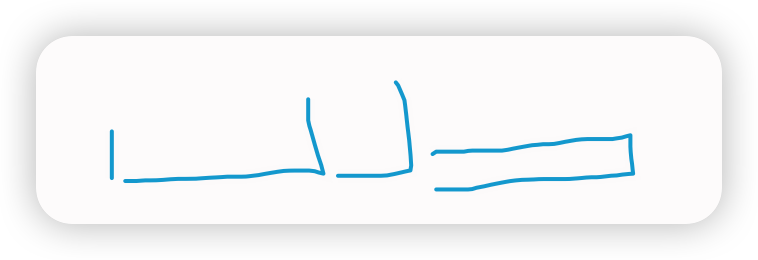
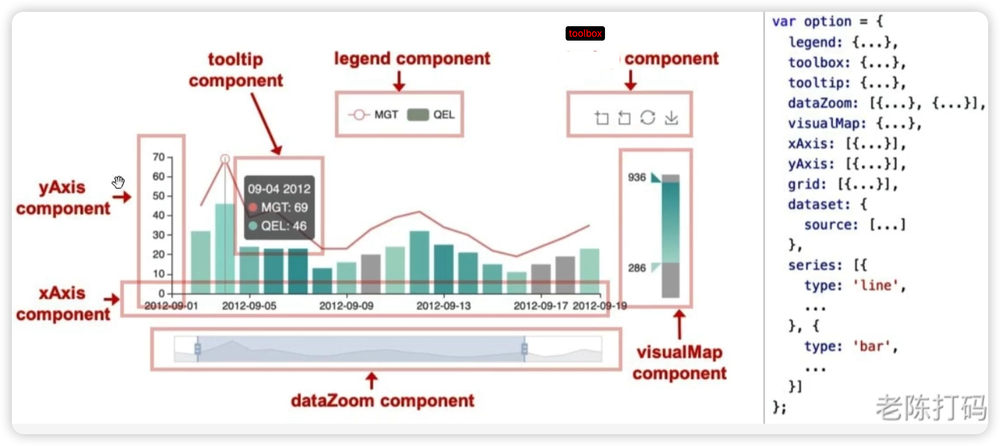
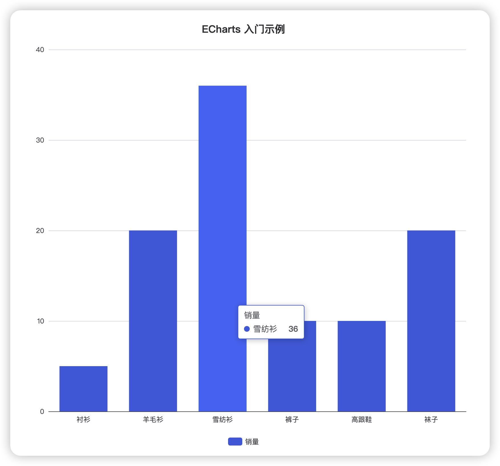
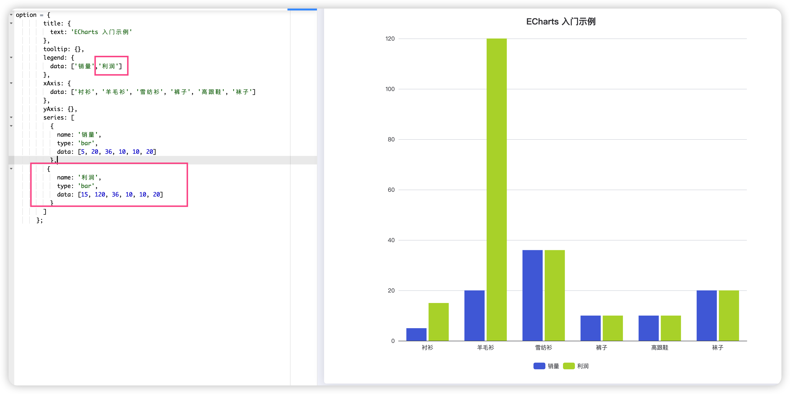

## ECharts大数据渲染优化

>  “血泪经验！大数据量时关闭动画+简化tooltip，利用canvas渲染～ 面试官追问细节直接拿项目案例砸！”

1. 关闭动画（animation:false)
2. 简化提示框（tooltip) 因为当数据量大时，哪怕鼠标微小的移动，都会引发海量的碰撞计算，所以可以简化tooltip里计算的内容逻辑。

> 比如说减少展示的内容，开启防抖（echarts自带的showdelay来减少触发频率）

### 防抖与节流

**防抖（debounce）：**频事件触发时，永远只执行最后一次。

比如搜索框输入联想，当用户在搜索框敲东西，等用户敲完后，停顿了0.5s，再发送请求。

或者是用户拖拽窗口，等用户彻底拖拽完，手松开时，再mychart.resize()


节流（Throttle）：按照固定的时间间隔执行。

比如：游戏里的技能冷却时间，3s就是3s， 在这期间你点了也没用。

比如：页面滚动监听，隔一段时间去监测用户是否滚动到底部。


## 数据更新频繁时怎么避免卡顿？



1. 首先由于更新频繁，所以肯定要降低渲染频率（防抖与节流）：比如后端通过WebSocket推送数据时，前端可以把接收到的数据先暂存到数组队列中，利用定时器，每隔一些时间去调用`setOption`进行批量更新。（节流，设计数据缓冲区）

2. 使用增量渲染（appenddata）：它每次更新不需要清空画布，而是直接在原有画布的结尾，把新来的几个点画上去，

   > 比如在某个场景下用户只关心最近3分钟的数据，所以前端可以维护一个固定长度的队列，新绘制结尾的点，就把头部的点丢掉。

3. 对于纯js计算逻辑可以去交给web worker运行，这样可以保证浏览器主线程也就是负责UI渲染的线程不阻塞。


## Canvas vs SVG区别

- Canvas：像素绘制，适合大数据量
- SVG：DOM节点，适合交互频繁场景

canvas是画布，无论画多少个点，在DOM树里都只是< canvas>节点，所以内存小，适合大数据渲染，但是想要单独处理图里的某个图形会很困难，需要通过坐标计算。

SVG是可缩放矢量图形，它的每个点和线都会有一个真实、独立的DOM节点，所以适合数据量小，但是需要高频用户交互的场景。


## 说一下vue中echarts图表自适应的实现方式

```
window.addEventListener('resize',()=>{
	myChart.resize();
})
```

> resize是浏览器原生（window对象）提供的事件监听名称，当用户屏幕变动时，会触发resize。这里的mychart.resize才是echarts提供的解决方法，
>
> 这里我们用了箭头函数，因为箭头函数没有自己的this，会用定义时上下文的this，可以确保this指向组件实例。


## 基础⭐️



```js
<!DOCTYPE html>
<html>
  <head>
    <meta charset="utf-8" />
    <title>ECharts</title>
    <!-- 引入刚刚下载的 ECharts 文件 -->
    <script src="echarts.js"></script>
  </head>
  <body>
    <!-- 为 ECharts 准备一个定义了宽高的 DOM -->
    <div id="main" style="width: 600px;height:400px;"></div>
    <script type="text/javascript">
      // 基于准备好的dom，初始化echarts实例
      var myChart = echarts.init(document.getElementById('main'));

      // 指定图表的配置项和数据
      var option = {
        title: {
          text: 'ECharts 入门示例'
        },
        tooltip: {},
        legend: {
          data: ['销量']
        },
        xAxis: {
          data: ['衬衫', '羊毛衫', '雪纺衫', '裤子', '高跟鞋', '袜子']
        },
        yAxis: {},
        series: [
          {
            name: '销量',
            type: 'bar',
            data: [5, 20, 36, 10, 10, 20]
          }
        ]
      };

      // 使用刚指定的配置项和数据显示图表。
      myChart.setOption(option);
    </script>
  </body>
</html>
```



### 不要搞混**坐标轴（Axis）** 和 **数据系列（Series）**

为什么 yAxis 不叫"销量"？

因为 **Y 轴描述的是"坐标轴类型"**，而不是业务含义。

```
yAxis: {
  type: 'value'
}
```

意思是：

> 纵轴是一条**数值轴**（0、10、20、30……）


如果

```
yAxis: {
  type: 'value',
  name: '销量'
}
```

效果就会变成：

```
销量 ↑
40 │
30 │
20 │
10 │
 0 └──────────────►
```

很多后台系统都会这样写。




## 我的项目中的大屏

数据可视化

- ECharts（核心图表库，含 `registerMap`、`convertToPixel / convertFromPixel`）
- 自定义 GeoJSON 地图数据（`components/EchartsMap/mapData/*.json`）
- `import.meta.glob` 动态导入地图 JSON，解决动态路径导入问题

动画与交互

- GSAP（卡片发光、地图入场缩放、计数动画等）
- WOW.js + animate.css（卡片淡入入场动画）
- GSAP 数字滚动组件 `@/components/gsapNum`

| 场景                           | 选哪个 |
| :----------------------------- | :----- |
| 入场淡入、从下滑入（比如标题） | WOW.js |
| 滚动到才出现                   | WOW.js |
| “动一下就行，不想写 JS”        | WOW.js |
| 数字滚动、计数动画             | GSAP   |
| 元素呼吸 / 闪烁 / 循环         | GSAP   |
| 地图、Canvas、SVG 动画         | GSAP   |
| 多个动画 按顺序串起来          | GSAP   |
| 根据数据 / 状态触发动画        | GSAP   |
| 大屏入场编排（错峰、批量）     | GSAP   |