# 一、Vue2篇

## 1. 关于生命周期

### 	1.1 生命周期有哪些？发送请求在created还是mounted？

```
请求接口测试：https://fcm.52kfw.cn/index.php?_mall_id=1&r=api/default/district
```

Vue2.x系统自带有8个

```
beforeCreate
created
beforeMount
mounted
beforeUpdate
updated
beforeDestroy
destroyed
```

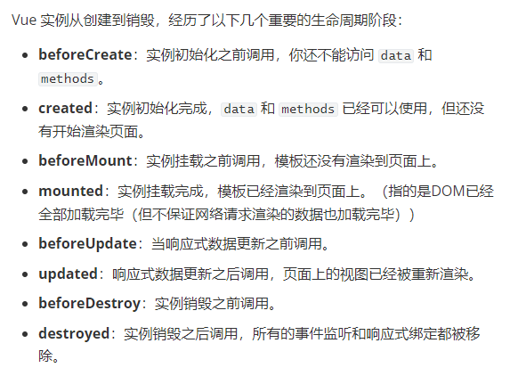

发送请求在created还是mounted？

> 如果不涉及组件引入，那么使用mounted是比较安全的，因为此时DOM已经加载挂载完毕。
>
> 但如果涉及组件引入，比如父组件引入子组件，一般会先执行父组件的前3个生命周期，再执行子的4个声明周期，
>
> 那么如果我们的业务是父引子，并且优先加载子组件，就可以把当前的请求放到mounted中。


### 	1.2 为什么发送请求不在beforeCreate里？beforeCreate和created有什么区别？

为什么发送请求不在beforeCreate里？

```
因为：如果请求是在methods封装好了，在beforeCreate调用的时候，beforeCreate阶段是拿不到methods里面的方法的（会报错了）
```

beforeCreate和created有什么区别？

```
beforeCreate没有$data，且拿不到methods的方法
created中有$data，且可以拿到methods的方法
```

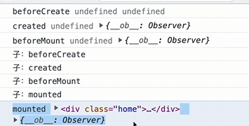


### 	1.3 在created中如何获取dom

```
1. 只要写异步代码，获取dom是在异步中获取的，就可以了。
	例如：setTimeout、请求、Promise.xxx()等等...
2. 使用vue系统内置的this.$nextTick
```


### 	1.4 一旦进入组件会执行哪些生命周期？

```
beforeCreate
created
beforeMount
mounted
```


### keep-alive

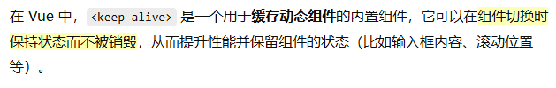


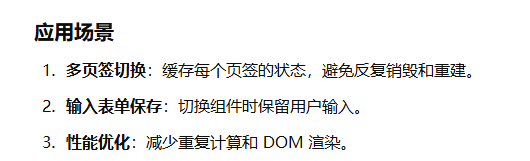

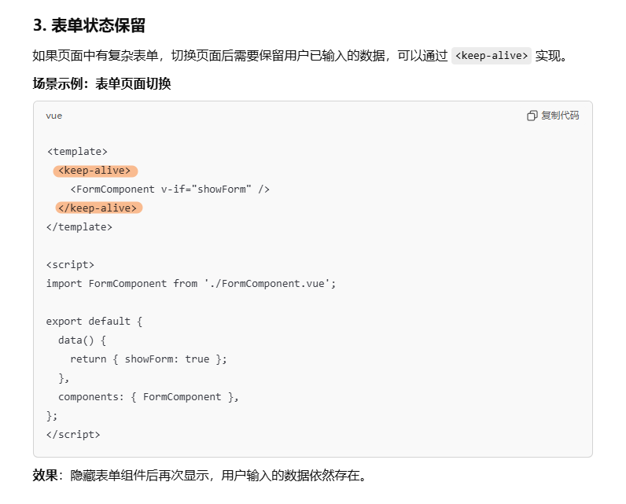


### 	1.5 第二次或者第N次进去组件会执行哪些生命周期？

如果当前组件加入了keep-alive，只会执行一个生命周期

```
activated
```

如果没有加入keep-alive

```
beforeCreate
created
beforeMount
mounted
```


### 	1.6 父组件引入子组件，那么生命周期执行的顺序是？

```
父：beforeCreate、created、beforeMount
子：beforeCreate、created、beforeMount、mounted
...
父：mounted
```


### 	1.7 加入keep-alive会执行哪些生命周期？

如果使用了keep-alive组件，当前的组件会额外增加2个生命周期（系统8 + 2 ）

```
activated
deactivated
```

如果当前组件加入了keep-alive第一次进入这个组件会执行5个生命周期

```
beforeCreate
created
beforeMount
mounted
activated
```


### 1.8 你在什么情况下用过哪些生命周期？说一说生命周期使用场景

```
created    ===> 单组件请求
mounted    ===> 同步可以获取dom，如果先子组件请求后父组件请求
activated  ===> 判断id是否相等，如果不相同发起请求
destroyed  ===> 关闭页面记录视频播放的时间,初始化的时候从上一次的历史开始播放
```


## 2. 关于组件

### 	2.1 组件传值（通信）的方式

```
父传子 ( 后代拿到了父的数据 )
1. 父组件引入子组件，绑定数据
	 <List :str1='str1'></List>
	子组件通过props来接收
	props:{
		str1:{
			type:String,
			default:''
		}
	}
	这种方式父传子很方便，但是父传给孙子辈分的组件就很麻烦（父=>子=>孙）
	这种方式：子不能直接修改父组件的数据

2. 子组件直接使用父组件的数据
	子组件通过：this.$parent.xxx使用父组件的数据
	这种方式：子可以直接修改父组件的数据
	
3. 依赖注入
	优势：父组件可以直接向某个后代组件传值(不让一级一级的传递)
```

```
子传父 （父拿到了后代的数据）
1. 子组件传值给父组件
	子组件定义自定义事件 this.$emit
2. 父组件直接拿到子组件的数据
	<List ref='child'></List>
	this.$refs.child
```

```
平辈之间的传值 ( 兄弟可以拿到数据 ) 

通过新建bus.js文件来做
```


### 	2.2 父组件如何直接修改子组件的值

```
<List ref='child'></List>
this.$refs.child.xxx = 'yyyy';
```


### 	2.3 子组件如何直接修改父组件的值

```
子组件中可以使用：this.$parent.xxx去修改
```


### 	2.4 如何找到父组件

```
this.$parent
```


### 	2.5 如何找到根组件

```
this.$root
```


### 	2.7 slot/插槽

```
匿名插槽 ：插槽没有名字
```

```
具名插槽 ：插槽有名字
```

```
作用域插槽 ： 传值
```


### （）2.8 provide/inject

```
provide/inject ===> 依赖注入
```


### 	（）2.9 如何封装组件

```
组件一定要难点，涉及的知识点：slot、组件通信...
```


## 3. 关于Vuex

### 	3.1 Vuex有哪些属性

```
state ==> 全局共享属性
getters ==> 针对于state数据进行二次计算（简化数据）
mutatioins ==> 存放同步方法的
actions    ==> 存放异步方法的，并且是来提交mutations
modules    ==> 把vuex再次进行模块之间的划分
```


### 	3.2 Vuex使用state值

```
this.$store.state.xxx
```

```
辅助函数：mapState
```

以上俩种方式都可以拿到state的值，那么区别是什么？

```
使用this.$store.state.xxx是可以直接修改vuex的state数据的

使用辅助函数的形式，是不可以修改的
```


### 	3.3 Vuex的getters值修改

面试官可能会这样问：组件使用了getters中的内容，组件使用采用v-model的形式会发生什么？

```
getters是不可以修改的
```


### 	3.4 Vuex的mutations和actions区别

```
相同点：mutations和actions都是来存放全局方法的，这个全局方法return的值拿不到
```

```
区别：
	mutations ==》 同步
	actions   ==》 返回的是一个Promise对象，他可以执行相关异步操作
	
mutations是来修改state的值的，actions的作用是来提交mutations
```


### 	3.5 Vuex持久化存储  ：在页面使用了state值：1，然后把1修改成2，然后刷新页面又回到了1为什么？ 

```
Vuex本身不是持久化存储的数据。Vuex是一个状态管理仓库（state：全局属性）==》就是存放全局属性的地方。
```

```
实现持久化存储：1. 自己写localStorage  2. 使用vuex-persistedstate插件
```

```
插件使用方式：https://www.xuexiluxian.cn/blog/detail/dae4073b07144d3c9abb3e2cc8495922
```

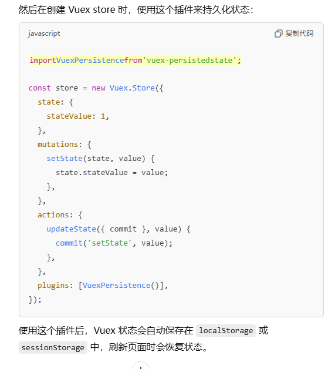

## 4. 关于路由

### 	4.1 路由的模式和区别

```
路由的模式：history、hash
```

```
区别：
1. 关于表象不同
	hash:#
	history:/
	history更像传统的URL，路径看起来更清晰
2. 关于找不到当前页面发送请求的问题
	history会给后端发送一次请求而hash不会
3. 关于项目打包前端自测问题
	hash是可以看到内容的
	history默认情况是看不到内容的，需要你定向配置一下
```


### 	（）4.2 子路由和动态路由

### 	（）4.3 路由传值

### 	4.4 导航故障（CROS）

```
官网说明：https://v3.router.vuejs.org/zh/guide/advanced/navigation-failures.html#%E6%A3%80%E6%B5%8B%E5%AF%BC%E8%88%AA%E6%95%85%E9%9A%9C
```

解决：

```
import VueRouter from 'vue-router'
const routerPush = VueRouter.prototype.push
VueRouter.prototype.push = function (location) {
  return routerPush.call(this, location).catch(error => error)
}
```

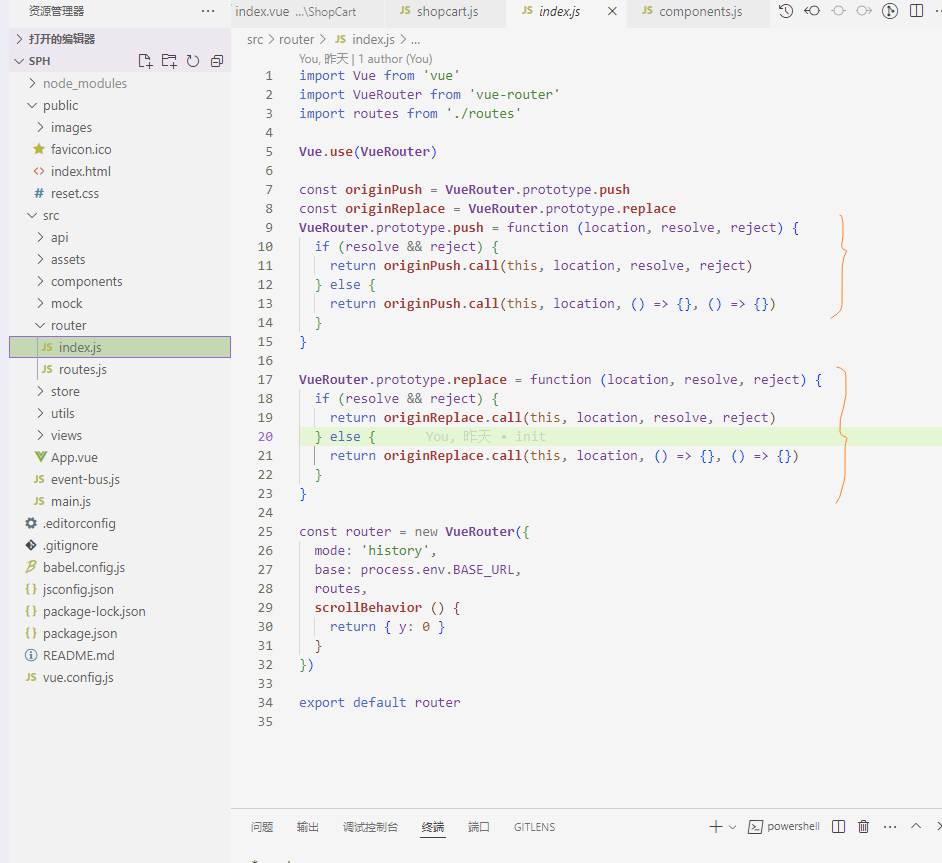


### 	4.5 $router和$route区别

```
$router不仅包含当前路由还包含整个路由的属性和方法

$route包含当前路由对象，比如路径、参数、查询字符串
```

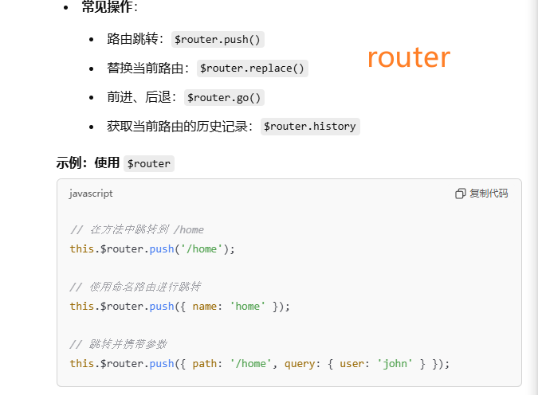

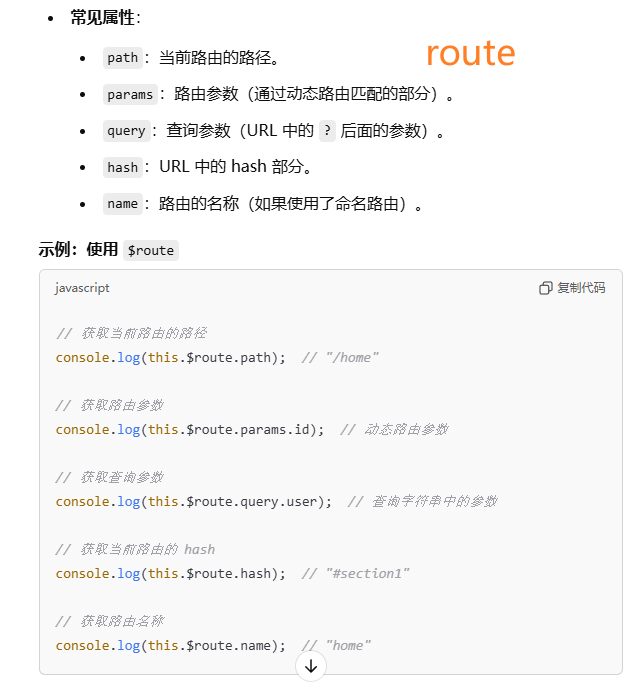


### 	4.6 导航守卫

```
1. 全局守卫

	beforeEach 路由进入之前
	afterEach 路由进入之后

2. 路由独享守卫
	
	beforeEnter 路由进入之前

3. 组件内守卫

	beforeRouteEnter 路由进入之前
	beforeRouteUpdate 路由更新之前
	beforeRouteLeave 路由离开之前
```


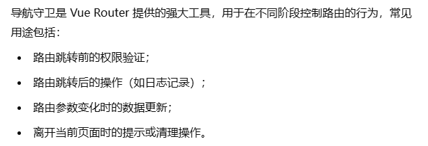

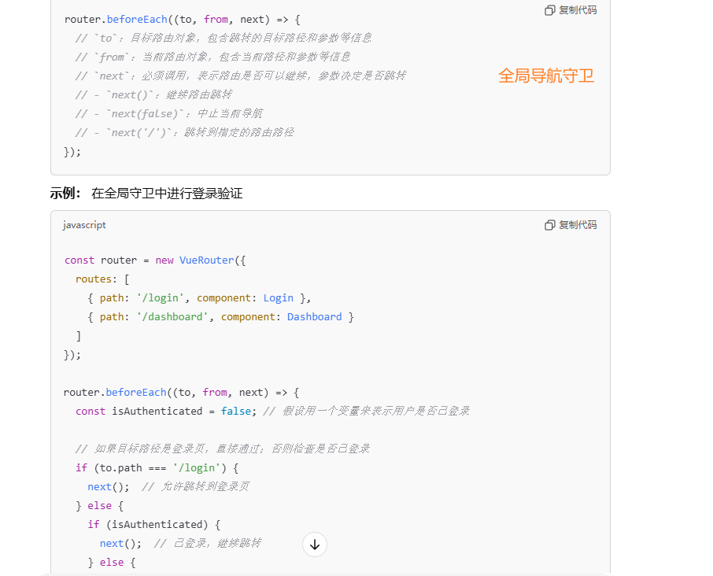

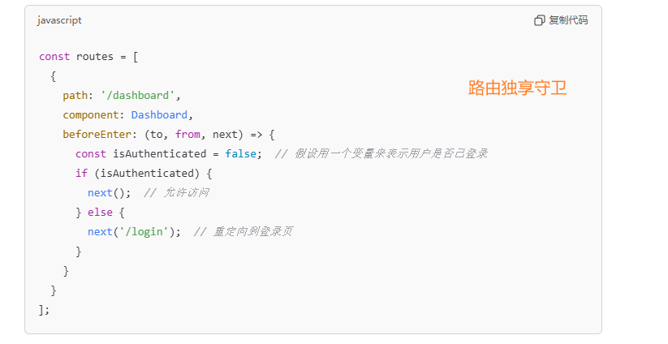


## 5. 关于API

### 	5.1 $set

```
面试官：你有没有碰到过，数据更新视图没有更新的问题 => $set
```

```
this.$set(target,key,修改后的值)
```

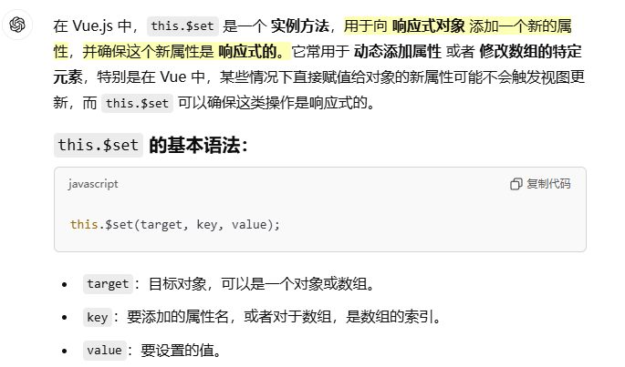

```
我还可以使用watch来监测某个值的变化
或者看看生命周期调用合适吗
或者看看$nextTick
```


### 	5.2 $nextTick

```
$nextTick返回的参数[函数]，是一个异步的。功能：获取更新后的dom
this.$nextTick() 可以让你在 DOM 更新后立即执行回调函数

源码|原理：
$nextTick( callback ){
		return Promise.resolve().then(()=>{
			callback();
		})
}
```


### 	5.3 $refs

```
来获取dom的
```

### 	5.4 $el

```
$el 获取当前组件的根节点
```

### 	5.5 $data

```
$data 获取当前组件data数据的
```


### 	5.6 $children

```
$children 获取到当前组件的所有子组件的
```

### 	5.7 $parent

```
找到当前组件的父组件，如果找不到返回自身
```

### 	5.8 $root

```
找到根组件
```

### 	5.9 data定义数据

```
数据定义在data的return内和return外的区别：

1. return外：单纯修改这个数据是不可以修改的，因为没有被get/set
2. reutnr内：是可以修改的
```

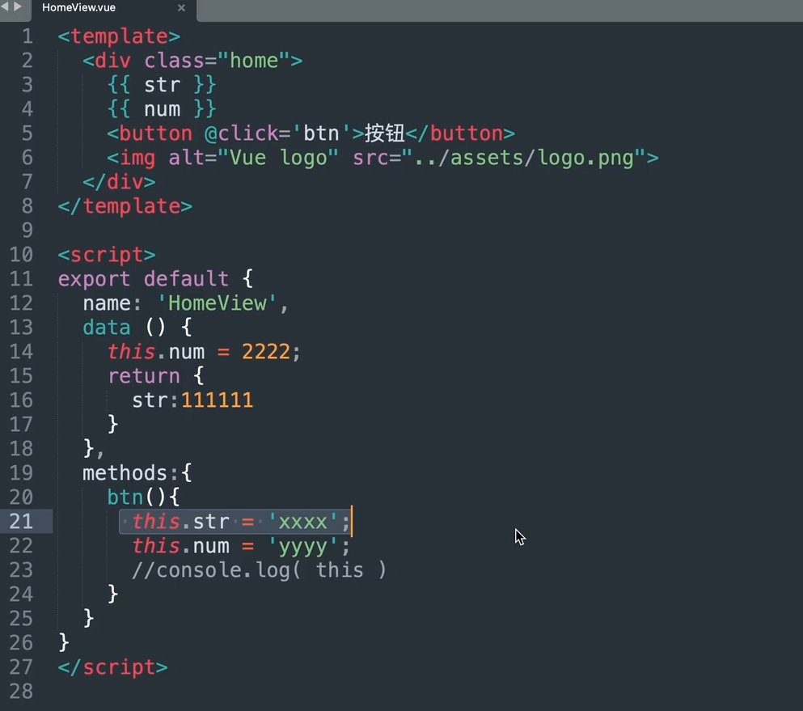


### ()5.10 computed计算属性

```
computed计算属性的结果值，可以修改吗？可以的，需要通过get/set写法

当前组件v-model绑定的值是computed来的，那么可以修改吗？可以的，需要通过get/set写法
```

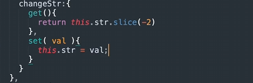

### 	5.11 watch

```
watch:{
  obj:{
    handler(newVal,oldVal){
      console.log( 'obj',newVal , oldVal )
    },
    immediate:true,
    deep:true
  },
}
```

### 	5.12 methods和computed区别

```
computed是有缓存机制的，methods是没有缓存机制的（调用几次执行几次）
```

## 6. 关于指令

### 6.1 如何自定义指令

```
全局：
Vue.directive('demo', {
  inserted: function (a,b,c) {
    console.log( a,b,c );
  }
})
```

```
局部：
<script>
export default {
  directives: {
    demo: {
      bind: function (el) {
        console.log( 1 )
      }
    }
  }
}
</script>
```

### 	6.2 vue单项绑定

```
双向绑定：v-model
```

```
单项绑定：v-bind
```

### 	6.3 v-if和v-for优先级

```
vue2中：v-for > v-if
```

```
vue3中：v-if > v-for
```

## 7. 关于原理

### 	7.1 $nextTick原理

```
$nextTick功能：获取更新后的DOM
使用场景：响应式数据更新后需要立即访问DOM
```

> 涉及  数据更新函数、操作DOM函数、更新DOM（内在机制）
>
> 正常步骤：数据更新函数=>操作DOM函数=>更新DOM（还在队列中，不及时）
>
> $nextTick：数据更新函数=>更新DOM（在微任务中）=>(几乎同时)操作DOM函数

正常情况下是数据进行变更，vue将变更记录放在一个队列中，所以DOM的更新不会很及时。（等数据变更完毕在下一个事件循环才去更新DOM）

如果不加这个功能，函数是异步的，即使函数修改DOM，也不一定会立马更新DOM，因为vue将变更记录放在了一个队列中。等事件循环去处理。

$nextTick会将负责回调函数（放置着操作DOM的处理函数）推入一个微任务队列，确保DOM更新完成后立即执行回调。（因为微任务的优先级比宏任务高，所以可以确保DOM一更新，就执行操作DOM的函数）


		$nextTick( callback ){
		return Promise.resolve().then(()=>{
			callback();
		})
		}


### 	7.2 双向绑定原理

### 


## 8.Axios


# Vue3篇	

### vue2和vue3区别？

```
1. Vue2 和 Vue3 双向绑定 方法不同

	Vue2 : Object.defineProperty()
			
			***后添加的属性是劫持不到的
		
	Vue3 : new Proxy()
	
			***即使后添加的也可以劫持到
			***还不需要循环

3. $set在vue3中没有，因为new Proxy不需要

4. 关于写法

	vue2是选项式API
	vue3可以向下兼容（选项式API），也可以组合式api或Setup语法糖形式
	
5. v-if和v-for优先级不同了

6. $ref和$children也不同

7. 如果大家还知道其他api不同点，随便说说就可以了

```

### vue3如果用setup写怎么组织代码？

```
说明：hooks（就是函数式），主要让功能模块细分（提升项目的维护性）

		解决问题：<script setup>
							//代码==》比较乱
						</script>
面试题：你们vue3写代码的方式 ==〉setup形式

		解决：hooks

```

### vue3如果用setup写如何获取类似于vue2中的this？

```
import {  getCurrentInstance } from 'vue'
let app = getCurrentInstance();
console.log( app.appContext.app.config.globalProperties.$loading )
```

### vue3常用api有哪些？

```
1. createApp() ==》 创建一个应用实例。
	说明：等于Vue2的==》new Vue()
	使用场景：写插件(封装全局组件会使用)
2. provide/inject ==》依赖注入
	说明：其实就是传值
	使用场景：某一个父组件传值 到后代组件，如果层级过多传递麻烦，所以使用
	缺点：不好维护和查询数据来源
3. directive
	说明：自定义指令
	场景：后台管理系统中的按钮权限控制（ 一个用户拥有某些权限，但是只能查看和修改，不能删除）
4. mixin
	说明：1.全局混入 2. 局部
	场景：可以添加生命周期，我在小程序的分享功能会用到
	缺点：不好维护和查询数据来源
5. app.config.globalProperties
	说明：获取vue这个全局对象的属性和方法
	场景：自己封装插件的时候需要把方法添加到对象中
6. nextTick
	说明：等待下一次 DOM 更新刷新的工具方法 ：nextTick返回一个Pormise，回调函数是放在Promise中的，所以是异步执行的
	场景：就是把dom要更新，那么vue是数据驱动dom，所以数据的赋值就要在nextTick进行
7. computed
	说明：计算属性
	场景：有缓存
8. reactive、ref
	说明：来定义数据的和vue2的data类似
9. watch
	说明：监听（Vue3不需要深度监听）
10. markRaw()
	说明：不被new Proxy代理，说白了就是静态的数据
11. defineProps() 
	说明：父组件传递的值，子组件使用setup的形式，需要用defineProps接收
12. defineEmits()
	当前组件使用setup形式，自定义事件需要使用defineEmits
13. slot
	说明：分为 1. 匿名 2. 具名 3. 作用域
	场景：后台管理系统，左侧是固定菜单，右侧是不固定内容，那么右侧就是slot
```

### 请介绍一下vue3常用的响应式数据类型

```
ref ：基本类型
reactive ：复杂类型
toRef ：解构某一个值
toRefs ： 解构多个值
```

### 请介绍一下teleport组件及其使用场景

```
teleport组件是一个传送门
假如自己写弹出框，需要在页面居中位置展示，不受当前组件的限制，可以把盒子传送到body中
```

