# HTML				

### 行内元素有哪些？块级元素有哪些？ 空(void)元素有哪些？

```
行内元素：a/span/br/label/q...
块级元素：div/footer/header/section/p/h1/
行内块级元素：input/button/img
空元素：br、hr...


元素之间的转换问题：
display: inline;  			把某元素转换成了行内元素       ===>不独占一行的，并且不能设置宽高
display: inline-block; 	把某元素转换成了行内块元素		  ===>不独占一行的，可以设置宽高
display: block;					把某元素转换成了块元素	   ===>独占一行，并且可以设置宽高
```


### 页面导入样式时，使用link和@import有什么区别？

> 使用：<link rel="stylesheet" href="">
>
> @import url（"style.css"）

```
1.link是个标签，可以引入外部资源，通常放在head里。@import是CSS的语法规则，只能用来导入样式表。
2.都存在时先加载link后加载@import
3.link由于出的早所以兼容性上更好
```


### title与h1的区别、b与strong的区别、i与em的区别？

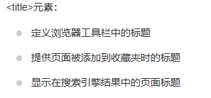

```
title与h1的区别：

定义：
	title：概括了网站信息，网站的内容主题
	h1：文章主题内容
区别：
	title他是显示在网页标题上、h1是显示在网页内容上
	title比h1添加的重要 (title > h1 ) ==》对于seo的了解
场景：
	网站的logo都是用h1标签包裹的	
```

```
b与strong的区别：

	b标签只有加粗的样式，没有任何人语义含义。
	strong表示重要或要强调的内容。

```

```
i与em的区别：

	i标签只是表示斜体，而不传达其他额外信息。
		主要用于表示外来词、技术书籍、电影或专有名词等需要在视觉上区分其他文本的内容
		或字体图标
	em标签表示强调、警告、命令，用于突出某些文本。

em更有语义化
```

### img标签的title和alt有什么区别？

```
区别一：
	title ： 鼠标移入到图片显示的值
	alt   ： 图片无法加载时显示的值
区别二：
	在seo的层面上，蜘蛛抓取不到图片的内容，所以前端在写img标签的时候为了增加seo效果要加入alt属性来描述这张图是什么内容或者关键词。
```

### png、jpg、gif 这些图片格式解释一下，分别什么时候用？

```
png:无损压缩，尺寸体积要比jpg/jpeg的大，适合做小图标。
jpg:采用压缩算法，有一点失真，比png体积要小，适合做中大图片。
gif:一般是做动图的。
webp：同时支持有损或者无损压缩，相同质量的图片，webp具有更小的体积。兼容性不是特别好。
```

# CSS

### 介绍一下CSS的盒子模型

```
CSS的盒子模型有哪些：标准盒模型、替代盒模型
CSS的盒子模型区别：
	标准盒模型： width==content
	替代盒模型： width==content+padding+border
通过CSS如何转换盒子模型：
	box-sizing: content-box;
	box-sizing: border-box;	  
```

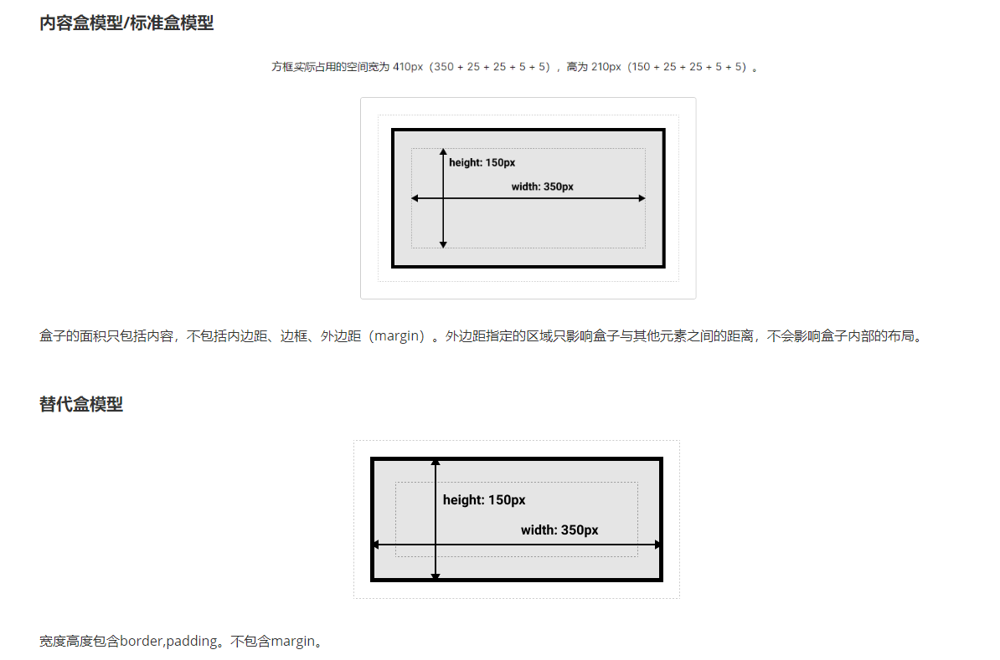

### line-height和heigh区别

```
line-height设置行间距的，决定了每一行文字的高度，影响文本的垂直间距和排版效果。
height控制整个元素的尺寸。
```

### CSS选择符有哪些？哪些属性可以继承？

```
CSS选择符：
    通配（*）
    id选择器（#）
    类选择器（.）
    标签选择器（div、p、h1...）
    相邻选择器(+)
    后代选择器(ul li)
    子元素选择器（ > ）
    属性选择器(a[href])
    
CSS属性哪些可以继承：
文字系列：font-size、color、line-height、text-align...
***不可继承属性：border、padding、margin...
```

### CSS优先级算法如何计算？

```
优先级比较：!important > 内联样式 > id > class > 标签 > 通配
```

```
CSS权重计算：
第一：内联样式（style）  权重值:1000
第二：id选择器  				 权重值:100
第三：类选择器 				  权重值:10
第四：标签&伪元素选择器   权重值:1
第五：通配、>、+         权重值:0
```

### 用CSS画一个三角形

```
用边框画（border）,例如：
{
		width: 0;
		height: 0;

		border-left:100px solid transparent;
		border-right:100px solid transparent;
		border-top:100px solid transparent;
		border-bottom:100px solid #ccc;
}
```

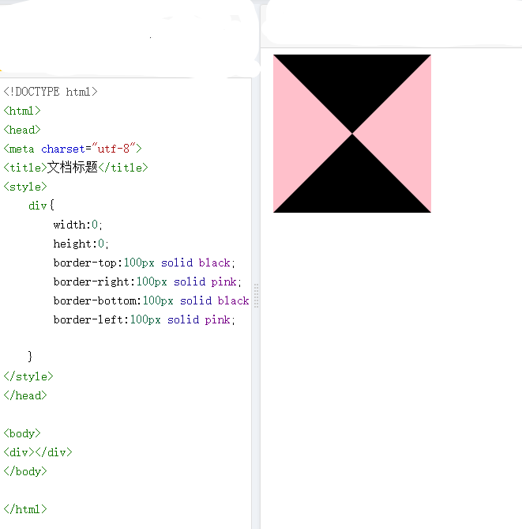

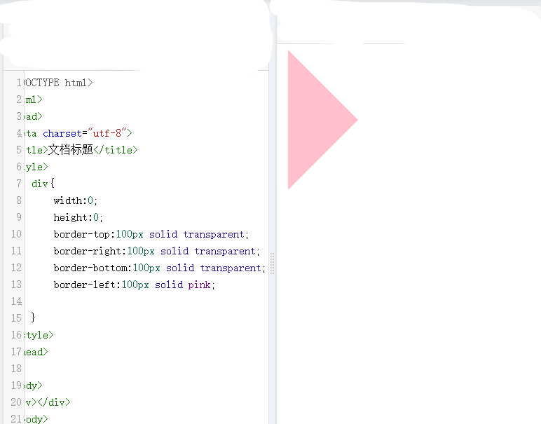


### 一个盒子不给宽度和高度如何水平垂直居中？

方式一：

```
<div class='container'>
	<div class='main'>main</div>
</div>

.container{
		display: flex;
		justify-content: center;
		align-items: center;
		width: 300px;
		height: 300px;
		border:5px solid #ccc;
}
.main{
		background: red;
}
```

方式二：

```
<div class='container'>
	<div class='main'>main</div>
</div>

.container{
		position: relative;
		width: 300px;
		height: 300px;
		border:5px solid #ccc;
}
.main{
		position: absolute;
		left:50%;
		top:50%;
		background: red;
		transform: translate(-50%,-50%);
}
```

### display有哪些值？说明他们的作用。

```
none     			隐藏元素
block    			把某某元素转换成块元素
inline   			把某某元素转换成内联元素
inline-block 	1	把某某元素转换成行内块元素
```

### calc使用场景

1.页面把图片推向中间

padding设置为，用页面的一半距离减去图片的一半距离。

2.响应式设计。

比如想让图案始终距离外框有距离，哪怕是外框随时移动的情况下。

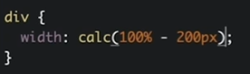


### 对BFC规范的理解

(块级格式化上下文：block formatting context)

```
BFC就是页面上一个隔离的独立容器，容器里面的子元素不会影响到外面的元素。

BFC的原则：如果一个元素具有BFC，那么内部元素再怎么弄，都不会影响到外面的元素。
如何触发BFC：
		position的值为:absoute、fixed
		float的值非none
		overflow的值为overflow、hidden、scroll。非visible
		display的值为：inline-block、flex
```

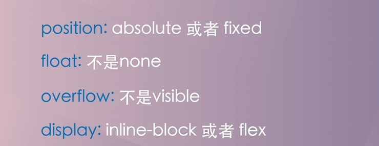

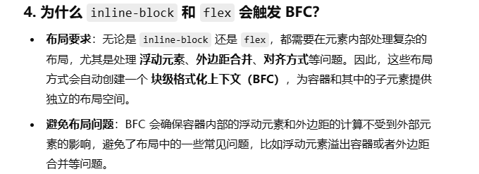

### 外边距塌陷

1. 只会发生在垂直方向，不是水平方向
2. 只会发生在块级元素

发生塌陷后计算方法：

​	1.正数&&正数  最大的数

​	2.负数&&负数  绝对值最大的数

​	3.正数&&负数  相加的和

解决：

​	为父元素设置相对定位，子元素设置绝对定位

​	为子元素设置相对定位，用top或者bottom设置

​	为子元素设置display:inline-block，同时设置宽高


​	BFC：为父元素设置overflow:hidden 

​	为父元素设置padding 

​	为父元素设置border

​	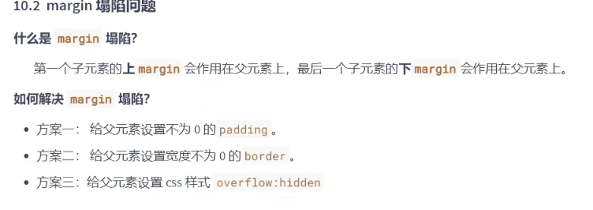

### 清除浮动有哪些方式

> 1. 触发BFC。
>
>    父元素设置overflow:hidden/auto
>
>    或父元素设置浮动
>
>    > overflow会计算当前浮动的高度，再把多余的浮动进行处理
>
> 2. 多创建一个盒子，添加样式：clear: both;
>
> 3. after方式（类似第二个方法，添加伪元素）
>     ul:after{
>
>   		content: '';
>   		display: block;
>   		clear: both;
>   }

### 在网页中的应该使用奇数还是偶数的字体？为什么呢？

```
偶数 : 让文字在浏览器上表现更好看。

另外说明：ui给前端一般设计图都是偶数的，这样不管是布局也好，转换px也好，方便一点。
```

### position有哪些值？分别是根据什么定位的？

```
static   [默认]  没有定位
fixed    固定定位，相对于浏览器窗口进行定位。脱离文档流。
relative 相对于自身定位，不脱离文档流。
absolute 相对于第一个有relative的父元素，脱离文档流。
sticky  粘性定位，元素在滚动过程中，根据位置在相对定位和固定定位之间切换。

relative和absolute区别
1. relative不脱离文档流 、absolute脱离文档流
2. relative相对于自身 、 absolute相对于第一个有relative的父元素
3. relative如果有left、right、top、bottom ==》left、top
   absolute如果有left、right、top、bottom ==》left、right、top、bottom
```

### 什么是CSS reset？

```
重置浏览器的默认样式的css文件
```

### 双飞翼布局

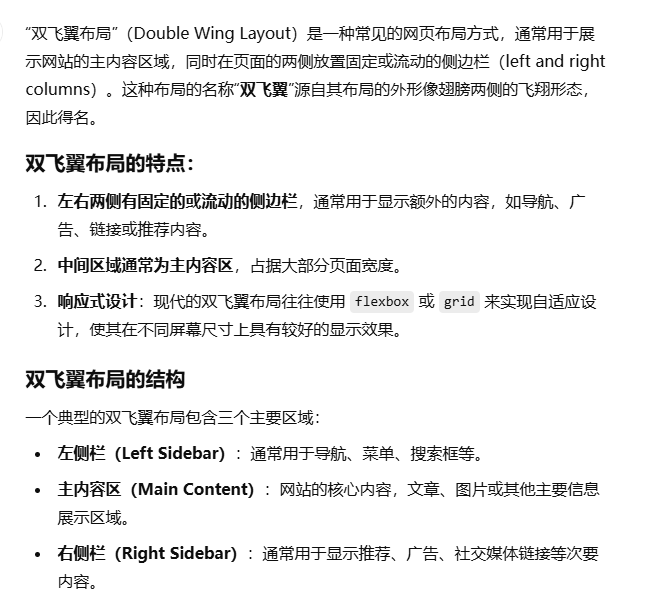

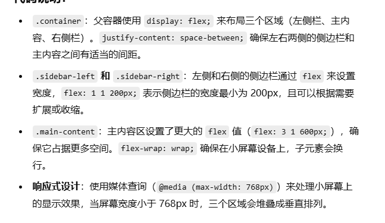

```
<!DOCTYPE html>
<html lang="en">
<head>
    <meta charset="UTF-8">
    <meta name="viewport" content="width=device-width, initial-scale=1.0">
    <title>双飞翼布局 - Flexbox 示例</title>
    <style>
        /* 容器：使用 flexbox 排列左右侧边栏和主内容区域 */
        .container {
            display: flex;
            justify-content: space-between; /* 左右边距相等 */
            flex-wrap: wrap; /* 当屏幕宽度小于容器宽度时，自动换行 */
            padding: 20px;
        }

        /* 左侧栏样式 */
        .sidebar-left {
            flex: 1 1 200px; /* 侧边栏占 200px 的宽度，且可以缩放 */
            background-color: #f4f4f4;
            padding: 15px;
        }

        /* 主内容区样式 */
        .main-content {
            flex: 3 1 600px; /* 主内容区占 600px 的宽度，且可以缩放 */
            background-color: #fff;
            padding: 15px;
            margin: 0 20px;
        }

        /* 右侧栏样式 */
        .sidebar-right {
            flex: 1 1 200px; /* 右侧栏占 200px 的宽度，且可以缩放 */
            background-color: #f4f4f4;
            padding: 15px;
        }

        /* 响应式：当屏幕宽度小于 768px 时，侧边栏将自动堆叠 */
        @media (max-width: 768px) {
            .container {
                flex-direction: column;
            }
            .sidebar-left, .sidebar-right {
                flex: 1 1 100%; /* 使两侧栏宽度充满一行 */
                margin: 10px 0;
            }
            .main-content {
                flex: 1 1 100%; /* 主内容区充满剩余的空间 */
            }
        }
    </style>
</head>
<body>
    <div class="container">
        <div class="sidebar-left">左侧栏</div>
        <div class="main-content">
            <h1>主内容</h1>
            <p>这里是网页的主内容区域，可以放置文章、图片或其他重要内容。</p>
        </div>
        <div class="sidebar-right">右侧栏</div>
    </div>
</body>
</html>

```


### css sprite是什么,有什么优缺点

```
	优点：只加载一张图片，缓解网站压力。
	缺点：维护比较差（图片位置进行修改或者内容宽高修改）
```

### display: none;与visibility: hidden;的区别

```
占用位置的区别
display: none; 				是不占用位置的
visibility: hidden;   虽然隐藏了，但是占用位置

它俩都会重绘
```

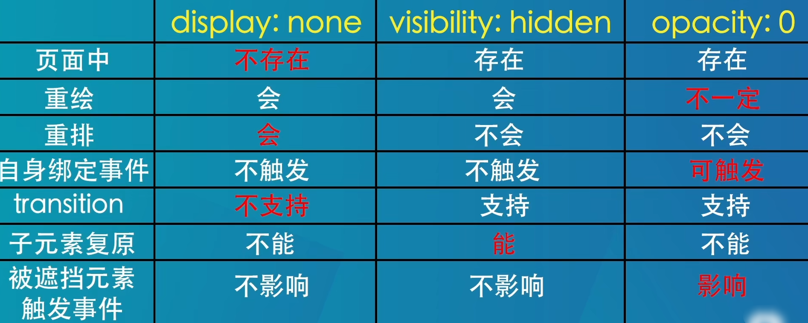

### opacity 和 rgba区别

opacity、alpha是从 0（完全透明）到 1（完全不透明）

`opacity`影响整个元素，设置后，元素和它所有子元素都会透明。

alpha只控制颜色覆盖范围的透明度。


# JS		

### 延迟加载JS有哪些方式？

```
延迟加载：async、defer
		例如：<script defer type="text/javascript" src='script.js'></script>
		
defer : defer告诉浏览器延迟执行脚本，直到 HTML文档完全解析完成。多个文档时顺次执行。
async :async告诉浏览器异步加载脚本，加载完后立即执行（不按顺序），不是顺次执行js脚本（谁先加载完谁先执行）。
```

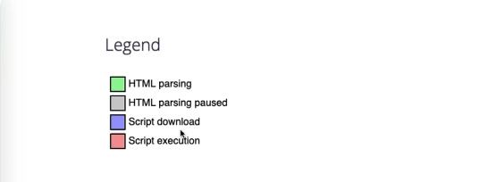

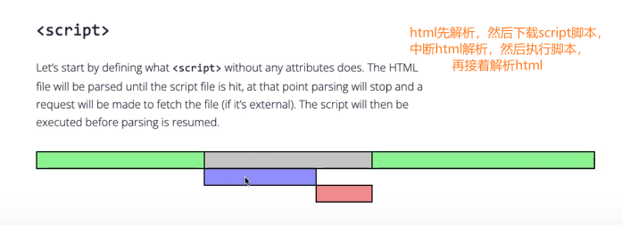

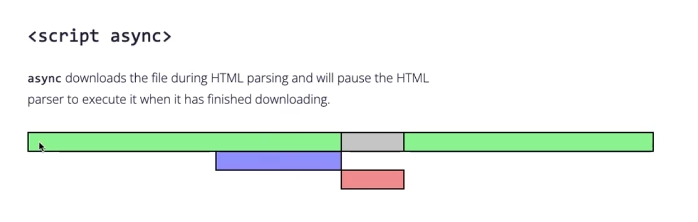

> 异步代码不会“立即”执行，它需要等待微任务队列的调度。

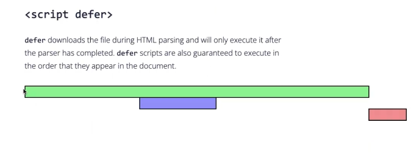


### JS数据类型有哪些？

```
基本类型：string、number、boolean、undefined、null、bigin、tsymbol
引用类型：object

NaN是一个数值类型，但是不是一个具体的数字。
```

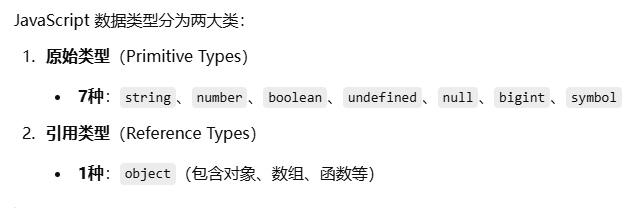

> 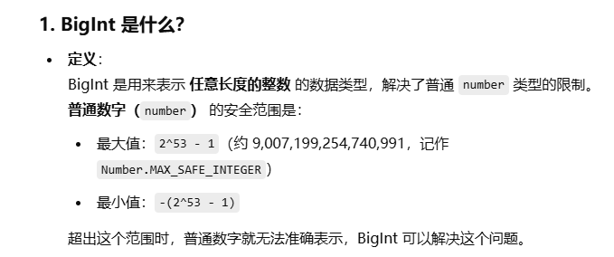
>
> 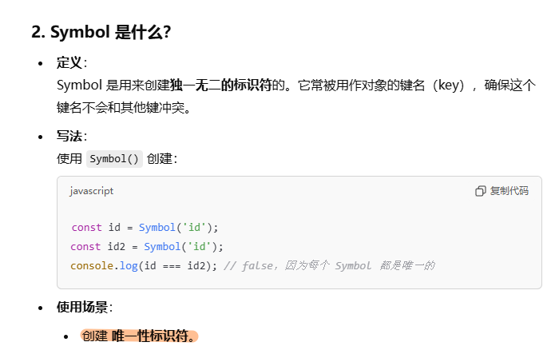


### JS数据类型考题	

```
console.log( true + 1 );     						//2
console.log( 'name'+true );  						//nametrue
console.log( undefined + 1 ); 						//NaN
console.log( typeof undefined ); 					//undefined
```

> `undefined` 在参与数学运算时会被转换为 `NaN`（Not a Number），而任何值与 `NaN` 进行运算，结果都会是 `NaN`。

```
console.log( typeof(NaN) );       					//number
console.log( typeof(null) );      					//object
```

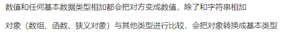


###  null和undefined的区别

```
1. 作者在设计js的都是先设计的null（因为最初设计时借鉴了java）
2. null会被隐式转换成0，很不容易发现错误。
3. 先有null后有undefined，出来undefined是为了填补之前的坑。

具体区别：JavaScript的最初版本是这样区分的：null是一个表示"无"的对象（空对象指针），转为数值时为0；undefined是一个表示"无"的原始值，转为数值时为NaN。
```

**`null`**：表示**明确的空值**，通常是开发者手动设置的，表示“这里本该有值，但目前为空”。

**`undefined：`** 通常表示程序的某些部分**没有提供足够的信息**。


### ==和===有什么不同？

```
==  :  比较的是值
		
	string == number || boolean || number ....都会隐式转换
	通过valueOf转换（valueOf() 方法通常由 JavaScript 在后台自动调用，并不显式地出现在代码中）

=== ： 除了比较值，还比较类型
```

数值和任何基本数据类型相加都会把对方变成数值，除了和字符串相加

对象（数组、函数、狭义对象）与其他类型进行比较，会把对象转换成基本类型

> 比如[1,2]会被转换成'1,2'，这里数组转换成了对象

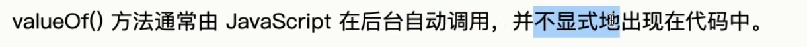


###  JS微任务和宏任务

```
1. js是单线程的语言。
2. js代码执行流程：同步执行完 => 事件循环
	同步的任务都执行完了，才会执行事件循环的内容
	进入事件循环：请求、定时器、事件....
3. 事件循环中包含：【微任务、宏任务】
微任务：promise.then
宏任务：setTimeout..

要执行宏任务的前提是清空了所有的微任务

流程：同步==>事件循环【微任务和宏任务】==>微任务==>宏任务=>微任务...

```


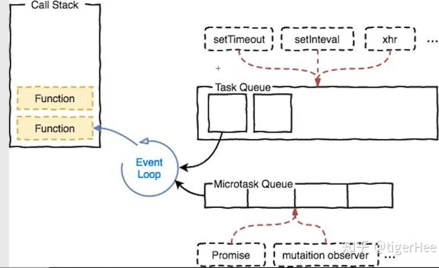


###  JS作用域考题

ES5：函数作用域、全局作用域

ES6：函数作用域、全局作用域、块级作用域（let）

```
1. 除了函数外，js是没有块级作用域。
2. 作用域链：内部可以访问外部的变量，但是外部不能访问内部的变量。
	 注意：如果内部有，优先查找到内部，如果内部没有就查找外部的。
3. 注意声明变量是用var还是没有写（window.）
4. 注意：js有变量提升的机制【变量悬挂声明】
5. 变量提升优先级：函数声明 > 变量声明 > 类声明 
```

面试的时候怎么看：

```
1. 本层作用域有没有此变量【注意变量提升】
2. 注意：js除了函数外没有块级作用域
3. 普通声明函数是不看写函数的时候顺序
```

考题一：

```
function c(){
	var b = 1;
	function a(){
		console.log( b );
		var b = 2;
		console.log( b );
	}
	a();
	console.log( b );
}
c();
```

考题二：

```
var name = 'a';
(function(){
	if( typeof name == 'undefined' ){
		var name = 'b';
		console.log('111'+name);
	}else{
		console.log('222'+name);
	}
})()
```

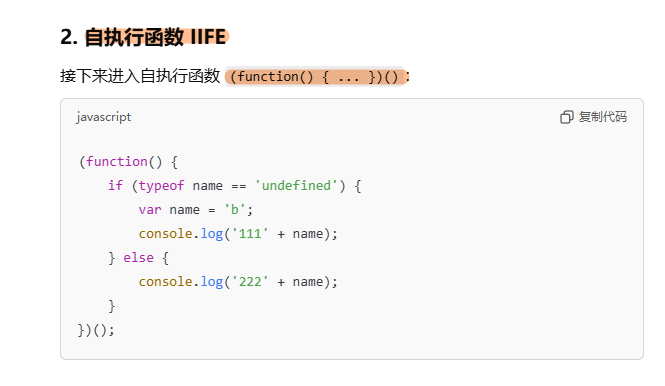

考题三：

```
function fun( a ){
	var a = 10;
	function a(){}
	console.log( a );
}
fun( 100 );
```

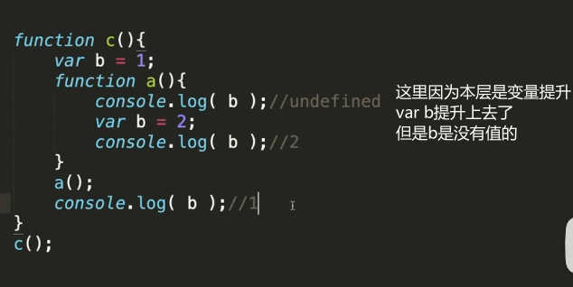

以下同理(111b) 不清楚的可以问chatgpt

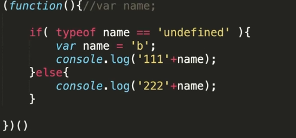


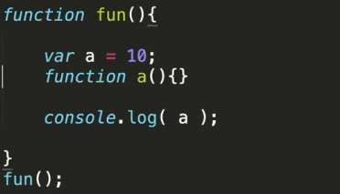

上面这个打印10

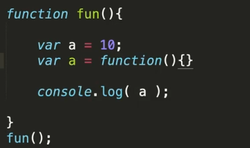

上面这个打印f(){}

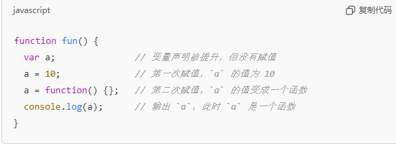


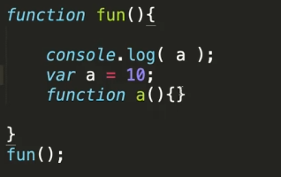

上面这个结果是undefined

这个是函数声明和a变量同时提升，函数优先

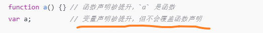


###  JS对象考题

JS对象注意点：

```
1. 对象是通过new操作符构建出来的，所以对象之间不相等(除了引用外)；
2. 对象注意：引用类型(共同一个地址)；
3. 对象的key都是字符串类型；
4. 对象如何找属性|方法；
	查找规则：先在对象本身找 ===> 构造函数中找 ===> 对象原型中找 ===> 构造函数原型中找 ===> 对象上一层原型查找
```

任何一个函数都有其原型和实例

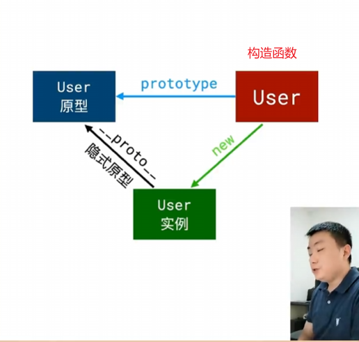

考题一：

```
 [1,2,3] === [1,2,3]   //false
```

> 因为两个数组是两个对象，三个等号比较的是 是不是同一个引用对象

考题二：

```
var obj1 = {
	a:'hellow'
}
var obj2 = obj1;
obj2.a = 'world';
console.log(obj1); 	//{a:world}
(function(){
	console.log(a); 	//undefined
	var a = 1;
})();
```

考题三：

```
var a = {}
var b = {
	key:'a'
}
var c = {
	key:'c'
}

a[b] = '123';
a[c] = '456';

console.log( a[b] ); // 456
```

> 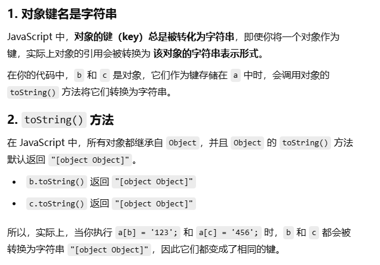
>
> 
>
> 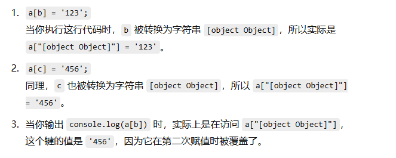


### JS作用域+this指向+原型的考题

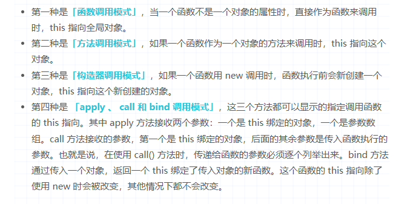

> 上面四种当中，第一种是默认模式
>
> 第二种是隐式绑定
>
> 第三种叫new绑定
>
> 第四种叫显示绑定
>
>  
>
> new绑定>显式绑定>隐式绑定>默认绑定

考题一：

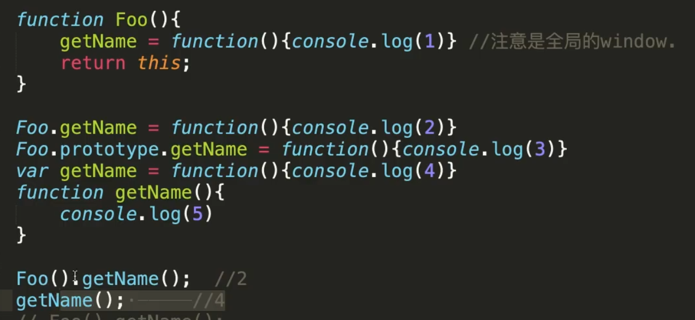

> 首先我想介绍一下这个东西
>
> function Foo() {    
>
> getName = function() { console.log(1); }; // 全局变量    
>
> return this; 
>
> }
>
> 在这里getName由于**没有使用声明关键字（`var`、`let`、`const`）创建的变量会隐式地成为全局变量**，并绑定到全局对象。
>
> `Foo` 和 `getName` 没有父子关系。所以在这里Foo.getName是错误的
>
> `Foo` 只是一个函数，`getName` 是通过函数执行时被创建的全局变量。
>
> 当Foo().getName()时，会先进入Foo()，在这个函数里面会将变量getName进行值的修改，修改为函数function(){ console.log(1); }

```
function Foo(){
	getName = function(){console.log(1)} //注意是全局的window.
	return this;
}

Foo.getName = function(){console.log(2)}
Foo.prototype.getName = function(){console.log(3)}

var getName = function(){console.log(4)}
function getName(){
	console.log(5)
}


Foo.getName();    //2
getName(); 		  //4
Foo().getName();  //1
getName();		  //1
new Foo().getName();//3
```

> 最后有五行结果，我逐行解释一下
>
> 第一行我们有直接现成的语句，就直接用了（console.log2）
>
> 第二行，getName有个变量，还有个函数，都叫这个，由于变量提升，最后是4
>
> 第三行，我在最上面解释过，先调用Foo()，里面对getName进行修改，输出1
>
> 第四行，由于getName是全局变量，在上一句中已经被修改为getName就是function(){ console.log(1); }，所以输出1
>
> 第五行，由于是new创建的，所以new Foo()指向新创建的对象，在新创建的对象中没找到getName，就去了原型上找

考题二：

```
var o = {
	a:10,
	b:{
		a:2,
		fn:function(){
			console.log( this.a ); // 2
			console.log( this );   //代表b对象
		}
	}
}
o.b.fn();
```


看看调用的位置就懂了

2

b


考题三：

```
window.name = 'ByteDance';
function A(){
	this.name = 123;
}
A.prototype.getA = function(){
	console.log( this );
	return this.name + 1;
}
let a = new A();
let funcA = a.getA;
funcA();  
```


//this代表window


考题四：

```
var length = 10;
function fn(){
	return this.length + 1;
}
var obj = {
	length:5,
	test1:function(){
		return fn();
	}
}
obj.test2 = fn;
console.log( obj.test1() ); 							
console.log( fn()===obj.test2() ); 				
console.log( obj.test1() == obj.test2() ); 
```

​				


结果是

11	obj调用test1,test1内部直接调用fn。由于是直接调用，所以fn指向全局

true

> 这个非常重要，因为如果是
>
> var obj={
>
> f3:function(){concole.log('a')};
>
> }
>
> 可以说obj.f3();	//a
>
> 但是这里obj.test2=fn，是把 `fn` 函数赋值给了 `obj.test2`，因此 `obj.test2` 指向 `fn` 函数。但obj.fn()指的是全局
>
> 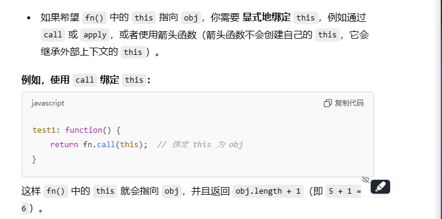


true


### JS判断变量是不是数组，你能写出哪些方法？

方式一：isArray

```
var arr = [1,2,3];
console.log( Array.isArray( arr ) );
```

方式二：instanceof  【可写,可不写】

```
var arr = [1,2,3];
console.log( arr instanceof Array );
```

方式三：原型prototype

```
var arr = [1,2,3];
console.log( Object.prototype.toString.call(arr).indexOf('Array') > -1 );
```

方式四：isPrototypeOf()

```
var arr = [1,2,3];
console.log(  Array.prototype.isPrototypeOf(arr) )
```

方式五：constructor

```
var arr = [1,2,3];
console.log(  arr.constructor.toString().indexOf('Array') > -1 )
```

### slice是干嘛的、splice是否会改变原数组

```
1. slice是来截取的
	参数可以写slice(3)、slice(1,3)、slice(-3)
	返回的是一个新的数组
2. splice 功能有：插入、删除、替换
	返回：删除的元素
	该方法会改变原数组
```

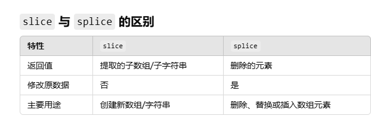

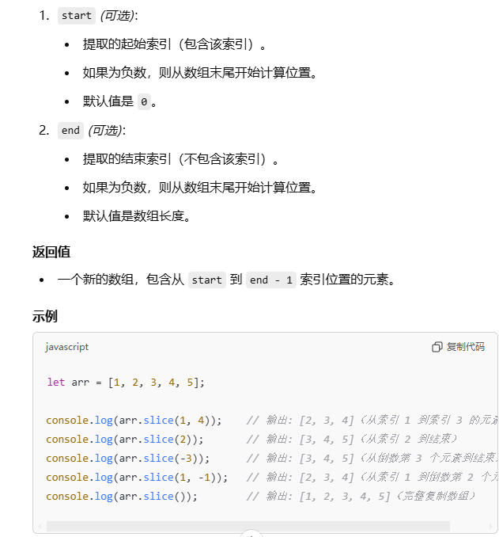

> 好像如果是正数，就会从0123开始，但如果是负数，就要从123开始（最后一个是1，倒数第二个是2）
>
> 而且start索引比如是1，那么对应数组的2。end索引是4，虽然对应数组中的5，但是end所以是不包含的，实际上是数组的slice[start,end)，这样是为了与数学中的切片相对应，这样4-1，正好就是切了三个元素


### JS数组去重

方式一：new set

> set可以处理任何数据类型，只要内部有重复的，就会执行。
>
> 但是set对对象不是很管用，因为set内部是===，也就是说即使两个对象属性值一样，但是由于地址不一样，set认为就不一样。
>
> 但是我们去重的时候会觉得两个对象值一样就ok，所以需要去掉一个对象。
>
> 所以涉及到对象，需要对比较函数或者set进行重写。
>
> > 先鉴别是不是对象，如果是对象，就要值挨个比较是否重复，先把n个对象放到一个对象中，从第一个元素开始看，看看后面有没有重复的；再看第二个元素，再接着往后看
> >
> > 如果不是对象，那么就直接使用set

```
var arr1 = [1,2,3,2,4,1];
function unique(arr){
	return [...new Set(arr)]
}
console.log(  unique(arr1) );
```

方式二：indexOf

```
var arr2 = [1,2,3,2,4,1];
function unique( arr ){
	var brr = [];
	for( var i=0;i<arr.length;i++){
		if(  brr.indexOf(arr[i]) == -1 ){
			brr.push( arr[i] );
		}
	}
	return brr;
}
console.log( unique(arr2) );
```

方式三：sort

```
var arr3 = [1,2,3,2,4,1];
function unique( arr ){
	arr = arr.sort();
	var brr = [];
	for(var i=0;i<arr.length;i++){
		if( arr[i] !== arr[i-1]){
			brr.push( arr[i] );
		}
	}
	return brr;
}
console.log( unique(arr3) );
```

​				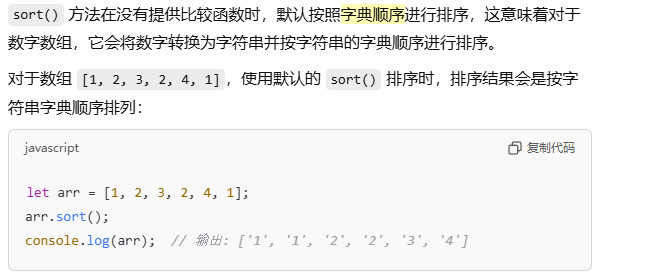

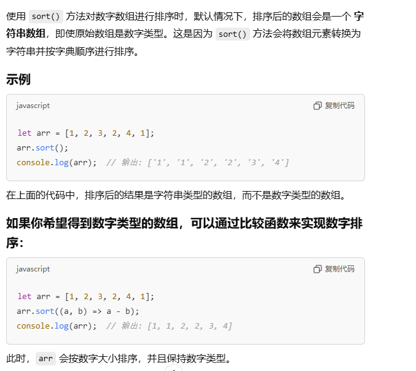


### 找出多维数组最大值

```
function fnArr(arr){
	var newArr = [];
	arr.forEach((item,index)=>{
		newArr.push( Math.max(...item)  )
	})
	return newArr;
}
console.log(fnArr([
	[4,5,1,3],
	[13,27,18,26],
	[32,35,37,39],
	[1000,1001,857,1]
]));
```

​				面试题：给字符串新增方法实现功能

给字符串对象定义一个addPrefix函数，当传入一个字符串str时，它会返回新的带有指定前缀的字符串，例如：

console.log( 'world'.addPrefix('hello') )  控制台会输出helloworld

```
解答：
String.prototype.addPrefix = function(str){
	return str  + this;
}
console.log( 'world'.addPrefix('hello') )
```

​				面试题：找出字符串出现最多次数的字符以及次数

```
var str = 'aaabbbbbccddddddddddx';
var obj = {};
for(var i=0;i<str.length;i++){
	var char = str.charAt(i);
	if( obj[char] ){
		obj[char]++;
	}else{
		obj[char] = 1;
	}
}
console.log( obj );
//统计出来最大值
var max = 0;
for( var key in obj ){
	if( max < obj[key] ){
		max = obj[key];
	}
}
//拿最大值去对比
for( var key in obj ){
	if( obj[key] == max ){
		console.log('最多的字符是'+key);
		console.log('出现的次数是'+max);
	}
}
```

​				面试题：new操作符具体做了什么

```
1. 创建了一个空的对象
2. 将空对象的原型，指向于构造函数的原型
3. 将空对象作为构造函数的上下文（改变this指向）
4. 对构造函数有返回值的处理判断
```

```
function Fun( age,name ){
	this.age = age;
	this.name = name;
}
function create( fn , ...args ){
	//1. 创建了一个空的对象
	var obj = {}; //var obj = Object.create({})
	//2. 将空对象的原型，指向于构造函数的原型
	Object.setPrototypeOf(obj,fn.prototype);
	//3. 将空对象作为构造函数的上下文（改变this指向）
	var result = fn.apply(obj,args);
	//4. 对构造函数有返回值的处理判断
	return result instanceof Object ? result : obj;
}
console.log( create(Fun,18,'张三')   )
```

面试题：闭包

```
1. 闭包是什么
	闭包是一个函数加上到创建函数的作用域的连接，闭包“关闭”了函数的自由变量。
2. 闭包可以解决什么问题【闭包的优点】
	2.1 内部函数可以访问到外部函数的局部变量
	2.2 闭包可以解决的问题
			var lis = document.getElementsByTagName('li');
      for(var i=0;i<lis.length;i++){
        (function(i){
          lis[i].onclick = function(){
            alert(i);
          }
        })(i)
      }
3. 闭包的缺点
	3.1 变量会驻留在内存中，造成内存损耗问题。
				解决：把闭包的函数设置为null
  3.2 内存泄漏【ie】 ==> 可说可不说，如果说一定要提到ie
```

面试题：原型链

```
1. 原型可以解决什么问题
	对象共享属性和共享方法
2. 谁有原型
函数拥有：prototype
对象拥有：__proto__
3. 对象查找属性或者方法的顺序
	先在对象本身查找 --> 构造函数中查找 --> 对象的原型 --> 构造函数的原型中 --> 当前原型的原型中查找
4. 原型链
	4.1 是什么？：就是把原型串联起来
	4.2 原型链的最顶端是null
```

​				面试题： JS继承有哪些方式

##### 方式一：ES6

```
class Parent{
	constructor(){
		this.age = 18;
	}
}

class Child extends Parent{
	constructor(){
		super();
		this.name = '张三';
	}
}
let o1 = new Child();
console.log( o1,o1.name,o1.age );
```

##### 方式二：原型链继承

```
function Parent(){
	this.age = 20;
}
function Child(){
	this.name = '张三'
}
Child.prototype = new Parent();
let o2 = new Child();
console.log( o2,o2.name,o2.age );
```

##### 方式三：借用构造函数继承

```
function Parent(){
	this.age = 22;
}
function Child(){
	this.name = '张三'
	Parent.call(this);
}
let o3 = new Child();
console.log( o3,o3.name,o3.age );
```

##### 方式四：组合式继承

```
function Parent(){
	this.age = 100;
}
function Child(){
	Parent.call(this);
	this.name = '张三'
}
Child.prototype = new Parent();
let o4 = new Child();
console.log( o4,o4.name,o4.age );
```

​				面试题：说一下call、apply、bind区别

##### 共同点：功能一致

```
可以改变this指向

语法： 函数.call()、函数.apply()、函数.bind()
```

##### 区别：

```
1. call、apply可以立即执行。bind不会立即执行，因为bind返回的是一个函数需要加入()执行。
2. 参数不同：apply第二个参数是数组。call和bind有多个参数需要挨个写。
```

##### 场景：

```
1. 用apply的情况
var arr1 = [1,2,4,5,7,3,321];
console.log( Math.max.apply(null,arr1) )

2. 用bind的情况
var btn = document.getElementById('btn');
var h1s = document.getElementById('h1s');
btn.onclick = function(){
	console.log( this.id );
}.bind(h1s)
```

​				面试题：sort背后原理是什么？

```
V8 引擎 sort 函数只给出了两种排序 InsertionSort 和 QuickSort，数量小于10的数组使用 InsertionSort，比10大的数组则使用 QuickSort。

之前的版本是：插入排序和快排，现在是冒泡

原理实现链接：https://github.com/v8/v8/blob/ad82a40509c5b5b4680d4299c8f08d6c6d31af3c/src/js/array.js

***710行代码开始***
```

​				面试题：深拷贝和浅拷贝

```
共同点：复制

1. 浅拷贝：只复制引用，而未复制真正的值。
var arr1 = ['a','b','c','d'];
var arr2 = arr1;

var obj1 = {a:1,b:2}
var obj2 = Object.assign(obj1);

2. 深拷贝：是复制真正的值 （不同引用）
var obj3 = {
	a:1,
	b:2
}
var obj4 = JSON.parse(JSON.stringify( obj3 ));

//递归的形式
function copyObj( obj ){
	if(  Array.isArray(obj)  ){
		var newObj = [];
	}else{
		var newObj = {};
	}
	for( var key in obj ){
		if( typeof obj[key] == 'object' ){
			newObj[key] = copyObj(obj[key]);
		}else{
			newObj[key] = obj[key];
		}
	}
	return newObj;
}
console.log(  copyObj(obj5)  );
```

​				面试题：localStorage、sessionStorage、cookie的区别

```
公共点：在客户端存放数据
区别：
1. 数据存放有效期
		sessionStorage : 仅在当前浏览器窗口关闭之前有效。【关闭浏览器就没了】
		localStorage   : 始终有效，窗口或者浏览器关闭也一直保存，所以叫持久化存储。
		cookie				 : 只在设置的cookie过期时间之前有效，即使窗口或者浏览器关闭也有效。
2. localStorage、sessionStorage不可以设置过期时间
	 cookie 有过期时间，可以设置过期（把时间调整到之前的时间，就过期了）
3. 存储大小的限制
	cookie存储量不能超过4k
	localStorage、sessionStorage不能超过5M
	
	****根据不同的浏览器存储的大小是不同的。
```

# H5/C3面试题	

​				面试题：什么是语义化标签

​				面试题：::before 和 :after中双冒号和单冒号 有什么区别？解释一下这2个伪元素的作用。

​				面试题：如何关闭iOS键盘首字母自动大写

​				面试题：怎么让Chrome支持小于12px 的文字？

​				面试题：rem和em区别

​				面试题：ios系统中元素被触摸时产生的半透明灰色遮罩怎么去掉

​				面试题：webkit表单输入框placeholder的颜色值能改变吗？

​				面试题：禁止ios 长按时不触发系统的菜单，禁止ios&android长按时下载图片

​				面试题：禁止ios和android用户选中文字

​				面试题：自适应

​				面试题：响应式

#  面试题进阶篇

​		2.1 ES6面试题

​				面试题：var、let、const区别

​				面试题：作用域考题

​				面试题：将下列对象进行合并

​				面试题：箭头函数和普通函数有什么区别？

​				面试题：Promise有几种状态

​				面试题：find和filter的区别

​				面试题：some和every的区别

​		2.2 webpack面试题

​				面试题：webpack插件

​		2.3 Git面试题

​				面试题：git常用命令

​				面试题：解决冲突

​				面试题：GitFlow

# 面试题框架篇

# Vue

## Vue2.x 生命周期有哪些？

## 第一次进入组件或者页面，会执行哪些生命周期？

​				面试题：谈谈你对keep-alive的了解

​				面试题：v-if和v-show区别

​				面试题：v-if和v-for优先级

​				面试题：ref是什么？

​				面试题：nextTick是什么？

​				面试题：路由导航守卫有哪些？

​				面试题：Vue中如何做样式穿透

​				面试题：scoped原理

​				面试题：Vuex是单向数据流还是双向数据流？

​				面试题：讲一下MVVM

​				面试题：双向绑定原理

​				面试题：什么是虚拟DOM

​				面试题：diff算法

​				面试题：Vue组件传值

​				面试题：介绍一下SPA以及SPA有什么缺点？

​				面试题：Vue双向绑定和单向绑定

​				面试题：props和data优先级谁高？

​				面试题：computed、methods、watch有什么区别？

​				面试题：Vuex

​		3.2 微信小程序面试题

​				面试题：如何自定义头部？

​				面试题：如何自定义底部？

​		3.3 uni-app面试题

​				面试题：生命周期

​				面试题：条件编译

# 面试题性能优化篇

​		4.1 加载优化

​		4.2 图片优化

​		4.3 渲染优化

​		4.4 首屏优化

​		4.5 vue优化

#  面试题兼容篇

​		5.1 页面样式兼容

​		5.2 框架兼容

# 面试题网络请求篇

​		6.1 跨域面试题

​		6.2 http和https

# WEB安全篇

​		7.1 XSS攻击

​		7.2 SQL注入

​		7.3 接口安全

# 其他类面试题

​		8.1 token

​		8.2 SEO5