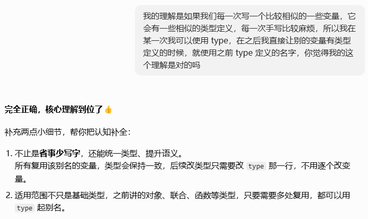

# TypeScript 入门指南

> 时间：约 20 分钟 | 难度：入门

**TypeScript = JavaScript + 类型提示系统**

它不是一门完全新的语言，而是在 JS 上加了一层"提前检查"的能力。代码里你看到的很多 `: string`、`interface`、`type`、`<T>`，本质都是在告诉编译器和编辑器：

> 这个变量、函数参数、组件 props、接口返回值，应该长什么样。

---

## 入门认知

### 1. 为什么用 TS？

- **类型检查**：编译时发现错误，而不是运行时
- **智能提示**：IDE 提供准确的代码补全
- **代码文档**：类型本身就是最好的注释
- **重构友好**：改名字、改结构时更安全

**TS 的核心价值：少写运行时报错，多在写代码时发现问题。**

---

### 2. TypeScript 怎么写

TS 是 JS 的**超集**，只是在 JS 代码基础上加了「类型标注」。核心规则只有一条：**在变量、函数参数、函数返回值后面加冒号说明类型**。

#### 类型标注的三种位置

```typescript
// 1. 变量声明
let count: number = 0;
let message: string = 'hello';

// 2. 函数参数 + 返回值
function greet(name: string): string {
  return 'Hi, ' + name;
}

// 3. 对象属性
interface User {
  name: string;
  age: number;
}

// 简化写法：不用单独声明，参数后面直接写类型
function fetchUser(id: number): Promise<User> {
  return fetch(`/api/users/${id}`).then(res => res.json());
}
```

> 拆解一下最后一种的写法
>
> ```
> function fetchUser(id: number): Promise<User>
>       │       │           │
>       │       │           └─ 返回值类型
>       │       └─ 参数类型
>       └─ 函数名
> ```

#### TS 文件后缀

| 文件   | 说明                             |
| ------ | -------------------------------- |
| `.js`  | 纯 JavaScript                    |
| `.ts`  | TypeScript（不含 JSX）           |
| `.tsx` | TypeScript + JSX（React 项目用） |

#### 编译流程

```
.ts 文件 --[tsc 编译]--> .js 文件
                            ↓
                      浏览器只运行 .js
```

> 💡 **记住**：TS 只是给 JS 加了「类型标注」，最终浏览器运行的还是编译后的 .js 文件。

---

## 基本类型

这一部分解决的是：**一个值「是」什么类型**。所有类型最终都是这些基础形状的组合。

### 3. 基础类型

```typescript
// 基础类型
let name: string = '张三';
let age: number = 25;
let isStudent: boolean = true;

// 数组
let nums: number[] = [1, 2, 3];
let names: Array<string> = ['a', 'b'];

// 元组：固定长度、固定类型
let tuple: [string, number] = ['hello', 42];

// 枚举
enum Color { Red, Green, Blue }	//定义枚举
let c: Color = Color.Green;		//使用

// any：放弃类型检查（尽量少用）
let anything: any = 4;
anything = 'string'; // OK

// void：没有返回值
function log(): void {
  console.log('hello');
}

// null 和 undefined
let n: null = null;
let u: undefined = undefined;
```

> 这里的数组写法，两种都一样，只是风格不同
>
> ```
> let nums: number[] = [1, 2, 3];       // 语法 1：类型 + []
> let names: Array<string> = ['a', 'b']; // 语法 2：Array<类型>
> ```
>
> 前者更像C/Java，后者是泛型写法
>
> 一半用前者 比较简洁

---

### 4. 函数类型

```ts
function add(a: number, b: number): number {
  return a + b
}
```

> 返回值可以不写，让 TS 推断：
>
> ```
> function add(a: number, b: number) {
>   return a + b  // TS 知道返回 number
> }
> ```

---

### 5. 对象类型：type & interface

这两个单词分别有翻译，前者叫"类型别名"，后者叫"接口"。

定义对象结构、可选属性、只读属性、类型标注：

```ts
type User = {
  id: number
  name: string
  email?: string   // ? 表示可选
}
```

也可以用 `interface`，效果一样：

```ts
// 接口：定义对象结构
interface User {
  name: string;
  age: number;
  email?: string;       // 可选属性
  readonly id: number;  // 只读属性
}
```

**type vs interface 的区别**

在纯对象类型定义里，`type` 和 `interface` 都差不多，但还是有区别：

| 特性         | `type`（对象场景）                | `interface`（对象场景）                  |
| ------------ | --------------------------------- | ---------------------------------------- |
| **声明合并** | ✖，同名 `type` 会直接报错         | ✔，同名 `interface` 会自动合并成一个类型 |
| **扩展方式** | 用交叉类型 `&` 来扩展             | 用 `extends` 关键字来继承 / 扩展         |
| **语法形式** | 必须用 `=` 赋值，后面跟对象字面量 | 直接声明接口，不需要 `=`                 |

**1. 声明合并：interface 独有的特性**

`interface` 支持**声明合并**，多个同名的 `interface` 会自动合并成一个类型；但 `type` 不支持，同名会直接报错。

```ts
// interface 支持声明合并
interface User {
  name: string
}
interface User {
  age: number
}
// 合并后 User 等价于：{ name: string; age: number }
const user: User = { name: "张三", age: 18 } // ✅ 正常通过

// type 不支持同名声明，会报错
type UserType = { name: string }
// 下面这行会直接报错：标识符"UserType"重复。
type UserType = { age: number }
```

**2. 扩展方式：写法不同，但效果类似**

- `interface` 用 `extends` 继承 / 扩展
- `type` 用交叉类型 `&` 来扩展

```ts
// interface 扩展
interface BaseUser {
  id: number
  name: string
}
interface Admin extends BaseUser {
  role: "admin"
}
// Admin 等价于 { id: number; name: string; role: "admin" }

// type 扩展
type BaseUserType = {
  id: number
  name: string
}
type AdminType = BaseUserType & {
  role: "admin"
}
// AdminType 等价于 { id: number; name: string; role: "admin" }
```

---

### 6. 类型组合：联合、交叉与 type 进阶

`type` 的中文叫"**类型别名**"，作用是**给已存在的 TS 类型起一个新名字**，后续直接用这个新名字代替原类型。

除了对象，它还可以为几乎所有 TS 类型起别名，包括基础类型、联合类型、元组、函数类型等。

> `type` 不是给变量起名字，而是给类型起名字，这一点会比较绕。

#### 解释

```ts
// 1. 给原生 string 起新名字：UserID
type UserID = string;

// 2. 给原生 number 起新名字：StatusCode
type StatusCode = number;
```

- `UserID` = 等价于原生 `string`
- `StatusCode` = 等价于原生 `number`
- 本质是**别名映射**，新名字完全等同于右边的原生类型




#### **定义联合类型**

```ts
type StringOrNumber = string | number;

let value: StringOrNumber;
value = "hello"; // ✔
value = 123;     // ✔
value = true;    // ✖ 不是 string/number
```

#### **字符串字面量联合（枚举场景）**

```ts
// 定义状态只能是这三个值之一
type Status = "success" | "error" | "loading";

function fetchData(a: Status) {
  console.log(a);
}

fetchData("success"); // ✔
fetchData("pending"); // ✖ 报错，不在允许的列表里
```

#### **交叉类型（Intersection Types）**

交叉类型用 `&` 表示，它可以将多个类型合并为一个，常用于对象类型的扩展。

```ts
type User = {
  id: number;
  name: string;
};

type WithRole = {
  role: "admin" | "user";
};

// 合并两个类型，得到一个新类型
type AdminUser = User & WithRole;

const admin: AdminUser = {
  id: 1,
  name: "张三",
  role: "admin" // ✔ 必须同时包含 User 和 WithRole 的所有属性
};
```

> 注意：交叉类型不是简单的"取交集"，而是将多个类型的成员合并。如果两个类型有同名但类型冲突的属性，会得到 `never` 类型。

---

### 7. 特殊类型：any、unknown

#### any：放弃类型检查

```ts
let data: any
data.abc.def.xxx()  // TS 不会管
```


#### unknown：更安全的 any

`unknown` 表示"我暂时不知道是什么，用之前必须判断"：

```ts
function handle(value: unknown) {
  if (typeof value === "string") {
    console.log(value.toUpperCase())
  }
}
```

简单记：**any 是不管，unknown 是用之前先判断**。

> 可能你会有疑问：unknown 都不知道类型是什么，怎么去做类型检查？
>
> 这是因为我们会先用 `if`、`typeof`、`instanceof`、`in` 先做判断，让 TS 在代码块里"识别"出具体类型。

```ts
// 手写判断语句：检查是不是字符串类型
if (typeof val === "string") {
  // 进入这个代码块，TS 确定 val 就是 string
  console.log(val.toUpperCase()); // ✔ 正常调用字符串方法
}
```

`instanceof` 的作用是：**检查左边的对象是不是右边类/构造函数创建出来的实例**，返回 `true` 或 `false`。

```ts
class Person {
  name = "小明";
}

let obj: unknown;
obj = new Person();

// 判断是不是 Person 实例
if (obj instanceof Person) {
  console.log(obj.name); // ✔ TS 识别为 Person 类型
}

// 也可以判断对象是否包含某个属性（常用接口/对象场景）
type User = { id: number };
let data: unknown = { id: 1001 };

// 判断是否存在 id 属性
if ("id" in data) {
  console.log(data.id); // ✔
}
```
> 💡 像上面这种"通过 `if/typeof/in/instanceof` 让 TS 推断出更具体类型"的写法，就叫 narrowing（类型缩小）。
---

## 类型的 3 种机制（怎么告诉 TS）

基本类型讲完了"**是什么**"，但 TS 还有个关键问题：**怎么把类型写出来**？

项目里你看到的所有类型标注，本质上就是下面 **3 种机制**之一，或者它们的组合：

| 机制 | 一句话 | 典型写法 |
| --- | --- | --- |
| **声明** | 直接把类型写出来 | `let a: number = 1` |
| **断言 `as`** | 强行告诉 TS 这个值的类型 | `"123" as string` |
| **泛型 `<T>`** | 把类型当参数传 | `Array<number>` |

后面几节分别讲这 3 种。

---

### 8. 机制 1：声明

声明是最常用、最直接的写法：把类型直接写出来。

```ts
// 1. 变量声明：变量: 类型
let a: number = 1
let name: string = "张三"
let isDone: boolean = true

// 2. 函数声明：参数: 类型，返回值: 类型
function add(a: number, b: number): number {
  return a + b
}

// 3. 类型别名 / 接口
type User = { id: number; name: string }
interface Product { id: number; price: number }
```

> 💡 TS 的 `:` 只有一个作用——**给左边标注类型**。所以 `path: string` 是给 `path` 标类型，`) : string` 是给函数返回值标类型。

声明的局限：**类型必须提前写死**。如果想让一个函数"既能处理 string 又能处理 number"——直接声明做不到，需要别的机制（见后面）。

---

### 9. 机制 2：断言 `as`

断言是"强行告诉 TS 我确信这个值是什么类型"。

```ts
const input = document.querySelector("input") as HTMLInputElement
input.value  
```

`document.querySelector` 默认返回的是 `Element | null`，没有 `.value`。用 `as HTMLInputElement` 告诉 TS"我确信它是 input"，编辑器就放行。

**断言的边界**

断言不能跨越完全无关的类型：

```ts
let a = "123" as boolean  // ✖ TS 不允许：string 和 boolean 没关系
```

但可以"绕个弯"骗过 TS：

```ts
let a = "123" as unknown as boolean  // ✔
```

但这只是骗过 TS，运行时它还是字符串。

> 断言的本质：**改变 TS 的类型判断，但不改变真实数据**。
> 所以「断言」不等于「类型转换」。

---

### 10. 机制 3：泛型 `<T>`

#### 引入

假如让你写一个「返回输入值本身」的函数，你会怎么写？

最朴素的写法是 `any`：

```ts
function identity(value: any): any {
  return value
}
```

能跑，但问题来了：

运行时崩溃

```ts
const result = identity("hello")
result.toFixed(2)  // 运行时崩溃！result 是字符串，没有 toFixed
```

那用具体类型呢？

**太死板**——只接受 number，传 string 就报错。

```ts
function identity(value: number): number {
  return value
}
identity("hello")  // ✖ 只能传 number
```

我们想要的是：**「进来什么类型，就出去什么类型」**——这正是泛型要做的事。

```ts
function identity<T>(value: T): T {
  return value
}

const a = identity<string>("hello")  // T = string，a 是 string
const b = identity<number>(123)      // T = number，b 是 number
```

> **一个真实踩坑案例**
>
> Vue 里用 `ref` 经常遇到：
>
> ```ts
> import { ref } from 'vue'
> 
> // 不用泛型
> const user = ref(null)
> 
> // TS 推断为 ref<null>，user.value 永远是 null
> user.value = { name: "张三" } // ✖ 报错
> ```
>
> 用泛型告诉 TS「它可能是 null，也可能是 User」：
>
>  ```ts
>  type User = { name: string }
>  const user = ref<User | null>(null)
>  user.value = { name: "张三" } // ✔
>  ```
>
>  这就是泛型在项目里**最实际的作用**——**让类型"可配置"，又保持类型安全**。


#### 泛型

`T` 是**类型变量**（你可以叫它 `T`、`U`、`K` 任何名字），它代表"未确定的类型"：

👉 **泛型 = 类型的“参数机制”**

- **定义时**：`T` 是占位符（"我先不决定"）

```ts
function fn<T>(value: T): T {
  return value
}
```

- **使用时**：传一个具体类型进去（"现在我决定它是 number"）

```ts
fn<number>(123)
```


类比函数参数：

```ts
function add(a, b) { return a + b }   // 运行时参数
function fn<T>(value: T) { ... }      // 类型参数
```

普通函数的参数是"运行时传值"，泛型的 `<T>` 是"**编译时传类型**"。

**`<T>` 不写可以吗？**

可以，TS 会自动推断：

```ts
identity("hello")   // 自动推断 T = string
identity(123)        // 自动推断 T = number
```

效果跟 `identity<string>("hello")` 一模一样。

那什么时候必须写？——当 TS 推不出来，或者你想明确指定时。

最常见的是封装请求：

```ts
async function request<T>(url: string): Promise<T> {
  const res = await fetch(url)
  return res.json()
}

const user = await request<User>("/api/user")
//                           ↑ 必须写<User>，否则 TS 不知道返回什么
```


**泛型不止用在函数**

函数、类型别名、接口、类都能用泛型。Vue/React 源码里到处都是：

```ts
// 类型别名
type ApiResponse<T> = {
  code: number
  data: T
}

// 接口
interface ListProps<T> {
  items: T[]
  render: (item: T) => void
}
```

写法都是 `<T>`，含义都是「**这里有个待定的类型**」。


---

## 实战与避坑

### 11. null、undefined 与可选链

**先分清两个东西**

| 值 | 含义 | 何时出现 |
|---|---|---|
| `null` | "这里本来就没有"（主动给空值） | 后端返回 `null`、变量刚声明还没值 |
| `undefined` | "这里应该有值，但还没给"（系统给的） | 没初始化的变量、不存在的对象属性、函数没 return |

```ts
// null：明确告诉程序"这里没有"
let user: string | null = null

// undefined：声明了，但还没赋值
let value: string   // 此刻 value === undefined
```


由于 TS 类型检查很严格——如果类型明确定义为是 `string`，就不能传 `null` 或 `undefined`：

```ts
let name: string = "张三"
name = null        // ✖ 报错：string 不接受 null
```

这就逼着你明确写出"可能为空"：

```ts
let name: string | null = "张三"
name = null        // ✔ 接受

function greet(name: string | null) {
  console.log(name.toUpperCase())  // ✖ name 可能是 null，不能直接用
}
```

TS 编译器会因为"**name 可能是 null**"阻止你调用方法——这是好事，能避免线上崩溃。

#### 怎么用（三种方法）

**方式 1：手动判断**（最直白）

```ts
function greet(name: string | null) {
  if (name !== null) {
    console.log(name.toUpperCase())  // ✔ 这里 name 一定是 string
  }
}
```

**方式 2：可选链 `?.`**（项目里最常用）

`?.` 的意思：**左边是 `null` 或 `undefined`，就直接返回 `undefined`，不继续往下找**。

```ts
const user = data?.user
// data 没值时，user 就是 undefined（不会报错）
```

链式调用也很安全：

```ts
const street = user?.address?.street
// user 不存在 → 整个表达式就是 undefined
// user.address 不存在 → 整个表达式就是 undefined
// 都不会报错
```

**方式 3：空值合并 `??`**（给个默认值）

`??` 的意思：**左边是 `null` 或 `undefined`，就用右边的默认值**。

```ts
const name = user?.name ?? "匿名"
// user 没值时，name = "匿名"
// user.name = "" 时，name = ""（空字符串不是 null/undefined，会保留）
```

> 💡 `??` vs `||` 的区别
>
> ```ts
> "" || "默认值"      // "默认值"  ← 空字符串被认为是「假」
> "" ?? "默认值"      // ""        ← 只有 null/undefined 才用默认值
> ```
>
> 项目里给个名字、给个数字，**优先用 `??`**，更精确。


**举个例子**

```ts
const displayName = data?.user?.name ?? "匿名"
```

拆解一下：

1. `data?.user?.name` → 安全地拿到名字，可能是 `undefined`
2. `?? "匿名"` → 拿到的是 `undefined` 时，用"匿名"顶上去
3. `displayName` → 一定是 string（TS 推断出来的）

> **记住这三种工具**：`?:`（可能是空）、`?.`（安全访问）、`??`（兜底默认值）——它们都是项目里每天都要用的。

---

### 12. 常用工具类型

#### Partial：所有属性变可选

```ts
type User = { id: number; name: string; email: string }
type PartialUser = Partial<User>
// 等价于 { id?: number; name?: number; email?: string }
```

#### Pick：挑选部分属性

```ts
type UserPreview = Pick<User, "id" | "name">
// 等价于 { id: number; name: string }
```

#### Omit：排除部分属性

```ts
type UserWithoutEmail = Omit<User, "email">
```

#### Record：键值对类型

```ts
type UserMap = Record<string, User>  // key 是 string，value 是 User
```

> 这几个工具类型的写法都是 `工具<类型>`——本质上都是**泛型**的应用（机制 3）。

---

### 13. 组件 Props 类型

组件的 props 是 TS 在前端项目里最常出没的地方——少传一个、传错一个，编辑器立刻报错。

#### React 版本

```tsx
type ButtonProps = {
  text: string           // 必填
  onClick: () => void    // 必填
  disabled?: boolean     // 可选
}

// 调用时
<Button text="点我" onClick={handleClick} />
// 少传 onClick 会立刻报错
```

#### Vue 3 版本

```vue
<script setup lang="ts">
// 用 defineProps<{}>() 给 props 标类型
const props = defineProps<{
  text: string
  onClick: () => void
  disabled?: boolean
}>()
</script>

<template>
  <button :disabled="props.disabled" @click="props.onClick">
    {{ props.text }}
  </button>
</template>
```

写法上：

- **React**：用 `type Props = { ... }` 单独定义，组件参数位置接收
- **Vue 3**：用泛型 `defineProps<{ ... }>()`（机制 3：泛型）

两种框架**本质都是"用 TS 标 props 类型"**，只是语法不同。

---

### 看项目时重点看什么

不用把 TS 所有语法都学完，优先看这几种：

```ts
type Xxx = { ... }                              // 声明
interface Xxx { ... }                           // 声明
function fn(a: Type): ReturnType                // 声明
Promise<T>                                      // 泛型
T[]                                             // 泛型
A | B                                           // 声明
Partial<T> / Pick<T, K> / Omit<T, K> / Record<K, V>  // 泛型
as Xxx                                          // 断言
```

**这 8 条全部对应"3 种机制"，没有第四种**——把它们看懂，80% 的项目 TS 代码就能读下去。
