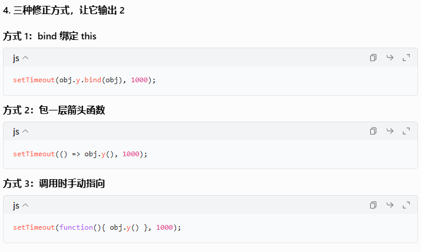

## 数据类型

### 概述

* 原始类型（primitive type）
  
  ```
   数值（number）：整数和小数
   字符串（string）
   布尔值
  ```
* 合成类型（complex type）
  
  ```
  对象（object）：分为狭义对象（object）、数组（array）、函数（function）
  ```
* 特殊值
  
  ```
   undefined：未定义
   null：空值
  ```

undefined是本来该有值的地方你没设值，是一种异常情况，所以它返回数值时是NAN.

null表示一个变量明确的被赋值成空值，所以返回0.


1. 类型

   `typeof undefined ` 返回 `"undefined"`。

   `typeof null` 返回 `"object"`（这是一个历史遗留问题，实际上`null`并不是一个对象）

   ```
   console.log(typeof undefined); // 输出："undefined"
   console.log(typeof null); // 输出："object"
   ```

   > 因为一开始公司设置的数据类型只有对象、整数、浮点数、字符串和布尔值。
   >
   > 只把null当做特殊对象，所以typeof null返回object。
   >
   > 后来`null`独立出来，作为一种单独的数据类型，为了兼容以前的代码，`typeof null`返回`object`就没法改变了。

2. 相等性

   ```
   console.log(undefined == null); // 输出：true,因为它们都被认为是空值。
   console.log(undefined === null); // 输出：false,因为它们类型不同
   ```

   总结：

   undefined表示变量未赋值或未定义

   null表示变量明确被赋值为空。

## MDN

## JS第一步🦘

<h3>什么是JS</h3>

JS是一种脚本编程语言，可以让网页提供实时内容更新。

**API分类**

全称是Application Programming Interface.应用程序接口

分为3rd party APIs,Browser APIs


有以下几种常用API


**JS用途**

常见用途是按照文档对象模型API动态修改HTML，CSS


**内部JS**

就是在html文件中添加< script>blablablabla< /script>。 bla就是js语言

**外部JS**

在html文件中引用外部文件。< script src="script.js" defer>< /script>

**内联JS**

直接在html的标签中添加事件处理。

---

**常见定义解释**

* 解释&编译：分别是interpret,compile.先解释编译，编译型语言是说代码要转化成另一种形式才能运行。比如C和C++先要编译成机器码，然后才能由计算机运行。解释型语言是说，代码自上而下运行，且**实时返回运行结果**。
* `监听控件.addEventListener("监听事件"，"处理器")  `：监听控件发生的事件并分配处理器


**脚本阻塞**

由于HTML是自上而下运行，所以有时候遇见js了就不往下运行了，这时候常用defer，不过是外部js的时候。

*  `DOMContentLoaded` 事件，表示HTML 文档体完全加载和解析。（一般用在html加载完毕再运行js的时候）
* `defer`：（仅对外部脚本有效，而且通常是放到< head>标签中）常见于< script src="script.js" defer>< /script>。defer告知浏览器在遇到 `<script>` 元素时先把HTML 内容解析完以后再执行js脚本，而不是遇见脚本就立即执行。（适用于脚本中有很多DOM的情况）有助于减缓阻塞。（defer的翻译是推迟，延缓）
* `async`：脚本下载完就立即执行。也就是可能会边解析HTML文档边解析脚本。
* 如果你直接把js脚本文件放在HTML代码底端，那上面的都是浮云，完全不需要使用了，因为计算机直接运行完上面的再运行js。


## 循环&条件语句

`for...of` 循环为你提供了一种获取数组中的每一个元素的方法

例子

```
const fruits = ["apples", "bananas", "cherries"];
for (const fruit of fruits) {
  console.log(fruit);
}
```

`for (const fruit of fruits)` 这一行的意思是：

1. 把 `fruits` 中的第一个元素设置成`fruit`。
2. 运行`{}` 。
3. 获取 `fruits`中的下一个元素，重复步骤 2，直至到达 `fruits` 的末尾。

---

**循环**

循环并不难，但是在一些算法题目中容易绕进去，希望你冷静思考，不要妄自菲薄，熟练度上来以后会好很多。

while(	){	}

do{	}while(	)

-- 

break 跳出循环（只跳出最近的一层循环）

continue 跳出迭代 （跳出最近一层）


**条件**

if(	)else{	}

if(	){	}else if(	){	}else{	}


## 变量

变量可以存储任何东西，比如变量可以存储数值。但是变量不是数值本身，变量只是装数值的容器。

声明一个变量的语法是在 `var` 或 `let` 关键字之后加上这个变量的名字、


<h5>变量提升</h5>

指的是你可以先用这个变量，在后面再声明它。

name="chris";  var name;


不过这样写是错误的，var myName = "Chris"; var myName = "Bob";


<h5>变量命名规则</h5>

你应当坚持使用拉丁字符 (0-9,a-z,A-Z) 和下划线字符。

- 变量名不要以下划线开头——以下划线开头的被某些 JavaScript 设计为特殊的含义，因此可能让人迷惑。
- 变量名不要以数字开头。这种行为是不被允许的，并且将引发一个错误。
- 一个可靠的命名约定叫做 ["小写驼峰命名法"](https://en.wikipedia.org/wiki/CamelCase#Variations_and_synonyms)，用来将多个单词组在一起，小写整个命名的第一个字母然后大写剩下单词的首字符。我们已经在文章中使用了这种命名方法。
- 让变量名直观，它们描述了所包含的数据。不要只使用单一的字母/数字，或者长句。
- 变量名大小写敏感——因此`myage`与`myAge`是 2 个不同的变量。
- 最后也是最重要的一点——你应当避免使用 JavaScript 的保留字给变量命名。保留字，即是组成 JavaScript 的实际语法的单词！因此诸如 `var`、`function`、`let` 和 `for` 等，都不能被作为变量名使用。浏览器将把它们识别为不同的代码项，因此你将得到错误。


<h5>动态类型</h5>

JavaScript 是一种"动态类型语言"，这意味着不同于其他一些语言 (译者注：如 C、JAVA)，你不需要指定变量将包含什么数据类型（例如 number 或 string）。

let myString = "Hello";

## 文本处理 字符串

在 JavaScript 中，你可以选择单引号（`'`）、双引号（`"`）或反引号（```）来包裹字符串。

字符串的开头和结尾必须使用相同的字符，否则会出现错误。

<h5>模板字面量</h5>

使用反引号声明的字符串是一种特殊字符串，被称为[*模板字面量*](https://developer.mozilla.org/zh-CN/docs/Web/JavaScript/Reference/Template_literals)。在大多数情况下，模板字面量与普通字符串类似，但它具有一些特殊的属性。


在模板字面量中，你可以在 `${ }` 中包装 JavaScript 变量或表达式，其结果将被包含在字符串中：

```
const name = "克里斯";
const greeting = `你好，${name}`;
console.log(greeting); // "你好，克里斯"
```

你可以使用相同的技术来连接两个变量：

```
const one = "你好，";
const two = "请问最近如何？";
const joined = `${one}${two}`;
console.log(joined); // "你好，请问最近如何？"
```

像这样连接字符串被称为*串联*（concatenation）。


如果你不想使用模板字面量，只想使用普通字符串，

可以写

```
const greeting = "你好";
const name = "克里斯";
console.log(greeting + "，" + name); // "你好，克里斯"
```

> 用加号"+"尽情的连接吧！

但是，模板字面量通常更具可读性：

```
const greeting = "你好";
const name = "克里斯";
console.log(`${greeting}，${name}`); // "你好，克里斯"
```


更复杂一点的模板字面量中可以包含js表达式：

```
const song = "青花瓷";
const score = 9;
const highestScore = 10;
const output = `我喜欢歌曲《${song}》。我给它打了 ${
  (score / highestScore) * 100
} 分。`;
console.log(output); // "我喜欢歌曲《青花瓷》。我给它打了 90 分。"
```


:christmas_tree:当你想在字符串中输入双引号或者单引号的时候该怎么做呢？

输入双引号：

> 一种是换其他字符来声明字符串，之前说过字符串还可以用单引号和反引号声明
>
> ```
> const goodQuotes1 = 'She said "I think so!"';
> const goodQuotes2 = `She said "I'm not going in there!"`;
> ```

输入单引号' ：

> 可以用转义字符，单引号'的转义字符是\'
>
> ```
> const bigmouth = 'I\'ve got no right to take my place…';
> console.log(bigmouth);
> //I've got no right to take my place…
> ```

## 数组

<h4>数组的定义和简单使用</h4>

数组是包含了多个值的对象。

数组也是个对象，与其他对象的区别是我们可以单独访问列表中的每个值。

**创建数组：**

```
let shopping = ["bread", "milk", "cheese", "hummus", "noodles"];
let random = ["tree", 795, [0, 1, 2]];	//混合项目
```

**访问和修改数组元素：**

用方括号访问：

shopping[0];

数组中包含数组的话称之为多维数组。你可以通过将两组方括号链接在一起来访问数组内的另一个数组:

random[2] [2];

**获取数组长度：**

```
sequence.length;
```


<h4>有趣的方法</h4>

**spilt方法：用于分割字符串去存进数组中**


**join方法与方法：把数组每个项组合起来存进字符串**


<h4>添加和删除数组项</h4>

添加一个或多个要添加到数组末尾的元素`push()`

```
myArray.push("Cardiff");
myArray;
myArray.push("Bradford", "Brighton");
myArray;
```

从数组中删除最后一个元素的话直接使用 `pop()`

```
myArray.pop();
```


`unshift()` 和 `shift()` 从功能上与`push()` 和 `pop()`完全相同，只是它们分别作用于数组的开始，而不是结尾。

```
myArray.unshift("Edinburgh");	//unshift意思是平移
myArray;
```


```
let removedItem = myArray.shift();
myArray;
removedItem;
```


## 函数

函数是可复用的代码块，要使用这个代码块呢，只需要一个简短的命令来调用。

<h4>浏览器内置函数</h4>

太多咯，比如replace、join...

<h4>自定义函数</h4>

function name(){

​	//开始定义

}

name();	//开始使用


<h4>函数与方法</h4>

对象的成员的函数被称为**方法**。

很多时候内置代码是同属于函数和方法的。比如string a.replace();

此时这个replace就是属于a对象的方法，但它也是内置函数哦、


<h4>参数</h4>

常见一点的知识就不写了。

参数(parameter)我们也可以叫做属性(property)、argument、特性(attribute)。

有时候也可以设置默认参数

function hello（name）{		};	//指的是name是默认属性

function hello（name="克里斯"）{		}；	//指的是name是默认属性，克里斯是默认值


<h4>匿名函数和默认值</h4>


### 箭头函数

==(参数)=>{执行的内容}==

举例：

```
textBox.addEventListener("keydown", (event) => {
  console.log(`You pressed "${event.key}".`);
});
```

如果函数只接受一个参数，可以省略参数周围的括号：

```
textBox.addEventListener("keydown", event => {
  console.log(`You pressed "${event.key}".`);
});
```

最后，如果函数只包含一行 `return` 语句，也可以省略圆括号和 `return` 关键字，隐式地返回表达式。在下面的示例中，我们使用 `Array` 的 [`map()`](https://developer.mozilla.org/zh-CN/docs/Web/JavaScript/Reference/Global_Objects/Array/map) 方法将原始数组中的每个值加倍：

```
const doubled = originals.map(item => item * 2);
```


### 注意(声明

在JavaScript中，函数的定义和声明有时候可以混淆，但它们实际上指的是同一件事情，只是表达方式有所不同。以下是它们的区别和使用场景：

1. **函数声明 (Function Declaration)**:
   - 使用 `function` 关键字来定义函数。
   - ==函数声明会被提升（hoisted）==，这意味着在执行代码之前就可以访问函数。
   - 示例：
     ```javascript
     function add(a, b) {
         return a + b;
     }
     ```

2. **函数表达式 (Function Expression)**:
   - 将函数赋值给变量，或者将函数作为匿名函数直接使用。
   - 函数表达式不会被提升（==匿名函数也不会被提升==，匿名函数也可以当做函数表达式），只有在执行到达它们定义的位置时，才能访问到这些函数。
   - 示例：
     ```javascript
     var add = function(a, b) {
         return a + b;
     };
     ```
   - 或者使用匿名函数：
     ```javascript
     var add = function(a, b) {
         return a + b;
     };
     add(4,7);
     ```
   
3. **箭头函数 (Arrow Function)**:
   - ES6引入的新特性，提供了一种更简洁的函数定义方式。
   - 箭头函数有更短的语法，并且词法上绑定 `this`。
   - 示例：
     ```javascript
     var add = (a, b) => a + b;
     ```

**总结**：
- 如果你希望函数在代码中任何地方都可以被调用（因为函数声明会被提升），可以使用函数声明。
- 如果你希望在一个表达式中定义函数（比如将函数赋值给变量），或者希望定义匿名函数，可以使用函数表达式。
- 如果你希望使用更现代的语法，尤其是在处理简单函数时，可以考虑使用箭头函数。

在实际应用中，通常会根据具体的需求和代码风格来选择适合的方式来定义函数。

### 注意(传参简化

```
function logKey(event) {
  console.log(`You pressed "${event.key}".`);
}

textBox.addEventListener("keydown", logKey);
```

上面所有代码简化成以下，用匿名函数

```
textBox.addEventListener("keydown", function (event) {
  console.log(`You pressed "${event.key}".`);
} );

```

还可以进一步简化，用箭头函数

```
textBox.addEventListener("keydown", (event) => {
  console.log(`You pressed "${event.key}".`);
});
```


### 调用知识

```
btn.onclick = displayMessage;
```

btn绑定的是button，当button被点击的时候，函数就会被调用。

不过那可能会想为什么右边的函数没有加括号呢？这是因为一旦加上括号，就会立即被调用，管你此时有没有被点击呢

比如btn.onclick=displayMessage();	

不过可以写**匿名函数**。因为匿名函数并不会直接执行，前提是代码要在函数作用域内。

btn.onclick=function(){  }


## 事件

事件是你正在编程的系统中发生的事情。（事件是在浏览器窗口内触发的）

事件产生，系统触发某种信号，并且触发一些可自选机制。

> 事件举例：
>
> 用户按下某个按键
>
> 用户悬停光标
>
> 网页结束加载
>
> 表单提交
>
> 视频的播放、暂停或结束
>
> 发生错误

### 事件处理器

<h4>addEventListener()</h4>

addEventListener("事件"，"调用函数")

这里的事件可以是

- `focus` 和 `blur`：当按钮被聚焦或失焦时，颜色会改变；尝试按下 tab 键来聚焦于按钮，再次按下该键来使按钮失去焦点。这些事件通常用于在聚焦时显示填入表单字段的信息，或者在表单字段填入不正确的值时显示错误信息。
- `dblclick`：颜色只在按钮被双击时改变。
- `mouseover`和 `mouseout`：当鼠标指针在按钮上悬停，或指针移出按钮时，颜色分别会改变。


<h5>移除监听器</h5>

方法一：使用`removeEventListener()`方法，负责删除事件处理器。内部两个参数，一个事件名，一个函数。

方法二：通过信号法删除。

大体是说先创建一个处理器对象。

然后在事件处理器内部，比如addEventListener内部添加一句话，这句话的意思是向该处理器传递信号。

然后在事件处理器外，调用处理器的中止功能。（abort是中止的意思）

```
const controller = new AbortController();	//创建对象，controller叫做处理器

btn.addEventListener("click",
  () => {
    const rndCol = `rgb(${random(255)}, ${random(255)}, ${random(255)})`;
    document.body.style.backgroundColor = rndCol;
  },
{signal: controller.signal })  //在addEventListener内部 向该处理器传递 Signal;


controller.abort();// 移除任何 所有与该控制器相关的事件处理器

```


<h5>在单个事件上添加多个监听器</h5>

你可以为一个事件设置多个处理器

myElement.addEventListener("click",functionA);

myElement.addEventListener("click",functionB);

当点击按钮，这两个处理器函数都会运行


<h5>其他事件监听器机制</h5>

除了addEventListener()监听事件，还有两种事件处理器方式。

**一种是通过属性处理，一种是内联事件处理器**

事件处理器属性：我们常常选择按钮button作为触发事件的对象，这种可以触发事件的对象通常也有属性可以监控触发。比如button.onclick=()=>{ }；这个onclick属性就是监听点击的。也可以是button.onclick=change; 这个change函数在其他地方定义过。

> 不过上面我们提过可以给一个事件添加多个函数处理，但那只适用addEventListener()，并不适用事件属性处理器
>
> 比如element.onclick=func1;element.onclick=func2;
>
> 这里后面的函数只会覆盖掉前面的函数。


内联事件处理器：指的是< button onclick="change()">Click me！< /button>

这样是完全不建议使用的，一是有各种隐患，二是维护不方便。比如你想统一修改触发change的控件，这样就得一个个修改。


### 事件对象

放在事件处理函数的**参数**当中

```
btn.addEventListener("click", bgChange);	//btn绑定的是button

function bgChange(e) {
  const rndCol = `rgb(${random(255)}, ${random(255)}, ${random(255)})`;
  e.target.style.backgroundColor = rndCol;
  console.log(e);
}
```

在上面的代码中，可以看到触发的函数传入的参数是e,其实这里传入`event`,`evt`,`e`都可以

> 以往我们常常会给bgChange传入函数运转需要的参数或者不提供，这里我们传入e。这里的e指的就是触发的

这个东西叫**事件对象**，它会自动传递给事件处理函数。

> 回到代码，e.target指的是控件本身（这里代码没有展示完毕，我们绑定的是button）
>
> target是e的属性，负责对元素进行引用。所以这里改变颜色改变的是button的颜色，而不是html背景颜色。


针对不同的事件，事件对象有时候有一些额外的属性。在上个代码中，事件对象具有target属性，这个是通用的。不过针对keydown事件，事件对象额外的属性就是key，告诉你哪个键被按下。


### 阻止默认行为

有时你希望事件结束后不要立即执行默认行为。

比如用户提交表单，有时表单自己有一些简单的验证，但由于过于简单，很多信息筛错筛不出来，所以需要开发者自己写验证信息。

不过这不重要，重要的是用户有时会提交错误的信息，还按下了提交按钮，这时怎么阻止呢？

```
//以下是一个简单的例子

form.addEventListener("submit", (e) => {
  if (fname.value === "" || lastname.value === "") {
    e.preventDefault();
    para.textContent = "You need to fill in both names!";
  }
});
指的是在form当中的提交触发时，如果当中的input有任一是空的，就触发以下事件。并且触发完毕我们还会告诉用户应该修改哪里。
```


## 事件嵌套传递

### 事件冒泡

事件冒泡描述了浏览器如何针对嵌套元素的事件。

事件原理：当一个元素嵌套在父元素里，当你点击这个元素，同时也隐含的点击了它的父元素。（好比一个盒子里有巧克力，当你取巧克力，你不可避免的就碰到盒子）

<h5>冒泡实例</h5>

```
<body>
  <div id="container">
    <button>点我！</button>
  </div>
</body>
```

当你给div、button、body都绑上监听器，再来个处理函数

```
function handleClick(e) {
  output.textContent += `你在 ${e.currentTarget.tagName} 元素上进行了点击\n`;
}
```

会出现如下结果：


这上面其实插入了一张空白图片，当你点击浅蓝色区域，会出现`你在 BUTTON 元素上进行了点击
你在 DIV 元素上进行了点击
你在 BODY 元素上进行了点击`

当你点击深蓝色区域，会出现`你在 DIV 元素上进行了点击
你在 BODY 元素上进行了点击`

当你点击白色区域，会出现`你在 BODY 元素上进行了点击`


在这种情况下：

- 最先触发按钮上的单击事件
- 然后是按钮的父元素（`<div>` 元素）
- 然后是 `<div>` 的父元素（`<body>` 元素）

==我们可以这样描述：事件从被点击的最里面的元素**冒泡**而出。==


### 阻止传递

(指的是阻止事件冒泡传递)

<h5>使用 stopPropagation() 修复问题</h5>

但不是所有时候我们点击元素都希望触发它的父元素的，有一个方法可以防止这些问题。[`Event`](https://developer.mozilla.org/zh-CN/docs/Web/API/Event) 对象有一个可用的函数，叫做 [`stopPropagation()`](https://developer.mozilla.org/zh-CN/docs/Web/API/Event/stopPropagation)，当在一个事件处理器中调用时，可以防止事件向任何其他元素传递。

>  首先要找出你想要阻止什么事件，然后在事件内部施加语句

例如，

```
video.addEventListener("click", (event) => {
  event.stopPropagation();	//
  video.play();
});
```


### 事件冒泡应用

事件冒泡可以实现**事件委托**。

通俗来讲，一个父元素往往包含很多子元素，有时候监听器相同时，你不需要在每个子元素上安置监听器，只需要在父元素上安一个即可。因为子元素上的改变会传导到父元素上。


## event.target

我们使用 `event.target`来获取事件的目标元素（也就是最里面的元素）。

如果我们想访问处理这个事件的元素（在这个例子中是容器），我们可以使用`event.currentTarget`。

(不懂的结合MDN当前页面例子就懂了，这里只是mark一下)


## 事件捕获

它也是事件传递，但顺序与事件冒泡 相反。

> 事件冒泡是先在最内层的目标元素上发生，然后在逐层往父元素发生。
>
> 事件捕获在先在最外层父元素发生，再往内发生。
>
> //
>
> 专业术语：
>
> 事件冒泡：先在最内层的目标元素上发生，然后在连续较少的嵌套元素上发生。
>
> 事件捕获：事件先在*最小嵌套*元素上发生，然后在连续更多的嵌套元素上发生，直到达到目标。


**事件捕获默认是禁用的，你需要在 `addEventListener()` 的 `capture` 选项中启用它。**

> ```
> container.addEventListener("click", handleClick, { capture: true });
> ```


## 对象🦘

```
const objectName = {
  member1Name: member1Value,
  member2Name: member2Value,
  member3Name: member3Value,
};
```

一个对象由许多的成员组成，每个成员都拥有一个名字和一个值。**每一组名字/值必须由逗号分隔，并且名字和值要用冒号分隔。**

> 对象成员的值是任意的，比如可以是数字，数组也可以是函数。
>
> 对象成员值是数字、数组的时候我们叫做对象的**属性**，也叫**数据项**。
>
> 对象成员值是函数的时候，即对象对数据可以进行某些操作时，我们称为**方法**。
>
> ```
> const person = {
>   name: ["Bob", "Smith"],	//数据项
>   age: 32,					//数据项
>   bio: function () {		//方法
>     console.log(`${this.name[0]} ${this.name[1]} 现在 ${this.age} 岁了。`);
>   },
> };
> ```
>
> 这里的函数写法可能看起来有点奇怪，这的确不是我们最简单的写法。
>
> ```
> bio(){
> 	console.log(...);
> }
> ```
>
> ==上面的被称为**对象字面量**，手动的写出对象的内容来创建对象。==是我们自己手写创建的对象，而不是直接用模板生成的

### 点表示法

点表示法可以访问对象的属性和方法，对象的名字表现为一个**命名空间**。

当你想要访问对象内部的属性和方法时，命名空间必须写在第一位。然后输入一个点，紧接着是你想要访问的目标。

> 这个目标可以是简单属性的名字，或者是数组属性的子元素

person.age;

person.bio();

person.name[0];

<h5>子命名空间</h5>

从

```
const person = {
  name: ["Bob", "Smith"],
};
```

改成

```
const person = {
  name: {
    first: "Bob",
    last: "Smith",
  },
};
```

需要访问这些属性，只需要再一次用链式的点表示法。

person.name.first;

### 括号表示法

person.age变成 person.["age"];

person.name.first变成 person["name"] ["first"]

>  之前我们访问name里的元素用的是person.name[0]，这看起来很像是在访问数组，我们这里也用到了方括号，看起来也像是数组。
>
> 区别在于，它是使用关联值的名称来访问，而不是使用索引。
>
> 这里我们称之为**关联数组**，对象将字符串映射到值，而数组将数字映射到值。

点表示法通常优于括号表示法，因为它更易读。但是当出现对象的属性名称是***变量***时，必须使用括号表示法。

```
const person = {
  name: ["Bob", "Smith"],
  age: 32,
};

function logProperty(propertyName) {
  console.log(person[propertyName]);	////括号表示法
}

logProperty("name");	
// ["Bob", "Smith"]
logProperty("age");
// 32
```

==在JavaScript中，使用括号表示法访问对象属性时，必须将属性名作为字符串传递，因此需要使用引号（单引号 `'` 或双引号 `"`）来包围属性名。否则，JavaScript会将其解释为变量名，而不是属性名的字符串==

==但是如果是变量，用括号表示法访问时可以不加字符串，但是得保证变量内存储的值必须是字符串==


### 设置对象成员

<h4>修改对象成员的值</h4>

person.age=45;

person["name"] ["last"]="CratChit";

<h4>创建新的成员</h4>

person["eyes"]="hazel";

//创建新的函数

person.farewell=function(){console.log("再见");}

<h4>设置对象成员</h4>

```
const myDataName = nameInput.value;
const myDataValue = nameValue.value;
person[myDataName] = myDataValue;
////应用
const myDataName = "height";
const myDataValue = "1.75m";
person[myDataName] = myDataValue;
```


### "this"的含义

之前我们用到过this

```
const person={
	name:"Chris",
	introduceSelf() {
  		console.log(`你好！我是 ${this.name[0]}。`);
  	}
}
```

关键字 `this` 指向了当前代码运行时的对象——这里指 `person` 对象

> 为什么不直接写person呢？
>
> 假如说我们这里只有一个对象，那你写写person无碍，但是当你要创建多个对象时，那肯定不能把person写进函数里了，因为我们每个对象都想用你这个函数。
>
> 所以这就体现了this的作用，它可以让你对每一个创建的对象都采取相同的方法定义。


### 构造函数

==只用==对象字面量在创建多个对象时是不够用的。

我们希望有这样一种方法，可以创建任意多个对象，只需要更新不同属性的值。

> 注：以下不是构造函数

```
function createPerson(name) {
  const obj = {};
  obj.name = name;
  obj.introduceSelf = function () {
    console.log(`你好！我是 ${this.name}。`);
  };
  return obj;
}
```

每次调用 `createPerson()` 函数时，它都会创建并返回一个新对象。该对象将具有两个成员：

- 一个 `name` 属性
- 一个 `introduceSelf()` 方法。


现在我们可以创建任意多个对象，重用该定义：

```
const salva = createPerson("Salva");	//==createPerson会返回一个obj，此时你把obj传给salva，即该==
salva.name;
salva.introduceSelf();
// "你好！我是 Salva。"

const frankie = createPerson("Frankie");
frankie.name;
frankie.introduceSelf();
// "你好！我是 Frankie。"
```


> 可以看到上面的salva和frankie的创建有点冗长了，我们需要新创建一个空对象，然后初始化它、返回它。
>
> 接下来我们使用构造函数。

**构造函数是使用new关键字调用的函数**

当你调用构造函数时，它将：

- 创建一个新对象
- 将 `this` 绑定到新对象，以便你可以在构造函数代码中引用 `this`
- 运行构造函数中的代码
- 返回新对象

让我们应用一下，首先重写示例。

function Person(name) {
  this.name = name;
  this.introduceSelf = function () {
    console.log(`你好！我是 ${this.name}。`);
  };
}

然后开始应用：

const salva = new Person("Salva");
salva.name;
salva.introduceSelf();
// "你好！我是 Salva。"

const frankie = new Person("Frankie");
frankie.name;
frankie.introduceSelf();
// "你好！我是 Frankie。"


## 对象原型

### 原型链

js中所有对象都有一个内置属性，叫做**prototype(原型)**。

原型本身也是一个对象，所以这个对象也有自己的内置属性，故原型也会有自己的原型。这就构成了**原型链**。

原型链止于 null作为其原型的对象。


<h4>访问原型</h4>

访问对象原型的标准方法是Object.getPrototypeof( )；

当你试图访问一个对象的属性时，如果在对象本身找不到该属性，就会在原型链中搜索该属性，如果仍然找不到该属性，就会搜索原型的原型，以此类推，直到找到属性或者到达链的末端(返回undefined)。

所以，在调用 `myObject.toString()` 时，浏览器做了这些事情：

- 在 `myObject` 中寻找 `toString` 属性
- `myObject` 中找不到 `toString` 属性，故在 `myObject` 的原型对象中寻找 `toString`
- 其原型对象拥有这个属性，然后调用它。

<h4>原型是什么</h4>

有个对象叫Object.prototype，它是最基础的原型（因为它指向null），所有对象都默认拥有它。

> Object.prototype自身没有原型，它是原型链的终点。


但是一个对象的原型并不一定总是Object.prototype，

```
const myDate = new Date();
let object = myDate;

do {
  object = Object.getPrototypeOf(object);
  console.log(object);
} while (object);

// Date.prototype
// Object { }
// null
```

所以myDate的原型是Date.prototype对象，Date.prototype的原型是Object.prototype，Object.prototype的原型是null

### 属性遮蔽

指的是在对象中定义了一个属性，但是在对象的原型中定义了一个同名的属性。

可以看到在下面的第二句就有gapyear，可以知道gapyear是Date中的函数

但是在第三行我们在myDate中又定义了一个gapyear函数，此时你再调用gapyear调用的是 myDate中的函数。

```
const myDate = new Date(1995, 11, 17);

console.log(myDate.getYear()); // 95

myDate.getYear = function () {
  console.log("别的东西！");
};

myDate.getYear(); // '别的东西！'
```

鉴于对原型链的描述，这应该是可以预测的。当我们调用 `getYear()` 时，浏览器首先在 `myDate` 中寻找具有该名称的属性，如果 `myDate` 没有定义该属性，才检查原型。因此，当我们给 `myDate` 添加 `getYear()` 时，就会调用 `myDate` 中的版本。

这叫做属性的"遮蔽"。


### js中的类

#### 类和构造函数

在 JavaScript 中，可以通过两种主要方式声明构造函数：一种是使用传统的函数声明，另一种是使用 ES6 引入的类语法。

<h3> 使用函数声明</h3>

传统上，JavaScript 使用函数声明来定义构造函数。构造函数名通常以大写字母开头，表示它是一个构造函数，需要使用 `new` 关键字来实例化对象。


<h3>使用 ES6 类语法</h3>

在 ES6 中，引入了 `class` 关键字，使得定义类和构造函数更加简洁和直观。


## JSON

json是一种标准格式，用的是js语法，但是和js没有关系。

json里面就是由一堆数组、对象这样的东西构成。

* JSON 是一种纯数据格式，它只包含属性，没有方法。
* **JSON 要求在字符串和属性名称周围使用双引号。单引号无效。**
* JSON 实际上可以是任何可以有效包含在 JSON 中的数据类型的形式。比如，单个字符串或者数字就是有效的 JSON 对象。

```
const person = {
  name: "John",
  age: 30,
  isStudent: false,
  address: {
    street: "123 Main St",
    city: "New York",
    zipcode: "10001"
  },
  phoneNumbers: ["123-456-7890", "987-654-3210"]
};
```

一个是JSON格式的字符串

const jsonString = '{"name": "Alice", "age": 25}';

一个是JS风格的字符串

const jsonObject = {name: "Alice", age: 25};

> JSON 格式中的 `{}` 是对象结构，
>
> 但 JSON本质上是一个纯字符串， 所以整个内容必须以字符串的形式表示，因此需要用引号包裹。

<h4>两个常用函数</h4>

**JSON.parse()：将JSON字符串解析为JS对象**

```
const jsonString = '{"name": "Alice", "age": 25}';
const jsonObject = JSON.parse(jsonString);
console.log(jsonObject);  // 输出: {name: "Alice", age: 25}
```

**JSON.stringify()：将JS对象序列化为JSON字符串**

```
const jsonObject = {name: "Alice", age: 25};
const jsonString = JSON.stringify(jsonObject);
console.log(jsonString);  // 输出: '{"name": "Alice", "age": 25}'
```


# ⭐

## 异步

### 为什么 JavaScript 需要异步

JavaScript 是单线程语言，同一时间只能执行一段 JS 代码。如果所有任务都同步执行，遇到耗时任务（如网络请求、定时器、用户点击等）时，页面就会卡住。

异步的核心思想是：遇到耗时任务时，不让 JS 主线程一直等待，而是把任务交给浏览器运行环境处理。等任务完成后，再把对应的回调函数放入队列，等待主线程空闲时执行。

常见异步场景：

- `setTimeout` / `setInterval`
- 用户点击、输入等事件
- `fetch` / Ajax 网络请求
- `Promise.then`
- `async` / `await`

先来观察什么样的场景程序是**同步运行**的：

```
const name = "Miriam";
const greeting = `Hello, my name is ${name}!`;
console.log(greeting);
// "Hello, my name is Miriam!"
```

一行完了再接着下一行执行，就叫做**同步程序**。

---

### 事件处理程序

事件处理程序是事件发生后执行的处理逻辑。

> 对于addEventListener，它本身不是事件处理程序，它是负责给事件添加事件处理程序，第一个参数是事件，第二个参数是事件处理程序。

`addEventListener` 本身是**同步**调用的，它的作用是注册一个监听器。真正异步执行的是：未来用户触发事件后，被传入的那个回调函数。

```js
button.addEventListener('click', function() {
  console.log('clicked')
})

console.log('end')
// 先打印 end，用户点击按钮后才打印 clicked
```

事件处理程序是在事件发生后才被放入事件队列（event queue），等待事件循环处理。当主线程空闲时，事件循环才会取出事件处理程序并执行它们。

---

### 同步任务与异步任务

**同步任务**：没有被引擎挂起，在主线程中排队执行。只有前一个任务完成，才能执行后一个任务。

**异步任务**：被引擎挂起，不进入主线程，而交给运行环境（Web APIs）处理。异步操作完成后，**其回调函数**进入任务队列，等待主线程空闲时执行。

> 真正进入任务队列的，是异步操作完成后的回调函数，而不是异步操作本身。例如 `setTimeout` 的回调在计时到期后才进入队列，而不是 `setTimeout` 这一行代码。

---

### 回调函数 Callback

回调函数是指把一个函数作为参数传给另一个函数，并由另一个函数在合适的时机调用。

回调的核心是：把一段操作逻辑交给另一个函数、API、浏览器或框架，由对方在合适的时机调用。


#### 回调的常见形式

##### **函数作为参数传给另一个函数**

```js
greet(sayHello)
```

###### Promise.then里的回调

Promise 的 `.then()` 方法里传入的函数，也可以看作回调函数。

```js
const promise = Promise.resolve('成功的数据')
promise.then(function(data) {
  console.log('拿到结果：', data)
})
```

这里的回调函数不会在代码执行到 `.then()` 时立刻执行，而是等 Promise 状态变成 `fulfilled` 后，再进入微任务队列等待执行。

```
创建 Promise
↓
给 Promise 注册 then 回调
↓
Promise 成功完成
↓
then 里的回调进入微任务队列
↓
当前同步代码执行完
↓
执行 then 回调
```

> Promise.then 属于函数作为参数传给另一个函数。
>
> promise.then(function(data) {
>   console.log(data)
> })
>
> 这里的
>
> function(data) {
>   console.log(data)
> }
>
> 就是作为参数传给了 `.then()`。
>
> 但之所以另起标题是因为
>
> >  `.then()` 里的回调不是普通同步回调，而是 Promise 完成后进入微任务队列执行。


#### 其他回调形式

**1. 作为对象属性传入**

```js
const options = {
  success: function(data) {
    console.log('成功：', data)
  }
}
request(options)
```

**2. 事件监听里的回调**

把控制权交给浏览器，按钮被点击时，浏览器帮我们执行回调：

```js
button.addEventListener('click', function() {
  console.log('按钮被点击了')
})
```

**3. 数组方法里的同步回调**

```js
const arr = [1, 2, 3]
arr.forEach(function(item) {
  console.log(item)
})
```

##### async/await中的后续逻辑

`async / await` 表面上看不到回调函数，但它本质上是 Promise 的更简洁写法。

```js
async function main() {
  const data = await Promise.resolve('成功的数据')
  console.log('拿到结果：', data)
}

main()
```

这里的console.log('拿到结果：', data)不是以普通同步代码立即执行的，

它会等 `await` 后面的 Promise 完成之后，才继续执行。

```
执行 async 函数
↓
遇到 await
↓
暂停当前 async 函数后面的代码
↓
等待 Promise 完成
↓
Promise 完成后
↓
await 后面的代码进入微任务队列
↓
继续执行后续代码
```


#### 

#### 同步回调

回调函数在当前函数调用过程中被立即执行，不等待未来事件。

```js
function greet(name, callback) {
    console.log('Hello ' + name);
    callback();
}

function sayGoodbye() {
    console.log('Goodbye!');
}

greet('Alice', sayGoodbye);
// Hello Alice
// Goodbye!
```

#### 异步回调

回调函数不会立刻执行，而是在未来某个时机执行。

```js
function fetchData(callback) {
    setTimeout(function() {
        console.log('Data fetched');
        callback('Data');
    }, 2000);
}

function processData(data) {
    console.log('Processing: ' + data);
}

fetchData(processData);
// 2秒后才输出 Processing: Data
```


#### 回调地狱

多个异步操作互相依赖，导致回调一层套一层，代码缩进越来越深，可读性越来越差，错误处理也很混乱。

```js
login(function(user) {
  getUserInfo(user.id, function(info) {
    getOrders(info.id, function(orders) {
      getOrderDetail(orders[0].id, function(detail) {
        console.log(detail)
      })
    })
  })
})
```

改写成 async/await 后：

```js
const user = await login()
const info = await getUserInfo(user.id)
const orders = await getOrders(info.id)
const detail = await getOrderDetail(orders[0].id)
console.log(detail)
```

> 上面那段 **不能无脑直接改成下面那段**。
>  只有当 `login()`、`getUserInfo()`、`getOrders()`、`getOrderDetail()` 这些函数**返回 Promise** 时，才能用 `await` 这样写。
>
> 这里是怎么改写的呢？
>
> `login(function(user))`意思是等待login完成 把login的结果交给await
>
> `getUserInfo(user.id, function(info) {})`意思是等待getUserinfo(user.id)完成后，把结果赋值给info

---

### 浏览器中的事件循环

#### 单线程模型

JavaScript 上只有一个线程（主线程），同一时间只能执行一段代码。JS 设计之初就只想要单线程，因为多线程涉及线程之间的交互设置，过于复杂。但如果遇到耗时很长的函数，卡在那里等着就会造成页面"假死"。

所以设计了异步模式：把耗时任务挂起来，继续执行后面的代码，等任务返回一个结果（IO 结果、请求结果）后，再把对应的回调函数放回主线程执行。

#### 调用栈 Call Stack

调用栈（Call Stack）用于存放正在执行的代码。同步代码按顺序入栈、出栈执行。

#### Web APIs

浏览器提供 Web APIs（如 `setTimeout`、DOM 事件、`fetch` 等），用于处理耗时的异步操作。主线程遇到异步 API 时，把任务交给 Web APIs 处理，然后继续往下执行。

#### 任务队列 Task Queue（宏任务队列）

任务队列（也称宏任务队列）用于存放异步操作完成后的**回调函数**。当调用栈为空时，事件循环从任务队列中取出一个回调函数推入调用栈执行。

#### 微任务队列 Microtask Queue

除了宏任务队列，还有一个微任务队列，用于存放 Promise 回调（`.then`、`.catch`）、`MutationObserver` 回调等。

#### 宏任务与微任务的执行顺序

事件循环每轮的执行规则是：

1. 执行一个宏任务（从宏任务队列取一个）
2. 执行所有微任务（清空微任务队列）
3. 渲染（如有需要）
4. 下一轮宏任务

举例：

```js
console.log('Start');

setTimeout(() => {
    console.log('Timeout callback');
}, 1);

console.log('End');
```

执行顺序：

1. `console.log('Start')` → 打印 Start
2. `setTimeout` 交给 Web API 计时，**回调**进入宏任务队列
3. `console.log('End')` → 打印 End，调用栈空
4. 事件循环从宏任务队列取出 `setTimeout` 的回调 → 打印 Timeout callback

#### addEventListener 的执行流程

以 `document.getElementById('myButton').addEventListener('click', () => { console.log("ok"); })` 为例：

1. **注册监听器**：`getElementById` 获取按钮，`addEventListener` 注册监听器（此时只是设置监听器，回调函数并未执行）
2. **事件触发**：用户点击按钮，浏览器检测到点击事件
3. **回调入队**：点击事件的回调被放入宏任务队列
4. **事件循环**：调用栈为空时，事件循环从队列取出回调，推入调用栈
5. **执行回调**：`console.log("ok")`

---

### 定时器

`setTimeout` 和 `setInterval` 的运行机制，是将指定的回调函数移出本轮事件循环，等到下一轮事件循环再检查是否到了指定时间。如果到了，就执行；如果不到，就继续等待。

由于它们本身是回调函数，待在任务队列中，所以不能保证时间到了事件循环能立即执行，只能等待前面的同步任务全部执行完毕。

#### setTimeout

```
var timerId = setTimeout(func|code, delay);
```

`setTimeout` 用来指定一段代码在多少毫秒之后执行，返回一个整数（定时器 ID），用于后续 `clearTimeout` 取消（取消的意思是让回调不再执行，而不是立刻执行）。

```js
// 参数一：函数
setTimeout(function(a, b) {
  console.log(a + b);
}, 1000, 1, 1);  // 1000ms 后执行，1 和 1 是回调的参数
```

特殊注意：把对象的方法传入 `setTimeout` 时，`this` 会丢失绑定，指向全局对象。

```js
var obj = {
  x: 2,
  y: function() { console.log(this.x); }
};
setTimeout(obj.y, 1000);  // 输出 undefined，而不是 2
```

> this不指向obj，而是全局。
> 

#### setInterval

`setInterval` 的用法与 `setTimeout` 完全一致，区别在于它每隔一段时间就执行一次，无限重复，直到 `clearInterval`。

```js
var div = document.getElementById('someDiv');
var opacity = 1;
var fader = setInterval(function() {
  opacity -= 0.1;
  if (opacity >= 0) {
    div.style.opacity = opacity;
  } else {
    clearInterval(fader);
  }
}, 100);
```

注意：`setInterval` 的间隔包含回调执行的时间。如果回调本身需要较长时间，实际间隔会比设定值更短。

#### 定时器不一定准时的原因

`setTimeout(fn, 1000)` 并不是精确的 1000ms 后执行，而是"最快"在 1000ms 后执行。如果此时调用栈中有其他同步代码在执行，`fn` 必须等调用栈清空后才能被推入执行。

---


### Promise

#### Promise 是什么

Promise 是 JavaScript 中表示"一个未来结果"的对象。它常常由异步 API（如 `fetch()`）返回，但也可以通过 `new Promise()` 手动创建，并不一定必须由异步函数返回。

比喻：主队伍行进途中，派一个士兵去取药，主队伍不等待士兵回来，继续前进。手里留下一张"取药凭证"（Promise）——此时上面是Pending。士兵成功取回药，凭证变为 fulfilled 并带回药；士兵失败了，凭证变为 rejected 并带回失败原因，总之士兵一定会回来，要么成功，要么失败。

所以 Promise 不是任务本身，而是表示这个异步任务未来结果的对象。

Promise 既是一个对象（由异步 API 返回），也是一个构造函数（可用 `new Promise()` 创建）。

#### Promise 的三种状态（学到这里）

Promise 实例具有三种状态：

- `pending`（待定）：操作未完成
- `fulfilled`（已兑现）：操作成功
- `rejected`（已拒绝）：操作失败

状态只能变化一次（凝固），最终只能是 fulfilled 或 rejected 之一。

```js
let myPromise = new Promise(function(resolve, reject) {
    let success = true;
    if (success) {
        resolve("操作成功");
    } else {
        reject("操作失败");
    }
});
```

- `resolve(value)`：将 Promise 变为 fulfilled，并携带成功结果
- `reject(error)`：将 Promise 变为 rejected，并携带失败原因

> myPromise 右边 new Promise 创建的就是一个 “承诺”，它最终只会有成功或失败两种结果，中间状态是 “等待”。
>
> **异步操作的逻辑和决定结果的 resolve、reject 调用，都要放在 Promise 构造函数的执行器函数里。这样 Promise 才能管理异步操作的状态变化，确保 resolve 或 reject 只执行一次，避免状态混乱。**
>
> 里面的箭头函数是 Promise 的执行器函数，它接收的两个参数 resolve 和 reject 其实也是函数。当异步操作成功时，就调用 resolve 并传入结果，这时候 Promise 状态会从 “等待” 变成 “成功”；
>
> 如果失败，调用 reject 并传入错误信息，状态就变成 “失败”。

#### then / catch / finally

- `then(onFulfilled)`：处理成功结果
- `catch(onRejected)`：处理失败结果
- `finally(onFinally)`：无论成功失败都执行

```js
myPromise
    .then(function(value) {
        console.log(value); // 操作成功
    })
    .catch(function(error) {
        console.error(error); // 操作失败
    })
    .finally(function() {
        console.log('无论成功失败都执行');
    });
```

是的，then 和 catch 里的函数不会立即执行，它们会 “等待” Promise 的状态变化。只有当 Promise 从 “等待” 变成 “成功” 时，then 里的函数才会被调用并接收结果；变成 “失败” 时，catch 里的函数才会执行。在 Promise 还没确定结果前，then 和 catch 就像 “待命” 一样，不会有任何动作。

> then方法里的参数是一个函数，这个函数的参数value，就是Promise执行器里调用resolve时传入的值；
>
> catch方法里的函数参数error，就是调用reject时传入的值。
>
> 比如例子中如果success是true，resolve传了“操作成功...”，then的result就拿到这个字符串并打印；如果success是false，reject传“操作失败...”，catch的error就拿到这个字符串并打印。

#### Promise 链式调用

一个 Promise 的 `.then()` 返回另一个 Promise，因此可以链式调用。

```js
fetch('/api/data.json')
  .then(response => response.json())   // 返回 Promise，自动传给下一个
  .then(data => {
    console.log(data[0].name);
  })
  .catch(error => {
    console.error('请求失败：', error);
  });
```

#### fetch 示例

`fetch()` 是基于 Promise 的网络请求 API：

```js
const fetchPromise = fetch(
  "https://mdn.github.io/learning-area/javascript/apis/fetching-data/can-store/products.json",
);

console.log(fetchPromise);
// Promise { <state>: "pending" }

fetchPromise.then((response) => {
  console.log(`已收到响应：${response.status}`);
});

console.log("已发送请求……");
```

输出顺序：

```
Promise { <state>: "pending" }
已发送请求……
// 网络响应到达后
已收到响应：200
```

---

### async / await

`async/await` 是 Promise 的语法糖，让异步代码看起来像同步代码。

```js
// Promise 链式调用
fetch('/api/user')
  .then(response => response.json())
  .then(data => console.log(data))

// async/await 版本
const response = await fetch('/api/user')
const data = await response.json()
console.log(data)
```

`async` 函数始终返回一个 Promise。`await` 等待右侧的 Promise resolve，然后返回其结果。

#### await 和异步的区别

**关键点：区分"异步操作"和"阻塞等待"**

| 概念 | 含义 | 程序状态 |
|-----|------|---------|
| **阻塞等待** | 干等着，什么都不做 | 程序卡住，CPU 空转 |
| **异步等待** | 发起请求，然后干别的事 | 主线程继续执行 |

**对比示例：**

```js
// 阻塞（老式写法）
const data = http.get('http://xxx');  // 卡住，等结果
console.log(data);  // 很久之后才执行
console.log('后面还有');  // 必须等上面完成才能执行
```

```js
// 异步：发起请求后，不等结果，继续往下
const promise = http.get('http://xxx');  // 发起请求，返回一个Promise对象

// 什么时候要结果，再用 await
// 暂停当前函数执行，等待上面的Promise完成（请求成功/失败），再把结果赋值给data
const data = await promise;
console.log(data);  // 有结果了才执行这里
```

**核心理解：**

- `await` 不是"卡住等"
- 而是"先把请求发出去，然后去干别的事，等数据回来了再回来处理"
- **`await` 是让"当前这个函数"暂停，但"整个程序"不暂停**。函数内的代码顺序执行，函数外的代码可以"不等"先跑。

---

### 事件监听、发布订阅与回调的关系

这三种都是"异步操作的实现方式"，但抽象层次不同。

#### 回调函数

最基础的方式，把函数作为参数传入：

```js
f1(function() {
  f2();
})
```

缺点：多层嵌套时容易形成回调地狱，一层套一层。

#### 事件监听（EventEmitter）

通过事件名来触发回调，一个事件可以触发多个函数：

```js
emitter.on('done', f2);
emitter.on('done', f3);
emitter.emit('done');  // 同时触发 f2 和 f3
```

运行流程比纯回调清晰一些，但整体流程仍然不线性。

#### 发布/订阅（Pub/Sub）

有一个独立的消息中心（事件总线），发布者和订阅者不直接交互：

```js
// 订阅
eventBus.on('dataLoaded', handleData);

// 发布
function loadData() {
  // ... 加载数据
  eventBus.emit('dataLoaded', data);
}
```

这种模式的好处是：可以随时查看消息中心，了解有多少信号、各有多少订阅者，从而监控程序运行。

#### 三者的关系

| 模式 | 核心机制 | 适用场景 |
|------|---------|---------|
| 回调 | 函数作为参数传递 | 一次性、线性依赖 |
| 事件监听 | 事件名 + 回调列表 | 多次触发、同一事件多个处理 |
| 发布/订阅 | 消息中心解耦 | 多模块通信、事件广播 |

回调是一种写法，事件监听和发布订阅是组织回调的架构模式。它们经常一起使用，但概念上处于不同层次。
