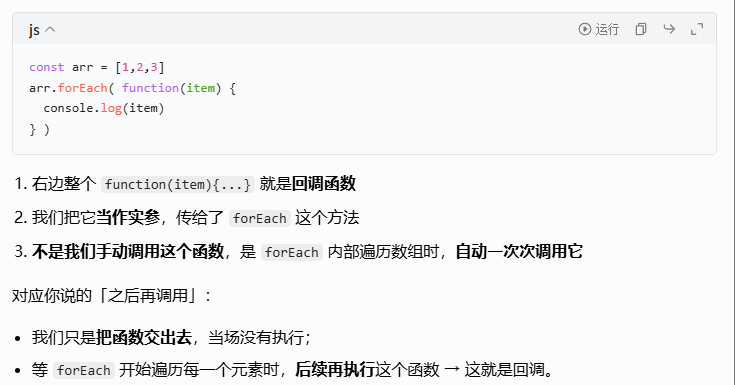

## 数组方法

数组也是个对象，与其他对象的区别是我们可以单独访问列表中的每个值。

**创建数组：**

```
let shopping = ["bread", "milk", "cheese", "hummus", "noodles"];
let random = ["tree", 795, [0, 1, 2]];	//混合项目
```


**访问和修改数组元素：**

用方括号访问：

```
shopping[0];
```

数组中包含数组的话称之为多维数组。你可以通过将两组方括号链接在一起来访问数组内的另一个数组:

```
random[2][2];
```


**获取数组长度：**

```
sequence.length;
```


### Array.isArray：判断是否为数组

```javascript
Array.isArray([1, 2, 3])    // true
Array.isArray({ a: 1 })    // false
Array.isArray('abc')        // false
Array.isArray(new Array(3)) // true
```


### join：数组转字符串

```js
const arr = ['hello', 'world']

// 用指定分隔符连接
arr.join(' ')               // 'hello world'
arr.join('-')               // 'hello-world'
arr.join('')                // 'helloworld'

// 默认用逗号连接
arr.join()                  // 'hello,world'

```


### 添加和删除数组项(push/pop/unshift/shift)

**push / pop：操作数组末尾**

```js
const arr = ['a', 'b', 'c']

// push：在末尾添加元素，返回新长度
arr.push('d')        // 4
arr                   // ['a', 'b', 'c', 'd']


// pop：删除末尾元素，返回被删除的元素
arr.pop()             // 'f'
arr                   // ['a', 'b', 'c', 'd', 'e']
```

**unshift / shift：操作数组开头**

```js
const arr = ['a', 'b', 'c']

// unshift：在开头添加元素，返回新长度
arr.unshift('0')     // 4
arr                   // ['0', 'a', 'b', 'c']

// shift：删除开头元素，返回被删除的元素
arr.shift()          // '0'
arr                   // ['a', 'b', 'c']
```

**对比记忆**

| 方法 | 位置 | 操作 | 返回值 |
| --- | --- | --- | --- |
| push | 末尾 | 添加 | 新长度 |
| pop | 末尾 | 删除 | 被删元素 |
| unshift | 开头 | 添加 | 新长度 |
| shift | 开头 | 删除 | 被删元素 |

---

### slice：截取数组（不修改原数组）

```javascript
const arr = [1, 2, 3, 4, 5]

// slice(start, end) - 返回从 start 到 end（不含）的元素
arr.slice(1, 3)      // [2, 3]
arr.slice(2)         // [3, 4, 5]
arr.slice(-2)        // [4, 5]，负数从末尾开始算,从-1开始
arr.slice()          // 复制整个数组 [1, 2, 3, 4, 5]
```

---

### splice：剪切，拼接（修改原数组）

```javascript
const arr = [1, 2, 3, 4, 5]
const arr2 = [1, 2, 3, 4, 5]
const arr3 = [1, 2, 3, 4, 5]

// splice(start, count) - 从 start 开始删除 count 个元素
arr.splice(1, 2)    // 返回 [2, 3]，arr 变成 [1, 4, 5]

// splice(start, count, item1, item2...) - 删除并插入新元素

arr2.splice(2, 0, 'a', 'b')  // 在索引2插入，不删除，返回 []    // arr2 变成 [1, 2, 'a', 'b', 3, 4, 5]

// splice(start, count, item1...) - 替换

arr3.splice(2, 2, 'x')       // 删除2个，插入1个    // arr3 变成 [1, 2, 'x', 5]
```

---

### concat：合并数组（不修改原数组）

```javascript
const arr1 = [1, 2]
const arr2 = [3, 4]
const arr3 = [5, 6]

arr1.concat(arr2)           // [1, 2, 3, 4]
arr1.concat(arr2, arr3)    // [1, 2, 3, 4, 5, 6]
```

### ---------------------------

### **indexOf / lastIndexOf：返回元素位置（找不到返回 -1）**

```javascript
const arr = [1, 2, 3, 2, 4]

arr.indexOf(2)      // 1，从前往后找
arr.lastIndexOf(2)   // 3，从后往前找
arr.indexOf(5)       // -1，找不到
```

### **includes：判断是否包含（返回 true/false）**

```javascript
const arr = [1, 2, 3]

arr.includes(2)      // true
arr.includes(5)       // false
```

### **find / findIndex：查找满足条件的元素**

```javascript
const arr = [1, 2, 3, 4, 5]

// find 返回满足条件的第一个元素
arr.find(item => item > 3)           // 4
arr.find(item => item > 10)           // undefined

// findIndex 返回满足条件的第一个元素的索引
arr.findIndex(item => item > 3)       // 3
arr.findIndex(item => item > 10)      // -1
```

---

### ---------------------------

### filter：过滤数组（不修改原数组）

```javascript
const arr = [1, 2, 3, 4, 5]

// 返回满足条件的元素组成的新数组
arr.filter(item => item > 2)         // [3, 4, 5]
arr.filter(item => item % 2 === 0)    // [2, 4]
```

---

### map：映射数组（不修改原数组）

```javascript
const arr = [1, 2, 3]

// 对每个元素执行操作，返回新数组
arr.map(item => item * 2)             // [2, 4, 6]
arr.map(item => ({ num: item }))       // [{num: 1}, {num: 2}, {num: 3}]
```

---

### reduce：归约数组（不修改原数组）

归约的含义：把一堆东西，逐步收拢、简化、合并成一个最终值。

```javascript
const arr = [1, 2, 3, 4, 5]

// reduce(回调, 初始值)
// 回调参数：(累加器, 当前元素) => 返回新的累加器

// 求和
arr.reduce((sum, item) => sum + item, 0)   // 15  这里有两个参数，第二个参数是0

// 求积
arr.reduce((prod, item) => prod * item, 1) // 120

// 转成对象
const arr2 = ['a', 'b', 'c']
arr2.reduce((obj, item, index) => {
  obj[index] = item
  return obj
}, {})                                   // {0: 'a', 1: 'b', 2: 'c'}
```

---

### sort：排序数组（修改原数组）

```javascript
const arr = [3, 1, 4, 1, 5, 9, 2, 6]

// 默认按 Unicode 编码排序（数字会转成字符串）
arr.sort()                   // [1, 1, 2, 3, 4, 5, 6, 9]

// 自定义排序规则
const arr2 = [3, 1, 4, 1, 5, 9, 2, 6]
arr2.sort((a, b) => a - b)   // 升序 [1, 1, 2, 3, 4, 5, 6, 9]
arr2.sort((a, b) => b - a)   // 降序 [9, 6, 5, 4, 3, 2, 1, 1]

// 按对象属性排序
const users = [{name: 'Tom', age: 20}, {name: 'Bob', age: 15}]
users.sort((a, b) => a.age - b.age)  // 按 age 升序
```

---

### some / every：判断数组

```javascript
const arr = [1, 2, 3, 4, 5]

// some：是否有任意一个满足条件
arr.some(item => item > 4)    // true
arr.some(item => item > 10)   // false

// every：是否全部满足条件
arr.every(item => item > 0)   // true
arr.every(item => item > 2)   // false
```

---

### flat / flatMap：扁平化数组

```javascript
const arr = [1, [2, 3], [4, [5, 6]]]

// flat(depth)：按指定深度扁平化，默认 depth=1
arr.flat()             // [1, 2, 3, 4, [5, 6]]
arr.flat(2)            // [1, 2, 3, 4, 5, 6]

// flatMap：先 map 再 flat
const arr2 = ['hello world', 'foo bar']
arr2.map(item => item.split(' '))     // [['hello', 'world'], ['foo', 'bar']]
arr2.flatMap(item => item.split(' ')) // ['hello', 'world', 'foo', 'bar']
```

---

### reverse：反转数组（修改原数组）

```javascript
const arr = [1, 2, 3, 4, 5]
arr.reverse()          // [5, 4, 3, 2, 1]，arr 也被修改了
```

---

### forEach：遍历数组

```javascript
// 遍历每个元素，执行回调
[1, 2, 3].forEach((item, index) => {
  console.log(`${index}: ${item}`)
})
// 输出：0: 1, 1: 2, 2: 3

```

> // 注意：forEach 没有返回值，执行后永远返回 `undefined`，拿不到遍历结果。
>
> // forEach是循环
>
> `forEach` 内部是**函数回调**，`break / continue` 只能作用于 `for/while/do-while` 这类原生循环语句，不能跳出函数。
>
> 你在回调函数里写 `break`，JS 引擎不知道要 “跳出哪个循环”，所以直接禁止。

> 为什么说forEach是函数回调，
>
> 

---

### Array.from / Array.of：Array 静态方法

```javascript
// Array.from：把类数组或可迭代对象转成数组
Array.from('abc')               // ['a', 'b', 'c']
Array.from({ length: 3 })       // [undefined, undefined, undefined]


// Array.of：创建数组（弥补 new Array 的坑）
new Array(3)        // [empty × 3]，长度为3的空数组
Array.of(3)         // [3]，只有1个元素3
Array.of(1, 2, 3)   // [1, 2, 3]
```

---

### Object.assign：合并对象

Object.assign() 的返回值，就是**第一个参数（目标对象）**。

```javascript
const obj1 = { a: 1, b: 2 }
const obj2 = { b: 3, c: 4 }

// Object.assign：把后面对象的属性拷贝到第一个对象
Object.assign(obj1, obj2)   // { a: 1, b: 3, c: 4 } // obj1 被修改了


// 常用：合并到新对象
const obj3 = Object.assign({}, obj1, obj2)  // { a: 1, b: 3, c: 4 }

// 常用：浅拷贝
const copy = Object.assign({}, original)

// 常用：合并默认值
const defaults = { theme: 'light', lang: 'en' }
const userPrefs = { theme: 'dark' }
const config = Object.assign({}, defaults, userPrefs)  // { theme: 'dark', lang: 'en' }
```

---

### Object.keys / values / entries：对象转数组

```javascript
const obj = { a: 1, b: 2, c: 3 }

// Object.keys：获取所有键
Object.keys(obj)           // ['a', 'b', 'c']

// Object.values：获取所有值
Object.values(obj)         // [1, 2, 3]

// Object.entries：获取所有键值对
Object.entries(obj)        // [['a', 1], ['b', 2], ['c', 3]]

// 常用：遍历对象
for (const [key, value] of Object.entries(obj)) {
  console.log(`${key}: ${value}`)
}

// 常用：对象转 Map
const map = new Map(Object.entries(obj))

// 常用：对象深拷贝
const deepCopy = JSON.parse(JSON.stringify(obj))
```

---

## 字符串方法

### split：分割字符串为数组（不修改原字符串）

```javascript
const str = 'hello world'

// 按指定分隔符分割
str.split(' ')              // ['hello', 'world']

// 按空字符串分割（每个字符）
str.split('')               // ['h', 'e', 'l', 'l', 'o', ' ', 'w', 'o', 'r', 'l', 'd']

// 日期分割
'2024-07-14'.split('-')     // ['2024', '07', '14']

// 限制返回数量
'hello world'.split(' ', 1) // ['hello']
```

---

### substring / substr / slice：截取字符串（不修改原字符串）

```javascript
const str = 'hello world'

// substring(start, end)：不支持负数，会自动交换参数
str.substring(0, 5)         // 'hello' 从索引 0 取到索引 5（不含 5），也就是索引0到4
str.substring(5, 0)          // 'hello'，会自动交换

// slice(start, end)：支持负数
str.slice(0, 5)              // 'hello'
str.slice(-5)                // 'world'
str.slice(-5, -1)           // 'worl'

// substr(start, length)：已废弃，不推荐使用
str.substr(0, 5)             // 'hello'
```

---

### indexOf / lastIndexOf：查找字符位置（不修改原字符串）

```javascript
const str = 'hello world'

str.indexOf('o')             // 4，从前往后找
str.indexOf('o', 5)          // 7，从位置5开始找
str.indexOf('x')             // -1，找不到

str.lastIndexOf('o')         // 7，从后往前找
```

---

### includes / startsWith / endsWith：判断包含（不修改原字符串）

```javascript
const str = 'hello world'

str.includes('world')        // true
str.includes('world', 8)     // false，从位置8开始查找

str.startsWith('hello')      // true
str.startsWith('world', 6)   // true，从位置6开始判断

str.endsWith('world')        // true
str.endsWith('hello', 5)     // true，只检查前5个字符
```

---

### toUpperCase / toLowerCase：大小写转换（不修改原字符串）

```javascript
const str = 'Hello World'

str.toUpperCase()            // 'HELLO WORLD'
str.toLowerCase()            // 'hello world'
```

---

### trim / trimStart / trimEnd：去除空格（不修改原字符串）

```javascript
const str = '  hello world  '

str.trim()                   // 'hello world'
str.trimStart()              // 'hello world  '
str.trimEnd()                // '  hello world'

// 也可用于去除其他字符
'---hello---'.trimStart('-') // 'hello---'
```

---

### replace / replaceAll：替换（不修改原字符串）

```javascript
const str = 'hello world'

// replace：只替换第一个匹配
str.replace('l', 'L')        // 'heLlo world'

// replaceAll：替换所有匹配
str.replaceAll('l', 'L')     // 'heLLo worLd'

// 使用正则
str.replace(/l/g, 'L')       // 'heLLo worLd'
str.replace(/\b\w/g, c => c.toUpperCase())  // 'Hello World'
```

---

### match / matchAll：匹配（不修改原字符串）

```javascript
const str = '2024-07-14 is a date: 2025-01-01'

// match：返回匹配结果
str.match(/\d{4}-\d{2}-\d{2}/g)  // ['2024-07-14', '2025-01-01']

// matchAll：返回迭代器，适合捕获组
const matches = [...str.matchAll(/(\d{4})-(\d{2})-(\d{2})/g)]
matches[0][0]    // '2024-07-14'，完整匹配
matches[0][1]    // '2024'，第一个捕获组
matches[0][2]    // '07'，第二个捕获组
```

---

### padStart / padEnd：填充（不修改原字符串）

str.padStart(目标总长度, 填充字符)   str.padEnd(目标总长度, 填充字符)

```javascript
const num = '5'

num.padStart(3, '0')         // '005'
num.padEnd(3, '0')           // '500'

// 常用：格式化时间
const hours = '9'
const minutes = '3'
`${hours.padStart(2, '0')}:${minutes.padStart(2, '0')}`  // '09:03'
```

---

### repeat：重复（不修改原字符串）

```javascript
const str = 'abc'

str.repeat(3)                // 'abcabcabc'
str.repeat(0)                // ''
str.repeat(2.5)              // 'abcabc'，会向下取整
```

---

### charAt / charCodeAt：字符访问（不修改原字符串）

```javascript
const str = 'hello'

str.charAt(1)                // 'e'
str.charAt(10)               // ''，超出范围返回空字符串

str.charCodeAt(1)            // 101，返回 Unicode 编码
```

---

### concat：拼接字符串（不修改原字符串）

```javascript
const str = 'hello'

str.concat(' ', 'world', '!')  // 'hello world!'
'hello'.concat(' ', 'world')   // 'hello world'
```

---

### search：搜索位置（不修改原字符串）

```javascript
const str = 'hello world'

str.search('world')              // 6
str.search('foo')                // -1

// 支持正则
str.search(/\d/)                 // -1，没找到数字
str.search(/world/)              // 6
```

---

<h4>split + 常见组合</h4>

```javascript
// URL 参数解析
const url = 'https://example.com?name=张三&age=25'
const params = url.split('?')[1].split('&')
// ['name=张三', 'age=25']

// 驼峰转短横线
'getUserName'.split('').map((c, i) =>
  c === c.toUpperCase() && i !== 0 ? '-' + c.toLowerCase() : c.toLowerCase()
).join('')
// 'get-user-name'

// 单词首字母大写
'hello world'.split(' ').map(word =>
  word.charAt(0).toUpperCase() + word.slice(1)
).join(' ')
// 'Hello World'
```

---

## 常用场景汇总

| 需求 | 方法 |
| --- | --- |
| 复制数组 | `slice()`, `[...arr]` |
| 截取部分 | `slice(start, end)` |
| 合并数组 | `concat()`, `[...arr1, ...arr2]` |
| 添加元素 | `push()`(末尾), `unshift()`(开头), `splice()` |
| 删除元素 | `pop()`(末尾), `shift()`(开头), `splice()` |
| 查找元素 | `indexOf()`, `find()`, `findIndex()` |
| 过滤数组 | `filter()` |
| 遍历数组 | `forEach()`, `map()` |
| 排序数组 | `sort()` |
| 求和/归约 | `reduce()` |
| 扁平化 | `flat()`, `flatMap()` |
| 判断条件 | `some()`, `every()`, `includes()` |
| 合并对象 | `Object.assign()` |
| 对象转数组 | `Object.keys/values/entries()` |
| 分割字符串 | `split()` |
| 截取字符串 | `substring()`, `slice()` |
| 大小写转换 | `toUpperCase()`, `toLowerCase()` |
| 去除空格 | `trim()` |
| 字符串替换 | `replace()`, `replaceAll()` |
| 填充字符串 | `padStart()`, `padEnd()` |
