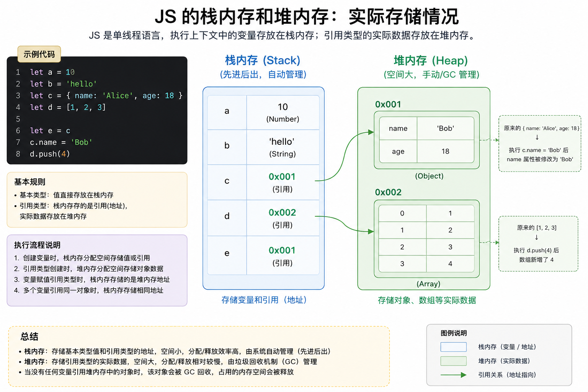

## 先搞懂 JS 两种数据存储方式

JS 数据分两大类，**存储位置完全不同**，这是拷贝的根源：



### 基本数据类型（值类型）

`String、Number、Boolean、Null、Undefined、Symbol、BigInt`

- 存在 **栈内存**
- 赋值时：**直接复制值**，两个变量互不影响

```javascript
let a = 10
let b = a  // 把 10 复制一份给 b
b = 20
console.log(a) // 10  没变
```

### 引用数据类型（对象/数组）

`Object、Array、Function`

- 数据本体存在 **堆内存**
- 变量里存的只是**内存地址（引用指针）**
- 赋值时：**只复制地址**，两个变量指向**同一个堆里的数据**

```javascript
let obj1 = { name: "张三" }
let obj2 = obj1 // 只复制了地址，不是复制对象本身

obj2.name = "李四"
console.log(obj1.name) // 李四  跟着变了！
```

> 因为 `obj1` 和 `obj2` 指向**同一个对象**。

---

## 浅拷贝（Shallow Copy）

只拷贝**外层一层**数据，**内层的对象/数组依然只复制地址**。

简单说：只扒第一层，里面嵌套的还是共用同一个数据。

### 常见浅拷贝方法

#### 对象：`Object.assign()`

```javascript
let obj = { a: 1, b: { c: 2 } }

// 浅拷贝
let newObj = Object.assign({}, obj)

newObj.a = 99
console.log(obj.a) // 1 ✅ 外层改了互不影响

newObj.b.c = 999
console.log(obj.b.c) // 999 ❗ 内层嵌套对象被改了，原数据也变
```

#### 对象/数组：展开运算符 `...`（最常用）

```javascript
let arr = [1, 2, { num: 3 }]
let newArr = [...arr] // 浅拷贝

newArr[0] = 99
console.log(arr[0]) // 1 外层没事

newArr[2].num = 999
console.log(arr[2].num) // 999 内层联动修改
```

####  数组：`slice()` / `concat()`

也是浅拷贝，规则同上。

> 反过来说如果对象只有一层的话那么浅拷贝也足够了


---

## 深拷贝（Deep Copy）

**把所有层级的数据，全部完整复制一份**，新旧数据完全独立，无论嵌套多少层，修改互不影响。

### 简单好用：`JSON.parse(JSON.stringify())`

适合**纯对象、数组**

```javascript
let obj = { a: 1, b: { c: 2 } }

// 深拷贝
let newObj = JSON.parse(JSON.stringify(obj))

newObj.b.c = 999
console.log(obj.b.c) // 2 ✅ 原数据完全不受影响
```

**缺点（一定要记）：**

- 无法拷贝 **函数、正则、Symbol、undefined**
- 日期会变成字符串
- 不支持循环引用

### 手写递归深拷贝（理解原理）

1. 判断是不是引用类型
2. 是数组就新建数组，是对象就新建对象
3. 遍历每一项，**递归拷贝**（一层层往下扒）

> 假设要拷贝的对象是 `{ a: 1, b: { c: 2 } }`，就像一个大箱子里装了 “数字 1” 和 “小箱子”，小箱子里又装了 “数字 2”。深拷贝的过程，就是把大箱子和里面所有小箱子、物品全复制一遍，新老箱子完全独立。

```javascript
function deepClone(obj) {
  // 基本类型 / null 直接返回
  if (typeof obj !== 'object' || obj === null) {
    return obj
  }

  // 判断数组还是对象，创建新容器
  let clone = Array.isArray(obj) ? [] : {}

  // 遍历递归拷贝每一个属性
  for (let key in obj) {
      // 只拷贝对象自身的属性
    if (obj.hasOwnProperty(key)) {
      clone[key] = deepClone(obj[key])
    }
  }
  return clone
}

// 测试
let old = { a: 1, b: { c: 2 } }
let now = deepClone(old)
now.b.c = 999
console.log(old.b.c) // 2
```
> 这里他在开头判断是不是object或者是不是null，这是个小的知识点，因为null因为历史遗留问题` typeof null; //object`，而只要不是object，在第一个判断中就被排除掉了。
### 第三方库

项目中复杂场景直接用：`Lodash` 的 `cloneDeep`

```javascript
const _ = require('lodash')
let newObj = _.cloneDeep(oldObj)
```


## 什么时候用哪个？

- 数据**只有一层、没有嵌套**：直接赋值 / 浅拷贝就行
- 数据**多层嵌套（对象套对象、数组套对象）**：必须用深拷贝，否则会改到原数据


## 总结

1. **基本类型**：赋值就是拷贝，互不影响
2. **引用类型**：变量存的是地址
3. **浅拷贝**：只复制第一层，嵌套内容还是共用
4. **深拷贝**：整棵数据树全部复制，彻底独立
