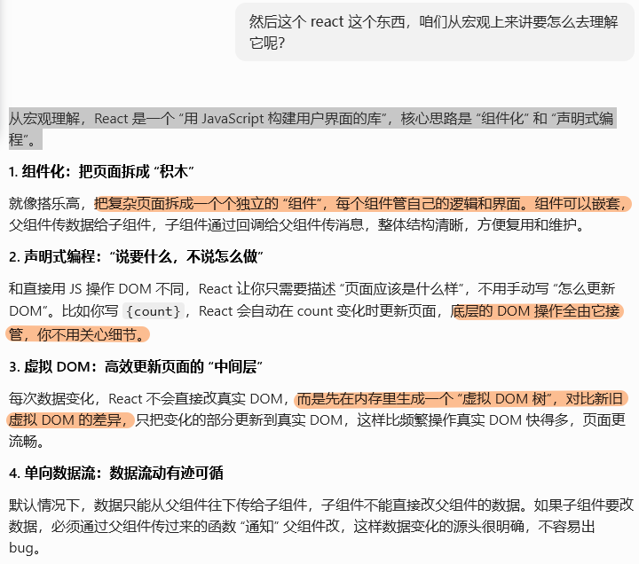

## 初见

### react怎么理解

React 用 JSX 让 “UI 和逻辑能自然结合”，又通过 Hooks/Components 让 “复杂逻辑可以按需抽离”，最终在页面级 JSX 里保留 “UI 结构 + 直接关联的简单逻辑”，而 Vue 更倾向于 “在单文件内通过语法区域划分逻辑和 UI”—— 两种方式没有绝对好坏，只是 React 更依赖 JS 的表达力，Vue 更依赖模板的直观性。



### 先建立认知：React vs Vue 核心差异

| 维度         | Vue 3                                          | React                                              |
| :----------- | :--------------------------------------------- | :------------------------------------------------- |
| 写法         | `<template>` 模板语法 + 指令（`v-if`/`v-for`） | **JSX**：在 JS 里直接写 HTML，全靠 JS 语法实现逻辑 |
| 双向绑定     | 支持 `v-model` 双向绑定                        | 单向数据流，只能手动通过事件修改状态               |
| 组件主流写法 | 组合式 API（`<script setup>`）                 | 函数组件 + Hooks                                   |
| 状态更新     | 响应式自动追踪依赖                             | 手动调用状态修改函数触发重渲染                     |

简单说：Vue 是「**模板 + JS**」，React 是「**全 JS 一把梭**」。

---

### 入门第一步：JSX 语法

JSX 是 React 的核心，本质是「在 JavaScript 中写 HTML 标签」的语法糖，最终会被编译成 `React.createElement` 函数调用。

**1. 基础写法**

```jsx
// 这就是一个最简单的 JSX
const title = <h1>Hello React</h1>
```

**2. 核心规则（对应 Vue 模板语法）**

- **插入变量/表达式**：用 `{ }` 包裹，对应 Vue 的 `{{ }}`

  ```jsx
  const name = '张三'
  const element = <h1>你好，{name}</h1> // 你好，张三
  ```

- **class 类名**：用 `className` 代替 `class`（避免和 JS 关键字冲突）

  ```jsx
  <div className="box">内容</div>
  ```

- **style 样式**：必须传一个对象，键名是驼峰

  ```jsx
  <div style={{ color: 'red', fontSize: '20px' }}>内容</div>
  ```

- **标签必须闭合**：单标签也要写 `/`，比如 ``、`<input />`

- **最外层只能有一个根标签**：和 Vue 一样，不想多套 div 可以用 `<>` 空标签（Fragment）

  ```jsx
  <>
    <h1>标题</h1>
    <p>段落</p>
  </>
  ```

---

### 基础组件：函数组件 + Props

#### 定义组件

- 组件名必须**首字母大写**（React 用来区分原生标签和自定义组件）
- 函数返回一段 JSX 就是组件

```jsx
// 定义一个组件
function Hello() {
  return <h1>Hello 组件</h1>
}

// 使用组件
function App() {
  return <Hello />
}
```

#### Props 父传子（对应 Vue 的 defineProps）

父组件通过标签属性传值，子组件通过函数参数接收，**props 只读，不能直接修改**。

```jsx
// 子组件：接收 props
function User(props) {
  return <div>姓名：{props.name}，年龄：{props.age}</div>
}

// 父组件：传值
function App() {
  return <User name="李四" age={20} />
}
```

更常用的解构写法：

```jsx
function User({ name, age }) {
  return <div>姓名：{name}，年龄：{age}</div>
}
```

---

### 状态管理：useState（对应 Vue 的 ref）

函数组件用 `useState` 这个 Hook 声明响应式状态，修改状态必须调用它提供的修改函数，视图才会更新。

**语法**

```jsx
import { useState } from 'react'

// [状态值, 修改状态的函数] = useState(初始值)
const [count, setCount] = useState(0)
```

**完整示例：计数器**

```jsx
import { useState } from 'react'

function Counter() {
  const [count, setCount] = useState(0)

  return (
    <div>
      <p>当前计数：{count}</p>
      {/* 修改状态必须调用 setCount */}
      <button onClick={() => setCount(count + 1)}>加1</button>
    </div>
  )
}
```

> 对比 Vue：`useState` 类似 `ref`，`setCount` 相当于手动给 `.value` 赋值。React 没有自动响应式，必须主动调用修改函数。

---

### 事件绑定（对应 Vue 的 @click）

- 事件名是**驼峰命名**：`onClick`、`onChange`、`onInput`
- 直接传函数名，不要加括号（加括号会立即执行）

```jsx
function Button() {
  // 事件处理函数
  const handleClick = () => {
    alert('点击了按钮')
  }

  return (
    {/* 正确：传函数引用 */}
    <button onClick={handleClick}>点击</button>
    
    {/* 传参写法：用箭头函数包裹 */}
    <button onClick={() => handleClick('参数')}>点击传参</button>
  )
}
```

---

### 条件渲染 & 列表渲染

React 没有 `v-if`、`v-for` 指令，**全靠 JS 原生语法实现**。

**条件渲染（对应 v-if）**

常用两种写法：

- **三元表达式**：满足条件显示 A，否则显示 B
- **&& 短路运算**：满足条件才显示，否则不渲染

```jsx
function ShowText() {
  const [isShow, setIsShow] = useState(true)

  return (
    <div>
      {/* 三元：对应 v-if / v-else */}
      {isShow ? <p>显示的文字</p> : <p>隐藏了</p>}

      {/* && 短路：满足条件才渲染 */}
      {isShow && <p>条件满足才显示我</p>}

      <button onClick={() => setIsShow(!isShow)}>切换</button>
    </div>
  )
}
```

**列表渲染（对应 v-for）**

用数组的 `map` 方法遍历，**必须给每一项加唯一的 key 属性**（和 Vue 的 key 作用一样，优化虚拟 DOM  diff）。

```jsx
function List() {
  const list = ['苹果', '香蕉', '橙子']

  return (
    <ul>
      {list.map((item, index) => (
        <li key={index}>{item}</li>
      ))}
    </ul>
  )
}
```

---

### 副作用：useEffect（对应 生命周期 + watch）

`useEffect` 是 React 最常用的 Hook 之一，用来处理「副作用」：比如接口请求、DOM 操作、定时器、订阅事件等。

它对应 Vue 里的组合：`onMounted` + `onUpdated` + `onUnmounted` + `watch`。

**语法**

```jsx
import { useEffect } from 'react'

useEffect(() => {
  // 副作用逻辑
  
  return () => {
    // 清理函数：组件卸载前 / 下一次副作用执行前 调用
  }
}, [依赖数组])
```

**三种常见用法**

1. **空依赖数组 `[]`**：只在组件挂载时执行 1 次 → 对应 Vue 的 `onMounted`

   ```jsx
   useEffect(() => {
     console.log('组件挂载了，发请求、开定时器')
   }, [])
   ```

2. **有依赖项**：依赖项变化时执行 → 对应 Vue 的 `watch`

   ```jsx
   const [count, setCount] = useState(0)
   
   useEffect(() => {
     console.log('count 变化了', count)
   }, [count])
   ```

3. **无依赖数组**：每次组件渲染都执行

   ```jsx
   useEffect(() => {
     console.log('每次更新都执行')
   })
   ```

4. **清理函数**：组件卸载时执行 → 对应 Vue 的 `onUnmounted`

   ```jsx
   useEffect(() => {
     const timer = setInterval(() => console.log('计时'), 1000)
     
     // 卸载时清除定时器
     return () => clearInterval(timer)
   }, [])
   ```

---

### 父子组件通信（子传父）

React 没有 `emit`，子传父靠**父组件传回调函数，子组件调用传参**实现。

```jsx
// 子组件
function Child({ onSend }) {
  const msg = '来自子组件的消息'
  return <button onClick={() => onSend(msg)}>给父组件发消息</button>
}

// 父组件
function Parent() {
  const handleReceive = (data) => {
    console.log('收到子组件数据：', data)
  }

  return <Child onSend={handleReceive} />
}
```

> 对比 Vue：相当于父组件传 `@事件名`，子组件 `emit` 触发；React 是直接把函数当 props 传下去。


## React 和 Vue 的核心区别

### 1. Vue：组件逻辑通常只在初始化时执行一次

在 Vue 3 中，无论是 `setup()` 还是 `<script setup>`，都可以理解成组件实例创建时执行的一段初始化逻辑。

- **执行时机**：组件实例创建时执行一次。
- **状态更新机制**：Vue 通过 `ref`、`reactive` 和 Proxy 做响应式追踪。模板、计算属性或副作用用到了哪些响应式数据，Vue 会记录下来。
- **重新渲染方式**：数据变化后，Vue 会触发相关的渲染更新，但不会把你写在 `setup` 里的业务逻辑从头到尾重新跑一遍。

这带来的直观感受是：你在 `setup` 里定义的普通变量和函数，一般不会因为页面更新而重新创建。对初学者来说，Vue 更像“先搭好一套响应式系统，后面数据变了，系统自动通知相关地方更新”。

### 2. React：重新渲染意味着组件函数重新执行

React 函数组件本身就是渲染函数。它的核心思想是：

```txt
UI = f(state)
```

也就是说，页面是状态计算出来的结果。

- **执行时机**：组件首次渲染会执行一次；之后只要组件自己的 state、父组件传入的 props、context 等发生变化，组件函数就可能重新执行。
- **更新方式**：React 会重新执行组件函数，得到新的 JSX / 虚拟 DOM，再和上一次结果比较，最后把差异更新到真实 DOM。
- **直接影响**：组件函数里的局部变量、普通函数，每次重新执行时都会重新创建。

所以 React 里很重要的心智模型是：**每一次渲染都是一张独立的快照**。这一轮函数里读到的 `count`、`todos`、`props`，都属于这一轮渲染。

### 3. 对比总结

| 特性 | Vue 3 `setup` | React 函数组件 |
| --- | --- | --- |
| 组件逻辑执行 | 通常每个组件实例执行一次 | 每次渲染都会重新执行 |
| 状态追踪 | 响应式系统自动追踪依赖 | 通过重新执行函数得到新 UI |
| 普通函数引用 | 通常稳定 | 默认每次渲染重新创建 |
| 常见心智负担 | 理解响应式代理 | 理解快照、闭包、依赖数组 |
| 性能优化 | 框架做较多细粒度处理 | 开发者在必要时用 `memo`、`useMemo`、`useCallback` |

一句话理解：**Vue 更像“数据变了，通知用到它的地方更新”；React 更像“状态变了，重新执行函数，再算出新的页面”。**

---

## 如何应对 React 的心智负担

React 的优点是透明：它没有 Vue 那种响应式代理黑盒，数据流通常更直接，尤其适合大型应用里追踪“状态从哪里来、传到哪里去”。

### 1. 把每次渲染看成一张快照

比如：

```tsx
const [count, setCount] = useState(0)

function handleClick() {
  setCount(count + 1)
  console.log(count)
}
```

点击时，`setCount(count + 1)` 并不会立刻改变当前函数里的 `count`。它只是告诉 React：“请安排下一次渲染，下一次渲染里的 `count` 应该变成新值。”

所以后面的 `console.log(count)` 读到的仍然是这一次渲染快照里的旧值。

记住这句话：**React 的 state 更新不是修改当前变量，而是触发下一次渲染，让下一次渲染拿到新值。**

### 2. 信任 Hooks Linter

React 项目里一定要开启 `eslint-plugin-react-hooks`。

当你在 `useEffect`、`useCallback`、`useMemo` 里面使用了外部变量，Linter 会提醒你把它们写进依赖数组。

不要为了消除警告随便写 `[]`。如果依赖漏了，函数就可能一直引用旧快照里的值，这就是常说的 **闭包陷阱**。

### 3. 不要把 `useEffect` 当成 Vue 的 `watch`

Vue 里常见写法是：监听一个数据变化，然后修改另一个数据。

React 里要先问一句：这个值能不能直接算出来？

如果可以，就不要用 `useEffect`：

```tsx
const filteredTodos = todos.filter(todo => todo.done)
const total = todos.length
```

这种派生数据应该直接在函数体里计算。因为 React 每次渲染都会重新执行函数，`todos` 变了以后，这些普通变量自然会用最新的 `todos` 重新算一遍。

`useEffect` 更适合做“和 React 外部系统同步”的事情，比如：

- 请求接口
- 绑定和解绑事件监听
- 操作浏览器 API
- 和本地存储、第三方库同步

### 4. 不要过早使用 `useMemo` 和 `useCallback`

初学者容易听到“React 会重新执行函数”，就给所有函数都包上 `useCallback`，给所有计算都包上 `useMemo`。

这通常没必要。

普通函数创建的成本很低，React 重新执行组件也很常见。`useMemo` 和 `useCallback` 自己也需要保存缓存、比较依赖，滥用反而会让代码更复杂。

更实用的原则是：

- 先写清晰的普通代码。
- 发现某个子组件真的因为 props 引用变化而频繁重渲染，再考虑 `React.memo` + `useCallback`。
- 发现某个计算真的很重，再考虑 `useMemo`。

---

## React 状态更新原则：不可变性

### 1. 什么是不可变性

不可变性指的是：**不要直接修改原来的 state，而是创建一个带有新变化的新值，再用新值替换旧值。**

例如不要这样：

```tsx
todos.push(newTodo)
setTodos(todos)
```

应该这样：

```tsx
setTodos(prev => [newTodo, ...prev])
```

区别在于：第一种写法修改了原数组；第二种写法创建了一个新数组。

### 2. 为什么 React 需要不可变性

React 判断 state 是否变化时，核心是比较新旧值是否是同一个引用。对于对象和数组来说，如果你直接修改原对象，引用地址没有变，React 可能认为“这个值没变”，页面就不会按预期更新。

可以这样理解：

- 直接修改：还是同一个对象，只是里面被你改了。
- 不可变更新：创建一个新对象或新数组，用新引用告诉 React 数据变了。

所以 React 状态更新的关键不是“把旧数据改掉”，而是“根据旧数据算出一个新数据”。

### 3. 数组和对象的常用写法

| 操作 | 不推荐 | 推荐 |
| --- | --- | --- |
| 数组添加 | `push()` | `[...arr, newItem]` 或 `[newItem, ...arr]` |
| 数组删除 | `splice()` | `arr.filter(item => item.id !== id)` |
| 数组修改 | 直接改某一项 | `arr.map(...)` |
| 对象修改 | `obj.key = value` | `{ ...obj, key: value }` |
| 对象删除 | `delete obj.key` | 解构或创建不含该字段的新对象 |

### 4. 嵌套对象不需要无脑深拷贝

不变的嵌套对象：**完全复用原有引用**，不复制；

被修改的那条层级链路：**只把这条链上每一层新建对象**，无关分支不动。


假设状态是：

```tsx
const [user, setUser] = useState({
  id: 1,
  name: '张三',
  address: { city: '北京', street: '长安街' }
})
```

如果只修改 `name`：

```tsx
setUser({
  ...user,
  name: '李四'
})
```

这里不需要深拷贝 `address`，因为 `address` 没变，保留它原来的引用反而更好。这样如果某个子组件只依赖 `address`，就更容易跳过不必要的渲染。

但如果你要修改嵌套的 `city`，就要把被修改路径上的每一层都创建新对象：

```tsx
setUser({
  ...user,
  address: {
    ...user.address,
    city: '上海'
  }
})
```

原则是：**只拷贝需要变化的那条路径，没变的部分保留原引用。**

---

## 不可变性实战

| 操作     | 不推荐写法        | 推荐写法                 |
| -------- | ----------------- | ------------------------ |
| 数组新增 | `push()`          | `[...arr, newItem]`      |
| 数组删除 | `splice()`        | `arr.filter(...)`        |
| 数组修改 | 直接改下标        | `arr.map(...)`           |
| 对象修改 | `obj.key = value` | `{ ...obj, key: value }` |

### 1. 添加任务：为什么不用 `push`

```tsx
const addTodo = useCallback((title: string) => {
  const newTodo: Todo = {
    id: crypto.randomUUID(),
    title,
    completed: false
  }

  setTodos(prev => [newTodo, ...prev])
}, [])
```

`push` 会修改原数组；`[newTodo, ...prev]` 会创建一个新数组。

这里还有一个重点：`setTodos(prev => ...)` 使用的是函数式更新。它不依赖外部的 `todos` 变量，而是让 React 把最新的旧状态 `prev` 传进来，所以 `addTodo` 可以安全地写空依赖数组 `[]`。

### 2. 修改任务：为什么用 `map`

```tsx
const toggleTodo = useCallback((id: string) => {
  setTodos(prev =>
    prev.map(todo =>
      todo.id === id
        ? { ...todo, completed: !todo.completed }
        : todo
    )
  )
}, [])
```

这段代码做了两层“创建新值”：

1. `map` 返回一个新数组。
2. 找到要修改的那一项时，用 `{ ...todo, completed: !todo.completed }` 创建一个新对象。

没有被修改的任务直接返回原对象，这样可以保留它们的引用。

### 3. 删除任务：为什么用 `filter`

```tsx
setTodos(prev => prev.filter(todo => todo.id !== id))
```

`filter` 不会修改原数组，它会根据条件返回一个新数组。

所以 React 里的删除，本质上不是“从原数组里切掉一项”，而是“生成一个不包含该项的新数组”。

### 4. 派生数据不需要 `useEffect`

```tsx
const filteredTodos = todos.filter(todo => {
  if (filter === 'active') return !todo.completed
  if (filter === 'completed') return todo.completed
  return true
})

const stats = {
  total: todos.length,
  completed: todos.filter(todo => todo.completed).length
}
```

`todos` 更新后，组件会重新执行，这些普通计算也会重新执行，所以它们会自然拿到最新数据。

不要写成：

```tsx
useEffect(() => {
  setStats(...)
}, [todos])
```

除非这个数据真的需要单独存成 state。否则这样会多一次 state 更新，也会让逻辑更绕。

---

## `React.memo` 和 `useCallback`

这一节先分开理解两个工具，再看它们为什么经常一起出现。

### 1. `React.memo`：根据 props 判断子组件是否跳过渲染

`React.memo` 是给组件用的。这里的 props 可以先理解成：**父组件传给子组件的参数**。

它的作用是：**当父组件重新渲染时，如果子组件收到的 props 没变，就跳过子组件这次渲染。**

```tsx
import { memo } from 'react'

const Child = memo(function Child({ name }) {
  console.log('Child 渲染了')
  return <div>{name}</div>
})
```

在这个例子里，`name` 就是父组件传给 `Child` 的一个 prop。如果父组件重新渲染，但传给 `Child` 的 `name` 还是同一个值，`Child` 就可以不重新渲染。

不过 `React.memo` 有一个关键限制：它默认只对 props 做**浅层比较**。

浅层比较可以简单理解为：

- 数字、字符串、布尔值：比较值本身。
- 对象、数组、函数：比较引用地址。

所以，如果父组件每次渲染都创建新的对象、数组或函数，即使内容看起来一样，`React.memo` 也会认为 props 变了。

### 2. 只写 `React.memo` 仍然可能失效

看一个不加函数缓存的例子：

```jsx
import { memo, useState } from 'react'

const Child = memo(({ handleClick }) => {
  console.log('子组件渲染了')
  return <button onClick={handleClick}>点我</button>
})

export default function Parent() {
  const [count, setCount] = useState(0)

  const handleChildClick = () => {
    alert('子组件按钮被点击')
  }

  return (
    <div>
      <p>父组件计数：{count}</p>
      <button onClick={() => setCount(count + 1)}>父组件+1</button>
      <Child handleClick={handleChildClick} />
    </div>
  )
}
```

这里看起来子组件已经用了 `memo`，但点击父组件 `+1` 按钮时，控制台还是会一直打印 `子组件渲染了`。

原因是：

1. 点击按钮后，`count` 更新，`Parent` 重新执行。
2. `Parent` 每次执行都会重新创建 `handleChildClick`。
3. 新旧 `handleChildClick` 是两个不同的函数引用。
4. `React.memo` 对 props 做浅比较，发现 `handleClick` 引用变了。
5. 子组件被认为 props 变了，所以继续重新渲染。

关键点：**`React.memo` 只做浅比较。函数、对象、数组只要引用变了，它就认为 props 变了。**

所以 `React.memo` 单独负责的是“子组件要不要重新渲染”，但它不能阻止父组件创建新的函数引用。

### 3. `useCallback`：缓存函数引用

`useCallback` 是给函数用的。它的作用是：**在依赖不变时，返回上一次缓存的函数引用。**

```tsx
const addTodo = useCallback((title: string) => {
  setTodos(prev => [createTodo(title), ...prev])
}, [])
```

它的意思不是“让函数永远不创建”，而是：

- 依赖没变时，返回上一次缓存的函数引用。
- 依赖变了时，返回这一次的新函数引用。

`useCallback` 最容易被误解成“节省创建函数的性能”。其实普通函数创建很便宜，`useCallback` 自己也需要保存缓存、比较依赖。

它真正重要的价值是：**让某个函数的引用保持稳定，方便别的地方做引用比较。**

比如依赖数组为空时：

```tsx
const handleChildClick = useCallback(() => {
  alert('子组件按钮被点击')
}, [])
```

只要这个函数不依赖外部会变化的变量，就可以一直复用同一个引用。

### 4. `useCallback` 的依赖数组和闭包陷阱

`useCallback` 会缓存函数引用，但这也意味着它可能缓存旧快照里的变量。

比如：

```tsx
const [count, setCount] = useState(0)

const handleClick = useCallback(() => {
  console.log(count)
}, [])
```

这里依赖数组是空的，表示这个函数永远使用第一次渲染时的快照。第一次渲染时 `count` 是 `0`，所以之后即使 `count` 变成 `5`，点击时也可能仍然打印 `0`。

正确写法是：

```tsx
const handleClick = useCallback(() => {
  console.log(count)
}, [count])
```


**大多数情况下，用正确的依赖数组就可以解决 `useCallback` 引起的闭包问题**。

### 5. 为什么有些函数可以写空依赖

比如：

```tsx
const toggleTodo = useCallback((id: string) => {
  setTodos(prev =>
    prev.map(todo =>
      todo.id === id
        ? { ...todo, completed: !todo.completed }
        : todo
    )
  )
}, [])
```

这个函数没有直接读取外部的 `todos`，而是通过 `setTodos(prev => ...)` 拿到最新状态。

所以它不依赖外部 `todos`，可以写 `[]`。

这也是 React 里很常用的写法：**如果下一次状态依赖上一次状态（指下一次状态是基于旧状态计算出来的），优先使用函数式更新。**

#### 函数式更新

假设我们有 `const [count, setCount] = useState(0)`

**函数式更新（传回调函数）**

```
setCount(prev => prev + 1)
```

- `prev` 是 React **内部实时提供的最新状态**，不从你组件作用域拿；
- 你的代码里完全不用读取外部 `count`；
- 连续调用也能正确叠加：

```
const add = () => {
  setCount(prev => prev + 1)
  setCount(prev => prev + 1)
}
// 点一次直接 +2，因为每一次 prev 都是上一次更新后的最新值
```

### 6. 两者结合：`React.memo` 管子组件，`useCallback` 管函数引用

如果这个函数确实要传给被 `React.memo` 包裹的子组件，就可以用 `useCallback`：

```jsx
import { memo, useState, useCallback } from 'react'

const Child = memo(({ handleClick }) => {
  console.log('子组件渲染了')
  return <button onClick={handleClick}>点我</button>
})

export default function Parent() {
  const [count, setCount] = useState(0)

  const handleChildClick = useCallback(() => {
    alert('子组件按钮被点击')
  }, [])

  return (
    <div>
      <p>父组件计数：{count}</p>
      <button onClick={() => setCount(count + 1)}>父组件+1</button>
      <Child handleClick={handleChildClick} />
    </div>
  )
}
```

这时点击父组件 `+1`，`Parent` 仍然会重新渲染，但只要依赖数组没变，`useCallback` 会返回上一次的函数引用。

于是 `Child` 收到的 `handleClick` 引用没变，`React.memo` 就可以拦住这次无效渲染。

它们的分工可以这样记：

| 工具 | 所在位置 | 负责什么 |
| --- | --- | --- |
| `React.memo` | 子组件 | 比较 props，决定子组件要不要重新渲染 |
| `useCallback` | 父组件 | 稳定传给子组件的函数引用 |
| `useMemo` | 父组件 | 稳定传给子组件的对象、数组或重计算结果 |

只写 `React.memo` 不写 `useCallback`：

```txt
父组件重新渲染
-> 创建新函数
-> 函数 prop 引用变化
-> memo 判断 props 变化
-> 子组件仍然重新渲染
```

只写 `useCallback` 不写 `React.memo`：

```txt
函数引用稳定了
-> 但子组件没有缓存判断
-> 父组件重新渲染时，子组件默认仍然跟着渲染
```

所以真正生效的组合是：

```txt
useCallback 稳定函数引用 + React.memo 拦截子组件渲染
```

如果传下去的是对象或数组，比如 `options={{ theme: 'dark' }}` 或 `list={filteredList}`，就要考虑 `useMemo`，否则对象和数组每次也会变成新引用。

### 7. 复杂场景：用 `useRef` 读取最新值，同时保持函数引用不变

有时你希望函数引用永远稳定，但函数执行时又要读到最新 state。可以用 `useRef` 保存最新值：

```jsx
import { memo, useState, useCallback, useRef } from 'react'

const Child = memo(({ handleClick }) => {
  console.log('子组件渲染了')
  return <button onClick={handleClick}>点我</button>
})

export default function Parent() {
  const [count, setCount] = useState(0)
  const countRef = useRef(count)

  countRef.current = count

  const handleChildClick = useCallback(() => {
    alert(`当前父计数：${countRef.current}`)
  }, [])

  return (
    <div>
      <p>父组件计数：{count}</p>
      <button onClick={() => setCount(count + 1)}>父组件+1</button>
      <Child handleClick={handleChildClick} />
    </div>
  )
}
```

这段代码的效果是：

- `handleChildClick` 的引用一直不变。
- `countRef.current` 每次渲染都会同步成最新 `count`。
- 点击子组件按钮时，函数可以读到最新的 `countRef.current`。

不过这属于更复杂的写法。初学阶段不要把它当默认方案。优先写正确的依赖数组；只有在你明确需要“稳定函数引用 + 读取最新值”时，再考虑 `useRef`。

### 8. 什么时候值得用这套组合

`React.memo` + `useCallback` 比较适合这些场景：

1. 这个函数要作为 prop 传给被 `React.memo` 包裹的子组件。
2. 这个函数会被放进其他 Hook 的依赖数组里，需要保持引用稳定，避免反复触发。
3. 子组件本身比较重，比如复杂表格、图表、大列表项，跳过渲染确实有价值。

例如：

```tsx
const HeavyChart = React.memo(function HeavyChart({ onExport }) {
  return <button onClick={onExport}>导出图表</button>
})

function Dashboard() {
  const [text, setText] = useState('')
  const [chartData, setChartData] = useState([])

  const handleExport = useCallback(() => {
    console.log('导出图表', chartData)
  }, [chartData])

  return (
    <div>
      <input value={text} onChange={e => setText(e.target.value)} />
      <HeavyChart onExport={handleExport} />
    </div>
  )
}
```

当你输入文字时，`Dashboard` 会重新渲染。如果 `handleExport` 每次都是新引用，`HeavyChart` 的 props 就会变化，可能跟着重新渲染。

用了 `useCallback` 后，只要 `chartData` 没变，`handleExport` 的引用就不变，`React.memo` 才有机会拦住 `HeavyChart` 的无效渲染。

### 9. 不需要用 `useCallback` 的场景

如果函数只是传给普通 HTML 元素，比如：

```tsx
<button onClick={() => setCount(count + 1)}>加一</button>
```

通常不需要为了它专门写 `useCallback`。普通 DOM 元素不会像 `React.memo` 子组件那样因为函数引用变化而做昂贵的重新渲染判断。

另外，如果子组件没有用 `React.memo`，函数只是普通传下去，也通常不需要 `useCallback`。因为没有 `memo` 的子组件默认会跟着父组件重新渲染，函数引用稳不稳定不会带来明显收益。

### 10. 简单总结

这部分可以先记住三句话：

1. `React.memo` 负责缓存子组件，但它只会浅比较 props。
2. `useCallback` 负责缓存函数引用，但单独使用通常看不到渲染优化收益。
3. 做子组件渲染优化时，常见组合是 `React.memo` 缓存子组件、`useCallback` 缓存函数 props、`useMemo` 缓存对象或数组 props。

### useEffect介绍

`useEffect` = 副作用钩子

专门处理**不在页面渲染内的操作**，所有和 DOM、外部资源打交道的逻辑都放这里。

**什么是副作用？**

组件渲染 JSX 是**纯 UI 渲染（主逻辑）**；

除此之外所有额外操作都叫副作用：

1. 操作真实 DOM（修改 input、获取元素宽高）
2. 发网络请求（接口拿数据）
3. 定时器、延时器 `setInterval/setTimeout`
4. 监听事件（窗口滚动、窗口大小变化）
5. 本地存储读写、websocket 连接

上面的总结一下—就是异步，监听，清理。

至于具体的代码太长，省略，我已收藏。

useEffect(执行函数, 依赖数组)

```react
useEffect(() => {
  // 执行逻辑：副作用代码
  return () => {
    // 清理函数（可选）：组件销毁 / 副作用重新执行时触发
  }
}, [依赖数组])
```

组件渲染、页面DOM画好之后，才会运行useEffect内部代码。

所以可以直接操作页面DOM元素。

---

#### useEffect场景

**1. 初始化异步操作（页面加载只跑一次）**

空依赖 `[]`

- 页面打开请求接口

- 只创建一次定时器、全局监听

  属于你说的「异步」

**2. 监听数据变化执行逻辑（对应 watch）**

依赖数组写 state/props

状态一变就重新执行内部代码

属于你说的「监听」

**3. 额外必备功能：资源清理（不能漏掉）**

只要开了定时器、窗口滚动监听、订阅事件，

必须 return 清理函数，防止内存泄漏。

这块不属于异步也不算监听，但几乎配套一起用。

---

#### 依赖数组的三种写法

**1.依赖为空**

仅**组件挂载时执行 1 次**，卸载时执行清理函数。

典型场景：页面初始化请求列表、只绑定一次窗口监听

```tsx
useEffect(() => {
  // 页面一加载就请求todo数据
  fetchTodoList()
}, [])
```

**2.依赖变量**

1. 单纯修改数字/计数 → 函数式更新 setX(prev=>prev+1)
2. 定时器、延时、异步函数要实时读最新值 → useRef
3. 组件内固定监听、延时逻辑随state更新 → useEffect + 完整依赖

```tsx
useEffect(() => {
  localStorage.setItem('todo', JSON.stringify(todos))
}, [todos]) // todos一变，自动存本地
```

**3. 完全不写依赖（没有第二个参数）**

每次组件渲染都会执行，极易死循环，开发几乎不用。


#### 和useState的区别

useState 是 “**管理会影响渲染的数据**”，当你调用 setXxx 更新状态时，React 会重新渲染组件，让页面显示新数据；

而 useEffect 是 “**在数据 / 渲染变化后执行额外操作**”，它本身不直接管理状态，只是 “监听” 状态变化后去做副作用逻辑。


#### 异步，定时器需要用到useeffect的原因

1. 一次性、只在本次点击触发一次的延时
   简单逻辑可以直接写在点击函数里，搭配  setX(prev=>...)  读取最新值，没问题；
2. 持续存在、长期挂载的定时器/滚动监听/窗口事件（每秒计时、resize监听）
   必须放 useEffect：

- 组件销毁时要清除，不然后台一直跑，内存泄漏；
- 状态更新自动重建监听，拿到最新数据。
  useEffect 配合依赖数组，能精准控制定时器只在需要的时候创建，避免重复创建。

#### useEffect和watch区别

useEffect ≠ 单纯 watch，它是挂载+监听+销毁三合一，渲染完才运行，自带清理；Vue 没有完全对等的API，是多个生命周期组合才等于它。

> 空依赖 `[]` 时：等于 Vue 的 `onMounted` + `onUnmounted`；
>
> 依赖数组有值 `[num]` 时：等于 `onMounted` + `watch(num, ...)` + `onUnmounted`。
>
> 简单说，一个 useEffect 能顶 Vue 里 “挂载 + 监听 + 销毁” 三个生命周期的组合效果。

### useRef

useRef 存的是 “**跨渲染的实时值**”

**用法一：**

useRef适合存“不触发页面刷新的可变数据

适合存：定时器 ID、接口返回的临时数据、组件卸载标记、上一次 state 的值……

这些数据只给代码内部用，页面不展示，改了也不用刷新页面，用 useRef 刚好。

**用法二：**

直接获取 DOM 元素 / 组件实例

>  本质： 都是让 ref.current 持有一个 “不会随渲染快照变化” 的引用
>
>  DOM 元素本身会随渲染更新，但 ref.current 存的是 “最新 DOM 元素的引用”，不会被旧快照锁住。

Vue ref = 能驱动页面的数据；React useRef = 只存东西、不碰页面的，完全不会响应式，不会刷新页面。

修改 `.current` → **页面绝对不会刷新**

> React 每次渲染会生成 “快照”，普通变量 /state 会被 “冻结” 在当前快照里，而 useRef 的 `.current` 是**所有渲染共享的同一个 “盒子”**，不管渲染多少次，盒子里的东西永远是最新的。

**避坑：**

1. **不要用 useRef 存页面上要展示的数据**

页面文字、列表、数字必须用 useState，改 ref 页面不会更新，界面不动。

2. **渲染过程中不要读写 .current**

渲染阶段（return 里面）读取 / 修改 ref 会逻辑错乱，只在点击函数、useEffect、定时器里操作。


### 组件通信

#### Zustand 

### 仓库内部固定三块内容

#### ① 原始状态（state 数据）

就是你要存的变量，比如计数器数字

```
count: 0,
name: '测试',
```

#### ② 修改状态的同步方法（actions）

用 `set()` 更新数据，两种写法：

1. 直接覆盖全部状态

```
add: () => set({ count: 10 }),
```

2. 基于旧状态更新（推荐计数器场景）

```
increase: () => set(state => ({ count: state.count + 1 })),
decrease: () => set(state => ({ count: state.count - 1 })),
reset: () => set({ count: 0 }),
```

#### ③ 可选：读取自身状态的方法（用到 get）

如果方法里需要拿当前状态做计算，用 `get()`

```
doubleCount: () => get().count * 2
```

```js
// countStore.js
import { create } from 'zustand'

// 创建全局仓库
const useCountStore = create((set, get) => ({
  // 1. 状态数据
  count: 0,

  // 2. 修改状态的方法（actions）
  // 加1
  addOne: () => set(state => ({ count: state.count + 1 })),
  // 减1
  subOne: () => set(state => ({ count: state.count - 1 })),
  // 直接赋值
  setNum: (num) => set({ count: num }),
  // 重置
  resetCount: () => set({ count: 0 }),

  // 3. 使用get获取当前状态
  getDouble: () => {
    return get().count * 2
  }
}))

// 导出仓库钩子，组件使用
export default useCountStore
```

### 组件使用

```js
import useCountStore from './store/countStore'

function Counter() {
  // 取出状态和方法
  const count = useCountStore(state => state.count)
  const addOne = useCountStore(state => state.addOne)
  const getDouble = useCountStore(state => state.getDouble)

  return (
    <div>
      <p>数字：{count}</p>
      <p>两倍值：{getDouble()}</p>
      <button onClick={addOne}>+1</button>
    </div>
  )
}
```

修改方法都是写在 store 内部的，我只要把这个方法取出来，就是进行了修改
