---
title: Vue 篇
published: 2024-01-01
updated: 2026-06-08
description: Vue 学习笔记
tags: [Vue]
category: 前端/Vue
draft: false
---

## 🐬Vue 基础

### 什么是 MVVM 模式？

MVVM（Model-View-ViewModel）是一种常见的前端架构思路。它的重点不是让我们手动操作 DOM，而是把页面拆成三部分：数据（Model）、视图（View）和连接两者的 ViewModel。

**ViewModel 的作用**

在 MVVM 里，视图和数据不建议直接互相操作，而是通过 ViewModel 建立联系。Vue 会通过响应式系统追踪数据变化，并在需要时更新视图；视图上的事件也会回到实例方法里处理，再去修改数据。

所以可以简单理解为：Vue 帮我们把“数据变化 <-> 页面更新”这件事自动化了。

我们开发时只需关注数据维护，无需再频繁操作 DOM。


**为什么要使用 MVVM？**

MVVM 和 MVC 一样，核心目标都是降低视图和数据之间的耦合。对前端来说，它的好处主要有几个：

* 减少大量 DOM 操作，把注意力放在数据和业务逻辑上。
* 数据和界面分离，代码更容易维护。
* 配合组件化开发，更适合中大型项目的组织。

> MVVM 可以看作是 MVC 的**前端进化版**：
>
> - **MVC**
>   - View → Controller → Model
>   - Controller 厚重，需要手动操作 DOM
>   - 视图和逻辑仍然有一定耦合
> - **MVVM**
>   - View ↔ ViewModel ↔ Model
>   - **双向绑定**，View 和 ViewModel 自动同步
>   - **完全不用操作 DOM**
>   - 视图和逻辑彻底解耦
>
> 一句话总结：
>
> **MVC 是控制驱动，MVVM 是数据驱动。**


**MVVM 中三部分的关系：**

> * Model：模型层，可以理解为页面用到的数据，通常来自本地状态或接口返回。
>
> * View：视图层，也就是用户看到的页面结构和样式。
>
> * ViewModel：连接 View 和 Model 的中间层。Vue 的实例/组件承担了这一层的很多工作。


> 当 View 变化时，比如用户在输入框打字或点击按钮，ViewModel 会通过事件监听捕获到这些操作，然后修改对应的 Model 数据。比如输入框绑定了 `v-model`，用户输入时，ViewModel 会自动更新 data 里的 Model 数据。
>
> 当 Model 变化时，比如通过代码修改了 data 里的值，ViewModel 会通过数据劫持感知到变化，然后自动更新 View 上的显示，不需要手动操作 DOM。这两种情况都是 ViewModel 在中间自动处理，实现了 View 和 Model 的双向同步。
>
> DOM Listeners 专门盯着 View 的变化，比如用户点击、输入，一旦触发就通知 ViewModel 去改 Model；Data Bindings 则反过来，监听 Model 的变化，只要数据变了就自动更新 View。这两个机制在 ViewModel 里分工明确，一个管 “View→Model”，一个管 “Model→View”，合起来就是双向绑定。


### Vue 理解

Vue 是一套用于构建用户界面的渐进式框架。“渐进式”的意思是：你可以只用它接管页面里的一小块，也可以配合 Vue Router、Vuex/Pinia 等工具搭建完整应用。

#### 一个完整的生命周期

#### 1. **什么是 Vue 实例？**

Vue 实例是 Vue 应用的核心部分。你可以把它看作是一个“控制中心”，它负责管理数据、模板渲染、事件处理等功能。我们创建一个 Vue 实例来管理页面中的某个部分，并让这个部分的数据和视图保持同步。

####  2. **创建 Vue 实例**

在实际项目中，Vue3 创建应用通常出现在 `src/main.ts` 或 `src/main.js` 里。

 `main.js` 的职责是把整个 Vue 应用启动起来。

注意这里是 **Vue3**，所以写法不是 `new Vue(...)`，而是 `createApp`：创建一个 Vue 应用实例，并指定根组件是 `App.vue`。

```ts
import { createApp } from 'vue'
import App from './App.vue'

const app = createApp(App)

app.mount('#app')
```

- **`app.mount('#app')`**：把这个应用挂载到 `index.html` 中的 `<div id="app"></div>` 上。

> 可以把整个 Vue 项目想象成一棵 “组件树”，`App.vue` 就是这棵树的 “树根”，所有其他组件最终都要挂载到它下面。
>
> > `createApp(App)` 时，Vue 会先根据 `App.vue` 及其子组件的结构，在内存中生成一棵 “虚拟 DOM 树”
>
> `app.mount('#app')` 是 “把这棵树种到页面的指定位置”。
>
> > Vue 会把这棵虚拟 DOM 树 “翻译” 成真实的 DOM 元素，再挂载到页面中 id 为 `app` 的实际 DOM 容器里，最终显示在屏幕上。后续组件更新时，Vue 也是先更新虚拟 DOM，再对比差异，只把变化的部分同步到实际 DOM


这里顺手把 Vue2 的写法也对比一下，避免看到不同教程时混乱：

**创建Vue实例，以根组件APP为根创建，然后挂载在#app上这个真实DOM上，vue会把虚拟DOM转化成真实DOM，并替换或插入到 `#app` 这个真实 DOM 节点里。**

| 写法 | 版本 | 说明 |
| --- | --- | --- |
| `new Vue({ el: '#app' })` | Vue2 | 创建实例时自动挂载 |
| `new Vue({ render: h => h(App) }).$mount('#app')` | Vue2 | 创建实例后，手动调用方法挂载($mount)，适合需要控制挂载时机的场景（比如先做一些初始化逻辑再挂载） |
| `createApp(App).mount('#app')` | Vue3 | 跟上面一个意思 |

所以面试准备时可以这样记：Vue3 看 `createApp + mount`；Vue2 才看 `new Vue + el/$mount`。它们最终都挂载到 `#app`，区别主要是 API 和工程化写法不同。

#### 3. **Vue 实例的创建过程**（内存初始化阶段）

当 `main.js` 调用 `createApp(App)` 时，Vue 会按顺序做这些事情：

```
第1步：创建Vue根实例
      → 生成整个Vue应用的“核心控制对象”，也就是根实例，后续所有组件、数据、方法都会挂载到这个实例上。

第2步：挂载根组件的配置选项
      → 把 `App.vue` 里写的 `data`、`methods`、`computed`、`watch` 等配置，绑定到刚创建的根实例上，让实例可以通过 `this` 访问这些数据和方法。

第3步：编译模板为渲染函数
      → 把 `App.vue` 里 `<template>` 中的HTML模板代码，转换成Vue能识别的渲染函数，生成对应的虚拟DOM结构（此时还不是真实的页面DOM，只是内存里的JS对象）。
```

这三步走完，Vue 已经在内存里准备好了所有渲染需要的 “素材”，但页面还是空的，接下来就要进入挂载渲染阶段了。

#### 4. **Vue 实例挂载和渲染**

这一步是调用 `.mount('#app')` 时执行的操作，核心是把内存里的内容，转换成真实 DOM 并显示到页面上。

**挂载**：把刚才准备好的东西，真正塞到页面上 `#app` 里。

**渲染**：把模板里的 `{{ message }}` 和 `data()` 里的 `message` 对应起来，显示成具体的值。

**完整流程：**

可以从第四步看起

```
1. 浏览器加载 index.html，里面有 <div id="app"></div>  ← 空壳
        ↓
2. main.js 执行 createApp(App).mount('#app')，Vue开始初始化流程
        ↓
3. 执行前面的创建过程，生成根实例、挂载配置、编译模板
        ↓
4. Vue执行编译好的渲染函数，生成虚拟DOM树，并把它转换成真实的DOM节点。
      	↓
5. 把生成的真实DOM，插入到页面上的 `#app` 容器中。
      	↓
6. 页面更新为最终的渲染结果，用户就能看到完整的页面内容了。
```

##### 补充：组件挂载过程

```
1. 模板编译
   把 template 模板编译成 render 函数，也就是 JS 代码。

2. 渲染
   执行 render 函数，生成虚拟 DOM。虚拟 DOM 本质是 JS 对象，用来描述页面结构。

3. 挂载
   Vue 根据虚拟 DOM 创建真实 DOM，并插入到 #app 这个真实 DOM 容器中。

4. mounted
   真实 DOM 已经插入页面，可以访问 DOM、初始化图表、绑定事件等。
```

```
template模板 →(编译) →render函数  →(执行生成) →虚拟DOM →(patch)真实DOM →(插入#app) →浏览器计算布局、绘制像素 →用户看到页面
```


问：我现在理解了渲染它是在挂载之前就发生的,但是用户是不是在最后一步挂载完之后才会看到页面?那么之前渲染好的页面看到最后用户看到的页面之间又发生了怎样的变化?

答：“渲染好的页面”这个说法容易误会。

在 Vue 里，渲染阶段生成的还不是浏览器能直接显示的页面，而是 **虚拟 DOM**。

虚拟 DOM 大概长这样：

```
{
  type: 'div',
  children: [
    {
      type: 'h1',
      children: 'Hello Vue'
    }
  ]
}
```

它只是 JS 对象，描述页面应该长什么样。

浏览器不能直接显示这个 JS 对象。

所以 Vue 还要做一步：

```
把虚拟 DOM 转成真实 DOM
```

比如：

```
{  type: 'h1',  children: 'Hello Vue' }
```

会被 Vue 创建成真实 DOM：

```
<h1>Hello Vue</h1>
```

然后插入到：

```
<div id="app">< /div>
```

里面。

插入后，浏览器才会把它绘制出来，用户才真正看到页面。

面试可以这样说：

> Vue 的渲染阶段会执行 render 函数生成虚拟 DOM，虚拟 DOM 本质是描述页面结构的 JS 对象。随后 Vue 通过 patch 根据虚拟 DOM 创建或更新真实 DOM，并把真实 DOM 插入到挂载容器中。真实 DOM 插入页面后，浏览器再进行布局和绘制，用户才看到最终页面。

#### 5. **响应式更新**

用户操作或代码修改了 data 里的值时，Vue 会自动更新页面上用到这个数据的部分，完全不需要手动操作 DOM。

```
比如：this.message = 'Hi'
        ↓
Vue 检测到 message 变了
        ↓
只重新渲染用到 message 的地方 → 页面自动更新成 "Hi"
        ↓
不用手动操作 DOM
```

#### 6. **Vue 实例销毁**

当组件被移除时（比如路由切换、`v-if=false`），Vue 会：

```
1. 移除组件对应的真实DOM节点，把组件从页面上卸载下来
      ↓
2. 解绑组件上绑定的所有事件监听器，比如 `@click` 这类绑定在DOM上的事件
      ↓
3. 清除组件里定义的定时器、延时器（比如 `setInterval`、`setTimeout`），防止它们在组件卸载后继续运行
      ↓
4. 清理实例上的响应式依赖、解除数据绑定，释放占用的内存
```

**为什么要销毁？** 如果不销毁，定时器还在跑、事件还在监听，白白占用内存。

---

##### 生命周期钩子

Vue2 和 Vue3 大部分钩子名称相同，只有**销毁阶段**命名不同：

| 阶段 | 钩子 | 时机 |
| --- | --- | --- |
| 创建 | `beforeCreate` | 实例刚创建，data/methods 还未初始化 |
| 创建 | `created` | data/methods 已初始化，可访问 |
| 挂载 | `beforeMount` | 模板编译完成，即将挂载到 DOM |
| 挂载 | `mounted` | DOM 已插入页面，可操作 DOM |
| 更新 | `beforeUpdate` | 数据变化，DOM 更新前 |
| 更新 | `updated` | DOM 更新完成 |
| 销毁 | `beforeDestroy` / `beforeUnmount` | 实例即将销毁，清理前 |
| 销毁 | `destroyed` / `unmounted` | 实例已销毁，完全清理 |

> 销毁阶段：Vue2 用 `beforeDestroy`/`destroyed`，Vue3 用 `beforeUnmount`/`unmounted`（

> 这里在初始化完成后date，methods已经可以通过实例访问。
>
> 但是不是说这时候还在一个虚拟 DOM 的阶段，为什么可以直接使用？
>
> 因为 `data` 和 `methods` 是**组件的逻辑数据和方法**，它们的初始化和虚拟 DOM 是两个独立的过程。实例创建时，Vue 会先把 `data` 里的属性变成响应式的，把 `methods` 绑定到实例上 —— 这一步和 DOM 毫无关系，纯粹是 JavaScript 内部的对象属性处理。虚拟 DOM 是后续根据模板生成的 “结构描述”。

### 组件化

* 页面上每个独立的可交互的区域视为一个组件

* 每个组件对应一个工程目录，组件所需的各种资源在这个目录下就近维护

* 页面不过是组件的容器，组件可以嵌套自由组合（复用）形成完整的页面

每个组件实例（Vue实例）都有相应的 watcher 实例对象，它会在组件渲染（根据模板渲染数据时）把属性记录为依赖，之后当依赖项的 setter 被调用时，会通知 watcher 重新计算，从而致使它关联的组件得以更新。

> watcher是组件的观察员，它会记录组件渲染时依赖哪些响应式数据。

> `ref` 和 `reactive` 是 Vue 3 中显式创建响应式数据的方式；而组件背后还有一个 watcher / render effect，它会在组件渲染时记录这个组件用到了哪些响应式数据。之后这些数据变化时，Vue 才知道要重新渲染哪个组件。
>  所以，响应式更新不是只有 `ref/reactive` 自己完成的，而是 `响应式数据 +  watcher/effect 更新组件` 共同完成的。


## 🐬Vue 2.0 基础

#### 安装与引入

**安装（使用npm）**

```bash
# 安装 Vue 2
npm install vue@^2
```


**引入**

<h6>1. js 文件本地引入</h6>

js 本地文件下载地址：https://v2.cn.vuejs.org/v2/guide/installation.html

然后在 HTML 文件中通过 `<script></script>` 引入。

<h6>2. CDN 引入</h6>

CDN 的全称是 Content Delivery Network，也就是内容分发网络。当前端引入 JavaScript 库或样式文件时，CDN 会尽量从离用户更近的服务器返回资源，从而减少加载延迟。


#### 💭根据代码继续基本理解

这里是一些当时为了加深理解而写下的问题和解答，比较偏自问自答。


###### 多个script可以共享同一作用域

在这段代码中，第二个 `<script>` 标签不需要再次指定 Vue 的 `src`，它会自动使用第一个 `<script>` 标签中加载的 Vue 库。这是因为浏览器在加载外部 JavaScript 文件（如 Vue.js）后，已经将其添加到全局作用域中，后续的 `<script>` 标签可以直接使用这个库中的功能和语法。


###### **常见的挂载方式**

Vue 常见写法是通过 `id` 选择器挂载实例，例如 `el: '#app'`。但它并不只支持 `id`，只要是有效的 CSS 选择器，基本都可以作为挂载目标。

1. *使用 `el` 选项：*

可以通过 `el` 绑定任意有效的 CSS 选择器，而不仅仅是 `id`。例如：

- 使用 class 选择器：

  ```html
  <div class="my-app"></div>
  ```

  ```javascript
  new Vue({
    el: '.my-app', // 使用类选择器
    data: {
      message: 'Hello, Vue!'
    },
    template: '<h1>{{ message }}</h1>'
  });
  ```

- 使用元素选择器：

  ```html
  <section></section>
  ```

  ```javascript
  new Vue({
    el: 'section', // 使用元素选择器
    data: {
      message: 'Hello, Vue!'
    },
    template: '<h1>{{ message }}</h1>'
  });
  ```

2. *使用 `$mount()` 方法手动挂载：*

除了 `el`，你还可以使用 `$mount` 方法手动将 Vue 实例挂载到任何 DOM 元素上。

```html
<div class="my-container"></div>
```

```javascript
var vm = new Vue({
  data: {
    message: 'Hello, World!'
  },
  template: '<h1>{{ message }}</h1>'
});

vm.$mount('.my-container'); // 手动挂载到 class 为 .my-container 的元素上
```

3. *挂载到 DOM 元素对象：*

你可以直接将 Vue 实例挂载到实际的 DOM 元素对象，而不仅仅是通过选择器。

```html
<div id="app"></div>
```

```javascript
var vm = new Vue({
  data: {
    message: 'Mounted to a DOM element!'
  },
  template: '<h1>{{ message }}</h1>'
});

var domElement = document.getElementById('app');
vm.$mount(domElement); // 直接传递 DOM 元素对象
```

4. *在 DOM 加载之后动态挂载*

```javascript
var vm = new Vue({
  data: {
    message: 'Mounted dynamically!'
  },
  template: '<h1>{{ message }}</h1>'
});

// 动态挂载
document.addEventListener('DOMContentLoaded', function() {
  vm.$mount('#dynamic-app');
});
```


###### methods/computed

`computed` 是计算属性，定义时写起来像函数，使用时更像一个属性。

所以在模板中使用计算属性时，**不要加括号**。


这里的 `output()` 是我们在 `methods` 中定义的方法，`outputContent` 是我们在 `computed` 中定义的计算属性。

虽然模板里都使用了三次，但 `methods` 每次渲染都会重新执行，而 `computed` 在依赖数据没有变化时会复用缓存结果。第一次计算后，如果依赖没变，后面就不会重复计算，这也是计算属性适合做派生数据的原因。


### 侦听器 watch

`watch` 用来监听某个响应式数据的变化。

它适合处理“数据变化后要额外做点事情”的场景，比如请求接口、同步本地存储、处理复杂副作用等。

```js
watch: {
  // 监听 firstName 的变化
  firstName(newVal, oldVal) {
    this.fullName = newVal + ' ' + this.lastName;
  }
}
```

这里是 watch 侦听器提供给我们的两个参数：

**newValue**：数据变化后的新值。

**oldValue**：数据变化前的旧值。

---

我们在 watch 里也常常会配合 `handler` 一起使用。

`handler` 是 Vue 在 watch 配置中的一个固定写法，用来指定监听器真正执行的回调函数。需要同时配置 `immediate`、`deep` 这类选项时，就会经常看到这种写法。


## 👧🏽渲染指令

### v-text


`v-text` 会覆盖标签中间原本的所有内容，而 `{{ }}` 是模板插值，只替换表达式所在的位置。

> 比起之前更加简洁，适合直接输出文本的场景。
>
> `v-text` 插入的是纯文本，不会解析 HTML 元素。


### v-html

`v-html` 用于把数据当作 HTML 代码插入元素中。和 `v-text` 不同，它会把绑定的数据解析成 HTML 片段，再插入 DOM。


但和 `v-text` 类似，`v-html` 也会覆盖元素中已有的内容。需要注意的是，`v-html` 不要直接渲染用户输入的内容，否则容易产生 XSS 风险。


### v-if/v-show

`v-if` 根据条件决定元素是否创建或销毁。

如果只是控制显示隐藏，不想频繁销毁和重建，可以使用 `v-show`。它本质上是切换元素的 `display` 样式。

**条件渲染**


`true` 的时候控制台上是 `Vue is awesome!`

`false` 的时候输出 `Oh no`

### v-for

`v-for` 用于列表渲染。当你需要根据数组或对象动态生成一组元素时，可以使用它。

**遍历数组时：**

```js
arr: ['a', 'b', 'c', 'd']
```

```html
<ul>
  <li v-for="(item, index) in items" :key="index">
    {{ index }} - {{ item }}
  </li>
</ul>
```

`item` 是数组中当前元素。

`index` 是当前元素的索引。


**遍历对象时**：

在这里 `item` 是我们起的别名。`:key` 是一个特殊属性，用来帮助 Vue 的虚拟 DOM diff 算法识别每一项。在渲染列表时，最好给 `key` 一个稳定且唯一的标识，不建议直接用 `index` 作为长期方案。

```html
<li v-for="(value, key, index) in object" :key="index">

  {{ index }}. {{ key }}: {{ value }}

</li>
```

```html
<li v-for="(item, key, index) in object" :key="index">

  {{ index }}. {{ key }}: {{ item }}

</li>
```


对象遍历时常见的三个参数顺序是 `(value, key, index)`：第一个是属性值，第二个是属性名，第三个是索引。

> 如果只写两个参数，也应该是 `(value, key)`，不要把顺序写反。


## 👧🏽属性指令

属性指令这里主要指绑定类指令。

### v-bind

#### 单属性绑定用法

`v-bind` 用于把数据绑定到 HTML 元素的属性上。这样属性值就可以随着 Vue 实例中的数据变化而变化。

**绑定过程**：

- 当 Vue 实例创建时，会读取 `data` 中的 `title` 值 `'这是标题文本'`，并把它赋值给 `<p>` 标签的 `title` 属性。
- 此时页面上的 `<p>` 标签，实际渲染为：`<p title="这是标题文本">这是内容</p>`。

**响应式体现**：

- 如果你在控制台修改 `vm.title = '新的标题'`，页面上 `<p>` 标签的 `title` 属性会立刻更新为 `'新的标题'`。
- 鼠标悬停在文字上时，显示的提示文本也会同步变化，这就是 `v-bind` 的响应式效果。

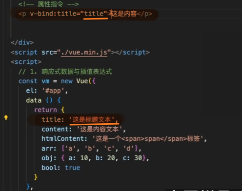

简化

将 `v-bind:` 简化为 `:`

#### 批量绑定一个对象

文件：`src/App.vue`

```
<script setup>
import Footer from './components/footer.vue'

const staticProps = {
  user: 10,
  userName: 'hey'
}
</script>

<template>
  <Footer v-bind="staticProps" />
</template>
```

这里不是绑定某一个属性，而是：

```
把 staticProps 这个对象里的所有属性，批量绑定到 Footer 组件上
```

它等价于：

```
<Footer :user="staticProps.user" :user-name="staticProps.userName" />
```

也就是：

```
<Footer :user="10" :user-name="'hey'" />
```

所以这就是 `v-bind` 的另一个用法：

```
v-bind:属性名="变量"    单个绑定
v-bind="对象"          批量绑定
```

------

**子组件接收时怎么写？**

文件：`src/components/footer.vue`

```
<script setup>
const props = defineProps({
  user: Number,
  userName: String
})
</script>

<template>
  <div>
    <p>{{ user }}</p>
    <p>{{ userName }}</p>
  </div>
</template>
```

因为父组件的：

```
<Footer v-bind="staticProps" />
```

已经被 Vue 拆成了：

```
<Footer :user="10" :user-name="'hey'" />
```

所以子组件就按普通 props 接收：

```
defineProps({
  user: Number,
  userName: String
})
```

### 动态类名绑定

*这里简单说说，因为 Vue 文档讲得更具体：https://v2.cn.vuejs.org/v2/guide/class-and-style.html*

**对象语法**： 使用对象语法，你可以根据条件返回一个对象，其中键是类名，值是布尔值，表示是否应用该类。

```
<div :class="{ active: isActive, 'text-danger': hasError }"></div>
```

在这个例子中：

- 如果 `isActive` 为 `true`，`active` 类会被添加。
- 如果 `hasError` 为 `true`，`text-danger` 类会被添加。


## 👧🏽事件指令

### v-on

```
v-on:事件名="要执行的方法"
```

```
@事件名="要执行的方法"
```


这里监听的是 `click` 事件。一旦 button 被点击，就会触发 `greet` 方法。


### v-model

`v-model` 主要用于表单元素的双向数据绑定，比如 `<input>`、`<textarea>`、`<select>`。

> 之前更多是单向绑定：数据变化后，视图跟着更新。（数据到视图）
>
> `v-model` 则可以让视图变化时，也把值同步回数据中。（视图到数据）


当 input 输入框的值变化时，`data` 里的 `message` 也会变化。

而 `app.message` 改变时，`<p>` 里的 `{{ message }}` 和 input 输入框的值也会跟着变化。


## 🐬Vue2.0 组件基础

### 简单终端指令

**Vue 项目创建**

**`vue create 项目名称`**

或者使用 `vue ui`


### 目录结构理解

```
my-vue-project/

├── node_modules/
├── public/
│   ├── favicon.ico
│   └── index.html
├── src/
│   ├── assets/
│   ├── components/
│   ├── App.vue
│   ├── main.js
├── .gitignore
├── babel.config.js
├── package.json
├── README.md
└── yarn.lock / package-lock.json
```


> node_modules：存放所有项目依赖包。通过 npm 或 yarn 安装的依赖都会下载到这个文件夹中，这是自动生成的，通常不需要手动修改。
>
> public：保存不参与编译的公共静态资源，比如网站图标和 `index.html`。`index.html` 是整个应用的入口，Vue 会把应用内容动态插入到这个文件的根标签中。
>
> src：保存参与编译的资源。这里是项目的源代码目录，存放 Vue 组件、页面、样式等。
>
> > assets：存放图片、字体等静态资源。这些资源通常会被 webpack 处理，并通过 JS 或 CSS 引用。
> >
> > components：存放自定义 Vue 组件。
> >
> > App.vue：项目根组件，通常作为整个应用的起始组件。`App.vue` 使用 Vue 单文件组件（Single File Component，SFC）格式，里面包含 `<template>`、`<script>` 和 `<style>` 部分。
> >
> > main.js：项目入口文件。在这里初始化 Vue 实例，并挂载到 `index.html` 的 `<div id="app"></div>` 上。
> >
> > ```
> > import Vue from 'vue';
> > import App from './App.vue';
> >
> > Vue.config.productionTip = false;
> >
> > new Vue({
> >   render: h => h(App),
> > }).$mount('#app');
> > ```
>
> package.json：文件包含项目的配置信息、依赖包、脚本等。它是nodejs的核心配置文件。
>
> 主要包括：
>
> 其他：                         
>
> 


### 组件通信

组件：把页面的一部分结构、样式和逻辑封装起来，方便复用和维护。

组件通信最基础的两类是父传子和子传父。

> 同级的也可以传
>
> * 同级组件也可以通过共同父组件中转。
> * Vue 2 中也有人用 EventBus 处理简单跨组件通信，不过项目复杂后不太好维护。
> * 如果层级很深，逐级传递很麻烦，可以考虑 Vuex 或其他状态管理方案。


#### EventBus（Vue2 常见）

```
创建 EventBus
        ↓
B 组件 created 时执行 bus.$on，订阅 send-message
        ↓
A 组件某个时刻执行 bus.$emit，广播 send-message
        ↓
EventBus 找到所有订阅 send-message 的回调
        ↓
B 组件的 callback 执行
        ↓
B 组件销毁前 bus.$off，取消订阅
```

它常用于 Vue2 中没有直接父子关系的简单组件通信，比如兄弟组件通信。

先创建一个事件总线：

```javascript
// eventBus.js
import Vue from 'vue'

export const bus = new Vue()
```


A 组件发送事件：

```javascript
import { bus } from './eventBus'

export default {
  methods: {
    sendMsg() {
      bus.$emit('send-message', '你好，我是 A 组件')
    }
  }
}
```

B 组件监听/订阅事件：

```javascript
import { bus } from './eventBus'

export default {
  created() {
    bus.$on('send-message', (msg) => {
      console.log(msg)
    })
  },
  beforeDestroy() {
    bus.$off('send-message')
  }
}
```

这里要注意两点：

1. Vue2 的 EventBus 依赖 `$emit`、`$on`、`$off` 这一套实例事件 API。
2. 监听后最好在 `beforeDestroy` 里解绑，否则组件销毁后事件还在，容易造成重复监听或内存泄漏。

Vue3 已经移除了实例上的 `$on/$off`，所以不推荐继续这样写。如果 Vue3 想做类似事件总线，一般会用 `mitt` 这种小库；如果是业务状态共享，更推荐 Pinia。

面试准备时可以这样说：

> EventBus 是 Vue2 里常见的非父子组件通信方式，本质是创建一个空 Vue 实例作为事件中心，通过 `$emit` 发事件，通过 `$on` 监听事件。它适合简单场景，但大型项目不推荐滥用，因为事件来源不清晰、维护成本高，Vue3 中也不再推荐这种实例事件 API。

#### 单文件组件结构

在 Vue 中，以 `.vue` 为后缀的文件称为单文件组件。

典型的单文件组件结构如下：（分别是结构，逻辑，样式）

* `<template>`：定义组件的 HTML 模板。

* `<script>`：定义组件的逻辑、数据等。

* `<style>`：定义组件的样式。


#### 父传子

`props`：子组件接收父组件传入数据的方式。


**父组件：**

这里定义了几个属性或事件，其中第三个 `countChange` 会涉及子传父。(没截全，后面是handler)


**子组件**：


子组件在对象中书写 `props` 属性。

这里的 `type` 表示可以接收哪些类型，比如字符串或数字。

`default` 表示父组件如果没有传 `count`，就使用默认值 `100`。


#### 子传父

由子组件触发，父组件被动监听。

`$emit`：子组件通知父组件的一种方式。


> 子组件也可以直接在 button 上调用 `$emit`。第一个参数是事件名，第二个参数是传给父组件的数据。
>
> ```
> <button @click = "$emit('changeCounte',this.childCount++)">按钮</button>
> ```


在父组件的 `hellotest` 组件标签上，我们监听 `countChange` 事件。这个事件由子组件 `$emit` 触发，父组件监听到后执行自己的 `handler`。（父组件和子组件里的 `handler` 只是名字一样，不是同一个函数）

父组件 `methods` 中的 `handler` 会接收到子组件传递过来的参数 `childCount`。

> 这里的 `childCount` 是函数参数，可以直接使用；如果要修改父组件自己的数据，则需要通过 `this.xxx` 访问。


这样就完成了子传父：子组件点击按钮，先修改自己的 `count`，再通过 `$emit` 把值传给父组件，父组件收到后再处理。


### 组件插槽

**插槽（Slot）就是：子组件留坑，父组件填内容；用来传 HTML / 模板，不是传数据（props）。**

> **props**：父→子，传**数据**（字符串、对象、数字）
>
> **插槽**：父→子，传**模板 / HTML / 组件**


#### 区别

**💭1. 默认插槽（最简单）**

特征：子组件里只有一个 `<slot>`，没有 name

```
<slot></slot>
```

父组件用法：直接写内容，不用 template、不用 #

```
<Child>
  我是默认插槽内容
</Child>
```

一句话：没名字、没模板、直接写 → 默认插槽


------

**💭2. 具名插槽（有名字）**

特征：子组件里 `<slot name="xxx">`

```
<slot name="header"></slot>
<slot name="footer"></slot>
```

父组件用法：必须写 `#名字` 或 `v-slot:名字`

```
<Child>
  <template #header> 我是头部 </template>
  <template v-slot:footer> 我是底部 </template>
</Child>
```

一句话：看到 name / 看到 #xxx → 具名插槽


------

**💭3.作用域插槽（带数据）**

**父用子的数据，渲染自己的模板。**

特征：子组件里 `<slot :变量="值">` —— 有冒号！

```
<slot :list="list"></slot>
<slot :item="item"></slot>
```

父组件用法：必须 `#default="{ 数据 }"`

```
<Child>
  <template #default="{ list }">
    {{ list }}
  </template>
</Child>
```

一句话：slot 上有：属性、父组件用 { } 解构 → 作用域插槽

------


#### 默认插槽


为了区分开，我给.hello加了margin-bottom:40px;


#### 具名插槽

这时我们给子组件又放了插槽


如果希望在父组件中修改footer插槽的内容，我们在父组件中修改如下


父组件中也可以这么写


#### 作用域插槽

**父用子的数据，渲染自己的模板。**

下面这个例子是**具名插槽 + 作用域插槽**混合用法

对于 `:childPassed="childCount"`，等号右边的 `childCount` 是子组件自己的数据，可以来自 `data` 或 `props`。

前面的 `childPassed` 是暴露给父组件使用的名字。父组件可以在**对应的**插槽中通过这个属性访问值。


在父组件相应的位置上，我们先通过具名插槽确定插入位置，再用 `dataObj` 接收插槽传来的对象。这个名字是父组件自己起的。


---

如果你在app.vue中这样书写


也就是用 `.` 来访问对象成员。


如果你不写这个{}，来看看结果

```
<template #footer="childPassed">第一个footer{{ childPassed }}</template>
```


如果你书写，

```
<template #footer="{childPassed}">第一个footer{{ childPassed }}</template>
```

应该得到这个


## 🐬VueRouter

### 💭前置理解

**多页面应用（Multi-Page Application，MPA）：** 指一个网站或应用由多个 HTML 页面组成。每次用户访问新页面时，服务器都会返回一个完整的 HTML 页面，浏览器也会刷新整个页面。

**单页面应用（Single Page Application，SPA）：** 指整个应用主要只有一个 HTML 页面，内容切换由 JS（比如 Vue）动态完成，不需要每次跳转都重新刷新整个页面。

我们通过前端路由（Vue Router、React Router 等）来管理 URL 和页面视图的切换。URL 会变化，但浏览器通常不会重新加载一个新的 HTML 页面，而是替换页面中的一部分内容。

> 单页面应用的原理：
>
> 当应用第一次加载时，客户端会获取应用所需的 HTML、CSS、JS 文件。
>
> 之后通过 JS（Vue）管理 URL 和组件切换，利用前端路由库（Vue Router）进行导航。
>
> 需要新数据时，应用会通过 AJAX 等方式请求数据，再局部渲染页面。


**单页面应用好处与坏处：**（简单聊聊）

由于主要只加载一次 HTML 页面，后续切换内容时通常更快，体验更流畅。

但由于首次加载可能需要较多 JS、CSS 文件，初次加载时间也可能更长。


---


**Vue里的路由是什么意思？**

Vue 使用 Vue Router 作为官方路由管理器，负责在单页面应用中管理路径和视图之间的关系。

当用户在浏览器访问某个 URL 时，应用需要展示对应的页面或视图。Vue Router 会根据 URL 找到对应组件并渲染出来，这个“URL 对应组件”的关系就是路由映射。


### 💭详解语句代码

##### **views文件是什么？**


在 `views` 文件夹中，每个文件通常代表应用中的一个独立页面。例如 `AboutView.vue` 是关于页，`HomeView.vue` 是首页。这些组件通常会和特定路由绑定。

> 当用户导航到某个路径，Vue Router会根据路径加载对应views文件夹中的组件。


##### 属性name

💭在我们的router中，有这样一个属性name，它与谁是相关的呢？

[](https://www.imagehub.cc/image/image-20241020125817783.Cxs60a)

1. 它与路径相关。当你想要修改或维护某个路径时，可以直接搜索这个名字找到对应路由。

2. 它可以在 `App.vue` 或其他组件中通过名字跳转。

在使用 `router-link` 组件时，你可以通过 `to` 属性的对象语法来使用命名路由进行导航，而不是直接使用路径：

```
<router-link :to="{ name: 'home' }">Go to Home</router-link>
```

这种方式比直接写路径（`/This_is_home`）更灵活，因为路径可能在将来发生变化，而名字通常保持不变。


##### **router-link：**

它可以理解为 a 标签的增强版，用它跳转不会刷新整个页面。

这个标签组件用于在单页面应用中创建导航链接。


这里的 `to` 属性必填，用来指定要导航到的路径或命名路由。


当用户点击 `<router-link>` 时：

1. Vue Router 会拦截这个点击事件。
2. URL 会被更新（但页面不会刷新）。
3. 匹配到的视图组件会被渲染到`<router-view>`位置。

（上面的图片里有这个一行，可以找找看）


### 新建组件配置路由

这是一个基础教学，但是万物都是从基础开始的。

达成效果：想要新建一个简单页面，在导航栏可以访问到。


1️⃣ 由于新建的页面很简单，不需要再引入其他组件，所以直接在 `views` 文件夹里新建一个 `.vue` 文件。


配置如下。为了避免样式影响其他 view 文件，需要在 `style` 标签内加入 `scoped`。

2️⃣ 在 `router` 文件夹内配置路由。我模仿了 about 页面的引入，只写了这一行。


3️⃣ 在 `App.vue` 里展示入口，这里用 `name` 来识别路由。


### 动态路由

最终效果：

当我们在 `App.vue` 里输入不同的 `id` 值，可以让上面的路由路径跟着改变。


**步骤：**

1️⃣ 如何自由地修改这个 `id` 呢？

这里使用 `params` 来传递，它的值是一个对象。


2️⃣ 在 `App.vue` 内更改 `id` 时，路由会先匹配 `router` 文件夹里的配置。

这里使用 props 的原因是为了**更方便地将路由参数传递给组件**。如果不配置 props，组件想获取这些参数就需要通过 `$route` 对象访问。

因为配置了 `props: true`，所以组件可以像接收普通 props 一样接收路由参数，不必强依赖 `$route`。）


这里在 `path` 后面加冒号，是为了声明一个名为 `id` 的动态参数。

> 这里的动态参数我们需要好好讲讲。
>
> 同一个路径内匹配不同的URL叫做**动态路由**。在动态路由中我们常常需要路径传递参数，
>
> 这个**动态参数**是随着URL的变化而变化。
>
> 如果要在路由路径中标记动态部分，需要使用冒号 `:`。Router 会把冒号后面的名字视作动态参数名，并把 URL 中匹配到的值解析到 `params` 里。
>
> 如果你在其他地方想要获取这个动态参数，可以通过 `this.$route.params` 来访问，此时动态参数就是这个params对象的属性。
>
> 
>
> 


3️⃣（可选）

如果你想要在当前页面展示动态路由变化的部分，可以在对应的视图组件中展示。


### 嵌套路由

在当前“bieguan”页面下，还想要增加两个页面，分别是点赞信息，互动信息。


当我们点击“点赞信息”，会出现该页面相关信息，而且在最上面的路径也会发生变化


增加子页面的步骤不难，但最好按顺序来，不然容易漏掉。

1️⃣ 在 `views` 下新建页面。

由于这里两个页面是子页面，而且格式相似，所以放在一个文件夹里。


2️⃣ 在 `router` 里配置路由。

在 router 文件中，先在顶部根据路径引入文件。

子页面要接在之前 `bieguan` 页面的路径下面，所以在该路由内加上 `children`。子路由里继续配置 `path`、`name`、`component`。


这样子我们的路由就算配置完毕了。如果想要在页面展示，还需要继续写。

3️⃣在父组件中配置

在父组件 `zhuzhuview` 中，我们用 `router-link` 标签通过 `name` 跳转到相关组件，分别是 `info1` 和 `info2`，并传入参数方便路径生成。

这里没有在根组件 `App.vue` 中配置，是因为根组件只需要展示父级路由组件。`info1` 和 `info2` 应该在它们的父组件里展示。

> 在routerlink标签中间我们写入点赞信息和互动信息，这是在我们zhuzhuview的视图中展示的，等你分别点进去才能看到info1和info2的视图。

底部还需要加上 `router-view`，别忘记。


`App.vue` 中没有做任何改动。


在进入页面之前，我想让 `id` 有默认值。

点击之后再进行修改。


### 编程式导航

**编程式导航**是指在 Vue Router 中通过 JavaScript 代码实现页面导航，而不是依赖于模板中的 `<router-link>` 标签或用户的点击操作。这种方式允许开发者在特定条件下控制路由跳转，例如在表单验证通过后、API 调用成功后，或在处理用户事件时。

`this.$router.push()` 是 **Vue Router** 提供的一个方法，专用于编程式导航。


做一个小案例看看实现方式：在 `zhuzhuview` 里点击`点赞信息`时，3 秒后跳转到主页 `home`。


这里使用 `created` 钩子，此时 `data`、`methods` 等已经初始化，但组件 DOM 还没有挂载完成。

这里插入了 `setTimeout`，表示 3 秒后跳转到主页。在这 3 秒内，页面先展示点赞信息界面，之后再跳到主页。

这里的 `this.$router` 指的是路由实例，`push` 是它提供的跳转方法。


### 路由传参

先介绍路由传参。它指的是通过路由携带参数，以便跳转到新页面或组件时把相关信息带过去。


想要效果：

在点赞信息（info1）内点击后三秒，将信息传递给互动信息（info2）


在 `info1` 页面的 `created` 钩子里，`push` 负责切换路由，`query` 负责传递数据。这里传的数据叫“info1 传递的数据”。


在 `info2` 的相应钩子内接收。

**通过 `this.$route` 获取当前路由信息。（`this.$router` 更多用于跳转，`this.$route` 更多用于读取当前路由数据）**


#### **动态参数与查询参数的区别**

**路由传参** 是指通过路由来传递数据或参数，以便在跳转到某个页面或组件时，将相关的信息带到新的视图中。在 Vue Router 中，路由传参主要有两种方式：

- 动态路由参数（params）

- 查询参数（query）

这两种方式允许你在导航时附带额外的信息，从而在目标页面或组件中根据这些参数来做出不同的处理。

- **params**
  - 写在 **path 里**：`/user/:id`
  - URL 样子：`/user/123`
  - **必须在路由配置里提前定义好**
  - 刷新页面**会丢失**（除非用 name 跳转）
- **query**
  - 写在 **? 后面**：`/user?id=123`
  - URL 样子：`/user?a=1&b=2&c=3`
  - **不用提前定义，随便加多少个**
  - 刷新页面**不会丢失**

| 特性         | 动态参数（params）              | 查询参数（query）              |
| ------------ | ------------------------------- | ------------------------------ |
| URL 形式     | `/user/42`                      | `/search?keyword=vue&page=1`   |
| 定义方式     | 在路由路径中用 `:param` 定义    | 不需要在路由路径中定义         |
| 传递方式     | `this.$router.push({ params })` | `this.$router.push({ query })` |
| 获取方式     | `this.$route.params`            | `this.$route.query`            |
| 典型应用场景 | 用户详情页、文章详情页等        | 搜索、分页、筛选等             |

<h3>总结</h3>

- **动态路由参数** 将参数嵌入在路径中，通常用于资源的唯一标识，如 `/user/1`。
- **查询参数** 通过 URL 后的查询字符串传递，适用于搜索、分页等可选参数的场景，如 `/search?keyword=vue&page=1`。

两者各有应用场景，选择哪种传参方式取决于你要实现的功能。


#### 动态路由参数（params）

动态路由参数是将参数嵌入到 URL 路径中的一种方式。通常用来传递关键数据，如用户 ID、文章 ID 等。这种参数在路由的路径中通过 `:` 语法定义。

**定义动态路由**

例如，假设我们有一个用户详情页面，需要根据用户 ID 来展示不同用户的详情，我们可以定义一个包含动态参数的路由：

```javascript
const routes = [
  {
    path: '/user/:id',  // :id 表示这个部分是一个动态参数
    name: 'user',
    component: UserView
  }
];
```

在这个例子中，`:id` 就是一个动态参数，当你访问 `/user/1` 时，`id` 参数的值就是 `1`。

**编程式导航传递 `params`**

当你通过编程式导航（即 `this.$router.push()`）时，可以传递动态参数：

```javascript
this.$router.push({ name: 'user', params: { id: 42 } });
```

这个代码会导航到 `/user/42`，并将 `id` 的值设为 `42`。

**获取动态参数**

在目标组件中，你可以通过 `this.$route.params` 来访问传递的动态参数。例如：

```javascript
export default {
  created() {
    console.log(this.$route.params.id);  // 输出 42
  }
};
```


#### 查询参数（query）

查询参数是通过 URL 中的问号 `?` 后面附加的键值对，类似于 URL 的查询字符串。查询参数通常用于搜索、筛选等需要携带较多信息的场景。

**定义普通路由**

查询参数不需要在路由定义中显式声明，你可以在任何路由中使用查询参数。

```javascript
const routes = [
  {
    path: '/search',
    name: 'search',
    component: SearchView
  }
];
```

**编程式导航传递 `query`**

当你想传递查询参数时，可以通过 `query` 属性来传递：

```javascript
this.$router.push({ path: '/search', query: { keyword: 'vue', page: 1 } });
```

这个代码会导航到 `/search?keyword=vue&page=1`，并传递 `keyword` 和 `page` 两个查询参数。

**获取查询参数**

在目标组件中，你可以通过 `this.$route.query` 来访问查询参数。例如：

```javascript
export default {
  created() {
    console.log(this.$route.query.keyword);  // 输出 'vue'
    console.log(this.$route.query.page);  // 输出 1
  }
};
```


### 导航守卫

导航守卫可以在路由跳转前后插入自己的逻辑，比如鉴权、拦截、重定向等。面试时问到导航守卫，核心要掌握三种类型的守卫、它们的执行流程，以及常见的应用场景。

#### 守卫的三种类型

**1. 全局守卫**（写在路由实例上，所有路由都会触发）

```javascript
// 路由配置
const router = createRouter({ ... })

// 全局前置守卫 - 每次路由切换前调用
router.beforeEach((to, from) => {
  // to: 目标路由对象
  // from: 当前正要离开的路由对象
  // 必须调用 next() 才能完成导航，或者直接返回值
  return true  // 放行
  // return false  // 取消导航
})

// 全局解析守卫 - 在组件实例被创建之前调用（路由确认后，组件渲染前）
router.beforeResolve((to, from) => {
  // 适合在此时进行数据预加载
})

// 全局后置守卫 - 路由切换完成后调用（组件已渲染）
router.afterEach((to, from) => {
  // 适合做页面埋点、滚动位置恢复等
})
```

**2. 路由独享守卫**（写在单个路由配置上）

```javascript
const routes = [
  {
    path: '/admin',
    component: Admin,
    beforeEnter: (to, from) => {
      // 只有进入 /admin 时才会触发
      // 适合对特定路由做单独的权限控制
    }
  }
]
```

**3. 组件内守卫**（写在组件内部）

```javascript
const UserProfile = {
  template: `...`,
  // 路由进入该组件时调用
  beforeRouteEnter(to, from) {
    // 此时组件实例还没创建，this 不可用
    // 可以通过 next(callback) 访问组件实例
    next(vm => {
      // vm 就是组件实例，在导航确认后调用
    })
  },
  // 路由参数变化时调用（如 /user/1 -> /user/2）
  beforeRouteUpdate(to, from) {
    // this 可以使用
  },
  // 离开该组件时调用
  beforeRouteLeave(to, from) {
    // 适合做离开提示，如表单未保存时阻止跳转
    const answer = window.confirm('还有未保存的更改，确定离开吗？')
    if (!answer) return false
  }
}
```

#### 参数详解

守卫函数接收三个参数：

| 参数 | 说明 |
| --- | --- |
| `to` | 目标路由对象，包含路径、参数、查询信息等 |
| `from` | 来源路由对象 |
| `next`（Vue Router 3） | 必须调用才能完成导航 |
| `next()` 的返回值（Vue Router 4） | `true`/undefined 放行，`false` 取消导航，或返回新路由对象 |

**`next` 的多种用法：**

```javascript
// Vue Router 3 写法
beforeEach((to, from, next) => {
  next()              // 放行
  next(true)         // 同上
  next(false)        // 取消导航
  next('/login')     // 跳转到其他路由
  next({ path: '/login', query: { redirect: to.fullPath } })  // 带参数跳转
})

// Vue Router 4 写法（更推荐）
beforeEach((to, from) => {
  return true                      // 放行
  return false                     // 取消导航
  return '/login'                  // 跳转到其他路由
  return { name: 'login', query: { redirect: to.fullPath } }  // 返回路由对象
})
```

#### 执行顺序

完整的导航流程如下：

```
1. 导航触发
2. 失活的组件调用 beforeRouteLeave
3. 全局 beforeEach
4. 路由独享 beforeEnter（如果有）
5. 复用组件调用 beforeRouteUpdate（如果有）
6. 组件 beforeRouteEnter
7. 全局 beforeResolve
8. 导航确认
9. 组件实例创建，beforeRouteEnter 的 next 回调执行
10. 全局 afterEach
11. DOM 更新完成
```

> **导航触发**：不是守卫，是 “跳转开始” 的信号，比如点按钮调用`push`。
>
> **beforeRouteLeave**：
>
> - 翻译：`before`、`Route`、`Leave` → “在路由离开前”。
> - 时机：从 A 页面跳走前，A 页面自己 “说话”。
>
> **全局 beforeEach**：
>
> - 翻译：`before`、`each` → “在每次（跳转）前”。
> - 时机：所有跳转的 “第一道关”，不管从哪跳到哪，都先经过它。
>
> **路由独享 beforeEnter**：
>
> - 翻译：`before`、`Enter` → “在进入（这个路由）前”。
> - 时机：只有跳去**当前这个路由**时才触发，是这个路由的 “专属门卫”。
>
> **复用组件 beforeRouteUpdate**：
>
> - 翻译：`before`、`Route`、`Update` → “在路由（参数）更新前”。
> - 时机：组件没换，但路由参数变了，组件 “更新前” 触发。
>
> **组件 beforeRouteEnter**：
>
> - 翻译：`before`、`Route`、`Enter` → “在路由进入（组件）前”。
> - 时机：跳去 B 页面时，B 页面 “被显示前” 触发，但这时候 B 页面还没创建出来。
>
> **全局 beforeResolve**：
>
> - 翻译：`before`、`Resolve` → “在（所有守卫）解决 / 完成前”。
> - 时机：前面所有 “before” 开头的守卫都跑完了，“最后确认” 一下，再正式跳转。
>
> **导航确认**：不是守卫，是 “所有检查通过，允许跳转” 的决策点。
>
> **组件实例创建，beforeRouteEnter 的 next 回调执行**：B 页面终于 “出生” 了，这时候`beforeRouteEnter`里的`next`才能拿到 B 页面的实例。
>
> **全局 afterEach**：
>
> - 翻译：`after`、`each` → “在每次（跳转）后”。
> - 时机：跳转完成后，地址栏和页面都变了，做些收尾工作。
>
> **DOM 更新完成**：B 页面的内容真正渲染到屏幕上，用户能看到了。

#### 常见面试场景

**1. 登录鉴权**

```javascript
// 判断用户是否已登录
const whiteList = ['/login', '/register']  // 白名单路由

router.beforeEach((to, from) => {
  const isLoggedIn = localStorage.getItem('token')
	
  //已登录
  if (isLoggedIn) {
    // 访问登录页则跳转到首页
    if (to.name === 'login') {
      return { name: 'home' }
    }
    return true
  }

  // 未登录
  if (whiteList.includes(to.path)) {
    return true  // 白名单路由放行
  }

  // 其他情况跳转到登录页，并记录原本想去的地址
  return { name: 'login', query: { redirect: to.fullPath } }
})
```

**2. 权限控制**

```javascript
// 假设用户角色存储在 store 中
router.beforeEach((to, from) => {
  const requiredRole = to.meta.role  // 路由配置的 meta 字段定义需要的角色
  const userRole = store.state.user.role

  if (!requiredRole) return true  // 不需要权限
  if (userRole === requiredRole) return true

  return { name: '403' }  // 无权限，跳转到 403 页面
})

// 路由配置示例
{
  path: '/admin',
  component: Admin,
  meta: { role: 'admin' }
}
```

**3. 页面埋点**

```javascript
router.afterEach((to, from) => {
  // 页面访问统计
  analytics.track('page_view', {
    from: from.name,
    to: to.name,
    path: to.path
  })
})
```

#### Vue Router 3 与 4 的区别

| 特性 | Vue Router 3 | Vue Router 4 |
| --- | --- | --- |
| 创建方式 | `new VueRouter({ routes })` | `createRouter({ routes })` |
| next 参数 | 必须调用 `next()` 放行 | 推荐直接返回值 |
| 守卫参数 | to, from, next | to, from（返回值控制导航） |
| 组合式 API | 没有 | 有 `onBeforeRouteUpdate`、`onBeforeRouteLeave` |

#### 面试加分点

1. **守卫是异步执行的**：所有守卫都是异步解析的，导航在所有守卫都 resolve 完之后才会完成。
2. **可以抛出错误**：在守卫中抛出错误，会触发 `onErrorCaptured` 或 `router.onError`。
3. **`next()` 多次调用**：在 Vue Router 3 中，调用多次 `next()` 只会执行第一次，后续调用会被忽略。
4. **导航被取消的情况**：如果当前导航被新的导航取代，原来的守卫可能不会再次执行。

---

在 `{}` 内很多地方可以不加分号，因为 JS 可以通过换行和 `}` 判断语句结束。

但为了代码风格统一，最好保持一致。


## 🐬Vuex

Vuex 是 Vue 2 中常用的全局状态管理工具。简单理解，它可以把多个组件都需要用到的数据集中放到一个仓库里管理。

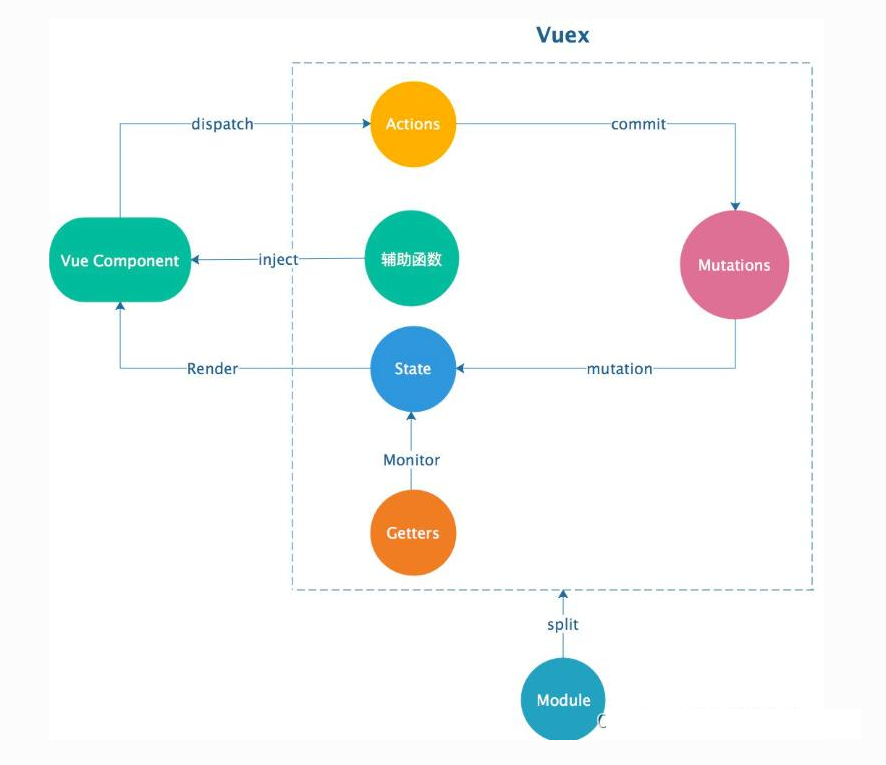

```
组件（Vue 页面）
   │
   │ 读数据：this.$store.state / this.$store.getters
   │
   │ 改数据（同步）：this.$store.commit('mutation名', 参数)
   │
   │ 改数据（异步）：this.$store.dispatch('action名', 参数)
   ▼
┌───────────────────────────┐
│         Vuex Store         │
│                           │
│  state：存数据（唯一数据源）   │
│  getters：计算属性（缓存）     │
│  mutations：同步修改 state    │
│  actions：异步逻辑 → commit mutation │
└───────────────────────────┘
```


Vuex 我是在创建项目时直接勾选创建的。

创建好后，在项目里大概是这个样子：


### state

这里采用函数写法，把 `state: {}` 改成了 `state() { return {} }`。

`state` 用来保存公共状态。这里在图片里定义了一个变量。


**使用：**


在上图中，我们在其中一个视图页面的两个生命周期里都使用了 `state` 中的变量。


使用时先通过 `this.$store` 访问仓库实例，再访问 `state`，最后访问具体变量。

> 直接访问 Vuex 中的 state 数据时，常见写法是 `this.$store.state.名字`。

**展示：**


### getters

`getters` 类似 Vue 的计算属性，它们**基于 state 进行计算**，并在相关状态改变时自动更新。

**定义：**


**使用：**


**特性：**

`getters` 具有**缓存性**。


```
mutation执行了，我们的count的值是 1
mutation执行了，我们的count的值是 3
mutation执行了，我们的count的值是 6

store当中的getters执行了
getters 8
getters 8
getters 8
getters 8
getters 8

// 3秒后
mutation执行了，我们的count的值是 18
```

可以看到 `console.log('store当中的getters执行了')` 只执行了一遍。

这里之所以mutation是同步的，但还是在最后一行输出，是因为**dispatch 里的 mutation 被 setTimeout 延迟执行了**，所以它的日志才会出现在后面。

### mutations

当我们修改 `state` 中的值时，如果一会儿在 A 页面改，一会儿在 B 页面改，后面维护起来就很容易找不到修改来源。

所以 Vuex 建议把同步修改状态的逻辑统一放在 `mutations` 中。

**定义：**


**使用：**


**`this.$store.commit`**：这是 Vuex 提供的方法，用于触发mutation。它的第一个参数是 mutation 的名称，第二个参数是你想传递给 mutation 的数据（载荷）。

`this.$store.commit('mutation名字', 参数)`

### actions

`actions` 主要用来处理异步逻辑。需要注意的是，真正修改 `state` 的仍然应该是 `mutations`。如果有异步操作，就先在 `actions` 里处理，处理完再 `commit` 一个 mutation 去改状态。

> `actions` 可以包含任意异步操作（例如 API 请求、定时器等），并且不能直接更改状态；它们的职责是处理业务逻辑，然后调用 mutations 来实际修改状态。
>
> `actions` 允许你将业务逻辑与状态更新分离，从而使代码更清晰。

**定义：**


> 可以看到我们在上面的delayChangeCount函数体中，并没有对state.count进行直接修改，而是使用commit去调用mutation，利用mutation进行state.count的修改。我们的actions只是做了异步的处理，我们加上的是setTimeout( )。

**使用：**


调用 `actions` 中的方法时使用 `dispatch`。可以理解成“派发一个任务”：先让它去执行，异步结果回来后再继续提交状态修改。

**因为在 Vuex 的 actions 和 mutations 里，函数的第一个参数就是 “仓库上下文”，所以不用 `this`。比如 mutations 里的 `state` 参数，就是当前仓库的 state；actions 里的 `{ commit }` 参数，其实是从仓库上下文里解构出来的 `commit` 方法，所以可以直接用 `commit('mutationName')`，不用加 `this.`。**

**举例：（更复杂的actions使用）**

```javascript
const store = new Vuex.Store({
  state: {
    count: 0,
  },
  mutations: {
    increment(state) {
      state.count++;
    },
    decrement(state) {
      state.count--;
    },
  },
  actions: {
    incrementAsync({ commit }) {
      setTimeout(() => {
        commit('increment'); // 在异步操作完成后提交 mutation
      }, 1000);
    },
    decrementAsync({ commit }, payload) {
      setTimeout(() => {
        commit('decrement'); // 使用 payload 可以传递参数
      }, payload.delay);
    },
  },
});

```

```js
methods: {
  increment() {
    this.$store.dispatch('incrementAsync'); // 调用 actions，异步增加 count
  },
  decrement() {
    this.$store.dispatch('decrementAsync', { delay: 500 }); // 调用 actions，异步减少 count，带有参数
  },
},
```


### 参数含义

 在vuex模块常常看到这些参数，

```
{ commit }、context、state、getters、rootState、rootGetters、payload
```

先记一句：

> **mutations / getters 主要拿 `state`；actions 主要拿 `context`。**

src/store/modules/user.js中，

```
// src/store/modules/user.js

export default {
  namespaced: true,

  state: {
    userInfo: null,
    token: '',
  },

  getters: {
    userName(state) {
      return state.userInfo?.name || '游客'
    },

    isLoggedIn(state) {
      return !!state.token
    },
  },

  mutations: {
    SET_USER(state, user) {
      state.userInfo = user
    },

    SET_TOKEN(state, token) {
      state.token = token
    },
  },

  actions: {
    async login(context, credentials) {
      const user = await api.login(credentials)

      context.commit('SET_USER', user)
      context.commit('SET_TOKEN', user.token)
    },

    logout({ commit }) {
      commit('SET_USER', null)
      commit('SET_TOKEN', '')
    },
  },
}
```

#### context

在 `actions` 里，第一个参数通常叫 `context`。

```
actions: {
  login(context, credentials) {

  }
}
```

这个 `context` 是 Vuex 给你的一个“工具包”。

里面最常用的是：

```
context.commit     调用 mutations
context.dispatch   调用其他 actions
context.state      当前模块的 state
context.getters    当前模块的 getters
context.rootState  根 state，也就是总 state
```

#### {commit}

你经常看到：

```
logout({ commit }) {
  commit('SET_USER', null)
}
```

这其实是 JS 的**解构语法**。

它等价于：

```
logout(context) {
  context.commit('SET_USER', null)
}
```

也就是说：

```
{ commit }
```

是从 `context` 里面单独拿出 `commit`。

### modules

当项目变得复杂时，所有 state、mutations、actions、getters 都写在 `store/index.js` 里会变得难以维护。

Vuex 提供了 **modules** 功能，可以把 store 拆分成多个模块，每个模块管理自己的状态和方法。

#### 目录结构

```
src/
├── store/
│   ├── index.js          # 主 store，组装所有模块
│   └── modules/
│       └── user.js       # 用户模块
└── App.vue               # 组件中使用
```

#### 创建模块

`src/store/modules/user.js`

```javascript
const userModule = {
  namespaced: true,

  state: {
    userInfo: null,
    isLoggedIn: false,
  },

  mutations: {
    SET_USER(state, user) {
      state.userInfo = user
      state.isLoggedIn = true
    },
    CLEAR_USER(state) {
      state.userInfo = null
      state.isLoggedIn = false
    },
  },

  actions: {
    async login({ commit }, credentials) {
      const user = await api.login(credentials)
      commit('SET_USER', user)
    },
    logout({ commit }) {
      commit('CLEAR_USER')
    },
  },

  getters: {
    userName: (state) => state.userInfo?.name || 'Guest',
    isVip: (state) => state.userInfo?.vip === true,
  },
}

export default userModule
```

#### 在 store 中注册模块

`src/store/index.js`

```javascript
import Vue from 'vue'
import Vuex from 'vuex'
import userModule from './modules/user'

Vue.use(Vuex)

export default new Vuex.Store({
  state: {
    version: '1.0.0',
  },

  modules: {
    // key 'user' 是模块名，访问时要用这个名字
    user: userModule,
  },
})
```

#### 在组件中使用模块

##### map

在下面 `组件.vue` 我们不需要引入 `store/index.js`

因为`store/index.js`通常是在`main.js`统一引入挂载到整个vue应用上的

`src/App.vue`

```vue
<template>
  <div>
    <h1>用户名: {{ userName }}</h1>
    <p>VIP状态: {{ isVip ? '是' : '否' }}</p>
    <button @click="handleLogin">登录</button>
    <button @click="handleLogout">退出</button>
  </div>
</template>

<script>
import { mapState, mapGetters, mapActions } from 'vuex'

export default {
  computed: {
    ...mapState('user', {
      userInfo: 'userInfo',
      isLoggedIn: 'isLoggedIn',
    }),
    ...mapGetters('user', ['userName', 'isVip']),
  },

  methods: {
    ...mapActions('user', ['login', 'logout']),

    handleLogin() {
      this.login({ username: '张三', password: '123456' })
    },

    handleLogout() {
      this.logout()
    },
  },
}
</script>
```

> `mapState / mapGetters` 是把 Vuex 里的数据，映射成当前组件的 `computed`。
>  `mapActions` 是把 Vuex 里的 action，映射成当前组件的 `methods`。
>
> 然后map的第一个参数不一定是模块名，你可以直接写方法，这样就会去全局找
>
> 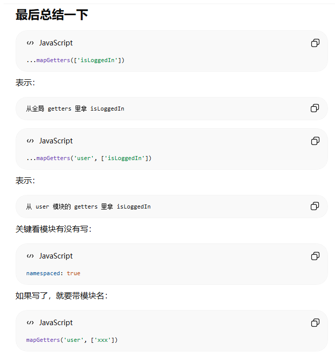
>
> 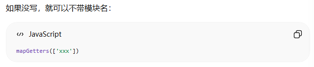


##### 不用 map

```javascript
// 上面代码和之前一样
export default {
  computed: {
    userInfo() {
      return this.$store.state.user.userInfo
    },
    userName() {
      return this.$store.getters['user/userName']
    },
  },

  methods: {
    handleLogin() {
      return qthis.$store.dispatch('user/login', {
        username: '张三',
        password: '123456',
      })
    },
    handlelogout() {
      return this.$store.dispatch('user/logout')
  }
  },
}
```

#### 多模块扩展

`src/store/index.js`

```javascript
import userModule from './modules/user'
import productsModule from './modules/products'

export default new Vuex.Store({
  modules: {
    user: userModule,
    products: productsModule,
  },
})
```

访问时用 `this.$store.state.products.list`、`this.$store.getters['products/totalCount']` 等。

> 我之前有个疑问就是为什么不能`this.$store.products.state.list`，这是因为vuex最终会把所有模块的state统一收集到大的`rootState`里

#### namespaced:true

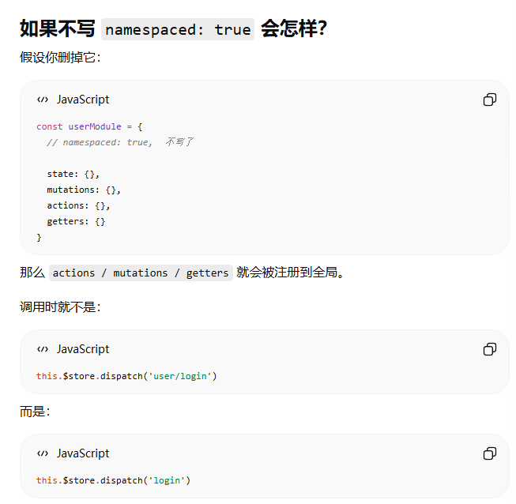

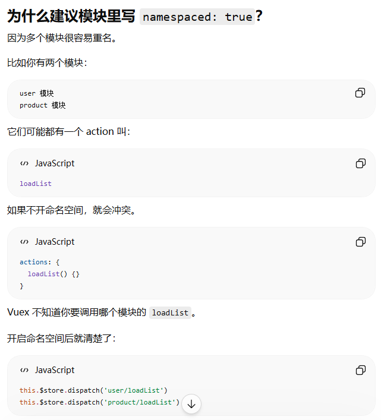

#### 小结

| 要点 | 说明 |
| --- | --- |
| 开启命名空间 | 添加 `namespaced: true`，别的文件访问时路径是 `模块名/getters、mutations、actions名` |
| 注册模块 | 在 `store/index.js` 的 `modules` 对象中注册 |
| 访问路径 | 用注册时的 key（如 `user`、`products`）作为前缀 |
| map 辅助函数 | 第一个参数传模块名，如 `mapState('user', [...])` |


>
>
> 
>
> 可以看到 `add` 和 `sub` 的写法不一样。`sub({ commit })` 用的是解构赋值，因为 `context` 里有很多东西，我们只取其中的 `commit` 来用。


## 🐬Vue2 与 Vue3 的区别

Vue3 是 Vue.js 的重大版本升级，相比 Vue2 有很多重要的变化。面试中经常会被问到两者的区别，下面从多个维度来对比。

### 生命周期

生命周期不要只背名字，更重要的是知道每个阶段适合做什么。Vue3 里最常用的是组合式 API，所以生命周期一般写成 `onMounted`、`onBeforeUnmount` 这种函数。

| 阶段 | Vue2 写法 | Vue3 写法 | 常见用途 |
| --- | --- | --- | --- |
| 创建前 | `beforeCreate` | `setup` 执行前后 | 很少直接用，Vue3 基本用 `setup` 接管 |
| 创建完成 | `created` | `setup` | 初始化普通数据、准备请求参数、调用不依赖 DOM 的方法 |
| 挂载前 | `beforeMount` | `onBeforeMount` | 较少用，适合在 DOM 渲染前做最后的状态准备 |
| 挂载完成 | `mounted` | `onMounted` | 最常用：发首屏请求、拿 DOM、初始化图表、注册事件监听 |
| 更新前 | `beforeUpdate` | `onBeforeUpdate` | 更新 DOM 前读取旧状态，实际项目中用得不多 |
| 更新完成 | `updated` | `onUpdated` | DOM 更新后做操作，但要避免在这里反复改数据导致循环更新 |
| 卸载前 | `beforeDestroy` | `onBeforeUnmount` | 清理定时器、解绑事件监听、取消请求、销毁图表实例 |
| 卸载完成 | `destroyed` | `onUnmounted` | 组件已经移除，一般用于确认清理完成 |

这里重点记几个高频用法就够了。

**1. 请求数据**

如果请求不依赖 DOM，Vue2 常写在 `created`，Vue3 可以直接在 `setup` 里调用；如果请求后还要操作 DOM，通常放在 `mounted/onMounted`。

```javascript
// Vue2
export default {
  created() {
    this.getList()
  },
  methods: {
    getList() {
      // 请求列表数据
    }
  }
}
```

```javascript
// Vue3
import { onMounted } from 'vue'

onMounted(() => {
  getList()
})
```

**2. 操作 DOM 或初始化第三方库**

只要涉及真实 DOM，比如获取元素高度、初始化 ECharts、创建滚动插件，一般放在 `mounted/onMounted`。因为这个时候模板已经渲染到页面上了。

```javascript
import { ref, onMounted } from 'vue'

const chartRef = ref(null)

onMounted(() => {
  // 这里才能稳定拿到 chartRef.value
  // initChart(chartRef.value)
})
```

**3. 清理副作用**

如果组件里开了定时器、绑定了 `window` 事件、创建了图表实例，离开页面前要清理。Vue2 用 `beforeDestroy`，Vue3 用 `onBeforeUnmount`。

```javascript
// Vue3
import { onMounted, onBeforeUnmount } from 'vue'

let timer = null

onMounted(() => {
  timer = setInterval(() => {
    // 定时刷新
  }, 1000)
})

onBeforeUnmount(() => {
  if (timer) {
    clearInterval(timer)
  }
})
```

**4. 更新后操作**

`updated/onUpdated` 表示数据变化引起 DOM 更新之后。它可以用来读取更新后的 DOM，但不要在里面随便修改当前组件依赖的数据，不然可能造成重复更新。

面试里可以这样说：

> Vue2 生命周期是选项式写法，比如 `created`、`mounted`、`beforeDestroy`；Vue3 组合式 API 中用 `setup` 和 `onMounted`、`onBeforeUnmount` 等函数。实际项目里最常用的是 `created/setup` 做不依赖 DOM 的初始化，`mounted/onMounted` 做请求、DOM 操作和第三方库初始化，`beforeDestroy/onBeforeUnmount` 做清理工作。

### 响应式原理

响应式说白了就是一句话：**数据变了，页面中用到这个数据的地方会自动更新**。

这里不要只背“Vue2 用 `Object.defineProperty`，Vue3 用 `Proxy`”，还要知道它们为什么会有差异。

#### Vue2：Object.defineProperty

```javascript
data() {
  return {
    user: {
      name: '张三'
    }
  }
}
```

Vue2 初始化组件时，会遍历 `data` 里的属性，然后用 `Object.defineProperty` 给每个属性加上 `getter` 和 `setter`。

```javascript
Object.defineProperty(obj, 'name', {
  get() {
    // 读取 name 时触发，这里可以收集依赖
    return value
  },
  set(newValue) {
    // 修改 name 时触发，这里可以通知页面更新
    value = newValue
  }
})
```

可以简单理解为：

```txt
读取 user.name
        ↓
触发 getter
        ↓
代码修改 user.name
        ↓
触发 setter，Vue 通知相关视图更新
```

这就是 Vue2 响应式的大概思路。

但是它有一个很重要的限制：**Vue2 是初始化时就把已有属性处理成响应式，如果后来新增属性，Vue 一开始没有给它设置 getter/setter，就监听不到。**

```javascript
data() {
  return {
    user: {
      name: '张三'
    }
  }
}

// 修改已有属性：可以响应式更新
this.user.name = '李四'

// 新增属性：Vue2 默认监听不到
this.user.age = 18

// Vue2 需要这样写
Vue.set(this.user, 'age', 18)
```


#### Vue3：Proxy

Vue3 的响应式基于 Proxy。Proxy 会代理整个对象，外部对响应式对象的读取、修改、新增、删除都会先经过 Proxy 的拦截逻辑，Vue 就可以在读取时收集依赖，在修改时触发更新。相比 Vue2 的 Object.defineProperty，Proxy 对新增属性、删除属性和数组操作支持更自然。

> 这里的外部是指 所有使用这个响应式对象的地方，不是原始对象内部自己在变，而是在对象外面读取它、修改它。

```
	你的代码或模板
        ↓ 读取/修改
	
	Proxy 代理对象
        ↓ 转发
	
	原始对象

Vue 响应式系统在 Proxy 这里记录和通知
```

> 此时的Vue 不是“响应式对象的一方”，更像是站在 Proxy 旁边的记录员。

1. 你修改响应式对象
2. Proxy 立刻拦截
3. 原始数据立刻被改掉
4. Vue 找到依赖这个数据的组件/副作用
5. Vue 把“更新页面”这个任务放进异步更新队列
6. 当前同步代码执行完后，在微任务里统一刷新 DOM

```javascript
import { reactive } from 'vue'

const data = reactive({
  name: '张三'
})

// 修改已有属性
data.name = '李四'

// 新增属性也能被监听
data.age = 25

// 删除属性也能被监听
delete data.age
```

这也是为什么有时候你改完数据后马上读 DOM，读到的可能还是旧 DOM：

```javascript
user.name = '李四'

console.log(document.querySelector('#name').textContent)
// 可能还是旧内容
```

如果你想等 DOM 更新完成，要用 nextTick：

```javascript
import { nextTick } from 'vue'

user.name = '李四'

await nextTick()

console.log(document.querySelector('#name').textContent)
// 这时 DOM 已经更新
```

面试版可以这样说：

> Vue3 中修改响应式数据时，Proxy 会同步拦截 set 操作并修改数据，然后触发依赖更新。组件更新不会立刻同步执行，而是被放入调度队列，Vue 会在当前同步任务结束后的微任务中批量刷新，避免多次数据修改导致多次 DOM 更新。

### 状态管理：Vuex 和 Pinia

Vue2 时代最常见的是 **Vuex**，Vue3 现在更推荐 **Pinia**。它们解决的是同一类问题：多个组件共享数据时，不想靠父子传参一层层传，就把公共状态放到一个统一的 store 里。

#### Vue2 常见：Vuex

Vuex 的结构比较固定：

```txt
state：保存数据
getters：基于 state 派生数据，类似 computed
mutations：同步修改 state
actions：处理异步，再 commit mutation
modules：拆分模块
```

比如 Vuex 里改一个 count，常见流程是：

```javascript
// store
const store = new Vuex.Store({
  state: {
    count: 0
  },
  mutations: {
    increment(state) {
      state.count++
    }
  },
  actions: {
    incrementAsync({ commit }) {
      setTimeout(() => {
        commit('increment')
      }, 1000)
    }
  }
})
```

组件里使用：

```javascript
this.$store.state.count
this.$store.commit('increment')
this.$store.dispatch('incrementAsync')
```

Vuex 的特点是规矩比较清楚，但写起来偏重。尤其是必须通过 mutation 改 state，初学时容易觉得绕。

#### Vue3 常见：Pinia

Pinia 更轻一些，它没有 mutations，只有 `state`、`getters`、`actions`。

```javascript
import { defineStore } from 'pinia'

export const useCounterStore = defineStore('counter', {
  state: () => ({
    count: 0
  }),
  getters: {
    double: (state) => state.count * 2
  },
  actions: {
    increment() {
      this.count++
    },
    async incrementAsync() {
      await delay()
      this.count++
    }
  }
})
```

组件里使用：

```javascript
import { useCounterStore } from '@/stores/counter'

const counterStore = useCounterStore()

counterStore.count
counterStore.double
counterStore.increment()
```

Pinia 的感觉更像“把一组响应式数据和方法封装成一个函数来用”。它和 Vue3 的组合式 API 更搭，也更适合 TypeScript 类型推断。

> 注意你这里面如果说有一个分store，你不需要把它先引入一个总的store，如果你有哪个组件你想要用这个分store，直接像这样引入就可以。
> 但是vue2是需要汇总的
>
> | 对比项   | Vuex (Vue 2)                             | Pinia (Vue 3)                 |
> | :------- | :--------------------------------------- | :---------------------------- |
> | 组织方式 | 必须有 `store/index.js` 汇总所有 modules | 不需要汇总，分散定义          |
> | 模块注册 | 必须在 root store 中 `modules: {}` 注册  | 直接 `defineStore()` 定义即可 |
> | 使用方式 | `this.$store.state.xxx` 或 mapState      | 直接调用 `useXxxStore()`      |
> | 热更新   | 需要手动处理                             | 原生支持，无需额外配置        |

#### 对比记忆

| 对比点 | Vuex | Pinia |
| --- | --- | --- |
| 常见搭配 | Vue2，也可以用于 Vue3 | Vue3 更推荐 |
| 修改状态 | 同步修改通常走 mutations | 直接在 actions 或组件中修改 |
| 异步逻辑 | actions 里异步，再 commit mutation | actions 可以同步也可以异步 |
| 模块化 | modules，写法相对重 | 每个 `defineStore` 天然就是一个模块 |
| TypeScript | 支持但比较麻烦 | 类型推断更友好 |

面试里可以这样说：

> Vuex 和 Pinia 都是状态管理工具。Vuex 常见于 Vue2，结构是 state、getters、mutations、actions，其中 mutations 负责同步修改 state，actions 负责异步。Pinia 是 Vue3 更推荐的状态管理方案，去掉了 mutations，直接用 state、getters、actions，写法更简单，模块化和 TypeScript 支持也更自然。


### 组件写法

**Vue2：选项式 API (Options API)**

```javascript
export default {
  data() {
    return { count: 0 }
  },
  methods: {
    add() { this.count++ }
  },
  computed: {
    double() { return this.count * 2 }
  },
  watch: {
    count(newVal) { console.log(newVal) }
  }
}
```

**Vue3：组合式 API (Composition API)**

```javascript
import { ref, computed, watch } from 'vue'

export default {
  setup() {
    const count = ref(0)  // 响应式数据
    const double = computed(() => count.value * 2)

    const add = () => { count.value++ }

    watch(count, (newVal) => {
      console.log(newVal)
    })

    return { count, double, add }
  }
}
```

> options API是在一个对象里配置各种“选项”。但如果一个功能同时需要 data、methods、computed、watch，它会被拆散。
>
> Vue3 组合式 API 的重点是：**把同一个功能相关的东西组合在一起写。**

**组合式 API 的优势：**

1. **更好的逻辑复用**：相同逻辑可以提取到独立的函数中，通过 import 复用
2. **更好的类型推断**：配合 TypeScript 使用体验更好
3. **代码组织**：相关逻辑可以放在一起，而不是分散在 data/methods/computed/watch 中


### 模板中的多个根元素

这里的“根元素”，就是 **template中 最外层的那个元素**。

**Vue2：不支持**

```html
<!-- Vue2 报错：template 只能有一个根元素 -->
<template>
  <div>1</div>
  <div>2</div>
</template>
```

**支持**

```
<template>
  <div>
    <p>1</p>
    <p>2</p>
  </div>
</template>
```


**Vue3：支持**

```html
<!-- Vue3 可以有多个根元素 -->
<template>
  <header>Header</header>
  <main>Content</main>
  <footer>Footer</footer>
</template>
```


### Teleport（传送门）

Vue3 新增的 Teleport 可以将组件的 DOM 节点传送到任意位置：

```html
<!-- 将模态框传送到 body 下，避免 z-index 问题 -->
<Teleport to="body">
  <div class="modal">
    <h3>模态框</h3>
    <button @click="close">关闭</button>
  </div>
</Teleport>
```

### Suspense（悬念）

Vue3 新增的 Suspense 用于处理异步组件的加载状态：

```html
<Suspense>
  <template #default>
    <AsyncComponent />
  </template>
  <template #fallback>
    <div>加载中...</div>
  </template>
</Suspense>
```

### 其他重要区别

| 特性 | Vue2 | Vue3 |
| --- | --- | --- |
| **Diff 算法** | 双端比较 | 最长递增子序列优化 |
| **TypeScript 支持** | partial（需要额外配置） | 更好的类型推断，原生支持 |
| **过滤器** | 支持 | 移除，推荐用 methods 或计算属性 |
| **v-model** | 一个组件只能有一个 | 可以用 `v-model:xxx` 支持多个 |
| **全局 API** | 静态的 | 支持 tree-shaking，按需引入 |
| **Props 校验** | `type`、`required`、`validator` | 同样的方式，但更完善的类型支持 |

### 面试加分点

1. **为什么 Vue3 要重写？**
   - 更好的 TypeScript 支持
   - Proxy 解决响应式的缺陷
   - 更好的性能（虚拟 DOM 重写、编译优化）
   - 更好的代码组织（Composition API）
   - 更小的包体积（Tree-shaking 支持）

2. **Vue3 的性能提升来自哪里？**
   - 静态提升：不会参与更新的模板节点被提升
   - 缓存事件处理函数
   - Block Tree：标记动态节点，减少遍历
   - PatchFlag：精确标记动态属性

3. **setup 函数的执行时机**
   - 在 `beforeCreate` 之前执行
   - this 不是组件实例（是 undefined）
   - 不能使用 async（如果 setup 返回 Promise，组件会自动等待）


## 🐬Vue3.0基础

### 生命周期

<div style="color:#879A3F">挂载阶段</div>

    onBeforeMount
    
        在组件实例即将被挂载到DOM树之前调用
    
        此时模板还没有渲染到 DOM，通常用于执行初始化操作。
    
        如果操作需要依赖真实 DOM，应该放到 onMounted 中。
    
    onMounted
    
        在组件成功挂载到 DOM 并完成首次渲染后调用。
    
        此时可以访问和操作 DOM 元素。
    
        适合执行与页面交互相关的逻辑。

<div style="color:#879A3F">更新阶段</div>

    onBeforeUpdate (由于响应式数据变化)
    
        在响应式数据变化导致组件重新渲染时，更新之前调用。
    
        可以在这里读取更新前的 DOM 状态。
    
        不建议在这里继续修改会触发更新的数据，避免造成重复更新。
    
    onUpdated
    
        在组件完成更新并重新渲染后调用。
    
        可以基于新的渲染结果处理更新后的 DOM。

<div style="color:#879A3F">卸载阶段</div>

    onBeforeUnmount
    
        在组件从 DOM 中卸载之前调用。
    
        适合释放资源，比如清理计时器、解绑事件监听器等。
    
    onUnmounted
    
        在组件已经从 DOM 中移除并卸载后调用。
    
        可以确认组件相关资源已经被释放。

<div style="color:#879A3F">错误处理</div>

    onErrorCaptured
    
        在捕获到后代组件中的错误时调用。
    
        常用于记录错误日志或展示降级 UI。


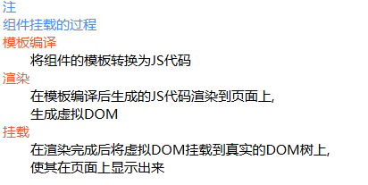

### ref、reactive、toRef、toRefs、unref

Vue3 里写响应式数据，最常见的是 `ref` 和 `reactive`。它们都是为了创建响应式数据，但适合的场景不太一样。

面试里可以这样说：

> `ref` 适合基础类型，使用时通过 `.value` 访问；`reactive` 适合对象和数组，返回 Proxy 代理对象；`toRef` 可以把响应式对象的某一个属性转成 ref；`toRefs` 可以把响应式对象的所有属性转成 ref，常用于解构时保持响应式；`unref` 是获取 ref 内部值的语法糖。

**ref**

`ref` 更适合定义一个基础类型数据，比如数字、字符串、布尔值。

```javascript
import { ref } from 'vue'

const count = ref(0)

count.value++
```

注意：在 JS 里使用 `ref` 的值，要写 `.value`。因为 `ref(0)` 返回的不是数字本身，而是一个带有 `value` 属性的响应式对象。

```txt
count        是 ref 对象
count.value  才是真正的值
```

但在模板里不用写 `.value`：

```vue
<template>
  <div>{{ count }}</div>
</template>
```

Vue 会在模板里自动帮你解包。

**reactive**

`reactive` 更适合定义对象或数组。

```javascript
import { reactive } from 'vue'

const user = reactive({
  name: '张三',
  age: 18
})

user.name = '李四'
```

`reactive` 返回的是一个 Proxy 代理对象，所以你可以像普通对象一样读写属性，不需要 `.value`。

简单记：

| 写法 | 适合什么 | JS 中访问 |
| --- | --- | --- |
| `ref(0)` | 基础类型，也可以放对象 | `count.value` |
| `reactive({})` | 对象、数组 | `user.name` |

**toRef**

`toRef` 是把响应式对象中的某一个属性，单独转成一个 ref。

```javascript
import { reactive, toRef } from 'vue'

const user = reactive({
  name: '张三',
  age: 18
})

const name = toRef(user, 'name')

name.value = '李四'
console.log(user.name) // 李四
```

它的重点是：`name` 和 `user.name` 仍然是连在一起的。改 `name.value`，`user.name` 也会变。

**toRefs**

`toRefs` 是把一个响应式对象的所有属性都转成 ref，常用于解构。

为什么需要它？因为直接解构 `reactive` 对象，容易丢失响应式。

```javascript
const user = reactive({
  name: '张三',
  age: 18
})

// 不推荐：这样解构出来的 name、age 容易失去响应式联系
const { name, age } = user
```

推荐：

```javascript
import { reactive, toRefs } from 'vue'

const user = reactive({
  name: '张三',
  age: 18
})

const { name, age } = toRefs(user)

name.value = '李四'
console.log(user.name) // 李四
```

**unref**

`unref` 是获取 ref 内部值的快捷方式。如果参数是 ref，返回 `.value`；如果不是 ref，直接返回原值。

```javascript
import { ref, unref } from 'vue'

const count = ref(0)
const num = 10

console.log(unref(count)) // 0（自动取 .value）
console.log(unref(num))   // 10（直接返回）
```

相当于：

```javascript
const val = isRef(count) ? count.value : count
```

常用于函数参数不确定是 ref 还是普通值的场景。


#### 为什么需要 ref / reactive？

这里有个常见的误解：Vue3 用 Proxy 实现响应式，是不是所有数据都自动响应式了？

**答案：不是。**

Vue 的响应式系统是**主动创建的**，不会自动追踪普通变量。

```javascript
// 普通变量，Vue 不会追踪它的变化
let count = 0
count++  // 改了，但页面不会更新

// 用 ref/reactive 包裹后，才会变成响应式
const count = ref(0)
count.value++  // 改了，页面会自动更新
```

原因是：Vue 需要显式地“告诉”它哪些数据需要追踪变化。`ref` 和 `reactive` 就是干这个的——它们会返回一个被 Vue 劫持过的 Proxy（`ref` 内部也是把值包成 reactive）。

```javascript
// Vue 响应式的本质
const count = ref(0)

// 相当于内部做了类似这样的事：
const count = reactive({ value: 0 })
```

**简单说：普通变量只是 JavaScript 变量，Vue 根本不知道它存在；只有用 ref/reactive 包裹后，Vue 才会监听它的变化。**

#### 什么时候不用响应式？

简单判断：**一个数据如果不需要在 UI 上展示，就不需要响应式。**

不懂 话可以去看看proxy那个标题下的内容。

> **面试时这样回答：**
>
> Vue3 虽然用 Proxy 实现响应式，但不会自动把所有变量变成响应式，必须主动用 `ref` 或 `reactive` 包裹。响应式的本质是"数据变化 → 视图更新"，所以只需要对需要在 UI 上展示的数据使用响应式。固定常量、纯计算临时变量、大数据量场景等不需要响应式。


### define 相关语法

Vue3 里有不少以 `define` 开头的写法，但它们不是同一类东西。先记一个大方向：`define` 可以理解成“声明”。

#### `<script setup>` 里的 define 宏

在 Vue3 的 `<script setup>` 里，经常会看到：

```vue
<script setup>
const props = defineProps(['title'])
const emit = defineEmits(['change'])
</script>
```

这些不是普通业务函数，而是 Vue 编译器提供的 **宏**。也就是说，Vue 在编译时会识别它们并转换代码，所以通常不需要手动 `import`。

常见的宏有：

| 写法 | 作用 |
| --- | --- |
| `defineProps` | 声明父组件传进来的 props |
| `defineEmits` | 声明子组件要触发的事件 |
| `defineExpose` | 主动暴露组件内部方法或数据给父组件 |
| `defineOptions` | 声明组件选项，比如组件名 |

> 提前用`defineProps`声明，能让 Vue 底层明确组件接收数据的类型、结构等信息，这样在父子组件通信时，就能更高效准确地传递和处理数据，就像提前告知会议相关信息能让会议更有序地进行一样。

比如 `defineProps` 是在告诉 Vue：这个组件可以接收哪些父组件传来的参数。

```vue
<script setup>
const props = defineProps({
  title: String,
  count: Number
})
</script>
```

`defineEmits` 是在告诉 Vue：这个组件会向父组件触发哪些事件。

```vue
<script setup>
const emit = defineEmits(['change'])

const handleClick = () => {
  emit('change', 123)
}
</script>
```

#### store 里的 defineStore

Pinia 里也有 `defineStore`：

```javascript
import { defineStore } from 'pinia'

export const useUserStore = defineStore('user', {
  state: () => ({
    name: '张三'
  }),
  actions: {
    setName(name) {
      this.name = name
    }
  }
})
```

这里的 `defineStore` 不是 Vue 编译器宏，它是 Pinia 提供的普通函数，需要从 `pinia` 里 import。

它的作用是：声明一个 store。第一个参数 `'user'` 是这个 store 的唯一名字，第二个参数里写 `state`、`getters`、`actions`。

所以要区分：

| 写法 | 来自哪里 | 是否需要 import | 含义 |
| --- | --- | --- | --- |
| `defineProps` | Vue `<script setup>` 宏 | 通常不需要 | 声明 props |
| `defineEmits` | Vue `<script setup>` 宏 | 通常不需要 | 声明 emits |
| `defineExpose` | Vue `<script setup>` 宏 | 通常不需要 | 声明暴露给父组件的内容 |
| `defineStore` | Pinia | 需要 | 声明一个 store |

面试或复习时可以这样说：

> Vue3 里 `define` 大多表示“声明”。`defineProps`、`defineEmits` 是 `<script setup>` 的编译器宏，用来声明组件接收什么、发出什么；`defineStore` 是 Pinia 的函数，用来声明一个状态仓库。它们名字都带 define，但来源和作用不同。

### 组件通信

#### 父传子（defineProps）

**1.传入属性和属性值**

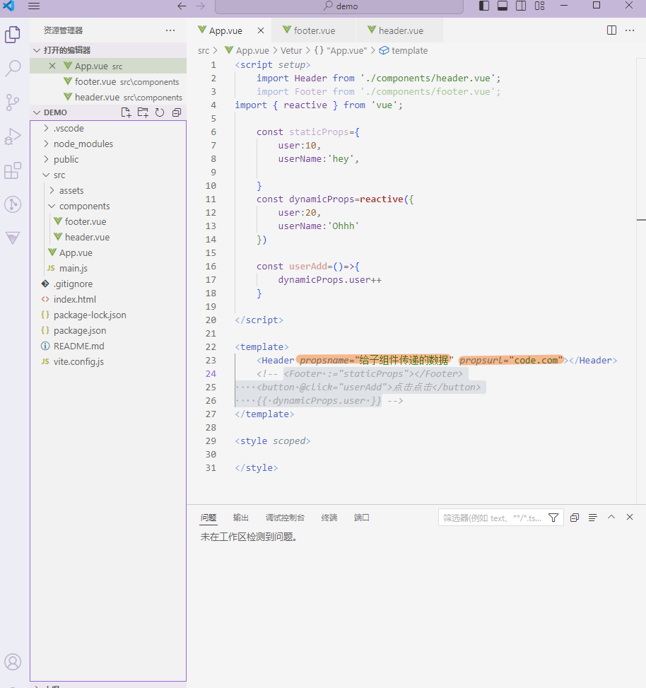

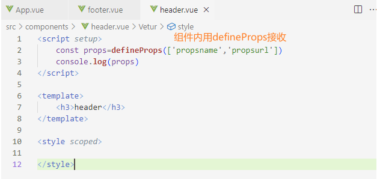


**2.传入对象**（静态数据）

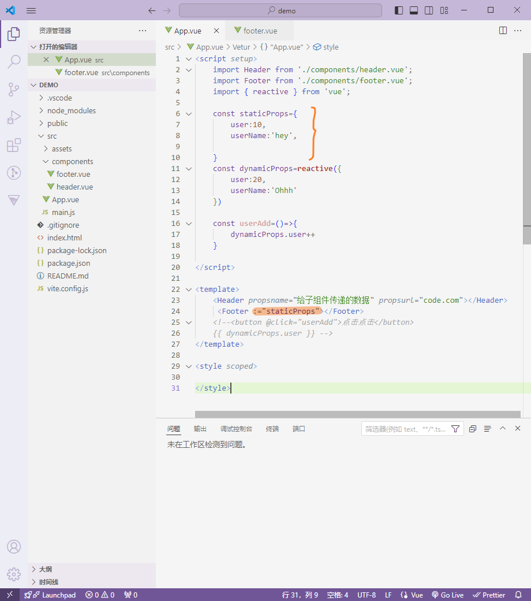

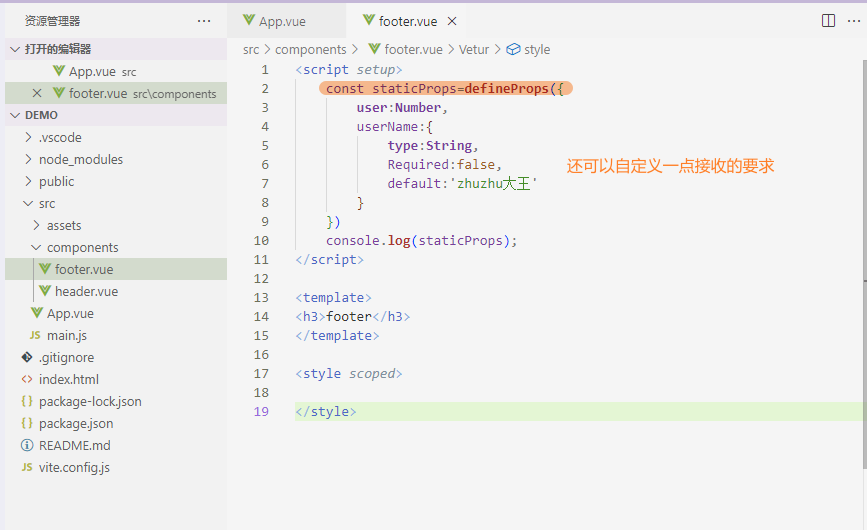
> 子组件变量名我建议别叫 `staticProps`，容易和父组件里的 `staticProps` 混淆。

##### 补充（v-bind用法2）

冒号 `:` 是父组件这边的“绑定语法”，子组件其实不需要分辨有没有冒号。

v-bind是指把 `staticProps` 这个对象里的属性，批量传给子组件

这里的`Footer :="staticProps"`不是“把这个对象整体传给子组件”，而是“把这个对象拆开传”。是**“对象展开传参”**。

子组件只关心最后有没有收到叫 `user`、`userName` 这些名字的 props。

子组件最终会得到一个 `props` 对象，类似这样：

```
props = {
  user: 10,
  userName: 'hey'
}
```

你问：

> 子组件这边会组合成一个对象吗？

答案是：**会有一个 `props` 对象，但它不是父组件那个原始对象本身，而是 Vue 根据传进来的 props 重新整理出来的子组件 props 对象。**

---

父组件在给子组件传东西的时候，可以不用这种：写法，

```
不加冒号：传字符串
加冒号：传变量 / JS 表达式
```


```
:user-name="userName"
```

加了冒号以后，意思是：

> 等号右边的 `userName` 不是普通文字，而是去当前父组件里找一个叫 `userName` 的变量 / 属性 / ref / computed / 表达式结果。

不加冒号，意思是：

> 直接把字符串 `"userName"` 传给子组件。


---

#### defineEmits 子传父

父组件

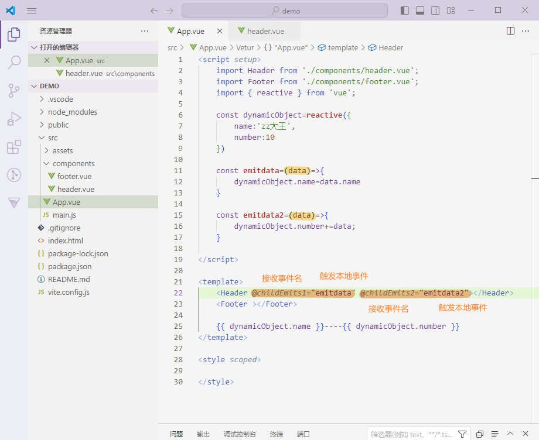

子组件

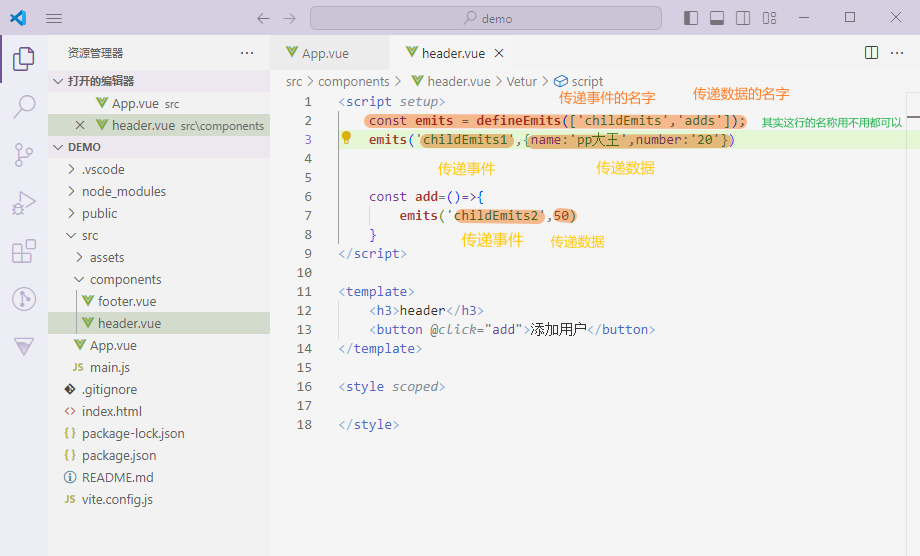


####  依赖注入

*父组件通过 `provide` 把数据传递给后代组件。*

父组件

`provide` 用于父组件向后代组件提供数据，后代组件再通过 `inject` 接收。它适合跨层级传值，但不适合滥用成全局状态管理。

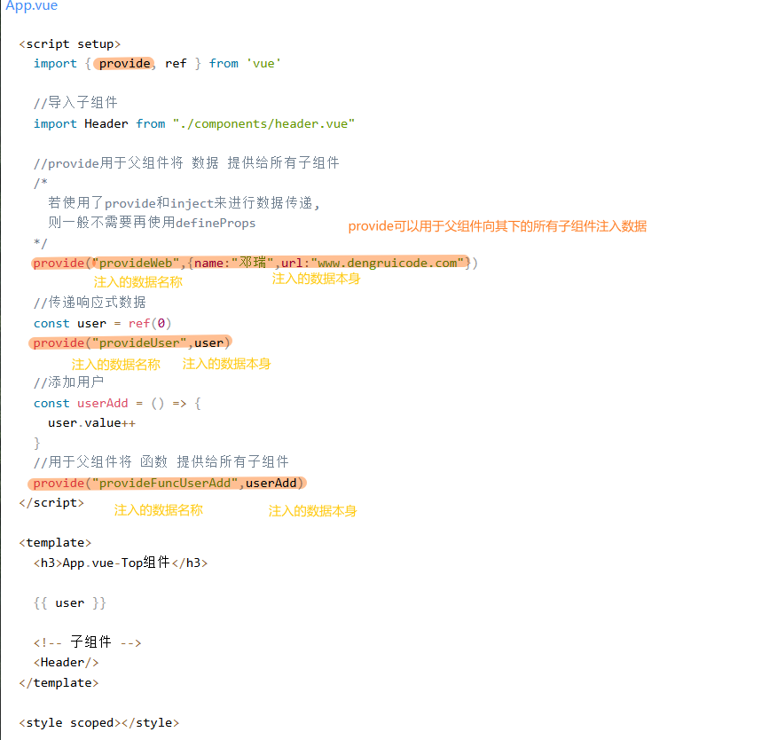

子组件

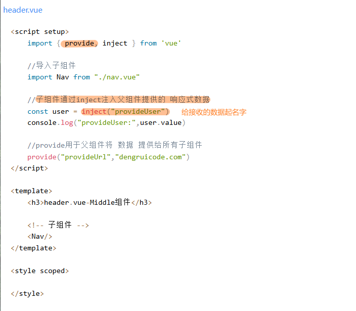

子组件的子组件

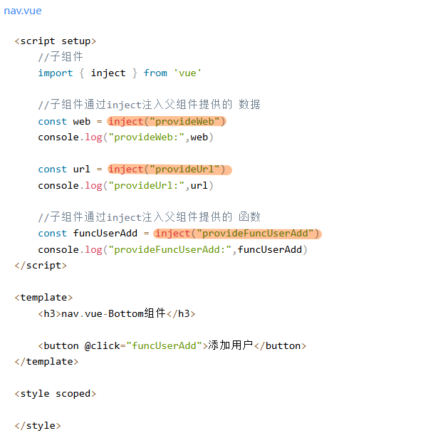


##### 它和 props / emits 的区别

你之前学的父子通信一般是：

```
父传子：props
子传父：emit
```

适合这种情况：

```
App.vue
└── Footer.vue
```

父子挨得近，用 `props`、`emit` 很舒服。

但是如果结构变成这样：

```
MapPage.vue
└── MapLayout.vue
    └── LeftPanel.vue
        └── LayerTree.vue
            └── LayerItem.vue
```

假如最底层的 `LayerItem.vue` 想用地图对象 `mapInstance`，你如果用 props，就得这样一路传：

```
MapPage → MapLayout → LeftPanel → LayerTree → LayerItem
```

中间这些组件可能根本不用 `mapInstance`，但它们被迫当“快递员”。

这时候就适合依赖注入：

```
MapPage.vue provide mapInstance
LayerItem.vue inject mapInstance
```

中间组件不用管。


