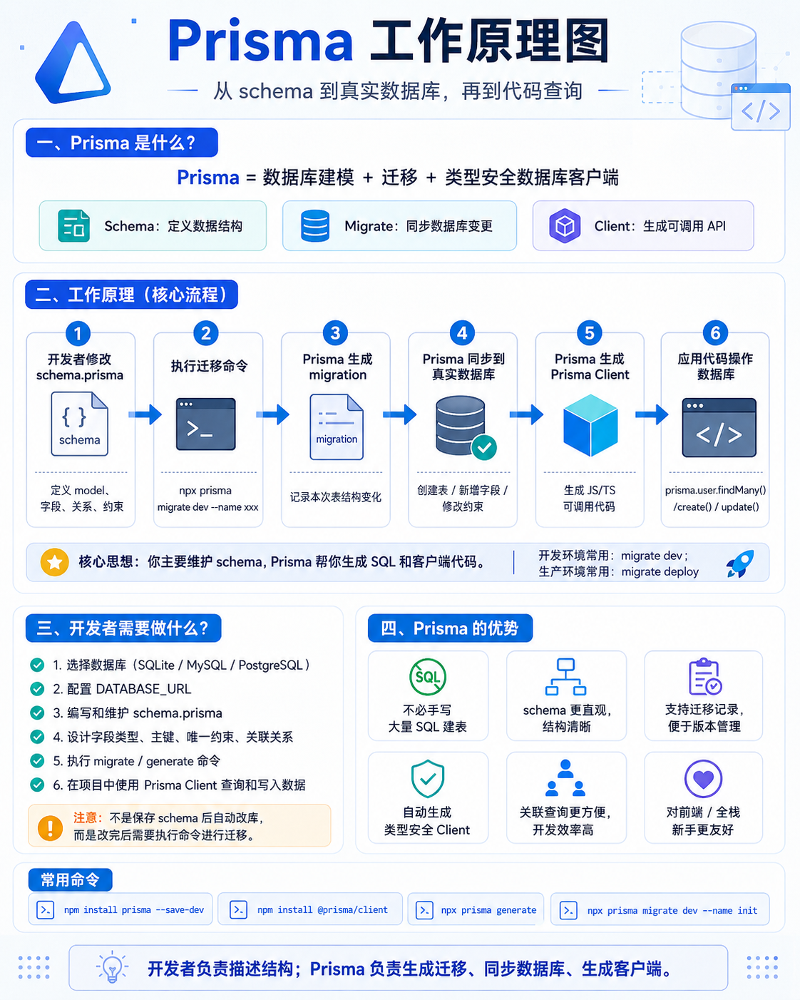

# ORM 介绍
## 什么是 ORM？

**ORM** = **Object-Relational Mapping**（对象-关系映射）

它的核心思想是：**把数据库的表映射成编程语言中的对象/类**，让你可以用操作对象的方式来操作数据库，而不需要写 SQL 语句。

---

## ORM 的核心映射关系

| 数据库概念 | ORM 概念 | 说明 |
|-----------|---------|------|
| 表（Table） | 类/模型（Class/Model） | 定义数据的结构 |
| 列（Column） | 属性（Property） | 对象的字段 |
| 行（Row） | 对象实例（Instance） | 具体的一条数据 |
| 主键（Primary Key） | id 属性 | 对象的唯一标识 |

---

## 为什么需要 ORM&&优缺点？

直接用 SQL 操作数据库

```sql
-- 插入一条用户数据
INSERT INTO users (name, email, age) VALUES ('张三', 'zhangsan@example.com', 25);

-- 查询所有用户
SELECT * FROM users WHERE age > 18;

-- 更新用户信息
UPDATE users SET email = 'new@example.com' WHERE id = 1;

-- 删除用户
DELETE FROM users WHERE id = 1;
```

用 ORM 之后

```javascript
// 插入数据 - 像操作对象一样
const user = new User({ name: '张三', email: 'zhangsan@example.com', age: 25 });
await user.save();

// 查询数据
const users = await User.find({ age: { $gt: 18 } });

// 更新数据
user.email = 'new@example.com';
await user.save();

// 删除数据
await user.destroy();
```

代码更直观、更符合面向对象的编程习惯。

<h4>ORM 的优缺点</h4>

**优点**

| 优点           | 说明                                |
| -------------- | ----------------------------------- |
| 开发效率高     | 不用写大量重复的 SQL                |
| 代码可读性好   | 用面向对象的方式操作数据            |
| 安全性高       | 内置防 SQL 注入                     |
| 数据库切换方便 | 更换数据库几乎不用改代码            |
| 自动迁移       | 通过模型定义自动创建/更新表结构     |
| 类型安全       | TypeScript 项目中获得完整的类型提示 |

**缺点**

| 缺点         | 说明                               |
| ------------ | ---------------------------------- |
| 性能损耗     | 生成的 SQL 不一定最优              |
| 复杂查询受限 | 某些复杂场景仍需手写 SQL           |
| 学习成本     | 需要学习 ORM 框架本身              |
| 过度封装     | 屏蔽太多细节可能导致不理解底层原理 |


## 正确理解：三层架构

> ⚠️ **容易混淆的地方**：MySQL、PostgreSQL、SQLite 实际上是 **DBMS（数据库管理系统）**，而不是数据库本身。数据库是数据文件，这些软件是管理数据文件的系统。

| 类别 | 产品 | 作用 |
|------|------|------|
| **数据库** | MySQL/PostgreSQL 的数据文件目录 | 真正存储数据的地方 |
| **DBMS（数据库管理系统）** | MySQL、PostgreSQL、SQLite | 管理数据库的软件系统 |
| **DBMS 管理工具** | MySQL Workbench、pgAdmin | DBMS 的图形化管理界面 |
| **ORM 工具** | **Prisma**、Sequelize、TypeORM | 用代码操作数据库的桥梁 |

类比

| 层级 | 比喻 | 说明 |
|------|------|------|
| 数据库 | 仓库建筑 | 真正存放数据的地方（数据文件） |
| MySQL/PostgreSQL | 仓库管理系统 | 管理仓库的系统软件（DBMS） |
| Prisma | 遥控器 | 让你不用直接操作 DBMS，通过代码操作 |


## 主流 ORM 框架

| ORM | 特点 | 适合场景 |
|-----|------|---------|
| **Prisma** | 现代、类型安全、自动生成客户端 | 新项目、TypeScript 项目 |
| **Sequelize** | 老牌、功能全、生态成熟 | 中大型项目 |
| **TypeORM** | 类似 Java/Hibernate 风格 | 企业级应用 |
| **Knex** | 查询构建器，更接近 SQL | 需要灵活控制 SQL |


---

## Prisma 快速入门

### 安装

```bash
npm install prisma @prisma/client
npx prisma init
```

### Prisma 工作原理

对于开发人员：

1. 先创建 Node 项目
2. 安装 Prisma 相关包
3. 初始化 Prisma
4. 配置数据库地址
5. 开发者修改 schema.prisma
6. 执行 migrate，把 schema 同步到真实数据库
7. 在代码里用 Prisma Client 操作数据库



### 定义数据模型（schema.prisma）

文件名叫schema.prisma，用来**描述数据库结构**，然后prisma根据它生成jt/ts代码，可以用代码操作数据库。

schema.prisma=数据库配置+客户端配置+表结构设计

```prisma
//配置数据库
datasource db {
  provider = "sqlite"  // 或 "mysql", "postgresql"
  url      = env("DATABASE_URL")
}

//生成 Prisma Client(生成 JS/TS 可以调用的 Prisma 客户端)
generator client {
  provider = "prisma-client-js"
}

model User {
  id    Int    @id @default(autoincrement())
  name  String
  email String @unique
  age   Int?
  
  // 关联关系
  posts Post[]
}

model Post {
  id        Int      @id @default(autoincrement())
  title     String
  content   String?
  published Boolean  @default(false)
  
  // 外键关联
  author    User     @relation(fields: [authorId], references: [id])
  authorId  Int
}
```

1.

```
datasource db {
  provider = "sqlite"  // 或 "mysql", "postgresql"
  url      = env("DATABASE_URL")
}
```

告诉代码要连接哪个数据库，以及数据库的连接地址。

2.

```
generator client {
  provider = "prisma-client-js"
}
```

含义是 生成js/ts可以调用的prisma客户端（利用客户端可以拥有一整套操作数据库的API）

3.

```
model User {
  id    Int    @id @default(autoincrement())
  name  String
  email String @unique
  age   Int?
  
  // 关联关系
  posts Post[]
}
```

创建一张表User，

字段叫id，字段类型是int，@id表示这个字段是主键 ，（不是因为这个字段叫id，而是什么字段都可以用@id表示主键）

@default(autoincrement())表示自增

第四行中 @unique表示字段是唯一的，含义是在这张表中，email这一列的值不能重复。

第五行中?表示这个字段可以有，也可以没有

posts Post[] 表示一种关系，代表Posts这个字段对应了表Post，有多个（[]是多个的意思）

4.

```
model Post {
  id        Int      @id @default(autoincrement())
  title     String
  content   String?
  published Boolean  @default(false)
  // 外键关联
  author    User     @relation(fields: [authorId], references: [id])
  authorId  Int
}
```

第五行，@default表示默认是false字段

```
  // 外键关联
  author    User     @relation(fields: [authorId], references: [id])
  authorId  Int
```

先看最后一句，表示这张表里有个字段叫authorid，是整数列。

然后是上一句，author User表示这个表有个author字段，对应的一个User表里一行数据，后面的@relation是在介绍要怎么查它们的关系，

fields:[authorid]表示当前author和User间是通过authorId关联，

references:[id]表示 关联到User里的id字段。


### 基本 CRUD 操作

```javascript
import { PrismaClient } from '@prisma/client';

const prisma = new PrismaClient();

// ========== 创建 ==========
// 创建单条
const user = await prisma.user.create({
    data: { name: '张三', email: 'zhangsan@example.com', age: 25 }
});

// 批量创建
const users = await prisma.user.createMany({
    data: [
        { name: '李四', email: 'lisi@example.com' },
        { name: '王五', email: 'wangwu@example.com' }
    ]
});

// ========== 查询 ==========
// 查询所有
const allUsers = await prisma.user.findMany();

// 条件查询
const adults = await prisma.user.findMany({
    where: { age: { gt: 18 } }
});

// 查询单条
const user = await prisma.user.findUnique({
    where: { email: 'zhangsan@example.com' }
});

// 关联查询
const userWithPosts = await prisma.user.findUnique({
    where: { id: 1 },
    include: { posts: true }
});

// ========== 更新 ==========
// 更新单条
await prisma.user.update({
    where: { id: 1 },
    data: { email: 'new@example.com', age: { increment: 1 } }
});

// ========== 删除 ==========
// 删除单条
await prisma.user.delete({
    where: { id: 1 }
});
```

### Prisma 生成的 SQL

Prisma 会自动把上面的代码转换成 SQL：

| Prisma 代码 | 生成的 SQL |
|------------|-----------|
| `prisma.user.create({ data: {...} })` | `INSERT INTO "User" (...) VALUES (...)` |
| `prisma.user.findMany()` | `SELECT * FROM "User"` |
| `prisma.user.findMany({ where: { age: { gt: 18 } } })` | `SELECT * FROM "User" WHERE "age" > 18` |
| `prisma.user.update({ where: { id: 1 }, data: {...} })` | `UPDATE "User" SET ... WHERE "id" = 1` |
| `prisma.user.delete({ where: { id: 1 } })` | `DELETE FROM "User" WHERE "id" = 1` |


## ORM 在项目中的落地方式

ORM 只是"思想"，真正在项目中落地时，不同规模、不同需求的团队会采用不同的代码组织方式。

### 方式一：直接调用（轻量级）

```
src/
  user.js    # 直接用 ORM API 操作数据库
```

**代码示例**：

```javascript
// user.js
const { User } = require("./models");

async function getUser(id) {
    return await User.findByPk(id);
}
```

**特点**：
- 简单直接，适合小型项目
- 缺点：数据访问逻辑分散，难以维护

> 数据访问分散是指假设有三个文件，比如service/userService.js、service/orderService.js、service/productService.js这三个都要操作getUser，那由于这个方法还没有封装到一个单独的地方，所以每个业务js文件都要直接写orm api，又分散，又麻烦。
---

### 方式二：Repository 模式（主流）

```
src/
  models/
    user.js        # 定义表结构
  repositories/
    userRepository.js  # 封装数据访问
  services/
    userService.js     # 业务逻辑
```

**特点**：
- 数据访问统一封装
- 业务逻辑和数据访问分离
- 适合中大型项目

> 当services的文件想要操作数据，只需要引用respository的方法，然后使用即可。
#### Repository 模式详解

为什么需要 Repository？

```javascript
// ❌ 没有 Repository：Service 直接依赖 Sequelize
async function getUser(id) {
    return await User.findByPk(id);  // Service 直接调用 ORM
}
```

**问题**：如果有一天要加缓存、换数据库、做读写分离 → **都要改 Service**

---

Repository 的解决方案

```javascript
// repository/userRepository.js
module.exports = {
    async getUser(id) {
        // 可以在这里加缓存
        // 可以在这里加日志
        // 可以在这里做读写分离
        //不是"在这里写缓存/日志"，而是"如果要加缓存/日志，只改这一个入口"  
        return await User.findByPk(id);
    }
};

// service/userService.js
async function getUserWithLogic(id) {
    const user = await userRepository.getUser(id);
    if (!user) throw new Error("用户不存在");
    return user;
}
```

---

Repository 的核心价值

| 价值         | 说明                                 |
| ------------ | ------------------------------------ |
| **隔离变化** | 换数据库、缓存、API，不用改 Service  |
| **统一入口** | 所有数据访问都在一个地方，容易维护   |
| **可测试性** | 测试时可以用 Mock Repository         |
| **业务纯粹** | Service 只关心业务，不关心数据从哪来 |

---

#### ORM 和 Repository 的关系

```
┌─────────────────────────────────────────────────────────────┐
│                      Repository 模式                         │
│   代码组织方式：把数据访问封装到 repository/*.js            │
├─────────────────────────────────────────────────────────────┤
│                      ORM (Sequelize)                        │
│   工具库：把数据库表映射成 JS 对象，提供 CRUD API            │
└─────────────────────────────────────────────────────────────┘
```

> **关键理解**：Repository 是"怎么组织代码"的思路，ORM 是"用什么工具操作数据库"的库。两者可以组合使用。

---

### 方式三：Spring Boot 常用方式

现代 Java 后台（Spring Boot）采用 **Spring Data JPA**，这是 Repository 模式的升级版。

```
src/main/java/com/xxx/
  model/
    User.java           # 实体类（对应数据库表）
  repository/
    UserRepository.java # 继承 JpaRepository，几乎不用写代码
  service/
    UserService.java
  controller/
    UserController.java
```

**特点**：
- 只需要写一个接口，继承 `JpaRepository`
- CRUD 方法（`findAll()`、`save()`、`delete()`）自动生成
- 自定义查询只需按命名规范写方法名，SQL 自动生成

```java
// UserRepository.java - 只需要一个接口
public interface UserRepository extends JpaRepository<User, Long> {
    // 不用写任何实现！自动拥有 findById(), findAll(), save() 等方法

    // 按命名规范写方法名，Spring 自动生成 SQL
    List<User> findByName(String name);
    List<User> findByAgeGreaterThan(int age);
}
// findByName              → SELECT * FROM users WHERE name = ?
// findByAgeGreaterThan    → SELECT * FROM users WHERE age > ?
```

**内部原理**：

```
UserRepository 接口
        ↓
Spring Data JPA 动态实现（运行时自动生成）
        ↓
底层调用 EntityManager（Hibernate 的封装）
        ↓
执行 SQL
```


---

### 方式四：Service + Model（极简模式）

```
src/
  models/
    user.js      # 定义 + 增删改查都在这里
  services/
    userService.js
```

**特点**：
- 不单独建 Repository/DAO
- 数据操作直接在 Model 或 Service 中完成
- 适合快速开发的小项目


> 

---

# 苯人常用的项目中的 ORM 具体实现1

**技术选型**

本项目使用 **Sequelize** 作为 ORM 框架，支持 MySQL 和 SQLite 两种数据库。

**架构分层**

```
src/business/
  model/           → Sequelize 模型定义（表结构）
  repository/      → 数据访问封装（Repository 模式）
  service/         → 业务逻辑
  controller/      → 路由处理
```

**1. 数据库连接管理**

**文件**：`src/framework/datasource/datasourcemanager.js`

```javascript
const { Sequelize } = require("sequelize");

// MySQL 连接
sequelize = new Sequelize({
    host: process.env.DB_HOST,
    port: process.env.DB_PORT,
    dialect: "mysql",
    pool: { max: 10, min: 0, idle: 10000, acquire: 3000 },
    timezone: '+08:00'
});

// SQLite 连接
sequelize = new Sequelize({
    dialect: "sqlite",
    storage: fileUtils.getWorkPath(path.join('db', 'main.db')),
});
```

**2. Model 定义（表结构映射）**

**文件**：`src/business/model/branching_point.js`

```javascript
const { DataTypes } = require("sequelize");

const BranchingPoint = function defineModel(projectId) {
    return getSequelize(projectId).define("BranchingPoint", {
        pid: { type: DataTypes.BIGINT, field: "p_id", primaryKey: true, autoIncrement: true },
        id: { type: DataTypes.INTEGER, field: "id" },
        projectId: { type: DataTypes.STRING, field: "project_id" },
        data: { type: DataTypes.TEXT("long"), field: "data" },
        lines: { type: DataTypes.TEXT("long"), field: "lines" },
    }, {
        tableName: "t_branching_point",
        indexes: [{ fields: ["project_id"] }]
    });
}
```

把数据库表 `t_branching_point` 映射成 JS 的 `BranchingPoint` 类。

**3. Repository 封装（数据访问逻辑）**

**文件**：`src/business/repository/boundary_time_series_data.js`

```javascript
const { Op } = require("sequelize");
const { sequelize } = require("../../framework/datasource/datasourcemanager");
const { BoundaryTimeSeriesData } = require("../model/boundary_time_series_data");

module.exports = {
    // 创建
    async save(projectId, data) {
        return (await BoundaryTimeSeriesData(projectId)).create(data);
    },

    // 批量创建
    async batchSave(projectId, dataList) {
        return (await BoundaryTimeSeriesData(projectId)).bulkCreate(dataList);
    },

    // 查询
    async queryByProjectId(projectId) {
        return (await BoundaryTimeSeriesData(projectId)).findAll({
            where: { projectId },
            order: [["id"]],
            raw: true,
        });
    },

    // 条件更新（带事务）
    async backfillFileIdByProjectIdAndBoundaryId(projectId, boundaryId, fileId, transaction) {
        return (await BoundaryTimeSeriesData(projectId)).update(
            { fileId },
            {
                where: {
                    projectId,
                    boundaryId,
                    [Op.or]: [{ fileId: null }, { fileId: 0 }],
                },
                transaction,
            }
        );
    },
};
```

**4. 关键理解**

| 问题 | 答案 |
|------|------|
| 为什么叫 `repository/`？ | 这是 Repository **模式**的名字 |
| `model/` 是 ORM 吗？ | 不是，是用 ORM 定义**模型**的代码 |
| `repository/` 是 ORM 吗？ | 不是，是用 ORM 实现**数据访问封装**的代码 |
| Sequelize 是什么？ | **ORM 工具库**，安装在 node_modules 里 |

---
# 苯人常用的项目中的 ORM 具体实现2

## 正常 Prisma 流程（标准用法）

可以直接看上面的prisma快速入门

**标准用法特点**

| 特点 | 说明 |
|------|------|
| schema.prisma 自己写 | 模型定义直接写在 schema 里 |
| 关系直接写 | `@relation` 直接写在 model 旁边 |
| 环境变量切换 | `env("DATABASE_URL")` 读取 .env 文件 |
| generate 生成到 node_modules | `npx prisma generate` 输出到默认位置 |

---

## 此项目中prisma流程

### 项目背景

本项目（tb-dock-server）使用 **Prisma + MySQL**，但对标准流程做了**定制化改造**。

### 改版原因

正常 Prisma 有一个痛点：**当数据库表结构变化时，schema.prisma 需要手动维护**。

具体问题：
1. `prisma db pull` 会从数据库拉取表结构到 schema.prisma，但**会覆盖**整个 model 定义
2. 如果你在 schema 里手动加了 `@relation` 关系定义，`db pull` 后就没了
3. 每次数据库表结构变，都得重新手动加关系，很烦

### 解决方案

把 schema.prisma 的内容**分块管理**：
- 表结构 → 数据库 → 自动同步
- 关系定义 → 代码文件 → 手动维护
- 数据库 URL → 环境变量 → 自动切换

---

### 项目文件结构

```
tb-dock-server/
├── prisma/                              📁 Prisma 相关配置
│   ├── schema.prisma                   📄 数据库结构定义（会自动生成）
│   ├── schemaRelation.ts               📄 模型关系定义（手动维护）
│   ├── schemaProcessor.ts               📄 自动化脚本（添加关系到 schema）
│   └── urlGenerator.ts                 📄 数据库 URL 生成脚本
│
├── src/
│   └── prisma/
│       └── index.ts                    📄 Prisma 客户端封装（业务代码从这里导入）
│
└── .env.dev / .env.prod / .env.test   📄 环境配置文件
```

---

#### 1. 数据库连接 URL 自动生成

**文件**：[prisma/urlGenerator.ts](prisma/urlGenerator.ts)

**问题**：不同环境（开发/测试/生产）需要连接不同的数据库。

**解决方案**：根据环境变量自动生成 URL 并更新 schema.prisma。

```typescript
// prisma/urlGenerator.ts
function generateDatabaseUrl() {
  const nodeEnv = process.env.NODE_ENV || 'dev';

  // 从环境变量读取数据库配置
  const mysqlHost = process.env.MYSQL_HOST;
  const mysqlUser = process.env.MYSQL_USER;
  const mysqlPwd = process.env.MYSQL_PWD;
  const mysqlDb = process.env.MYSQL_DB;

  // 构建 DATABASE_URL
  const databaseUrl = `mysql://${mysqlUser}:${mysqlPwd}@${mysqlHost}/${mysqlDb}`;

  // 替换 schema.prisma 中的 url
  const schemaPath = join(__dirname, 'schema.prisma');
  let schemaContent = readFileSync(schemaPath, 'utf8');
  // ... 替换逻辑
}
```

**效果**：

| 命令 | 读取的环境 | 连接数据库 |
|------|-----------|-----------|
| `npm run prisma:construct` | `.env.dev` | `localhost/dock` |
| `npm run prisma:construct:prod` | `.env.prod` | `usagi.tbdock.cn:8898/dock_prod` |
| `npm run prisma:construct:test` | `.env.test` | 测试数据库 |

---

#### 2. 模型关系单独定义

**文件**：[prisma/schemaRelation.ts](prisma/schemaRelation.ts)

**问题**：`db pull` 会覆盖 schema.prisma，手写的关系定义会丢失。

**解决方案**：把关系定义单独写在一个文件里，`db pull` 后再自动添加回去。

```typescript
// prisma/schemaRelation.ts
export const RELATIONS = {
    // 字典数据与字典类型的关系
    SysDictData: {
        dictTypeRelation: 'SysDictType @relation("DictType", fields: [dictType], references: [id])'
    },
    SysDictType: {
        dictData: 'SysDictData[] @relation("DictType")'
    },

    // 视频能力与产品的关系
    VideoCapability: {
        product: 'Product @relation("DockVideoCapability", fields: [productUuid], references: [uuid])'
    },

    // 端口与产品的关系
    Port: {
        product: 'Product @relation("DockPort", fields: [productUuid], references: [uuid])'
    },

    Product: {
        videoCapabilities: 'VideoCapability[] @relation("DockVideoCapability")',
        ports: 'Port[] @relation("DockPort")'
    },
};
```

> 这里是自定义的结构，但是还是说说什么意思，不然看不懂
>
> ```
>    SysDictData: {
>         dictTypeRelation: 'SysDictType @relation("DictType", fields: [dictType], references: [id])'
>     },
> ```
>
> SysDictData是表名
>
> **字段名、表、关系（口诀）**
>
> dictTypeRealeation当前表的字段名
>
> SysDictType对方表
>
> 关系：DictType 关系名
>
> ​	    dictType当前表的字段名（外键）
>
> ​	     id对方表的字段名

**为什么这样做？**

```
正常流程（会丢关系）：
db pull → schema.prisma 被覆盖 → 关系没了 → 重新手动加

本项目流程（关系不丢）：
db pull → schema.prisma 被覆盖 → schemaProcessor.ts 自动加回关系
```

---

#### 3. 关系自动注入

**文件**：[prisma/schemaProcessor.ts](prisma/schemaProcessor.ts)

**作用**：`db pull` 后，自动把 schemaRelation.ts 里的关系添加到 schema.prisma。

```typescript
// prisma/schemaProcessor.ts
function processSchema() {
  // 读取关系定义
  const relations = require('./schemaRelation').RELATIONS;

  // 读取 schema.prisma
  let schemaContent = readFileSync(schemaPath, 'utf8');

  // 处理每个模型，添加关系字段
  Object.entries(relations).forEach(([modelName, modelRelations]) => {
    // 匹配模型块
    const modelPattern = new RegExp(`(model\\s+${modelName}\\s*\\{)([\\s\\S]*?)(\\n\\})`);
    const match = modelPattern.exec(schemaContent);

    if (match) {
      // 添加关系定义到模型块末尾
      const lines = modelBody.split('\n');
      Object.entries(modelRelations).forEach(([relationName, relationDef]) => {
        lines.push(`  ${relationName} ${relationDef}`);
      });
      // 替换整个模型块
      schemaContent = schemaContent.replace(modelPattern, newModel);
    }
  });

  writeFileSync(schemaPath, schemaContent);
}
```

---

#### 4. 完整的构建命令

**文件**：[package.json](package.json#L19)

```json
"prisma:construct": "ts-node prisma/urlGenerator.ts && npx prisma db pull && ts-node prisma/schemaProcessor.ts && npx prisma generate"
```

**执行顺序**：

| 步骤 | 命令 | 作用 |
|------|------|------|
| 1 | `ts-node prisma/urlGenerator.ts` | 更新 schema.prisma 中的数据库 URL |
| 2 | `npx prisma db pull` | 从数据库拉取表结构到 schema.prisma |
| 3 | `ts-node prisma/schemaProcessor.ts` | 给 schema.prisma 添加关系定义 |
| 4 | `npx prisma generate` | 生成 TypeScript 类型代码 |

**什么时候需要运行？**

- 首次克隆项目
- 数据库表结构变了（新增表、新增字段、删除字段）
- 换了新的数据库

**日常开发不需要运行**，除非数据库结构变化了。

---

#### 5. Prisma 客户端封装

**文件**：[src/prisma/index.ts](src/prisma/index.ts)

**当前问题**：业务代码直接用 Prisma，没有统一的封装和扩展。

**解决方案**：在 `src/prisma/index.ts` 里对 Prisma 进行扩展，然后统一导出。

```typescript
// src/prisma/index.ts
import { PrismaClient, Prisma } from '../../generated/prisma';

// 创建基础实例
const basePrisma = new PrismaClient();

// ==================== 核心业务数据写保护扩展 ====================
export const prisma = basePrisma.$extends({
    query: {
        async $allOperations({ model, operation, args, query }) {
            if (isCoreBusinessDataWriteProtected()) {
                const isModelWriteTarget = !!model && PRISMA_DB_BACKUP_WRITE_MODELS.has(model);
                const isWriteOperation = PRISMA_WRITE_OPERATIONS.has(operation) || !PRISMA_READ_OPERATIONS.has(operation);

                if ((isModelWriteTarget && isWriteOperation) || (!model && isWriteOperation)) {
                    throw new BadRequestException('核心业务数据恢复中，当前暂不允许修改核心业务数据');
                }
            }
            return query(args);
        },
    },
});

// 导出事务客户端类型
export type ExtendedPrismaTransactionClient = Omit<
    typeof prisma,
    '$connect' | '$disconnect' | '$on' | '$transaction' | '$use' | '$extends'
>;
```

**核心业务数据写保护机制**：

```typescript
// 被保护的核心业务模型
const PRISMA_DB_BACKUP_WRITE_MODELS = new Set([
    'sysUser',
    'sysDictType',
    'sysDictData',
    'product',
    'port',
    'videoCapability',
    'feedback',
]);

// 读操作白名单
const PRISMA_READ_OPERATIONS = new Set([
    'findUnique', 'findMany', 'count', 'aggregate', ...
]);

// 写操作集合
const PRISMA_WRITE_OPERATIONS = new Set([
    'create', 'update', 'delete', 'upsert', ...
]);
```

**工作原理**：通过 Prisma 的 `$extends` 扩展，在所有数据库操作执行前进行拦截检查。如果开启了"核心业务数据写保护"状态，对这些核心模型的写操作会被拦截，防止恢复流程冲突。

**业务代码使用**：

```typescript
// 在 service 里直接导入使用
import prisma from 'src/prisma';

async function getProduct(uuid: string) {
    return await prisma.product.findUnique({
        where: { uuid, del: false }
    });
}

async function createProduct(data) {
    return await prisma.$transaction(async (tx) => {
        return await tx.product.create({ data });
    });
}
```

---

### 完整数据流图

```
┌─────────────────────────────────────────────────────────────────────────┐
│                      Prisma 完整工作流程                                 │
├─────────────────────────────────────────────────────────────────────────┤
│                                                                         │
│  【开发/部署时】                                                        │
│  ┌─────────────────────────────────────────────────────────────────┐  │
│  │  npm run prisma:construct                                        │  │
│  │       │                                                          │  │
│  │       ▼                                                          │  │
│  │  ┌─────────────────┐    读取 .env.xxx                          │  │
│  │  │ urlGenerator.ts  │ ────────────────────────────────────────▶ │  │
│  │  └────────┬────────┘                                            │  │
│  │           │ 生成 URL                                              │  │
│  │           ▼                                                      │  │
│  │  ┌─────────────────┐    更新 url                                 │  │
│  │  │ schema.prisma   │ ◀──────────────────────────────────────── │  │
│  │  └────────┬────────┘                                            │  │
│  │           │                                                      │  │
│  │           ▼                                                      │  │
│  │  ┌─────────────────┐    拉取表结构                              │  │
│  │  │  prisma db pull │ ────────────────────▶ MySQL 数据库         │  │
│  │  └────────┬────────┘                                            │  │
│  │           │                                                      │  │
│  │           ▼                                                      │  │
│  │  ┌─────────────────┐    读取关系定义                            │  │
│  │  │schemaRelation.ts│                                              │  │
│  │  └────────┬────────┘                                            │  │
│  │           │                                                      │  │
│  │           ▼                                                      │  │
│  │  ┌─────────────────┐    添加关系到 schema                       │  │
│  │  │schemaProcessor.ts│ ────────────────────▶ schema.prisma      │  │
│  │  └────────┬────────┘                                            │  │
│  │           │                                                      │  │
│  │           ▼                                                      │  │
│  │  ┌─────────────────┐    生成类型代码                            │  │
│  │  │ prisma generate │ ────────────────────▶ generated/prisma/    │  │
│  │  └─────────────────┘                                            │  │
│  └─────────────────────────────────────────────────────────────────┘  │
│                                                                         │
│  【运行时】                                                             │
│  ┌─────────────────────────────────────────────────────────────────┐  │
│  │  src/prisma/index.ts                                            │  │
│  │       │                                                          │  │
│  │       ▼  封装 + 写保护扩展                                        │  │
│  │  ┌─────────────────┐                                            │  │
│  │  │     prisma      │ ◀──────── 业务代码 import prisma           │  │
│  │  └────────┬────────┘                                            │  │
│  │           │                                                      │  │
│  │           ▼                                                      │  │
│  │  ┌─────────────────┐    翻译成 SQL                              │  │
│  │  │   Prisma Core   │                                            │  │
│  │  └────────┬────────┘                                            │  │
│  │           │                                                      │  │
│  │           ▼                                                      │  │
│  │  ┌─────────────────┐                                            │  │
│  │  │    MySQL DB     │                                            │  │
│  │  └─────────────────┘                                            │  │
│  └─────────────────────────────────────────────────────────────────┘  │
│                                                                         │
└─────────────────────────────────────────────────────────────────────────┘
```

---

### 与标准用法的对比

| 项目 | 标准 Prisma | 本项目 |
|------|------------|--------|
| schema.prisma | 手动维护 | 自动从数据库生成 |
| 关系定义 | 写在 schema 里 | 单独在 schemaRelation.ts 维护 |
| 数据库 URL | env("DATABASE_URL") | urlGenerator.ts 自动生成 |
| Prisma Client | `new PrismaClient()` | `src/prisma/index.ts` 统一导出 |
| 扩展能力 | 有限 | 通过 `$extends` 实现写保护 |
| 多环境切换 | 手动改 .env | 运行不同命令自动切换 |

---

### 关键理解

1. **schema.prisma 是自动生成的**：不需要手动改，由 `db pull` 从数据库同步
2. **关系定义单独管理**：避免 `db pull` 覆盖丢失
3. **urlGenerator.ts 是切换环境的关键**：不同命令连接不同数据库
4. **src/prisma/index.ts 是入口**：业务代码从这里导入 Prisma 客户端

---

## 相关资源

- [Prisma 官方文档](https://www.prisma.io/docs)
- [Prisma vs Sequelize vs TypeORM 对比](https://www.prisma.io/docs/orm/overview)

