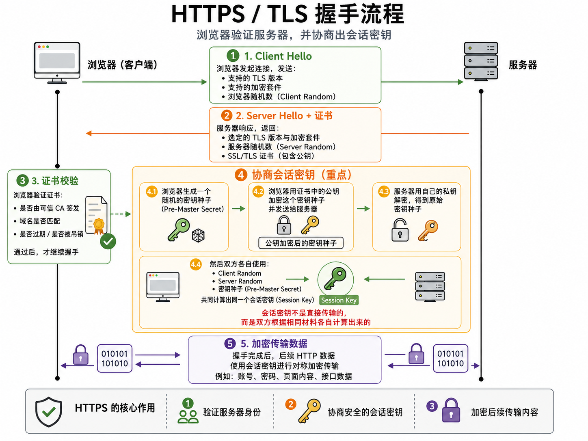

面试时不用背一堆方法，记住一个**通用安全方案**就够了：

> **HTTPS + HttpOnly Cookie 保存登录态 + SameSite + 敏感操作校验 CSRF Token / Origin。**

这篇文章重点是**项目落地方案**，可以把它当成登录态安全配置清单。XSS、CSRF 的攻击原理可以单独看《XSS 与 CSRF》。

---

# 一、传输过程：必须走 HTTPS

用户登录、传 token、传表单数据、传业务数据，都应该走 HTTPS：

```txt
https://xxx.com
```

HTTPS 主要解决三个问题：

| 问题 | 说明 |
|-----|------|
| 机密性 | 防止别人偷看数据 |
| 完整性 | 防止别人篡改数据 |
| 身份验证 | 确认你访问的网站是真的 |

## HTTPS 怎么配？

面试时说清楚概念就行，不需要深入代码。但可以简单理解为：

- 买一个**SSL 证书**（可以在阿里云、腾讯云申请）
- 把证书配置到你的服务器上（Nginx 或者 Node 服务）
- 配好之后，访问 `http://xxx.com` 会自动跳转到 `https://xxx.com`

## TLS 握手流程（了解原理）

简单理解 HTTPS 数据加密的流程：

1. 浏览器连接服务器
2. 服务器把证书和公钥发给浏览器
3. 浏览器验证证书是真的
4. 浏览器和服务器协商出一把临时对称密钥
5. 后续数据用这把临时密钥加密传输

> 在实际开发中，大部分 TLS 握手流程都是浏览器、服务器软件自动处理的，你们不用手动写代码实现。比如客户端验证证书、生成随机数、加密密钥种子这些，浏览器会自动完成；服务器这边，只要你在 Nginx 等软件里配好证书路径和加密算法，服务器就会自动发证书、解密种子、生成会话密钥。你们需要做的主要是：买对证书、正确部署到服务器、确保服务器配置了安全的加密算法，剩下的安全传输细节，系统和软件会帮你们搞定。




---

# 二、登录态：推荐放 HttpOnly Cookie

## 什么是 Set-Cookie？

这是**后端返回给浏览器**的一个响应头，告诉浏览器："帮我存一个 Cookie"。

```http
Set-Cookie: token=xxx; HttpOnly; Secure; SameSite=Lax
```

存好之后，浏览器以后访问这个网站，会**自动带上这个 Cookie**，不需要前端写任何代码。

## 为什么登录态要放 Cookie 里而不是 localStorage？

以前很多人把 token 存 localStorage，但有个问题：

```txt
XSS 攻击：坏人往你网站注入一段 JS，这段 JS 可以读取 localStorage 里的 token
```

而 Cookie 有个特殊属性叫 **HttpOnly**，意思是"前端 JS 拿不到这个 Cookie"。

## HttpOnly、Secure、SameSite 是什么意思？

| 属性 | 含义 |
|-----|------|
| HttpOnly | 前端 JS 读不到（`document.cookie` 是空的），防止 XSS 偷 token |
| Secure | 只在 HTTPS 下自动携带，HTTP 不会带 |
| SameSite | 限制第三方请求带这个 Cookie，减少 CSRF 风险 |

登录成功后，后端返回这样的 Cookie：

```http
Set-Cookie: token=xxx; HttpOnly; Secure; SameSite=Lax
```

> 登录态可以放在 Cookie 中，并设置 HttpOnly、Secure、SameSite。HttpOnly 可以防止前端 JS 直接读取 Token，Secure 保证只在 HTTPS 下传输，SameSite 可以降低跨站请求伪造风险。

---

# 三、敏感操作：再加一层校验

对于这类接口：

```txt
修改密码、转账、删除数据、修改手机号、提交订单
```

## 为什么 Cookie 登录态还要防 CSRF？

因为 Cookie 的特点是：**只要规则允许，浏览器会自动携带**。

先理解问题：

1. 你登录了 A 网站，浏览器存了登录态 Cookie
2. 你被诱导打开了恶意网站 B
3. B 网站让你的浏览器偷偷给 A 网站发请求（转账、删数据）
4. 浏览器会带上 A 的 Cookie，A 网站以为是你本人发的，就执行了

这就是 CSRF 风险：坏人不一定能偷到 Cookie，但可以借用浏览器“自动带 Cookie”的特性伪造请求。

## 怎么防？

### 用 CSRF Token

CSRF Token **不能只靠 Cookie 自动携带**，否则恶意网站仍然可能借用浏览器自动带 Cookie 的能力。

常见做法是：后端生成随机 token，页面提交表单或前端发请求时，必须额外带上这个 token。后端同时校验登录态和 CSRF Token。


### Origin / Referer

这两个是**浏览器自动带的请求头**：

| 请求头 | 说明 |
|-------|------|
| Origin | 当前页面从哪来的（更准确，推荐用它） |
| Referer | 同上，但老一点，某些情况下可能被伪造 |

服务端可以检查这个头：

```txt
请求来源是 https://my-website.com 吗？
不是 → 拒绝
```

> 对于 POST、PUT、DELETE 这类会修改数据的接口，不能只依赖 Cookie，还应该校验 CSRF Token 或 Origin / Referer，防止恶意网站借用用户浏览器发起请求。

---

# 四、可以直接背的版本

一般 Web 项目里，我会优先使用 **HTTPS** 保证传输安全。用户登录后，服务端把登录态写入 Cookie，并设置 **HttpOnly、Secure、SameSite**。HttpOnly 可以防止 JS 读取 Token，Secure 保证只在 HTTPS 下传输，SameSite 可以降低 CSRF 风险。对于修改密码、删除、转账这类敏感操作，后端还要校验 **CSRF Token 或 Origin**，不能只靠 Cookie 判断身份。这样可以同时降低 Token 被偷、请求被篡改、CSRF 伪造请求等风险。

---

# 五、记忆口诀

```
HTTPS 保传输，HttpOnly Cookie 保登录态，SameSite/CSRF Token 防伪造请求。
```
