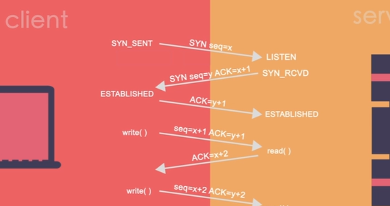

# TCP/IP协议族

比如你浏览器请求 B 站的 index.html：（即客户端向服务端请求数据）

1. 首先通过 **IP 协议** 找到 B 站服务器的网络位置（类似 “地址”）；
2. 然后通过 **TCP 协议** 在浏览器和服务器之间建立稳定的连接（类似 “打通电话”），确保数据不会丢失、顺序正确；
3. 最后 HTTP 协议才发挥作用，在这个 TCP 连接里发送 “请求 index.html” 的指令，服务器再通过 TCP 连接返回 HTML 数据。

> TCP 是 “可靠的渠道 builder”，TCP 不仅建立渠道（三次握手），还负责渠道的 “稳定性”：比如数据传丢了它会重发，数据顺序乱了它会排序，确保数据完整到达。
>
> 而 HTTP 则是在这个稳定渠道里，“定义数据的规范和含义” —— 比如请求时要写清楚 “我要什么资源（GET /index.html）、用什么版本协议（HTTP/2）”，响应时要标注 “资源类型（text/html）、状态码（200 成功）” 等，让双方能看懂数据的含义。
>
> HTTP 的核心是 “规范数据格式和交互逻辑”
>
> 没有 TCP 建立的可靠连接，HTTP 数据可能在传输中丢失或错乱；没有 HTTP 的规范，双方就算收到数据，也不知道该怎么处理。


上面是一个粗糙一点的版本，通常，我们会统一用TCP/IP协议族的四层模型来表示这个过程，这个协议族里包含了HTTP协议、TCP协议、IP协议等等，

**TCP/IP 四层模型从上到下的应用层、传输层、网际层、网络接口层。**

当你发送一个请求时，

``````
应用层     ：构建请求,提供特定应用程序的协议
↓
传输层     ：进行可靠的传输控制
↓
网际层     ：往哪儿传，指挥下一层的路径
↓
网络接口层 ：把数据变成电信号或者光信号在物理介质上传输

``````

到了对方电脑：

```网络接口层 → 网络层 → 传输层 → 应用层```

```
网络接口层 → 剥掉 MAC 头

网络层 → 剥掉 IP 头

传输层 → 剥掉端口 / TCP 头

应用层 → 拿到原始请求数据，开始处理
```


每一层是互相依赖，并不是独立工作，每一层会把相应的数据交给下一层（从上到下），服务器端拆数据是从下到上拆，这四层模型是**协议族的分层逻辑**，真实情况是硬件软件共同完成，互相依赖。


## 应用层（Application Layer）

核心协议：HTTP、HTTPS、FTP（文件传输）、DNS（域名解析）

负责：构建请求，提供特定应用程序的协议。

具体：输入网址 → DNS 先解析域名，拿到目标 IP，再生成 HTTP/HTTPS 请求数据

## 传输层（Transport Layer）

核心协议：TCP（可靠，有确认、重传）、UDP（不可靠但快，视频，游戏用）

负责：进行可靠的传输控制

具体：给数据加：源临时端口 + 目标固定端口，用 TCP 打包、分片


TCP是面向连接的可靠字节流服务协议。TCP必须先经过三次握手建立连接之 后，才能交换数据。在传输时有确认机制、重传机制保证数据不丢不重，排序重组。



每个收到的数据包都会向发送方发送ACK确认，以保证发送成功。

> 其实传输层的“保证可靠”是通过和对方传输层的交互来实现的，这个交互过程本身就需要借助下面两层来传输数据。
>
> 比如三次握手，传输层会生成SYN报文，交给网际层加IP地址，再由网络接口层转成帧发送出去。
>
> 对方收到后，传输层返回SYN+ACK，同样通过下面两层传回来。
>
> 只有完成这个“传输-响应”的循环，连接才建立。传输过程中，丢包了传输层会让下面两层重传，乱序了会排序，这些动作都依赖网际层和网络接口层实际传输数据，所以不是先于传输行动，而是边传输边通过交互保证可靠。

## 网际层（Internet Layer）

核心协议：IP

负责：往哪儿传，指挥下一层的路径。

具体：给包加上：源 IP、目标 IP，查路由，算出**下一跳路由器地址**

（它只决定下一步去哪，不规划全程所有路）

## 网络接口层（NetWork Interface Layer）

负责：把数据变成电信号或者光信号在物理介质上传输，将二进制数据包与网络信号相互之间转换。

具体：把 IP 包打成帧，加上**本机 MAC + 下一跳 MAC**，转成电信号 / 光信号发出去


# 数据传输的过程（光信号、数字信号与二进制）

当发消息给朋友时，会经过以下过程

* 手机把消息转化成二进制数据，
* 手机的wifi模块（网卡）把二进制数据转化成无线电波
* 路由器把无线电波转化成二进制数据，通过双绞线传给光猫
* 光猫把电数字信号转化为光信号，通过光纤传递
* 光信号经过海底光缆传给朋友家的光猫
* 朋友光猫把光信号转化为电数字信号（高低电压）
* 朋友路由器把电数字信号转化为无线电波传给手机
* 朋友手机把无线电波转化为二进制数据


数字信号是“承载二进制数据的物理载体”，载体会随着传输介质变。

> 在空气中无线电波是无线数字信号，在网线中用高低电压叫有线数字信号，在光纤中光的亮灭叫做光数字信号。

路由器是连接不同的网络，把互联网的公网数据，转化成家里局域网能识别的格式（MAC地址标签），再分配给手机、电脑。

网卡和MAC一一绑定，网卡生产出来自带MAC，网卡会把二进制数据转化成数字信号（电/无线电/光），只要这个设备要“接收或发送数据”，就一定有网卡。


```
消息
↓
二进制
↓
电信号 / 无线电波 / 光信号
↓
再变回二进制
↓
再变回消息
```

