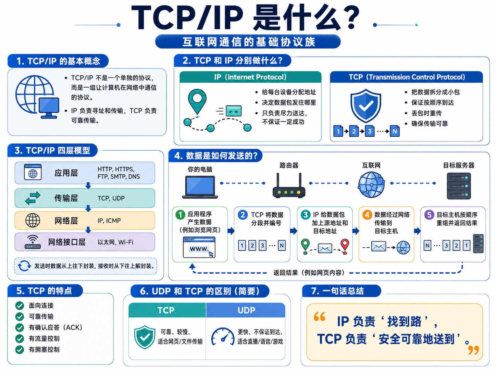
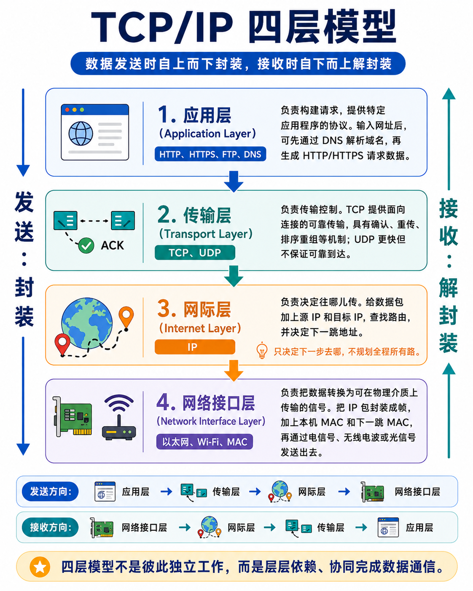
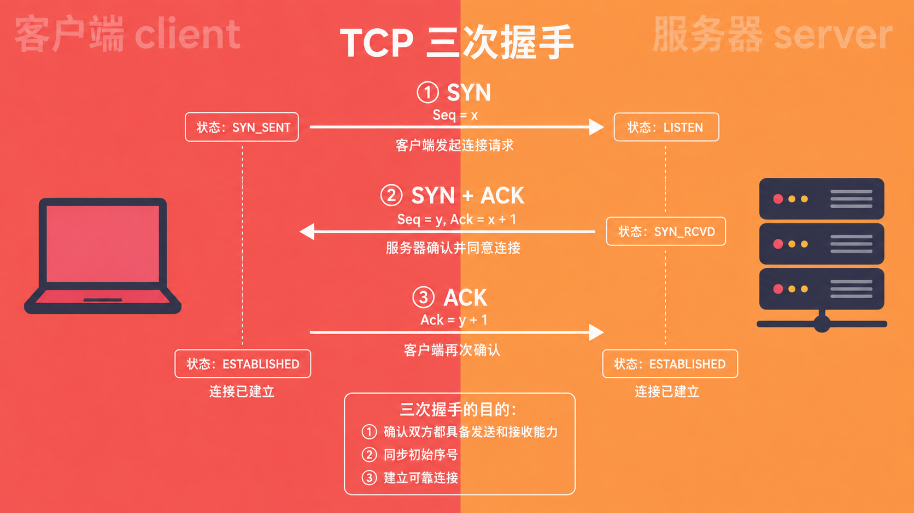
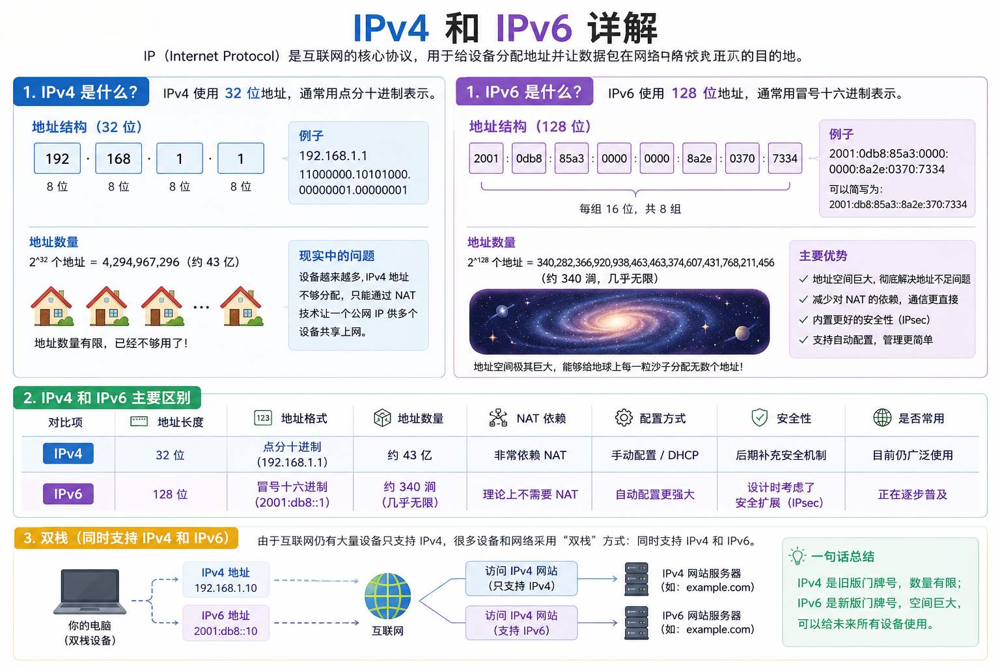
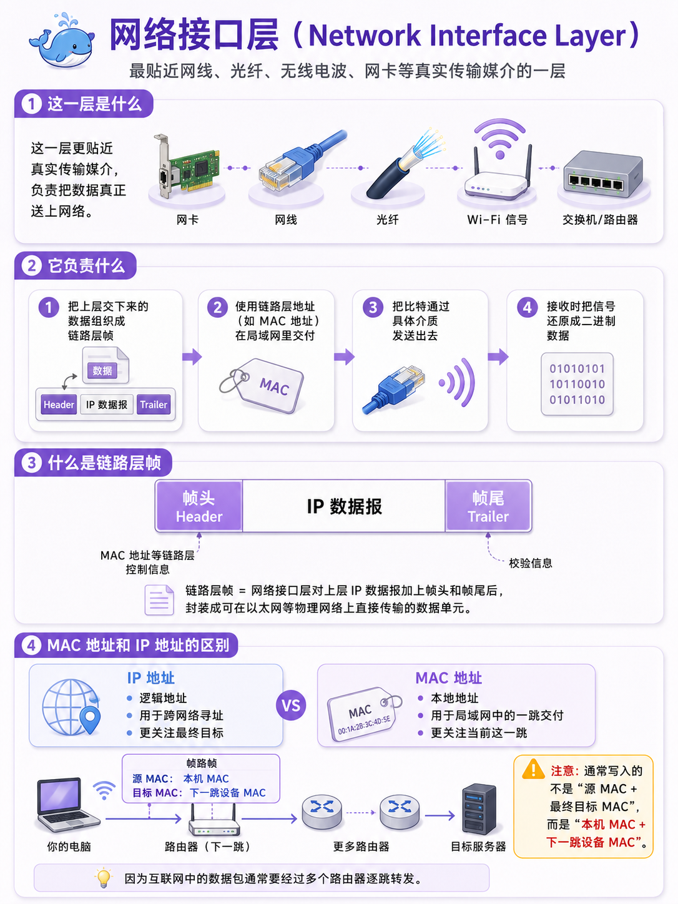
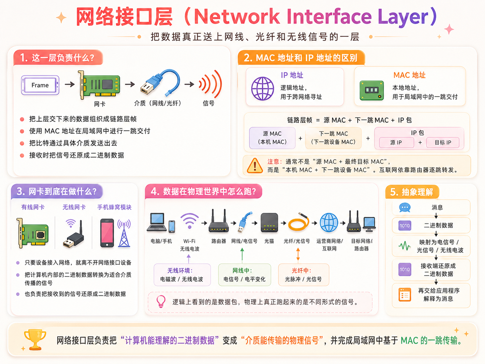
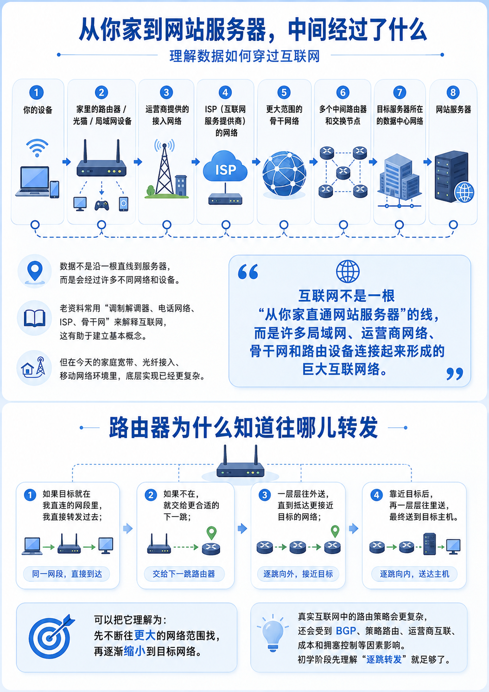
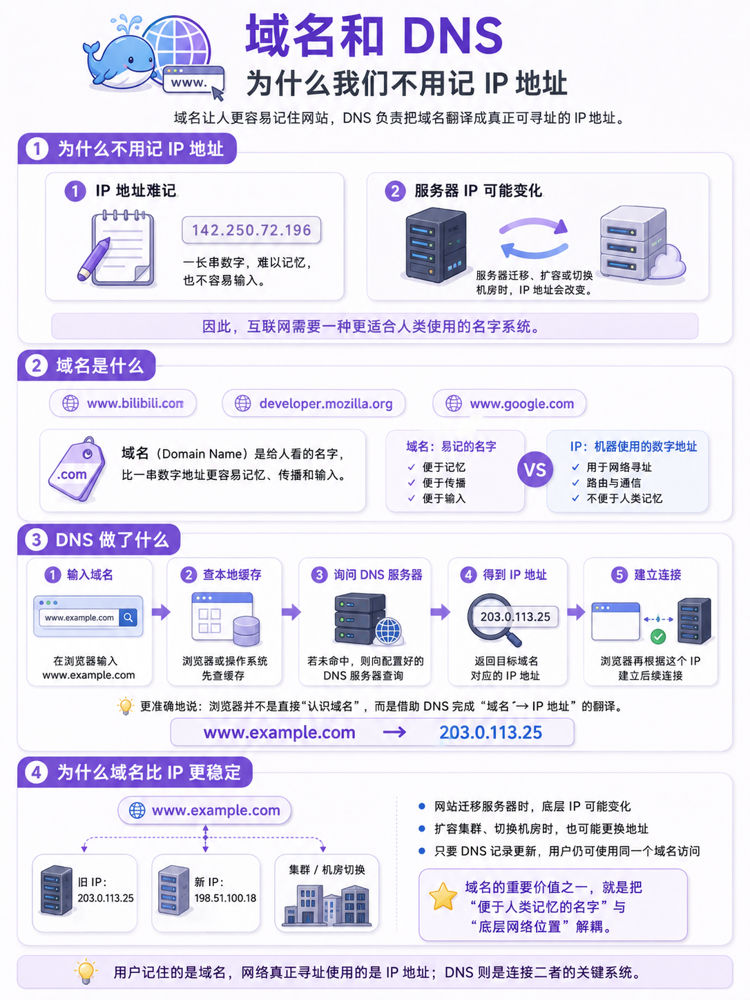

## 互联网是如何运行的

我们每天都在使用互联网：打开网站、发消息、看视频、刷资讯、下载文件。但“能用”不等于“理解”。

当你在浏览器里输入一个网址，比如 `www.bilibili.com`，页面之所以能显示出来，并不是浏览器直接“连上网站”这么简单。中间至少经历了这些关键步骤：

1. 先通过 **DNS** 把域名解析成 IP 地址；
2. 再通过 **IP** 把数据包送往目标主机；
3. 通过 **TCP** 在浏览器和服务器之间建立可靠传输，并保证数据按序到达；
4. 最后由 **HTTP** 约定“请求什么”和“返回什么”，在这个 TCP 连接里发送 “请求 index.html” 的指令，服务器再通过 TCP 连接返回 HTML 数据。。

> TCP&HTTP
>
> TCP 是 “可靠的渠道 builder”，TCP 不仅建立渠道（三次握手），还负责渠道的 “稳定性”：比如数据传丢了它会重发，数据顺序乱了它会排序，确保数据完整到达。
>
> 而 HTTP 则是在这个稳定渠道里，“定义数据的规范和含义” —— 比如请求时要写清楚 “我要什么资源（GET /index.html）、用什么版本协议（HTTP/2）”，响应时要标注 “资源类型（text/html）、状态码（200 成功）” 等，让双方能看懂数据的含义。
>
> HTTP 的核心是 “规范数据格式和交互逻辑”
>
> 没有 TCP 建立的可靠连接，HTTP 数据可能在传输中丢失或错乱；没有 HTTP 的规范，双方就算收到数据，也不知道该怎么处理。

## 为什么需要 TCP/IP 协议族



计算机之间要想稳定通信，必须提前约定很多规则：

这些约定统称为**协议**。而互联网中最核心的一组协议，就是 **TCP/IP 协议族**。

它通常用四层模型来理解：

```text
应用层     ：构建请求,提供特定应用程序的协议
	↓
传输层     ：进行可靠的传输控制
	↓
网际层     ：往哪儿传，负责寻址和路由
	↓
网络接口层 ：把数据变成电信号或者光信号在物理介质上传输
```

发送数据时，通常是**从上到下逐层封装**；接收数据时，则是**从下到上逐层解封装**。

```text
应用层 → 传输层 → 网际层 → 网络接口层
```

到达对方主机后：

```text
网络接口层 → 网际层 → 传输层 → 应用层
```

```
网络接口层 → 剥掉 MAC 头

网络层 → 剥掉 IP 头

传输层 → 剥掉端口 / TCP 头

应用层 → 拿到原始请求数据，开始处理
```

这里的“层”不是彼此隔绝的四块独立区域，而是一个**协议族的分层逻辑**。



## 🐋应用层（Application Layer）

常见协议：HTTP、HTTPS、DNS、FTP、SMTP、IMAP 等。

应用层最接近用户程序，负责定义“这份数据对应用来说是什么意思”。

以访问网页为例：

- 浏览器先准备请求目标；
- 如果输入的是域名，就先发起 DNS 查询；
- 得到 IP 地址后，再构造 HTTP 请求报文；
- 报文里会说明请求方法、路径、请求头，以及可能携带的请求体。

应用层关注的是“请求什么、响应什么”，而不直接关心这段数据到底怎么在网络里一跳一跳传过去。

## 🐳传输层（Transport Layer）

常见协议：TCP（可靠，有确认、重传）、UDP（不可靠但快，视频，游戏用）
具体：给数据加：源临时端口 + 目标固定端口，用 TCP 打包、分片

TCP是面向连接的可靠字节流服务协议。TCP必须先经过三次握手建立连接之 后，才能交换数据。在传输时有确认机制、重传机制保证数据不丢不重，排序重组。


### 端口：找到目标机器里的具体程序

IP 地址只能帮助我们找到一台主机，但一台主机上可能同时运行着很多程序：浏览器、邮件服务、数据库、聊天服务……

这时就需要**端口号**来标识“数据应该交给哪一个应用程序”。

所以传输层至少解决两个问题：

- 发给哪台主机：靠 IP；
- 发给主机上的哪个程序：靠端口。

### TCP：可靠传输

TCP 是一种**面向连接的、可靠的、基于字节流的传输协议**。

这句话可以拆开理解：

- **面向连接**：正式传数据之前，通信双方要先建立连接；
- **可靠**：它会尽量保证数据完整、有序地到达；
- **字节流**：应用层看到的是一串连续字节，而不是“天然带边界的一条条消息”。

TCP 在正式交换数据前，通常需要进行**三次握手**来建立连接。建立连接之后，双方才能开始收发数据。



> 首先客户端向服务器发送**SYN报文**，表示“我想和你建立连接”，
>
> 服务器收到请求后，返回 **SYN + ACK** 报文，表示“我收到了，也同意连接”。
>
> 最后，客户端再次发送 **ACK** 报文，确认服务器的响应，这个确认发出后，客户端和服务器都进入 **ESTABLISHED** 状态，说明 TCP 连接已经建立，可以开始正式传输数据。

TCP 的可靠性主要来自这些机制：

- **确认应答（ACK）**：接收方收到数据后会确认；
- **超时重传**：发送方长时间没等到确认，会重发；
- **序列号**：接收方可以按顺序重组数据；
- **流量控制 / 拥塞控制**：避免发送过快把对方或网络压垮。

需要注意的一点是：

> TCP 的“可靠”不是说底层物理链路永远不会丢包，而是说 TCP 会在不可靠的网络之上，通过确认、重传、排序等机制，尽量提供一个可靠的传输抽象。


## 🐋网际层（Internet Layer）

核心协议：IP。

这一层的核心任务是：**把数据从源主机送到目标主机所在的网络方向上去**。

具体：给包加上：源 IP、目标 IP，查路由，算出**下一跳路由器地址**

（它只决定下一步去哪，不规划全程所有路）


**IP 和 IP 地址不是一回事**

日常口语里我们经常把“IP”和“IP 地址”混着说，但严格来说它们不是同一个概念：

- IP 指的是网际层协议；
- IP地址 是这个协议里用于标识主机的地址。


IP 是一种**无连接、尽力而为**的协议。

这意味着：

- 它不会先和目标主机“打招呼再传”；
- 它不保证每个包一定送达；
- 它也不负责保证包按顺序到达；
- 它只负责尽可能把包往目标方向转发。

因此，丢包、乱序、重复到达等问题，并不是由 IP 层自己解决，而是更多交给上层的 TCP 来处理。

### 路由：每一跳只决定下一步去哪

数据在互联网中传播，不是发出前就一次性规划好完整路线，而是会经过一个个路由器逐跳转发。

每个路由器根据自己的路由表决定：

- 目标地址是否属于我直连的网络；
- 如果不属于，下一跳该交给哪个路由器。

所以更准确的说法是：

> 路由器通常只关心“下一跳往哪儿走”，而不是从源头到终点的一整条固定路径。

这也是为什么网络路径会动态变化：某条链路拥塞、故障或策略调整时，数据包可能改走其他路径。

### IPv4 与 IPv6

IP 地址常见有两套标准：

- **IPv4**：32 位地址，大约有 42 亿个地址；
- **IPv6**：128 位地址，地址空间极大。

IPv4是大量使用的IP地址版本，但是地址数量有限，再加上一部分地址要保留作特殊用途，所以公网可分配地址并不充裕。这也是 IPv6 出现的重要背景之一。

当然，现实世界并不是“IPv4 用完了大家立刻全部切到 IPv6”，而是长期共存，并配合 NAT、CDN、运营商网络等机制共同工作。

> 这里的“位”是bit，只能放0或者1，有几位就是2的几次方。



## 🐋网络接口层（Network Interface Layer）

这一层对应的是更贴近“网线、光纤、无线电波、网卡”这些真实传输媒介的部分。

它负责的事情包括：

- 把上层交下来的数据组织成链路层帧；
- 使用链路层地址（如 MAC 地址）在局域网里交付；
- 把比特通过具体介质发送出去；
- 在接收时把信号再还原成二进制数据。

> **链路层帧**，就是网络接口层 对上层（网络层）的 IP 数据报，加上**帧头（包含 MAC 地址等链路层控制信息）和帧尾（校验信息）** 后，封装成的、能在物理网络（如以太网）上直接传输的数据单元。

### MAC 地址和 IP 地址的区别

这里很容易混淆两个概念：

- **IP 地址**：更像网络层里的“逻辑地址”，用于跨网络寻址；
- **MAC 地址**：更像链路层里的“本地地址”，用于局域网中的一跳交付。

当你的电脑把一个 IP 包发出去时，真正落到局域网里传输时，往往还需要封装成链路层帧，并写入：

- 当前发送方的 MAC 地址；
- 当前这一跳接收方的 MAC 地址。

注意这里通常不是“源 MAC + 最终目标 MAC”，而是“**本机 MAC + 下一跳设备 MAC**”。因为在互联网里，包往往要经过多个路由器逐跳转发。





### 网卡到底在做什么

只要设备要接入网络、发送或接收数据，就离不开网络接口设备，比如有线网卡、无线网卡、手机里的蜂窝通信模块等。

它们负责把计算机内部的二进制数据，转换成适合当前介质传播的信号形式。

## 数据是怎么在物理世界中跑起来的

从逻辑上看，网络传输的是“数据包”；但从物理世界看，传输的其实是各种不同形式的信号。

例如一次常见的家庭网络访问过程，可能大致像这样：

- 电脑或手机先产生二进制数据；
- 无线网卡把它调制成无线电波，通过 Wi‑Fi 发给路由器；
- 路由器再通过网线把数据交给光猫或上联设备；
- 光猫把电信号和光信号进行转换；
- 数据通过运营商接入网、汇聚网、骨干网不断向外传输；
- 最终在目标侧再经过类似过程，还原成对方设备能处理的二进制数据。

所以我们平时说“0 和 1 在网络里跑”，更准确地说，是：

- 计算机内部以二进制形式处理信息；
- 传输过程中，这些二进制会映射到具体物理信号上；
- 这些信号的表现形式取决于介质。

例如：

- 在网线里，可能表现为电压或电平变化；
- 在光纤里，可能表现为光脉冲；
- 在无线环境中，可能表现为电磁波的变化。

可以把它抽象成：

```text
消息
↓
二进制数据
↓
映射为电信号 / 光信号 / 无线电波
↓
接收端还原成二进制数据
↓
再交给应用程序解释为消息
```

## 从你家到网站服务器，中间经过了什么

如果把视角再拉远一点，数据从你家到目标网站，通常还会经过下面这些角色：

- 家里的路由器 / 光猫 / 局域网设备；
- 运营商提供的接入网络；
- ISP（互联网服务提供商）的网络；
- 更大范围的骨干网络；
- 多个中间路由器和交换节点；
- 最终抵达目标服务器所在的数据中心网络。

老资料里经常会看到通过“调制解调器、电话网络、ISP、骨干网”来解释互联网，这种讲法有助于建立基本概念，但放到今天的家庭宽带、光纤接入、移动网络环境里，底层实现细节已经更复杂了。

所以理解时要抓住核心：

> 互联网不是一根“从你家直通网站服务器”的线，而是许多局域网、运营商网络、骨干网和路由设备连接起来形成的巨大互联网络。



## DNS

**DNS（Domain Name System，域名系统）**，把人类好记的域名，翻译成网络能识别的 IP 地址。

DNS 本质上是一个分布式的域名解析系统，用来维护“域名 ↔ IP 地址”的映射关系。

当你在浏览器输入一个域名时，通常会先发生域名解析：

- 浏览器或操作系统先查本地缓存；
- 如果没有命中，再去问配置好的 DNS 服务器；
- 最终得到目标域名对应的 IP 地址；
- 浏览器再根据这个 IP 去建立后续连接。

所以更准确地说，不是“浏览器直接认识域名”，而是浏览器借助 DNS，把域名翻译成网络真正可用于寻址的 IP 地址。



## 把整个过程串起来

现在我们把“输入网址到收到数据”这件事完整串一下：

1. 你在浏览器输入一个域名；
2. 浏览器先通过 DNS 查询得到目标 IP；
3. 浏览器构造 HTTP 请求；
4. 传输层给数据加上端口等信息；
5. 如果使用 TCP，会先建立连接，再传输数据；
6. 网际层给数据加上源 IP 和目标 IP；
7. 网络接口层把数据封装成帧，并通过网卡发到链路上；
8. 数据经过多个路由器逐跳转发，抵达目标服务器；
9. 服务器逐层解封装，把数据交给对应端口上的应用程序；
10. 服务端处理请求并返回响应；
11. 响应再通过类似路径回到你的浏览器。

如果请求的是网页，浏览器后面还会继续解析 HTML、下载 CSS/JavaScript/图片并渲染页面；但那已经属于“浏览器工作原理”的话题了。

## 总结

互联网之所以能工作，不是因为某一个神奇协议单独完成了一切，而是因为一整套分层协作机制在共同工作：

- 应用层定义“你想要什么”；
- 传输层负责“怎样稳定地交给对方”；
- 网际层负责“把数据送往正确方向”；
- 网络接口层负责“怎样在真实介质上把比特发出去”。

而 DNS、IP、TCP、HTTP、路由器、网卡、光猫、运营商网络、骨干网，都是这张巨大协作网络中的组成部分。

当你下次再打开一个网站时，可以把它想成这样一件事：

> 你的浏览器并不是“直接打开了网页”，而是在几层协议的协作下，向远方的一台服务器请求资源，并把返回的数据重新还原成你看得懂的内容。
