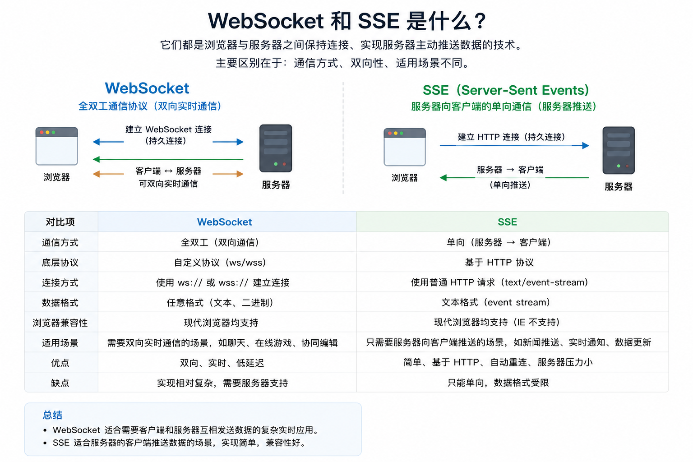
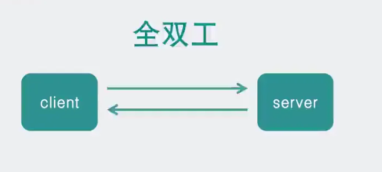
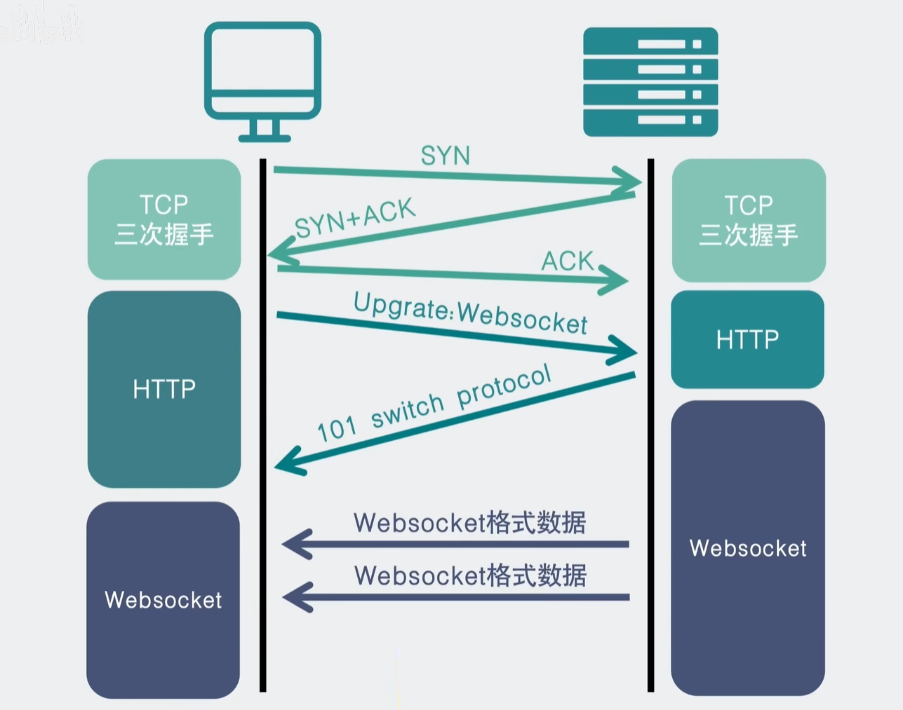

## 为什么有 HTTP 还要有 WebSocket

之前我们讨论的是“数据怎么在网络里传输”，现在要讨论的是另一个问题：

> 当浏览器和服务器已经能通信之后，**它们应该用什么方式持续交换应用层数据？**

平时我们打开网页，很多场景其实都很朴素：点一下按钮，浏览器发一次请求，服务器回一次响应。

从 HTTP 的角度看，这是一种典型的**请求 - 响应**模型：

- 客户端主动发起请求；
- 服务器被动返回响应；
- 如果客户端不发请求，服务器通常不会无缘无故主动给浏览器发消息。

这套模型应付大多数普通网页完全没问题。但还有一种情况，就算用户什么都没点，网页也希望能及时收到服务端的新消息。

比如：

- 股票价格、比赛比分、日志流要持续刷新；
- AI 回复要一段一段流式显示；
- 网页游戏里怪物移动、攻击状态要不断同步给客户端。

这就是“为什么有 HTTP 还要有 WebSocket”，以及“为什么 SSE 也存在”的真正背景。

## 从最基础的方法开始：轮询

最直接的办法，其实不是“服务器主动推”，而是**客户端反复去问**。

比如扫码登录页面，网页一开始并不知道你扫没扫二维码，于是前端代码会每隔一两秒请求一次后端：

- 这个二维码有人扫了吗？
- 确认登录了吗？
- 状态有没有变化？

这就是**轮询（Polling）**。

### 轮询的特点

- 浏览器按固定间隔不断发 HTTP 请求；
- 服务端每次都立即返回当前状态；
- 用户看起来像“网页自动知道结果了”；
- 但本质上仍然是客户端不断主动拉取。

### 轮询的问题

轮询简单，但缺点也很明显：

- **请求很多**：即使状态没变，也要不断发请求；
- **浪费带宽和资源**：每次都带着 HTTP 开销来回跑；
- **实时性有限**：如果每 2 秒请求一次，最坏情况就要多等接近 2 秒。

所以轮询适合逻辑简单、更新频率不高、对实时性要求没那么极致的场景，但并不是最优解。

## 比轮询更进一步：长轮询

如果我们不希望浏览器那么频繁地“空跑”，一个常见优化就是**长轮询（Long Polling）**。

**一次请求尽量等更久一点，等有消息再返回，然后马上续上下一次。**

### 长轮询相比轮询的好处

- HTTP 请求次数明显减少；
- 状态变化时通常能更快返回；
- 很适合扫码登录、审核状态变化、简单通知这类事件驱动但交互不算特别频繁的场景。

### 长轮询的本质仍然没有变

它虽然体验更好，但本质上仍然是：

- 浏览器发请求；
- 服务端借这个请求通道返回结果；
- 真正的主动权仍然在客户端发起请求这一步。

所以无论轮询还是长轮询，本质上都还是一种“伪服务端推送”：

> 不是服务器无中生有地主动发，而是客户端一直给服务器创造“你现在可以回我”的机会。

## 再往前一步：SSE

如果需求是“服务端持续往浏览器推送消息”，并且方向主要是**服务器 → 浏览器**，那么 SSE 往往会比轮询和长轮询更自然。

SSE 的全称是 **Server-Sent Events**，中文通常叫“服务器发送事件”。

它的核心思路是：

- 浏览器发起一次普通 HTTP 请求；
- 服务端返回的不是一个立即结束的响应；
- 而是一个持续不断开的响应流；
- 后续服务端可以不断往这个响应流里追加文本事件；
- 浏览器一边接收，一边触发前端回调。

你可以把它理解成：

> **浏览器先开了一条“请你持续把消息往这里写”的 HTTP 通道。**

### SSE 的特点

- 通信方向是**单向**的：服务器 → 浏览器；
- 基于 HTTP，天然适合穿过大多数代理和网关；
- 浏览器原生支持 `EventSource`；
- 消息格式比较简单，通常是文本；
- 断开后浏览器通常会自动重连。

### SSE 适合什么场景

SSE 很适合下面这类“服务端持续输出、客户端只负责接收”的场景：

- AI 文本流式输出；
- 实时日志；
- 通知推送；
- 任务进度更新；
- 股价、汇率、仪表盘数据刷新。

### SSE 的限制

SSE 很好用，但它并不是“WebSocket 的简化版替代品”，而是适合另一类问题。

它的限制主要在于：

- 默认是**单向**通信；
- 主要传文本，不适合频繁双向互动和复杂二进制传输；
- 如果客户端也要高频给服务端发消息，那还是得再配合普通 HTTP，或者直接换 WebSocket。

所以 SSE 的核心优势不在“功能更多”，而在于：

> **如果你只是想让服务器持续往浏览器推文本消息，SSE 往往更简单、更顺手。**

## WebSocket 到底解决了什么问题

无论是轮询还是长轮询，本质上其实还是客户端主动去取数据。对于像扫码登录这样的简单场景还能用用。但如果是网页游戏呢？游戏一般会有大量的数据需要从服务器主动推送到客户端。

我们知道TCP 连接的两端，同一时间里，双方都可以主动向对方发送数据，这就是所谓的**全双工**。

而现在使用最广泛的 **HTTP 1.1**，也是基于TCP协议的。同一时间里，客户端和服务器只能有一方主动发数据，这就是所谓的**半双工**。也就是说，好好的全双工TCP被HTTP 用成了半双工。

> HTTP我会在网络第三篇详细讲

这是由于 **TCP** 协议设计之初，考虑的是看看网页文本的场景，能做到客户端发起请求再由服务器响应就够了，根本就没考虑网页游戏这种客户端和服务器之间都要互相主动发大量数据的场景。

所以为了更好的支持这样的场景，我们需要另外一个基于 **TCP**的新协议。于是新的应用层协议**WebSocket** 就被设计出来了。

---

**TCP 是底层传输协议，WebSocket 是应用层协议，WebSocket 基于 TCP 实现**。

> WebSocket握手阶段走 HTTP，之后切换到原生 TCP 长连接，在 TCP 之上封装数据格式、帧结构。

WebSocket 它的目标很明确：

> **让浏览器和服务器之间建立一条长期存在、支持双向主动通信的连接。**

### WebSocket 的核心特征

- **全双工**：客户端和服务端都可以主动发送消息；
- **长连接**：建立后通常会持续保持；
- **消息驱动**：后续以帧为单位收发消息；
- **支持文本和二进制**：适合更丰富的实时场景。

这里很多文章会说“HTTP 是半双工，WebSocket 是全双工”。

所以更准确地说：

不是 TCP 不支持双向，而是普通 HTTP 不擅长表达“双方长期、频繁、主动互发消息”这件事。

## WebSocket 是怎么建立起来的

WebSocket 连接并不是一上来就凭空出现的。浏览器通常会先发起一次 HTTP 请求，请求里带上一些特殊头（header），比如：

- `Connection:Upgrade`：我希望升级协议；
- `Upgrade:websocket`：我想从 HTTP 切换到 WebSocket。
- `Sec-WebSocket-Key`: 随机BASE64码

如果服务端支持，就会返回 `101 Switching Protocols`，表示同意升级。完成这一步之后，后续双方就不再按普通 HTTP 请求/响应那套格式来交互，而是改用 WebSocket 自己的数据帧格式通信。

所以要注意两点：

- **建立连接时会借助 HTTP 握手**；
- **建立完成后，后续通信主体就不是普通 HTTP 了。**

WebSocket 通常借助 HTTP 完成升级握手，但升级完成后，它使用的是自己的协议语义和数据帧格式。

> WebSocket和HTTP一样，都是基于TCP的协议。经历了 3 次**TCP**握手之后，利用HTTP协议升级为WebSocket协议，后续双方就使用WebSocket 的数据格式进行通信。
>
> 

## 为什么 WebSocket 还要设计自己的帧格式

数据包在ws（websocket简写）中被称为“帧”

底层 TCP 提供的是**字节流**，不会天然帮你区分“这条消息到哪里结束”。

这意味着如果上层协议没有自己的边界设计，接收方就会面临一个问题：

- 我拿到的是一串连续字节；
- 到底哪一段算一条完整消息？

所以像 HTTP、RPC、WebSocket 这类应用层协议，通常都会设计自己的消息格式，常见做法就是：

- 有一部分头信息；
- 指明消息类型、长度等元数据；
- 再跟上真正的消息体。

WebSocket 也是这样做的。对使用者来说，你不一定需要背它的每个字段，但至少要知道：

> WebSocket 不是“直接把裸 TCP 暴露给浏览器”，而是提供了一套更适合前端实时通信的消息协议。

## 那到底该选 SSE 还是 WebSocket

这个问题不能只看“谁更高级”，而要看你的通信模式。

如果你的需求是：

- 服务端不断推送；
- 客户端主要负责接收；
- 文本消息为主；
- 你希望接入简单、调试方便；

那么通常 **SSE 更合适**。

如果你的需求是：

- 客户端和服务端都要频繁主动发消息；
- 双向互动很多；
- 延迟敏感；
- 可能还有二进制数据；

那么通常 **WebSocket 更合适**。

## 一个更完整的对比

| 维度 | 轮询 | 长轮询 | SSE | WebSocket |
| --- | --- | --- | --- | --- |
| 发起方式 | 客户端定时请求 | 客户端发请求并等待 | 客户端发起一次 HTTP 流 | 先 HTTP 升级，再长期通信 |
| 通信方向 | 本质单向拉取 | 本质单向拉取 | 服务器 → 客户端 | 客户端 ↔ 服务器 |
| 是否持续连接 | 否 | 近似持续，但请求会轮换 | 是 | 是 |
| 实时性 | 一般 | 较好 | 好 | 很好 |
| 协议复杂度 | 低 | 低到中 | 低 | 中到高 |
| 数据类型 | 通常文本/JSON | 通常文本/JSON | 主要文本 | 文本 + 二进制 |
| 适合场景 | 简单状态查询 | 扫码登录、轻量通知 | AI 流式输出、日志、通知 | 聊天、游戏、协同编辑 |

## 一些常见误区

### 1. “HTTP 不能做实时”

不准确。

HTTP 当然可以做一定程度的实时更新，比如轮询、长轮询、SSE 都是围绕 HTTP 发展出来的方案。真正的问题不是“能不能做”，而是：

- 成本高不高；
- 实时性够不够；
- 双向互动顺不顺手。

### 2. “SSE 就是低配版 WebSocket”

也不准确。

SSE 不是 WebSocket 的残缺替代，而是针对“服务端持续单向推送文本消息”这个场景，提供了一个更简单的方案。

### 3. “WebSocket 比 SSE 高级，所以优先选 WebSocket”

这也是常见误区。

WebSocket 更强，但也意味着：

- 连接管理更复杂；
- 心跳、断线重连、鉴权、连接状态都要认真设计；
- 服务端维护成本通常更高。

如果业务只是日志流、进度流、AI 流式文本，直接上 WebSocket 往往是过度设计。

### 4. “WebSocket 是基于 HTTP 的”

更严谨地说，**WebSocket 通常借助 HTTP 完成升级握手，但后续通信不是普通 HTTP。**

## 总结

把整件事串起来，其实非常简单：

- **普通 HTTP** 适合“一问一答”；
- **轮询 / 长轮询** 适合在现有 HTTP 模型上做轻量实时更新；
- **SSE** 适合服务端持续向浏览器单向推送文本消息；
- **WebSocket** 适合浏览器和服务端之间高频、双向、实时互动。

所以，“为什么有 HTTP 还要有 WebSocket”的答案并不是 HTTP 不行，而是：

> **HTTP 擅长请求 - 响应，WebSocket 擅长双向实时通信。它们解决的重点不同。**

而“WebSocket vs SSE”的答案也不是谁替代谁，而是：

> **如果你只需要服务端持续往前端推消息，优先考虑 SSE；如果你需要双方频繁互发消息，优先考虑 WebSocket。**
