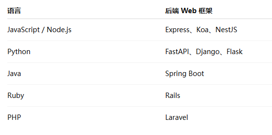
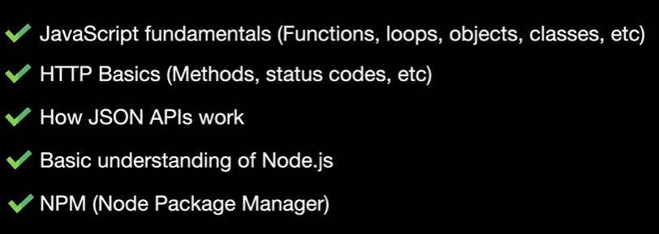
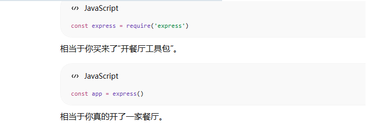
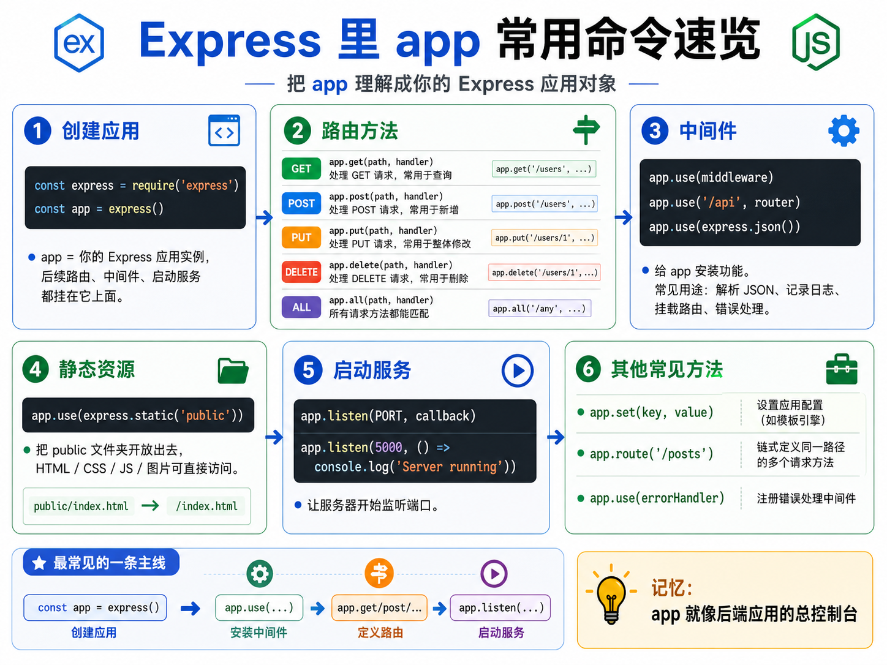
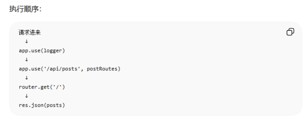
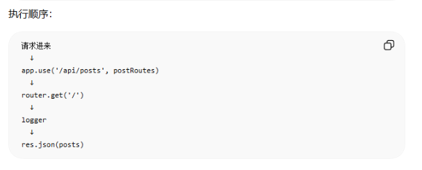
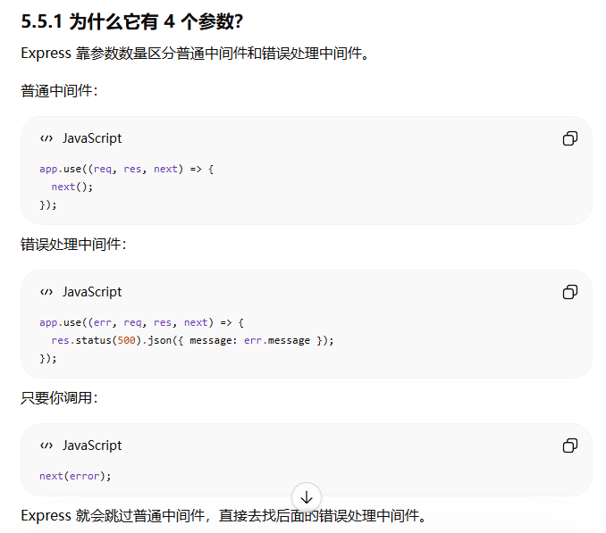

# Express.js 速成课

> 本教程基于 YouTube [Express JS Crash Course](https://www.youtube.com/watch?v=7X7eV9eNPIw) 视频翻译整理
>
> 整理：苯人

---

## 1. 课程介绍与Express简介

### 什么是 Express？

Express 是一个**轻量、灵活的 Node.js Web 框架**，为 Web 和移动应用提供了强大的功能集。它主要用于：

- 服务端应用
- RESTful API
- 微服务

Express 是 Node.js 领域最流行的框架，被 IBM、Uber、Nike 等大厂使用。

### MERN / MEAN / MEVN 技术栈

Express 最常用于以下全栈技术栈：

| 技术栈（首字母缩写） | 组成 |
|--------|------|
| **MERN** | MongoDB + Express + React + Node.js |
| **MEAN** | MongoDB + Express + Angular + Node.js |
| **MEVN** | MongoDB + Express + Vue + Node.js |

你可以把 MongoDB 换成 MySQL/PostgreSQL，把前端框架换成任何你熟悉的框架。

> 在组成里，又有Node.js又有Express是因为Node.js是运行环境，负责让Express这套JS后端跑起来，而Express是后端框架。

### (Web frameWork)Opinionated vs Unopinionated

Web 框架分为两种类型：

> Opinionated原意是“有主见的”。这个框架很有自己的想法，它会告诉你：项目应该怎么写、文件应该放哪里、数据库怎么接、路由怎么组织、模块怎么拆。
>
> 如果你不喜欢它的规则，或者项目比较特殊，改起来会有点束缚。

| 特性 | Opinionated（有约束） | Unopinionated（无约束） |
|------|----------------------|------------------------|
| 规则 | 多 | 少 |
| 灵活性 | 低 | 高 |
| 开箱即用 | 功能丰富 | **需要自己组合** |
| 代表框架 | Rails、Laravel、NestJS | Express、Koa |
| 数据库 | 通常绑定 | 自己选择 |
| 项目结构 | 强制规范 | 自己决定 |

Express 属于**无约束框架**，给你最大的自由，但需要你自己做更多决策。


> 比如 NestJS 会要求你经常写：
>
> ```
> module
> controller
> service
> decorator
> dependency injection
> ```
>
> Express 则很简单：
>
> 你怎么拆文件，Express 不太管。
>
>  
>
> **Express 为什么属于无约束框架？**
>
> 因为 Express 的核心非常少。
>
> 它主要给你：
>
> ```
> 1. 创建服务器
> 2. 定义路由
> 3. 使用中间件
> 4. 处理 req / res
> ```
>
> 比如：
>
> ```
> app.get('/users', (req, res) => {
>   res.json([{ id: 1, name: '张三' }])
> })
> ```
>
> 这就能跑。
>
> 但它不会自动帮你决定：
>
> ```
> 数据库用什么
> 登录怎么做
> 权限怎么做
> 参数校验怎么做
> 项目目录怎么拆
> 业务逻辑放哪里
> 错误格式怎么统一
> 
> ```
>
>  
>
> **Rails和Ruby的关系？**
>
> Ruby 是语言
> Rails 是 Ruby 语言里的一个 Web 框架
>
> like，
>
> JavaScript 是语言
> Express 是 JavaScript/Node.js 里的 Web 框架
>
> PHP 是语言
> Laravel 是 PHP 里的 Web 框架
>
> Java 是语言
> Spring / Spring Boot 是 Java 里的 Web 框架
>
>  
>
> **Web框架这个词怎么理解？**
>
>  “Web 框架” 不是固定指前端或后端，要看上下文。
>
> 前端Web框架（页面、交互、组件）
>
> ```
> Vue、React、Angular、Svelte
> ```
>
> 后端Web框架（跑在服务器上）（接口、路由、数据库、鉴权、服务端）
>
> ```
> Express、koa、NestJs、Spring Boot、Laravel、Rails、Django、FastAPI
> ```
>
> > FastAPI是Python生态的后端Web框架，主要写API接口服务
> >
> > 
>
> 全栈Web框架
>
> ```
> Next.js、Nuxt、Remix、SvelteKit、Astro
> ```

### 前置知识



### 本课程涵盖内容

- 服务器搭建与路由
- 请求/响应对象
- 自定义中间件（日志、认证等）
- CRUD 操作（创建、读取、更新、删除）
- 模板引擎（EJS）
- 错误处理
- 第三方 npm 包
- 控制器分离
- 静态文件服务器，前端 Fetch 数据
- 环境变量

---

## 2. 项目初始化与基础服务器

### 初始化项目

```bash
# 创建项目文件夹
mkdir my-express-app
cd my-express-app

# 初始化 npm
npm init -y

# 安装 Express
npm install express
```

### 创建 .gitignore

```bash
node_modules/
.env
```

### 创建入口文件 server.js

```javascript
//核心语句
const express = require('express');
const app = express();	//创建Express应用实例


const path = require('path');

// 监听端口
const PORT = process.env.PORT || 5000;
app.listen(PORT, () => {
  console.log(`Server running on port ${PORT}`);
});
```

> 这里的app是“后端应用对象”，也就是开发者创建出的Express服务器应用，后续所有路由、中间件、启动监听都通过它来完成。
>
> 
>
> 

### 运行服务器

```bash
node server.js
# 或使用 npm scripts（推荐）
```

### 配置 npm Scripts

在 `package.json` 中添加：

```json
{
  "scripts": {
    "start": "node server.js",	//意思是正式运行
    "dev": "node --watch server.js"	//意思是开发环境运行（适合频繁改动）
  }
}
```

现在可以用 `npm run dev` 启动开发服务器，支持热重载。

### watch指令

这个指令是Node.js新版本自带的监听功能，

以前经常用`nodemon server.js`

现在 用 `node --watch server.js`

---

## 3. 路由与请求响应

### 基本路由

```javascript
// GET 请求
// 含义：给后端应用添加一个get路由
app.get('/', (req, res) => {
  res.send('Hello World');
});

// POST 请求
app.post('/api/posts', (req, res) => {
  res.status(201).json({ message: 'Created' });
});

// PUT 请求
app.put('/api/posts/:id', (req, res) => {
  res.json({ message: 'Updated' });
});

// DELETE 请求
app.delete('/api/posts/:id', (req, res) => {
  res.status(204).send();
});
```

### 路由参数（req.params）

```javascript
// 动态路由：/api/posts/1
app.get('/api/posts/:id', (req, res) => {
  const id = parseInt(req.params.id);
    
    
  const post = posts.find(p => p.id === id);
  
  if (!post) {
    return res.status(404).json({ message: 'Post not found' });
  }
  
  res.json(post);
});
```

### 查询字符串（req.query）

```javascript
// GET /api/posts?limit=2
app.get('/api/posts', (req, res) => {
  const { limit } = req.query;
    
    
  let result = posts;
  
  if (limit) {
    const numLimit = parseInt(limit);
    if (!isNaN(numLimit) && numLimit > 0) {
      result = posts.slice(0, numLimit);
    }
  }
  
  res.json(result);
});
```

### 返回 JSON

```javascript
// res.json() 会自动将 JavaScript 对象转换为 JSON
res.json({ message: 'Hello', data: [1, 2, 3] });

// 也可以先设置状态码，再链式调用
res.status(200).json({ posts: [] });
```

### 状态码

常用状态码：
- **200** - OK（默认）
- **201** - Created（创建成功）
- **204** - No Content（删除成功）
- **400** - Bad Request（客户端错误）
- **401** - Unauthorized（未认证 / 未登录）
- **403** - Forbidden（禁止访问 / 无权限）
- **404** - Not Found
- **500** - Internal Server Error


### 路由文件分离

创建 `routes/posts.js`：

```javascript
const express = require('express');
const router = express.Router();

let posts = [
  { id: 1, title: 'Post One' },
  { id: 2, title: 'Post Two' },
  { id: 3, title: 'Post Three' }
];

// 获取所有文章
router.get('/', (req, res) => {
  res.json(posts);
});

// 获取单个文章
router.get('/:id', (req, res) => {
  const id = parseInt(req.params.id);
  const post = posts.find(p => p.id === id);
  
  if (!post) {
    return res.status(404).json({ message: 'Post not found' });
  }
  
  res.json(post);
});

// 创建文章
router.post('/', (req, res) => {
  const { title } = req.body;
  
  if (!title) {
    return res.status(400).json({ message: 'Title is required' });
  }
  
  const newPost = {
    id: posts.length + 1,
    title
  };
  
  posts.push(newPost);
  res.status(201).json(newPost);
});

// 更新文章
router.put('/:id', (req, res) => {
  const id = parseInt(req.params.id);
  const post = posts.find(p => p.id === id);
  
  if (!post) {
    return res.status(404).json({ message: 'Post not found' });
  }
  
  post.title = req.body.title;
  res.json(post);
});

// 删除文章
router.delete('/:id', (req, res) => {
  const id = parseInt(req.params.id);
  posts = posts.filter(p => p.id !== id);
  res.json({ message: 'Post deleted' });
});

module.exports = router;
```

在 `server.js` 中引入：

```javascript
const postRoutes = require('./routes/posts');	//导入时可以重新起名字

app.use('/api/posts', postRoutes);

//把postRoutes这个router挂载到/api/posts这个基础路径下
//后面的具体路径，由routes/posts.js里的router继续拼

```

含义：凡是以 `/api/posts` 开头的请求，都交给 `postRoutes` 这个路由模块继续处理。

### 使用 ES Modules

如果想用 ES Modules标准  `import/export` 语法，在 `package.json` 添加：

```json
{
  "type": "module"
}
```

配置好之后，你就可以把原来用 `require` 引入的方式，全部光明正大地替换成更优雅的 `import ... from ...` 语法了。

```javascript
import express from 'express';
import postRoutes from './routes/posts.js';

const app = express();
app.use('/api/posts', postRoutes);
```

### 处理请求体

Express 内置了 body-parser，只需添加中间件：

```javascript
// 专门翻译 JSON 格式的数据。
app.use(express.json());

// 专门翻译 传统的 HTML 表单提交的数据
app.use(express.urlencoded({ extended: false }));
```

以前，这两行代码不属于 Express 自带的功能。开发者必须在终端里运行 `npm install body-parser` 下载一个第三方库，然后才能使用它。现在你不需要额外安装任何东西，直接用 `express.json()` 就可以了。

---

## 4. 中间件

### 什么是中间件？

中间件是*介于请求和响应之间的**函数***。

```
function middleware(req,res,next){
	do sth...
	next()
}
```

**核心参数**

```
req		//请求对象：前端发来的请求信息
res		//响应对象：后端准备发给前端的信息
next	//放行函数：调用后，请求继续进入下一个中间件
```

中间件可以：

- 访问 `req`、`res` 对象
- 处理日志、认证、修改请求等
- 调用下一个中间件（通过 `next()`）

```
请求 → 中间件1 → 中间件2 → 路由处理 → 响应
         ↓          ↓
       next()     next()
```

**中间件们就像工厂流水线，每个中间件只负责一个小事**

来源：

1. Express 内置的：express.json()
2. 第三方下载的：cors、morgan、body-parser
3. 自己写的：logger、authenticate

### app.use()是什么

`app.use()` 是 Express 用来注册中间件或路由模块的方法。

最常见语法：

```
app.use(中间件函数)
```

例如：

```
app.use(express.json())
```

意思是：

> 给整个应用注册一个中间件，所有请求都会经过它。

也可以加路径：

```
app.use('/api', 中间件函数)
```

例如：

```
app.use('/api', authenticate)
```

意思是：

> 只有 `/api` 开头的请求，才会经过这个中间件。

#### 与app.get()的区别

app.use()不限制请求方法，而app.get()只处理get请求。

### 自定义日志中间件

创建 `middleware/logger.js`：

```javascript
const logger = (req, res, next) => {
  const method = req.method;
  const protocol = req.protocol;      // HTTP 或 HTTPS
  const hostname = req.hostname;       // localhost
  const originalUrl = req.originalUrl; // 完整路径
  
  console.log(`${method} ${protocol}://${hostname}${originalUrl}`);
  next();	// 必须调用 next() 才能继续
};

module.exports = logger;
```

#### req 对象常用属性

| 属性 | 说明 |
|------|------|
| `req.method` | HTTP 方法（GET, POST, PUT, DELETE） |
| `req.protocol` | 协议（http/https） |
| `req.hostname` | 主机名 |
| `req.originalUrl` | 完整请求路径 |
| `req.params` | 路由参数 |
| `req.query` | 查询字符串 |
| `req.body` | 请求体（需中间件解析） |
| `req.headers` | 请求头 |

#### res 对象常用方法

| 方法 | 说明 |
|------|------|
| `res.send()` | 发送响应（自动识别类型） |
| `res.json()` | 发送 JSON 响应 |
| `res.status()` | 设置状态码 |
| `res.render()` | 渲染模板 |
| `res.sendFile()` | 发送文件 |
| `res.redirect()` | 重定向 |


### 使用中间件

#### **应用级中间件**（所有路由）

```javascript
import logger from './middleware/logger.js';
app.use(logger);
```

> 适合通用的：记录日志、处理JSON、处理cookies、跨域CORS、全局鉴权、静态资源

一般公共中间件写在路由前面：



#### **路由级中间件**（特定路由）

```javascript
router.get('/', logger, (req, res) => {
  res.json(posts);
});
```




### 静态文件服务

使用 `express.static()` 可以让指定文件夹成为静态资源目录：

```javascript
// public 文件夹中的文件可以直接通过 URL 访问
// 例如：public/index.html  ->  http://localhost:5000/index.html
app.use(express.static(path.join(__dirname, 'public')));
```

现在可以直接访问：
- `http://localhost:5000/index.html`
- `http://localhost:5000/about.html`

### res.sendFile() 发送文件

如果不想用静态中间件，也可以手动发送文件：

```javascript
app.get('/', (req, res) => {
  res.sendFile(path.join(__dirname, 'public', 'index.html'));
});
```

### body-parser 

`body-parser` 是一个专门用来 **解析请求体 body** 的中间件库。

`body-parser` 提供 JSON、Raw、Text、URL-encoded form 等几类解析器；同时它不处理复杂的大文件 `multipart` 请求，比如文件上传通常要用 `multer` 这类工具。

```javascript
app.use(bodyParser.json({limit: '500mb'}));
```

解析前端传来的json类型（Content-Type: application/json）的数据，把json解析成js对象，然后把结果放到 `req.body` 上。

> 经过这个中间件之后，后面的路由里就可以这样拿：
>
> ```
> app.post('/user', (req, res) => {
>   console.log(req.body.name)
>   console.log(req.body.age)
> })
> ```


```
app.use(bodyParser.urlencoded({ extended: false, limit: '500mb' }));
```

解析表单格式数据

> 某些关于表单的接口（application/x-www-form-urlencoded）用这种格式：
>
> ```
> name=张三&age=18
> ```
>
> 它会帮你解析成：
>
> ```
> req.body = {
>   name: '张三',
>   age: '18'
> }
> ```

#### 现在 Express 还必须用 body-parser 吗？

现在 Express 自己已经内置了类似功能，比如：

```
app.use(express.json())
app.use(express.urlencoded({ extended: false }))
```

Express 官方 API 里说明，`express.json()` 和 `express.urlencoded()` 都是内置中间件，并且是基于 `body-parser` 的。


### 添加彩色日志

安装 `colors` 包：

```bash
npm install colors
```

```javascript
import colors from 'colors';

const methodColors = {
  GET: 'green',
  POST: 'blue',
  PUT: 'yellow',
  DELETE: 'red'
};


const logger = (req, res, next) => {
  const color = methodColors[req.method] || 'white';
  
   console.log(`${req.method} ${req.originalUrl}`[color]);
    
  next();
};
```

### 控制器分离

将路由逻辑移到 `controllers/postController.js`：

```javascript
// 获取所有文章
export const getPosts = (req, res) => {
  res.json(posts);
};

// 获取单个文章
export const getPost = (req, res) => {
  const id = parseInt(req.params.id);
  const post = posts.find(p => p.id === id);
  
  if (!post) {
    const error = new Error('Post not found');
    error.status = 404;
    return next(error);
  }
  
  res.json(post);
};

// 创建文章
export const createPost = (req, res, next) => {
  const { title } = req.body;
  
  if (!title) {
    const error = new Error('Title is required');
    error.status = 400;
    return next(error);
  }
  
  const newPost = { id: posts.length + 1, title };
  posts.push(newPost);
  res.status(201).json(newPost);
};

// 更新文章
export const updatePost = (req, res, next) => {
  const id = parseInt(req.params.id);
  const post = posts.find(p => p.id === id);
  
  if (!post) {
    const error = new Error('Post not found');
    error.status = 404;
    return next(error);
  }
  
  post.title = req.body.title;
  res.json(post);
};

// 删除文章
export const deletePost = (req, res, next) => {
  const id = parseInt(req.params.id);
  const postIndex = posts.findIndex(p => p.id === id);
  
  if (postIndex === -1) {
    const error = new Error('Post not found');
    error.status = 404;
    return next(error);
  }
  
  posts.splice(postIndex, 1);
  res.json({ message: 'Post deleted' });
};
```

然后在路由中使用：

```javascript
import * as postController from '../controllers/postController.js';

router.get('/', postController.getPosts);
router.get('/:id', postController.getPost);
router.post('/', postController.createPost);
router.put('/:id', postController.updatePost);
router.delete('/:id', postController.deletePost);
```

---

## 5. 错误处理

### 一个文件版：理解流程

```js
const express = require('express');
const app = express();

// ==========================================
// 1. 正常的业务路由（例子：获取文章）
// ==========================================
app.get('/api/posts/:id', (req, res, next) => {
  const { id } = req.params;
  const post = null; // 模拟：找不到文章

  if (!post) {
    // 业务错误：手动创建错误，传给 next(error)
    const error = new Error(`文章 ${id} 不存在`);
    error.status = 404;
    return next(error); // 交给错误处理流程(在下面)
  }

  res.json(post);
});

// ==========================================
// 2. 404 捕获中间件
// 作用：所有【没匹配到任何路由】的请求，都会走到这里
// ==========================================
app.use((req, res, next) => {
  const error = new Error('接口地址不存在');
  error.status = 404;
  next(error); // 继续交给全局错误处理（在下面）
});

// ==========================================
// 3. 全局错误处理中间件（4个参数！）
// 作用：接收所有 next(error) 传来的错误，统一返回
// ==========================================
// 在这里
app.use((err, req, res, next) => {
  res.status(err.status || 500).json({
    message: err.message,
    status: err.status || 500
  });
});

// 启动服务
app.listen(3000, () => {
  console.log('服务运行在 http://localhost:3000');
});
```

> 当你在前面写return next(error)，Express会跳过普通流程，去找后面最近的错误处理中间件，把error传给它，它会统一返回json。
>
> 


### 封装版：真实项目写法

project/
├─ server.js
├─ routes/
│  └─ posts.js
└─ middleware/
   ├─ notFound.js
   └─ errorHandler.js


**server.js**

```js
import express from 'express';
import postsRoutes from './routes/posts.js';
import notFound from './middleware/notFound.js';
import errorHandler from './middleware/errorHandler.js';

const app = express();

app.use(express.json());

app.use('/api/posts', postsRoutes);

// 必须放在所有路由之后
app.use(notFound);

// 必须放在 notFound 之后
app.use(errorHandler);

app.listen(3000, () => {
  console.log('服务运行在 http://localhost:3000');
});
```

注册顺序：

```
express.json()
  ↓
正常业务路由
  ↓
notFound
  ↓
errorHandler
```


* routes/posts.js

```js
import express from 'express';

const router = express.Router();

router.get('/:id', (req, res, next) => {
  const { id } = req.params;
  const post = null;

  if (!post) {
    const error = new Error(`文章 ${id} 不存在`);
    error.status = 404;
    return next(error);
  }

  res.json(post);
});

export default router;
```

接口存在，但是数据不存在，属于**业务错误**。

> 常见的业务错误有：文章不存在、用户不存在、标题不能为空、密码错误、权限不足...


* middleware/notFound.js

```js
const notFound = (req, res, next) => {
  const error = new Error('接口地址不存在');
  error.status = 404;
  next(error);
};

export default notFound;
```

* middleware/errorHandler.js

```js
const errorHandler = (err, req, res, next) => {
  const status = err.status || 500;

  res.status(status).json({
    message: err.message,
    status
  });
};

export default errorHandler;
```


---

## 6. 模板引擎与前后端交互

### 使用 EJS 模板引擎

> EJS主要用于服务器端生成html
>
> 让 HTML 里可以插入变量、循环、判断，然后由服务器把最终 HTML 拼好，再发给浏览器。
>
> 用的不多，简单看看。

安装：

```bash
npm install ejs
```

配置：

```javascript
app.set('view engine', 'ejs');
app.set('views', 'views');
```

创建 `views/index.ejs`：

```html
<!DOCTYPE html>
<html>
<head>
  <title><%= title %></title>
</head>
<body>
  <h1><%= message %></h1>
  <ul>
    <% people.forEach(person => { %>
      <li><%= person %></li>
    <% }); %>
  </ul>
</body>
</html>
```

路由中使用：

```javascript
app.get('/', (req, res) => {
  res.render('index', {
    title: 'My Website',
    message: 'Hello from EJS!',
    people: ['John', 'Jane', 'Jack']
  });
});
```

### EJS 语法

```html
<!-- 输出变量 -->
<%= variable %>

<!-- 执行代码（不输出） -->
<% code %>

<!-- 包含其他文件 -->
<%- include('partials/header') %>
```

#### 创建 Partials

> Partial = 可以被多个页面复用的一小块 EJS/HTML。

创建 `views/partials/header.ejs`：

```html
<header>
  <h1>My Website</h1>
</header>
```

在主文件中引入：

```html
<%- include('partials/header') %>
```

### 前后端数据交互

创建 `public/index.html`：

```html
<!DOCTYPE html>
<html>
<head>
  <title>Posts</title>
</head>
<body>
  <h1>Posts</h1>
  <button id="getPostsBtn">Get Posts</button>
  <div id="output"></div>
  
  <form id="addPostForm">
    <input type="text" name="title" placeholder="Post title">
    <button type="submit">Add Post</button>
  </form>
  
  <script src="/js/main.js"></script>
</body>
</html>
```

创建 `public/js/main.js`：

```javascript
// 获取文章
async function showPosts() {
  try {
    const res = await fetch('/api/posts');
    const posts = await res.json();
    
    const output = document.getElementById('output');
    output.innerHTML = '';
    
    posts.forEach(post => {
      const div = document.createElement('div');
      div.textContent = post.title;
      output.appendChild(div);
    });
  } catch (err) {
    console.error('Error fetching posts:', err);
  }
}

// 添加文章
async function addPost(e) {
  e.preventDefault();
  
  const formData = new FormData(e.target);
  const title = formData.get('title');
  
  try {
    const res = await fetch('/api/posts', {
      method: 'POST',
      headers: {
        'Content-Type': 'application/json'
      },
      body: JSON.stringify({ title })
    });
    
    if (!res.ok) throw new Error('Failed to add post');
    
    const newPost = await res.json();
    showPosts();
    e.target.reset();
  } catch (err) {
    console.error('Error adding post:', err);
  }
}

// 事件监听
document.getElementById('getPostsBtn').addEventListener('click', showPosts);
document.getElementById('addPostForm').addEventListener('submit', addPost);
```

### 环境变量

创建 `.env` 文件：

```bash
PORT=5000
```

在 `server.js` 中读取：

```javascript
import 'dotenv/config';

const PORT = process.env.PORT || 5000;
```

在 `package.json` 的启动脚本中添加：

```json
{
  "scripts": {
    "dev": "node --watch -r dotenv/config server.js"
  }
}
```

### __dirname 在 ES Modules 中的处理

ES Modules 不支持 `__dirname`，需要手动获取：

```javascript
import { fileURLToPath } from 'url'; //作用：把文件url转成正常的文件路径
import { dirname } from 'path';	//从一个完整文件路径里，取出它所在的文件夹路径(取的是函数)

const __filename = fileURLToPath(import.meta.url);
//import.meta.url表示当前文件的url，可能长这样file:///D:/project/server.js
const __dirname = dirname(__filename);
```

> 用 import/export 写法时，默认没有 __dirname。
>  所以要用这几行代码自己算出来。
>
>  __filename：当前文件的完整路径
>
> __dirname ：当前文件所在文件夹的路径

---

## 工具推荐

### API 测试工具

- **Postman** - 专业的 API 测试工具
- **Thunder Client**（VS Code 插件）- 轻量级替代
- **Insomnia** - 另一个好选择

### 开发辅助

- **nodemon** - 热重载（已内置在 Node.js 新版本中，使用 `--watch`）
- **colors** - 控制台彩色输出
- **dotenv** - 环境变量管理

---

## 常见问题

### Q: Express 和 Node.js 原生 HTTP 模块的区别？

Node.js 原生模块需要手动处理：
- 路由判断
- Content-Type 设置
- JSON 解析

Express 提供了优雅的 API，让这些操作变得简单。

### Q: 什么时候用 `res.send()` 和 `res.json()`？

- `res.json()` - 返回 JSON 数据
- `res.send()` - 返回任何类型（文本、HTML、JSON）

### Q: 中间件的执行顺序？

中间件按**定义顺序**执行，每个中间件必须调用 `next()` 才能进入下一个。

### Q: 如何防止 SQL 注入？

在后端开发中，永远不要相信用户输入的数据：

```javascript
// 危险！用户可能输入恶意 SQL
const query = `SELECT * FROM users WHERE id = ${userId}`;

// 安全做法：使用参数化查询
// Prisma 会自动处理 SQL 注入
const user = await prisma.user.findUnique({
  where: { id: parseInt(userId) }
});
```

### Q: 中间件的洋葱模型是什么？

Express 中间件的执行顺序像洋葱一样层层递进：

```
请求 → middleware1 → middleware2 → 路由处理 → middleware2 → middleware1 → 响应
```

每个中间件必须调用 `next()` 才能让请求继续往下传递。

### Q: 为什么需要错误处理中间件？

Express 默认的错误处理会返回 HTML 页面，对于 API 来说不合适。自定义错误处理可以返回统一的 JSON 格式：

```javascript
// 默认返回 HTML
Cannot GET /api/posts/999

// 自定义处理后返回 JSON
{
  "message": "Post not found",
  "status": 404
}
```

---

## 课程总结

本教程涵盖了 Express.js 的核心概念：

1. **Express 基础** - 安装、项目初始化
2. **路由系统** - GET、POST、PUT、DELETE
3. **请求响应** - params、query、body、状态码
4. **中间件** - 日志、认证、静态文件
5. **错误处理** - 自定义错误处理器
6. **模板引擎** - EJS 动态页面
7. **前后端交互** - Fetch API

Express 的核心理念是**简洁和灵活**，你需要自己组合各种功能来构建应用。这既是优势（自由度大）也是挑战（需要更多决策）。
